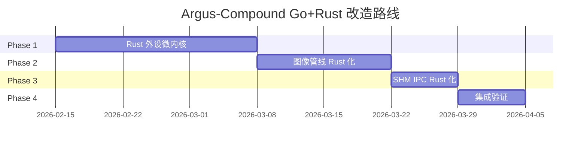
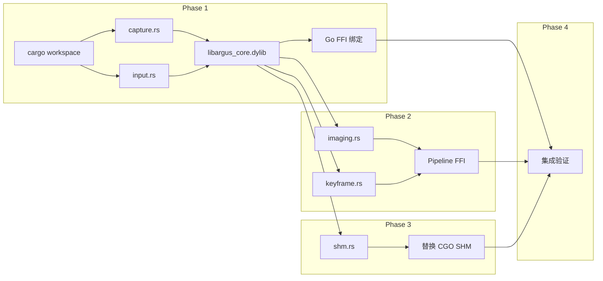

# 重构排序参考 — Argus-Compound Go+Rust 改造

> 版本：v1.0 · 2026-02-15
> 依据：`docs/jiagou/改造Go+Rust 混合架构.md` 六、实施路线图

---

## 改造阶段总览

---

## Phase 1: Rust 外设微内核（2-3 周）

**前置条件**：无

| 序号 | 任务 | Rust Crate | 依赖 |
|------|------|-----------|------|
| 1.1 | 创建 `rust-core/` Cargo workspace | — | 无 |
| 1.2 | 实现 SCK 屏幕捕获 | `screencapturekit`, `objc2` | 1.1 |
| 1.3 | 实现 CGEvent 输入注入 | `enigo` / `core-graphics` | 1.1 |
| 1.4 | 编译为 `libargus_core.dylib` | — | 1.2, 1.3 |
| 1.5 | Go 侧 FFI 绑定 + 单元测试 | — | 1.4 |

**里程碑**：通过 Rust 成功捕获屏幕帧并执行鼠标点击

**回滚检查点**：Go 侧保留原 CGO/ObjC 实现，FFI 绑定通过编译开关切换

---

## Phase 2: 图像管线 Rust 化（1-2 周）

**前置条件**：Phase 1 完成（`libargus_core.dylib` 可用）

| 序号 | 任务 | Rust Crate | 依赖 |
|------|------|-----------|------|
| 2.1 | SIMD 图像缩放 | `fast_image_resize` | Phase 1 |
| 2.2 | 关键帧哈希/差分算法 | `image` + 自定义哈希 | Phase 1 |
| 2.3 | FFI 暴露给 Go Pipeline | — | 2.1, 2.2 |
| 2.4 | 性能基准测试 (Go vs Rust) | `criterion` | 2.3 |

**里程碑**：图像处理性能提升 5x+

**回滚检查点**：Pipeline 层通过接口抽象，可切换 Go 原生实现或 Rust FFI

---

## Phase 3: SHM IPC Rust 化（1 周）

**前置条件**：Phase 1 完成

| 序号 | 任务 | Rust Crate | 依赖 |
|------|------|-----------|------|
| 3.1 | `memmap2` 实现安全 SHM | `memmap2` | Phase 1 |
| 3.2 | 替换现有 CGO SHM Writer | — | 3.1 |

**里程碑**：跨进程零拷贝帧传递正常工作

**回滚检查点**：保留 CGO SHM 实现作为 fallback

---

## Phase 4: 集成验证（1 周）

**前置条件**：Phase 1-3 全部完成

| 序号 | 任务 | 依赖 |
|------|------|------|
| 4.1 | 全功能集成测试 | Phase 1-3 |
| 4.2 | web-console 兼容性验证 | 4.1 |
| 4.3 | MCP 工具链路验证 | 4.1 |
| 4.4 | 性能回归测试 | 4.1 |

**里程碑**：全系统在 Go+Rust 混合架构下稳定运行

---

## 模块依赖图

---

## 执行原则

1. **每个 Phase 独立可交付** — 完成后系统处于可运行状态
2. **增量可回滚** — 每个 Phase 保留 Go 原实现作为 fallback
3. **前端零影响** — web-console 无需任何修改
4. **API 兼容** — 所有 HTTP/WS 端点保持不变
