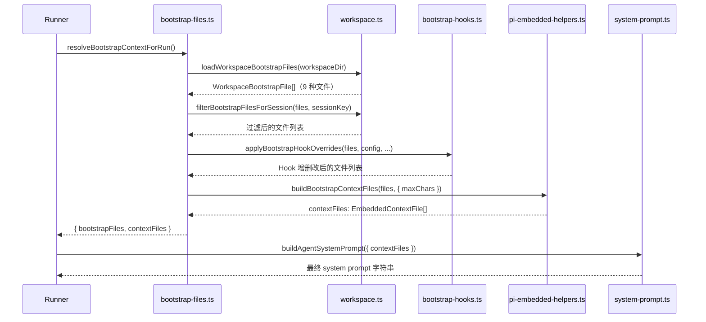
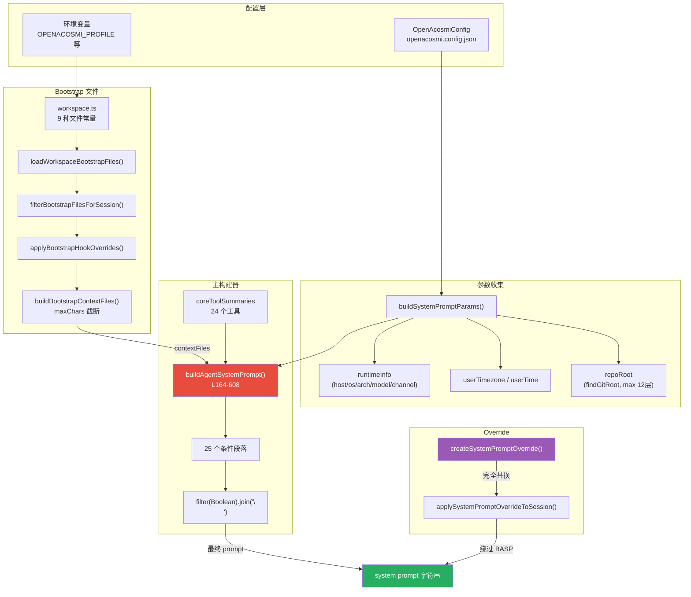

# OpenAcosmi 系统提示词（System Prompts）架构文档

> **文档日期**: 2026-02-25
> **复核日期**: 2026-02-25
> **分析对象**: `/Users/fushihua/Desktop/Claude-Acosmi/src/agents/` 目录下的提示词系统
> **结论**: 核心系统提示词 100% TypeScript 硬编码，用户仅可通过工作区文件注入自定义上下文
> **复核状态**: PASS（3 处数量偏差已修正，2 处安全发现已补充，1 处遗漏机制已补充）

---

## 1. 架构总览

```mermaid
graph TD
    A["buildAgentSystemPrompt()"] --> B["25 个条件段落"]
    A --> C["运行时动态参数"]
    A --> D["用户上下文文件注入"]
    A --> E["Override 机制"]

    B --> B1["身份声明 / Safety / CLI Reference"]
    B --> B2["Tooling / Tool Call Style"]
    B --> B3["Skills / Memory / Messaging"]
    B --> B4["Silent Replies / Heartbeats / Runtime"]

    C --> C1["toolNames / runtimeInfo"]
    C --> C2["userTimezone / modelAliasLines"]
    C --> C3["sandboxInfo / skillsPrompt"]

    D --> D1["SOUL.md — 人格设定"]
    D --> D2["TOOLS.md — 工具指南"]
    D --> D3["MEMORY.md — 记忆上下文"]
    D --> D4["AGENTS/IDENTITY/USER/HEARTBEAT/BOOTSTRAP.md"]
    D --> D5["其他 .md — Hooks 注入"]

    E --> E1["createSystemPromptOverride()"]
    E --> E2["完全替换 system prompt"]

    style A fill:#e74c3c,color:#fff
    style B fill:#3498db,color:#fff
    style C fill:#2ecc71,color:#fff
    style D fill:#f39c12,color:#fff
    style E fill:#9b59b6,color:#fff
```



---

## 2. 核心源码文件

| 文件 | 路径 | 行数 | 职责 |
|------|------|------|------|
| **system-prompt.ts** | `src/agents/system-prompt.ts` | 648 | 主构建器 `buildAgentSystemPrompt()` + `buildRuntimeLine()` |
| **system-prompt-params.ts** | `src/agents/system-prompt-params.ts` | 115 | 运行时参数收集（时区、仓库根、git root 发现） |
| **system-prompt-report.ts** | `src/agents/system-prompt-report.ts` | 160 | 提示词审计报告生成（统计 chars/工具数/技能数） |
| **pi-embedded/system-prompt.ts** | `src/agents/pi-embedded-runner/system-prompt.ts` | 99 | 嵌入模式薄包装 + `createSystemPromptOverride()` + `applySystemPromptOverrideToSession()` |
| **bootstrap-files.ts** | `src/agents/bootstrap-files.ts` | 60 | 编排工作区上下文文件加载流程 |
| **workspace.ts** | `src/agents/workspace.ts` | 305 | 定义 9 种 Bootstrap 文件常量 + 文件加载/初始化逻辑 |

---

## 3. 提示词拼装结构

`buildAgentSystemPrompt()` (L164-608) 将以下 **25 个段落** 通过数组拼接生成最终 system prompt：

| # | 段落标题 | 源码行号 | 内容类型 | 条件 | 可控性 |
|---|---------|---------|---------|------|--------|
| 1 | 身份声明 | L381 | 固定文本 | 无条件 | ❌ |
| 2 | `## Tooling` | L383-406 | 工具列表 + 硬编码描述字典（24 项） | 无条件 | ⚠️ toolNames 动态过滤 |
| 3 | `## Tool Call Style` | L408-413 | 固定文本 | 无条件 | ❌ |
| 4 | `## Safety` | L351-357, 414 | 固定文本（3 条规则，Anthropic constitution 灵感） | 无条件 | ❌ |
| 5 | `## OpenAcosmi CLI Quick Reference` | L415-423 | 固定文本 | 无条件 | ❌ |
| 6 | `## Skills (mandatory)` | L358-362, 424 | 动态（技能列表） | `skillsPrompt && !isMinimal` | ⚠️ 技能系统驱动 |
| 7 | `## Memory Recall` | L363-367, 425 | 条件显示 + citations 模式 | `memory_search/get 工具可用 && !isMinimal` | ❌ |
| 8 | `## OpenAcosmi Self-Update` | L427-436 | 条件显示 | `hasGateway && !isMinimal` | ❌ |
| 9 | `## Model Aliases` | L439-448 | 动态（模型别名列表） | `modelAliasLines.length > 0 && !isMinimal` | ⚠️ 配置驱动 |
| 10 | session_status 提示行 | L449-451 | 条件单行 | `userTimezone` | ⚠️ |
| 11 | `## Workspace` | L452-456 | 动态（工作目录路径 + 备注） | 无条件 | ⚠️ |
| 12 | `## Documentation` | L457 | 固定链接 + docsPath | `docsPath && !isMinimal` | ❌ |
| 13 | `## Sandbox` | L458-499 | 条件显示（沙箱配置，含 elevated 信息） | `sandboxInfo.enabled` | ⚠️ 配置驱动 |
| 14 | `## User Identity` | L500 | 动态（Owner 号码） | `ownerLine && !isMinimal` | ⚠️ 配置驱动 |
| 15 | `## Current Date & Time` | L501-503 | 动态（时区） | `userTimezone` | ⚠️ |
| 16 | `## Workspace Files (injected)` | L504-506 | 提示文本 | 无条件 | ❌ |
| 17 | `## Reply Tags` | L507 | 固定文本 | `!isMinimal` | ❌ |
| 18 | `## Messaging` | L508-515 | 动态（频道配置 + inline buttons） | `!isMinimal` | ⚠️ 配置驱动 |
| 19 | `## Voice (TTS)` | L516 | 条件显示 | `ttsHint && !isMinimal` | ⚠️ |
| 20 | `## Subagent/Group Chat Context` | L519-524 | **外部注入，无过滤** | `extraSystemPrompt` | ⚠️ **安全关注** |
| 21 | `## Reactions` | L525-547 | 条件显示（minimal/extensive 两档） | `reactionGuidance` | ⚠️ 配置驱动 |
| 22 | `## Reasoning Format` | L548-550 | 条件显示（`<think>/<final>` 标签格式） | `reasoningTagHint` | ❌ |
| 23 | `# Project Context` | L553-569 | **用户文件内容注入** | `contextFiles.length > 0` | ✅ |
| 24 | `## Silent Replies` | L572-587 | 固定文本（SILENT_REPLY_TOKEN） | `!isMinimal` | ❌ |
| 25 | `## Heartbeats` | L590-600 | 固定 + 动态 heartbeatPrompt | `!isMinimal` | ⚠️ |
| 26 | `## Runtime` | L602-606 | 动态（host/os/model/channel/thinking 等） | 无条件 | ⚠️ |

> **图例**: ❌ = 纯硬编码 ｜ ⚠️ = 模板硬编码 + 运行时参数填充 ｜ ✅ = 用户可直接编辑

---

## 4. 三种提示词模式

`system-prompt.ts` 通过 `PromptMode` 类型控制输出详细程度（L14）：

```typescript
export type PromptMode = "full" | "minimal" | "none";
```

| 模式 | 使用场景 | 包含段落 | 控制逻辑 |
|------|---------|---------|---------|
| `full` | 主 Agent | 全部 25 个段落（按条件） | 默认值（L349） |
| `minimal` | Sub-Agent | Tooling + Workspace + Runtime + 条件段落 | `isMinimal = true`（L350），跳过 Skills/Memory/Reply Tags 等 |
| `none` | 最小模式 | 仅一行身份声明 | L376-378: 直接 `return` 单行字符串 |

### minimal 模式跳过的段落

通过 `isMinimal` 守卫跳过：Skills、Memory Recall、Self-Update、Model Aliases、Documentation、User Identity、Reply Tags、Messaging、Voice、Silent Replies、Heartbeats。

---

## 5. 动态参数注入机制

### 5.1 运行时参数（`system-prompt-params.ts`）

```typescript
// L34-59: 参数收集入口
buildSystemPromptParams({
  config,      // OpenAcosmiConfig — 用户配置文件
  agentId,     // 当前 Agent ID
  runtime,     // host, os, arch, node, model, shell, channel 等
  workspaceDir, cwd
}) → SystemPromptRuntimeParams {
  runtimeInfo,    // RuntimeInfoInput（含 repoRoot via findGitRoot）
  userTimezone,   // resolveUserTimezone()
  userTime,       // formatUserTime()
  userTimeFormat  // resolveUserTimeFormat()
}
```

收集的参数最终注入 `buildAgentSystemPrompt()` 的对应字段。

#### Git Root 发现逻辑

`findGitRoot()` (L96-115) 从 startDir 向上最多遍历 12 层目录查找 `.git`。`resolveRepoRoot()` (L61-94) 优先使用 config 中的 `agents.defaults.repoRoot`，fallback 到 `workspaceDir` / `cwd` 的 git root。

### 5.2 工具描述字典（硬编码）

`system-prompt.ts` 内部维护一个 `coreToolSummaries` 硬编码字典（L219-246）：

```typescript
const coreToolSummaries: Record<string, string> = {
  read: "Read file contents",
  write: "Create or overwrite files",
  edit: "Make precise edits to files",
  apply_patch: "Apply multi-file patches",
  grep: "Search file contents for patterns",
  find: "Find files by glob pattern",
  ls: "List directory contents",
  exec: "Run shell commands (pty available for TTY-required CLIs)",
  process: "Manage background exec sessions",
  web_search: "Search the web (Brave API)",
  web_fetch: "Fetch and extract readable content from a URL",
  browser: "Control web browser",
  canvas: "Present/eval/snapshot the Canvas",
  nodes: "List/describe/notify/camera/screen on paired nodes",
  cron: "Manage cron jobs and wake events ...",
  message: "Send messages and channel actions",
  gateway: "Restart, apply config, or run updates ...",
  agents_list: "List agent ids allowed for sessions_spawn",
  sessions_list: "List other sessions ...",
  sessions_history: "Fetch history for another session/sub-agent",
  sessions_send: "Send a message to another session/sub-agent",
  sessions_spawn: "Spawn a sub-agent session",
  session_status: "Show a /status-equivalent status card ...",
  image: "Analyze an image with the configured image model",
  // 共 24 个工具
};
```

运行时根据实际可用的 `toolNames` 过滤后显示。

#### toolOrder 排序机制与已知问题

`toolOrder` 数组（L248-272）定义工具在提示词中的展示顺序，共 **22 项**。不在 `toolOrder` 中的工具归入 `extraTools` 按字母序追加。

> **BUG**: `sessions_spawn` 存在于 `coreToolSummaries`（L242）但缺失于 `toolOrder`，导致它被排入字母序尾部而非 sessions 工具组中的预期位置。

---

## 6. 用户可定制的提示词文件

通过 **Bootstrap 文件机制**（`workspace.ts` → `bootstrap-files.ts`），工作区中的特定 `.md` 文件会被读取并注入到 `# Project Context` 段落。

### 6.1 完整 Bootstrap 文件清单

`workspace.ts` (L23-31) 定义了 **9 种** Bootstrap 文件：

| 文件名 | 变量 | 作用 |
|-------|------|------|
| `SOUL.md` | `DEFAULT_SOUL_FILENAME` | 人格/角色设定 — Agent 会 "embody its persona and tone" |
| `TOOLS.md` | `DEFAULT_TOOLS_FILENAME` | 外部工具使用指南（不控制工具可用性） |
| `MEMORY.md` | `DEFAULT_MEMORY_FILENAME` | 记忆上下文入口 |
| `memory.md` | `DEFAULT_MEMORY_ALT_FILENAME` | 记忆上下文入口（小写备选） |
| `AGENTS.md` | `DEFAULT_AGENTS_FILENAME` | 子 Agent 定义与配置 |
| `IDENTITY.md` | `DEFAULT_IDENTITY_FILENAME` | Agent 身份信息 |
| `USER.md` | `DEFAULT_USER_FILENAME` | 用户信息上下文 |
| `HEARTBEAT.md` | `DEFAULT_HEARTBEAT_FILENAME` | 心跳轮询上下文 |
| `BOOTSTRAP.md` | `DEFAULT_BOOTSTRAP_FILENAME` | 通用引导上下文 |

类型定义 `WorkspaceBootstrapFileName`（L60-69）涵盖上述所有文件名的联合类型。

### 6.2 加载流程



### 6.3 注入位置

在 `system-prompt.ts` 中，`contextFiles` 被拼接到 `# Project Context` 段落（L552-569）：

```typescript
if (contextFiles.length > 0) {
    lines.push("# Project Context", "", "The following project context files have been loaded:");
    if (hasSoulFile) {
        lines.push("If SOUL.md is present, embody its persona and tone. ...");
    }
    lines.push("");
    for (const file of contextFiles) {
        lines.push(`## ${file.path}`, "", file.content, "");
    }
}
```

长度限制由上游 `resolveBootstrapMaxChars(config)` 控制，通过 `buildBootstrapContextFiles()` 执行截断。

---

## 7. 额外提示词注入点

除了上述主流程，还有三个额外注入/覆盖点：

| 注入点 | 参数 | 来源 | 安全性 |
|-------|------|------|--------|
| **Group Chat / Subagent Context** | `extraSystemPrompt` | 群聊上下文、子 Agent 上下文 | **无过滤直接注入**（见 S-02） |
| **Heartbeat Prompt** | `heartbeatPrompt` | 配置中的心跳轮询语句 | 低风险（配置文件来源） |
| **System Prompt Override** | `createSystemPromptOverride()` | `pi-embedded-runner/system-prompt.ts:80-85` | 完全替换（见 7.1） |

### 7.1 Override 机制

`pi-embedded-runner/system-prompt.ts` 提供两个辅助函数：

```typescript
// L80-85: 创建一个函数，完全忽略默认 prompt，返回自定义字符串
export function createSystemPromptOverride(systemPrompt: string):
    (defaultPrompt?: string) => string;

// L87-99: 直接设置 session 的 system prompt，绕过所有构建逻辑
export function applySystemPromptOverrideToSession(
    session: AgentSession,
    override: string | ((defaultPrompt?: string) => string),
);
```

这允许特定 session 完全替换 `buildAgentSystemPrompt()` 的输出。`_defaultPrompt` 参数被忽略（L84），原始 prompt 被完全丢弃。**此机制是设计如此**，用于嵌入模式下的完全自定义场景，但调用链必须确保 override 内容可信。

---

## 8. 提示词审计报告机制

`system-prompt-report.ts` (160 行) 提供 `buildSystemPromptReport()` 函数，对已生成的 prompt 做静态分析：

| 统计项 | 提取方式 |
|-------|---------|
| 总字符数 | `systemPrompt.length` |
| Project Context 字符数 | marker 文本提取（`"# Project Context"` → `"## Silent Replies"`） |
| 工具列表字符数 | marker 文本提取（`"Tool names are case-sensitive"` → `"TOOLS.md does not control"`） |
| 工具 schema 字符数 | `JSON.stringify(tool.parameters).length` |
| 技能列表 | `<skill>` XML 标签正则匹配 |
| Bootstrap 文件状态 | 逐文件统计 rawChars / injectedChars / truncated |

> **脆弱点**: marker 字符串提取依赖 `system-prompt.ts` 中的精确措辞。如果段落文本被修改，report 提取会静默失败（无编译时保证）。建议提取为共享常量。

---

## 9. 安全发现

### S-01: Safety 段落内容偏弱 (MEDIUM)

**位置**: L351-357

**现状**: 仅包含 3 条简洁的安全规则：
1. 无独立目标（不追求自保/复制/资源获取/权力）
2. 优先安全和人类监督（冲突时暂停并询问）
3. 不操纵他人扩展访问或禁用安全措施

**风险**: 对比 Claude Code 等系统的 Safety 段落（包含 OWASP、注入防护、权限控制、代码安全等），此段落在以下方面缺乏指导：
- Prompt injection 防护
- 敏感数据处理
- 文件系统安全边界
- 代码执行安全

**建议**: 如果 Agent 面向外部用户或处理不可信输入，应强化安全指令。对于内部使用场景，当前简洁程度可接受。

### S-02: `extraSystemPrompt` 无过滤注入 (MEDIUM)

**位置**: L519-523

```typescript
if (extraSystemPrompt) {
    const contextHeader = promptMode === "minimal"
        ? "## Subagent Context" : "## Group Chat Context";
    lines.push(contextHeader, extraSystemPrompt, "");
}
```

**风险**: `extraSystemPrompt` 直接拼接进 system prompt，无任何 sanitization、长度限制或内容过滤。如果群聊场景中恶意用户能影响此参数的内容，可实现 prompt injection（覆盖 Safety 规则、注入虚假指令等）。

**建议**: 对来自非可信源的 `extraSystemPrompt` 做基本过滤（长度限制、敏感关键词检测）。

### S-03: Bootstrap 文件长度限制已存在 (PASS)

**位置**: `bootstrap-files.ts:55-57` → `resolveBootstrapMaxChars(config)`

`contextFiles` 注入前通过 `buildBootstrapContextFiles()` 执行截断，受 `maxChars` 参数控制。上游有有效防护。

### S-04: `coreToolSummaries` 中 cron 描述混入行为指令 (INFO)

**位置**: L235

cron 工具描述长达 ~200 字符，包含"写提醒文本的方式"等行为指令。工具描述中嵌入行为规则不规范但无安全风险。

**建议**: 将行为指令拆到独立段落或 Skills 系统中。

---

## 10. 数据流总图（验证后修正版）



---

## 11. 关键结论

1. **没有外部提示词文件/数据库**: 所有核心系统提示词都作为 TypeScript 字符串常量硬编码在 `system-prompt.ts` 中。无 fetch/HTTP 调用，无 JSON/YAML 配置文件加载 prompt 文本
2. **修改提示词 = 修改源码**: 如果需要调整 Safety、Tooling 等段落的措辞，必须修改 TypeScript 源码并重新构建
3. **用户可控部分有限**: 用户可通过工作区的 9 种 Bootstrap 文件（SOUL/TOOLS/MEMORY/AGENTS/IDENTITY/USER/HEARTBEAT/BOOTSTRAP.md + memory.md）影响 `# Project Context` 段落。Hooks 机制可增删改 Bootstrap 文件
4. **配置影响显示**: 许多段落通过 `OpenAcosmiConfig` 控制是否显示（如 Sandbox、Reactions、Model Aliases），但段落模板本身是硬编码的
5. **Override 机制**: `createSystemPromptOverride()` 可完全替换 system prompt，绕过所有构建逻辑。调用链必须确保 override 内容可信
6. **提示词规模**: 完整 `full` 模式下核心段落（不含 contextFiles/skills 注入）约 2000-3000 字符。含用户上下文后可显著增长，受 `maxChars` 限制
7. **安全关注**: `extraSystemPrompt` 无过滤直接注入（S-02），Safety 段落内容简洁（S-01），在高安全要求场景下需强化

---

## 附录 A: 与初版审计的差异记录

| 项目 | 初版 | 修正后 | 说明 |
|------|------|--------|------|
| 段落数 | ~20 | **25** | 初版少计了 5 个条件段落（#10 session_status 提示行、#20 Subagent/Group Chat Context、#21 Reactions、#22 Reasoning Format 未单独计数） |
| `coreToolSummaries` 条目数 | ~22 | **24** | 漏计 `edit` 和 `image` |
| `toolOrder` 缺项 | 未提及 | `sessions_spawn` 缺失 | 存在于 summaries 但不在 order 中 |
| Bootstrap 文件种类 | 3 种 + Hooks | **9 种** | 遗漏 AGENTS/IDENTITY/USER/HEARTBEAT/BOOTSTRAP/memory.md |
| workspace.ts 行数 | 未标注 | **305** | 初版仅标注"—" |
| system-prompt-report.ts 行数 | ~150 | **160** | 小偏差 |
| Override 机制 | 未提及 | 已补充 | `createSystemPromptOverride` + `applySystemPromptOverrideToSession` |
| 安全分析 | 无 | 已补充 | S-01 ~ S-04 共 4 项发现 |
| 数据流图 | 无 | 已补充 | Mermaid 图含完整调用链 |
