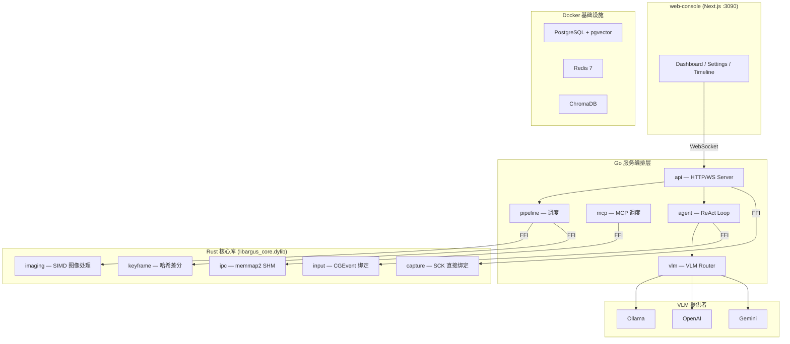

# Argus-Compound 改造：Go+Rust 混合架构方案

> 文档创建日期: 2026-02-15
> 状态: **已批准**

## 一、背景与动机

Argus-Compound（"24小时之眼"）当前采用 **Go + CGO + Next.js** 架构。系统通过 CGO 桥接 Objective-C 调用 macOS 原生 API（ScreenCaptureKit、CoreGraphics、CGEvent），在高频屏幕捕获（60fps）下存在以下瓶颈：

- **CGO 调用开销**：每次跨语言调用约 50-100ns，高频场景下累积显著
- **GC 帧抖动**：Go 垃圾回收可能导致帧处理延迟尖刺
- **内存拷贝**：CGO 层需要额外的内存拷贝

经对比分析 Discord、Cloudflare、Figma、Dropbox、ByteDance、TiDB 等国际顶级项目的架构决策，确定采用 **Go+Rust 混合架构**——仅在 CPU 密集型热路径引入 Rust，保留 Go 作为服务编排层。

---

## 二、架构原则

> **Go 做编排，Rust 做底盘。**

| 原则 | 说明 |
|------|------|
| **最小替换** | 仅替换有真实性能瓶颈的热路径，不做全量重写 |
| **增量可回滚** | 每个 Phase 独立交付，可随时回退到 Go 实现 |
| **前端零影响** | web-console 无需任何修改 |
| **API 兼容** | 所有 HTTP/WS 端点保持不变 |

---

## 三、职责分界

### 3.1 Go 保留层（服务编排 + I/O 密集型）

| 模块 | 保留理由 |
|------|----------|
| `api` — HTTP/WS Server | goroutine 并发模型是 I/O 密集型网络服务的最优解 |
| `agent` — ReAct Loop | 编排逻辑非 CPU 热路径，Go 开发效率更高 |
| `mcp` — MCP Server 调度 | JSON-RPC 调度是 I/O 型任务 |
| `vlm` — VLM Router | 本质是 HTTP 转发，Go 处理更简洁 |
| `metrics` — Prometheus | 标准 Go 生态 |
| `memory` — ChromaDB 客户端 | HTTP 客户端，Go 原生优势 |
| `analysis` — 时序分析 | 非实时热路径 |

### 3.2 Rust 替换层（CPU 密集型 + 系统级交互）

| 模块 | Rust Crate | 替换收益 |
|------|-----------|----------|
| **屏幕捕获** | `screencapturekit` + `core-graphics` | 消除 CGO 开销，objc2 直接绑定 |
| **图像缩放** | `fast_image_resize` | SIMD 加速，5-10x 性能提升 |
| **关键帧提取** | `image` + 自定义哈希 | CPU 密集型差分计算 |
| **键鼠输入** | `enigo` 或 `core-graphics` | 低延迟系统调用，消除内存泄漏 |
| **SHM IPC** | `memmap2` | 内存安全的跨进程零拷贝 |

### 3.3 架构总览图



---

## 四、FFI 集成方案

### 4.1 Rust 侧：C ABI 导出

```rust
// rust-core/src/lib.rs
#[no_mangle]
pub extern "C" fn argus_capture_frame(
    out_pixels: *mut *mut u8,
    out_width: *mut i32,
    out_height: *mut i32,
) -> i32 {
    // SCK 屏幕捕获实现
}

#[no_mangle]
pub extern "C" fn argus_resize_image(
    src: *const u8, src_w: i32, src_h: i32,
    dst: *mut u8, dst_w: i32, dst_h: i32,
) -> i32 {
    // SIMD 图像缩放实现
}

#[no_mangle]
pub extern "C" fn argus_free_buffer(ptr: *mut u8, len: usize) {
    // 安全释放 Rust 分配的内存
}
```

### 4.2 Go 侧：CGO 调用

```go
// #cgo LDFLAGS: -L${SRCDIR}/../../rust-core/target/release -largus_core
// #include "argus_core.h"
import "C"

func CaptureFrame() (*Frame, error) {
    var pixels *C.uint8_t
    var w, h C.int
    rc := C.argus_capture_frame(&pixels, &w, &h)
    if rc != 0 {
        return nil, fmt.Errorf("capture failed: %d", rc)
    }
    defer C.argus_free_buffer(pixels, C.size_t(w*h*4))
    // 拷贝到 Go 管理的内存
    ...
}
```

---

## 五、项目结构

```
Argus-compound/
├── go-sensory/           # Go 服务（保留）
│   ├── cmd/server/
│   └── internal/
│       ├── api/          # HTTP/WS — Go
│       ├── agent/        # ReAct — Go
│       ├── mcp/          # MCP 调度 — Go
│       ├── vlm/          # VLM 路由 — Go
│       └── pipeline/     # 调度层 — Go (调用 Rust FFI)
├── rust-core/            # Rust 核心库（新建）
│   ├── Cargo.toml
│   ├── src/
│   │   ├── lib.rs        # C ABI 导出
│   │   ├── capture.rs    # SCK 屏幕捕获
│   │   ├── imaging.rs    # SIMD 图像处理
│   │   ├── input.rs      # CGEvent 输入
│   │   ├── keyframe.rs   # 关键帧提取
│   │   └── shm.rs        # SHM IPC
│   └── include/
│       └── argus_core.h  # C 头文件
├── web-console/          # Next.js 前端（不变）
└── docker-compose.yml    # 基础设施（不变）
```

---

## 六、实施路线图

### Phase 1: Rust 外设微内核（2-3 周）

- [ ] 创建 `rust-core/` Cargo workspace
- [ ] 实现 SCK 屏幕捕获 (`screencapturekit` crate)
- [ ] 实现 CGEvent 输入注入 (`enigo` / `core-graphics`)
- [ ] 编译为 `libargus_core.dylib`
- [ ] Go 侧 FFI 绑定 + 单元测试
- **里程碑**: 通过 Rust 成功捕获屏幕帧并执行鼠标点击

### Phase 2: 图像管线 Rust 化（1-2 周）

- [ ] `fast_image_resize` SIMD 图像缩放
- [ ] 关键帧哈希/差分算法
- [ ] FFI 暴露给 Go Pipeline
- [ ] 性能基准测试 (Go vs Rust)
- **里程碑**: 图像处理性能提升 5x+

### Phase 3: SHM IPC Rust 化（1 周）

- [ ] `memmap2` 实现安全 SHM
- [ ] 替换现有 CGO SHM Writer
- **里程碑**: 跨进程零拷贝帧传递正常工作

### Phase 4: 集成验证（1 周）

- [ ] 全功能集成测试
- [ ] web-console 兼容性验证
- [ ] MCP 工具链路验证
- [ ] 性能回归测试
- **里程碑**: 全系统在 Go+Rust 混合架构下稳定运行

---

## 七、国际案例参考

| 公司 | 架构模式 | 关键收益 |
|------|----------|----------|
| **Discord** | Go 服务 + Rust 热路径替换 | 10x 性能，内存 -30% |
| **Cloudflare** | Go SDK + Rust 代理引擎 (Pingora) | 响应 -10ms，性能 +25% |
| **Figma** | JS 交互逻辑 + Rust 画布渲染 | 消除 GC 抖动 |
| **Dropbox** | Go/Python 编排 + Rust 同步引擎 | CPU 成本显著降低 |
| **ByteDance** | Go 服务 + Rust SDK (rust2go FFI) | CPU -30%，P99 延迟降低 |
| **TiDB** | Go SQL 层 (TiDB) + Rust 存储 (TiKV) | 各取所长 |

---

## 八、风险与缓解

| 风险 | 缓解措施 |
|------|----------|
| Rust 学习曲线 | 仅核心库使用 Rust，范围可控 |
| FFI 内存泄漏 | 严格的 `argus_free_buffer` 规范 + 集成测试 |
| ObjC 生命周期 | 使用 `Retained<T>` 智能指针 |
| 构建复杂度增加 | Makefile 统一构建 `cargo build` + `go build` |
| 调试困难 | Rust 侧完善日志 + `stderr` 输出 |
