# OpenAcosmi CLI — Architecture

## Overview

OpenAcosmi CLI is a Rust rewrite of the TypeScript CLI that ships with the OpenAcosmi
AI-agent orchestration platform. The binary (`openacosmi`) provides commands for managing
agents, channels, models, sessions, health checks, daemon services, and the full
configuration/onboarding lifecycle.

The migration preserves full wire and filesystem compatibility with the existing TypeScript
runtime: JSON field names remain camelCase, config file paths and formats are unchanged,
and the gateway RPC WebSocket protocol is identical. The Rust codebase lives entirely under
`cli-rust/` and is structured as a Cargo workspace containing 25 crates.

Source baseline for the migration: `src/commands/` (231 TypeScript command files).

---

## Crate Dependency Graph

The workspace follows a strict layered architecture. Dependencies only flow downward;
no crate imports another crate from the same layer or from a layer above it.

```mermaid
graph TD
    %% ── Leaf layer ─────────────────────────────────────────────────────────
    OA_TYPES["oa-types\nCore domain types"]
    OA_RUNTIME["oa-runtime\nRuntimeEnv trait"]
    OA_TERMINAL["oa-terminal\nTerminal UI"]

    %% ── Infrastructure layer ────────────────────────────────────────────────
    OA_CONFIG["oa-config\nConfig I/O + sessions"]
    OA_INFRA["oa-infra\nEnv, device, dotenv"]
    OA_ROUTING["oa-routing\nSession keys + bindings"]

    %% ── Service layer ───────────────────────────────────────────────────────
    OA_GW_RPC["oa-gateway-rpc\nWebSocket RPC client"]
    OA_AGENTS["oa-agents\nAgent scope + model catalog"]
    OA_CHANNELS["oa-channels\nChannel registry + caps"]
    OA_DAEMON["oa-daemon\nlaunchd / systemd"]

    %% ── Shared CLI utilities ────────────────────────────────────────────────
    OA_SHARED["oa-cli-shared\nBanner, globals, progress"]

    %% ── Command crates (13) ─────────────────────────────────────────────────
    CMD_HEALTH["oa-cmd-health"]
    CMD_STATUS["oa-cmd-status"]
    CMD_SESSIONS["oa-cmd-sessions"]
    CMD_CHANNELS["oa-cmd-channels"]
    CMD_MODELS["oa-cmd-models"]
    CMD_AGENTS["oa-cmd-agents"]
    CMD_SANDBOX["oa-cmd-sandbox"]
    CMD_AUTH["oa-cmd-auth"]
    CMD_CONFIGURE["oa-cmd-configure"]
    CMD_ONBOARD["oa-cmd-onboard"]
    CMD_DOCTOR["oa-cmd-doctor"]
    CMD_AGENT["oa-cmd-agent"]
    CMD_SUPPORTING["oa-cmd-supporting"]

    %% ── Binary ──────────────────────────────────────────────────────────────
    OA_CLI["oa-cli\nopenacosmi binary"]

    %% ── Leaf edges ──────────────────────────────────────────────────────────
    OA_RUNTIME --> OA_TYPES
    OA_TERMINAL --> OA_TYPES

    %% ── Infrastructure edges ────────────────────────────────────────────────
    OA_CONFIG --> OA_TYPES
    OA_CONFIG --> OA_RUNTIME
    OA_INFRA --> OA_TYPES
    OA_INFRA --> OA_RUNTIME
    OA_ROUTING --> OA_TYPES

    %% ── Service edges ───────────────────────────────────────────────────────
    OA_GW_RPC --> OA_TYPES
    OA_GW_RPC --> OA_CONFIG
    OA_GW_RPC --> OA_INFRA
    OA_AGENTS --> OA_TYPES
    OA_AGENTS --> OA_CONFIG
    OA_AGENTS --> OA_INFRA
    OA_AGENTS --> OA_ROUTING
    OA_CHANNELS --> OA_TYPES
    OA_CHANNELS --> OA_CONFIG
    OA_CHANNELS --> OA_INFRA
    OA_CHANNELS --> OA_ROUTING
    OA_DAEMON --> OA_TYPES
    OA_DAEMON --> OA_CONFIG
    OA_DAEMON --> OA_INFRA

    %% ── Shared edges ────────────────────────────────────────────────────────
    OA_SHARED --> OA_TYPES
    OA_SHARED --> OA_CONFIG
    OA_SHARED --> OA_INFRA
    OA_SHARED --> OA_TERMINAL
    OA_SHARED --> OA_GW_RPC
    OA_SHARED --> OA_AGENTS
    OA_SHARED --> OA_CHANNELS
    OA_SHARED --> OA_DAEMON

    %% ── Command edges (representative; all cmd crates depend on oa-cli-shared) ─
    CMD_HEALTH --> OA_SHARED
    CMD_HEALTH --> OA_GW_RPC
    CMD_HEALTH --> OA_AGENTS
    CMD_HEALTH --> OA_CHANNELS
    CMD_STATUS --> OA_SHARED
    CMD_STATUS --> OA_GW_RPC
    CMD_STATUS --> OA_DAEMON
    CMD_SESSIONS --> OA_SHARED
    CMD_CHANNELS --> OA_SHARED
    CMD_MODELS --> OA_SHARED
    CMD_AGENTS --> OA_SHARED
    CMD_SANDBOX --> OA_SHARED
    CMD_AUTH --> OA_SHARED
    CMD_CONFIGURE --> OA_SHARED
    CMD_ONBOARD --> OA_SHARED
    CMD_ONBOARD --> OA_GW_RPC
    CMD_ONBOARD --> OA_AGENTS
    CMD_ONBOARD --> OA_CHANNELS
    CMD_DOCTOR --> OA_SHARED
    CMD_AGENT --> OA_SHARED
    CMD_AGENT --> OA_GW_RPC
    CMD_AGENT --> OA_AGENTS
    CMD_AGENT --> OA_CHANNELS
    CMD_SUPPORTING --> OA_SHARED

    %% ── Binary edges ────────────────────────────────────────────────────────
    OA_CLI --> CMD_HEALTH
    OA_CLI --> CMD_STATUS
    OA_CLI --> CMD_SESSIONS
    OA_CLI --> CMD_CHANNELS
    OA_CLI --> CMD_MODELS
    OA_CLI --> CMD_AGENTS
    OA_CLI --> CMD_SANDBOX
    OA_CLI --> CMD_AUTH
    OA_CLI --> CMD_CONFIGURE
    OA_CLI --> CMD_ONBOARD
    OA_CLI --> CMD_DOCTOR
    OA_CLI --> CMD_AGENT
    OA_CLI --> CMD_SUPPORTING
```



### Layer Summary

| Layer | Crates | Rule |
|-------|--------|------|
| Leaf | `oa-types`, `oa-runtime`, `oa-terminal` | No internal deps (only third-party) |
| Infrastructure | `oa-config`, `oa-infra`, `oa-routing` | Depend on leaf crates only |
| Service | `oa-gateway-rpc`, `oa-agents`, `oa-channels`, `oa-daemon` | Depend on infra + leaf |
| Shared | `oa-cli-shared` | Aggregates all service + infra crates |
| Command | 13 `oa-cmd-*` crates | Depend on shared + selected service crates; never on each other |
| Binary | `oa-cli` | Depends on all command crates; owns `main.rs` and `commands.rs` |

---

## Module Responsibility Matrix

| Crate | Purpose | Key Modules | TypeScript Source Mapping |
|-------|---------|-------------|--------------------------|
| **oa-types** | All shared domain types: config schema, sessions, health, status, agents, channels, models | `config`, `agents`, `channels`, `models`, `session`, `health`, `status`, `gateway`, `auth`, `sandbox`, `tools`, `memory`, `skills`, `cron` | `src/config/types.*.ts`, `src/config/sessions/types.ts` |
| **oa-runtime** | `RuntimeEnv` trait for dependency injection; `DefaultRuntime` wraps real syscalls; enables mock testing | `lib.rs` (trait + impl) | `src/runtime.ts` |
| **oa-terminal** | Themed terminal output: color palette, table renderer, progress bars, ANSI utilities, OSC hyperlinks | `theme`, `palette`, `table`, `note`, `ansi`, `links`, `stream_writer` | `src/terminal/*.ts` |
| **oa-config** | Config file I/O (TOML/JSON/JSON5), path resolution, environment variable substitution, includes, defaults, validation, session store | `paths`, `includes`, `env_substitution`, `io`, `defaults`, `validation`, `sessions` | `src/config/*.ts`, `src/config/sessions/*.ts` |
| **oa-infra** | Infrastructure helpers: env var utilities, dotenv loading, device ID, home directory expansion, error formatting, time stubs | `env`, `dotenv`, `device`, `home_dir`, `errors`, `time`, `heartbeat` | `src/infra/*.ts` |
| **oa-routing** | Session key normalization (phone/email/ID canonicalization) and channel binding resolution | `session_key`, `bindings` | `src/routing/session-key.ts`, `src/routing/bindings.ts` |
| **oa-gateway-rpc** | WebSocket RPC client for the gateway service: connection, authentication handshake, protocol framing, one-shot call helper | `protocol`, `net`, `auth`, `client`, `call` | `src/gateway/call.ts`, `src/gateway/client.ts`, `src/gateway/auth.ts`, `src/gateway/net.ts` |
| **oa-agents** | Agent enumeration, default resolution, model catalog loading, model reference parsing, alias resolution, provider metadata | `scope`, `defaults`, `model_catalog`, `model_selection`, `providers` | `src/agents/agent-scope.ts`, `src/agents/model-catalog.ts`, `src/agents/model-selection.ts` |
| **oa-channels** | Static channel registry (Telegram, WhatsApp, Discord, Slack, Signal, iMessage, Google Chat), capability profiles, contact resolution | `registry`, `directory`, `capabilities` | `src/channels/registry.ts`, `src/channels/dock.ts` |
| **oa-daemon** | Daemon service lifecycle management; platform-specific backends (`launchd` on macOS, `systemd` on Linux) gated by `#[cfg(target_os)]` | `constants`, `paths`, `service`, `launchd` (macOS), `systemd` (Linux) | `src/daemon/*.ts` |
| **oa-cli-shared** | Cross-command CLI utilities: startup banner, global state (json/verbose flags), progress spinner, config guard, argument helpers, command formatting | `banner`, `globals`, `progress`, `config_guard`, `argv`, `command_format` | `src/globals.ts`, `src/cli/banner.ts`, `src/cli/progress.ts`, `src/cli/program/config-guard.ts` |
| **oa-cmd-health** | `health` command: probes gateway, channels, and agent liveness; formats results as table or JSON | `lib.rs`, handler functions | `src/commands/health/*.ts` |
| **oa-cmd-status** | `status`, `status-all`, `gateway-status` commands: system status dashboard, deep scan, usage metrics | `status_command`, `status_all`, `gateway_status` | `src/commands/status/*.ts` |
| **oa-cmd-sessions** | `sessions` command: reads and displays the session store with optional activity filtering | `lib.rs` | `src/commands/sessions/*.ts` |
| **oa-cmd-channels** | `channels` subcommands: list, add, remove, resolve, capabilities, logs, status | `list`, `add`, `remove`, `resolve`, `capabilities`, `logs`, `status` | `src/commands/channels/*.ts` |
| **oa-cmd-models** | `models` subcommands: list, set, set-image, aliases (list/add/remove), fallbacks (list/add/remove/clear), image-fallbacks | `list_configured`, `set`, `set_image`, `aliases`, `fallbacks`, `image_fallbacks` | `src/commands/models/*.ts` |
| **oa-cmd-agents** | `agents` subcommands: list agents with optional binding details | `list` | `src/commands/agents/*.ts` |
| **oa-cmd-sandbox** | `sandbox` subcommands: list containers, recreate, explain configuration | `list`, `recreate`, `explain` | `src/commands/sandbox/*.ts` |
| **oa-cmd-auth** | `auth` interactive wizard: configure authentication providers and API keys | `lib.rs` | `src/commands/auth/*.ts` |
| **oa-cmd-configure** | `configure` wizard: gateway, channels, daemon, workspace, model, web, skills, health sections; supports selective section runs | `lib.rs`, `shared` (WizardSection enum) | `src/commands/configure/*.ts` |
| **oa-cmd-onboard** | `onboard` wizard: full first-run setup with gateway, auth, channels, daemon; supports non-interactive batch mode | `lib.rs`, `types` (OnboardOptions) | `src/commands/onboard/*.ts` |
| **oa-cmd-doctor** | `doctor` command: system diagnostics, repair suggestions, automated and interactive fix modes | `lib.rs`, DoctorOptions | `src/commands/doctor/*.ts` |
| **oa-cmd-agent** | `agent` command: send a message to an AI agent via gateway RPC; handles session and delivery resolution | `agent_command`, `types` (AgentCommandOpts) | `src/commands/agent/*.ts` |
| **oa-cmd-supporting** | Supporting commands: `dashboard` (open browser), `docs` (search), `reset`, `setup`, `uninstall`, `message` | `dashboard`, `docs`, `reset`, `setup`, `uninstall`, `message` | `src/commands/{dashboard,docs,reset,setup,uninstall,message}/*.ts` |
| **oa-cli** | Binary entry point: parses global flags (`--dev`, `--profile`, `--verbose`, `--json`, `--no-color`, `--lang`), initializes tracing and the tokio runtime, routes subcommands via `commands::dispatch` | `main`, `commands` | `backend/cmd/openacosmi/main.go`, `src/cli/index.ts` |

---

## Design Decisions

### Cargo Workspace with Flat `crates/` Structure

The project uses a single Cargo workspace rooted at `cli-rust/Cargo.toml` with all 25
crates under `cli-rust/crates/` at a uniform depth. This follows the pattern used by
projects such as ripgrep: no nested workspaces, no path re-exporting tricks, and a single
`Cargo.lock`. All common dependency versions and workspace-wide `[lints]` are declared
once in the workspace root and inherited via `.workspace = true` in each crate manifest.

### Edition 2024 with MSRV 1.85

`edition = "2024"` is set workspace-wide. Rust 2024 introduced two breaking changes that
affect this codebase:

1. `std::env::set_var` is now `unsafe`. The `oa-infra` and `oa-cli` crates explicitly
   allow `unsafe_code` in their local `[lints]` (overriding the workspace `forbid`) and
   document the safety contract (called before the tokio thread pool starts).
2. `ref mut` capture rules changed. Code in these crates has been updated accordingly.

The workspace otherwise enforces `unsafe_code = "forbid"` globally.

### Clap Derive Mode for CLI Parsing

All argument structs use `#[derive(Parser)]`, `#[derive(Args)]`, and
`#[derive(Subcommand)]` from the `clap` crate (version 4.5, with the `derive`, `env`, and
`wrap_help` features). Global flags (`--dev`, `--profile`, `--verbose`, `--json`,
`--no-color`, `--lang`) are defined on the root `Cli` struct with `global = true` so they
are accepted at any subcommand level. Nested subcommand groups (e.g., `channels list`,
`models aliases add`) are represented as two-level enum variants.

Shell completion scripts are generated at build time via `clap_complete` and are also
available at runtime through `openacosmi completion <shell>`.

### Serde with camelCase for JS Wire Compatibility

All types in `oa-types` that are serialized to or deserialized from gateway API responses
use `#[serde(rename_all = "camelCase")]`. This preserves compatibility with the JSON wire
format produced by the existing TypeScript gateway and CLI, allowing the Rust binary to
replace the TypeScript binary without any server-side changes.

### thiserror for Library Errors, anyhow for Command Errors

Library crates (`oa-types`, `oa-config`, `oa-infra`, `oa-routing`, `oa-gateway-rpc`,
`oa-agents`, `oa-channels`, `oa-daemon`) define structured error enums with `thiserror`.
This preserves machine-readable error identity for callers.

Command crates (`oa-cmd-*`) and the binary (`oa-cli`) use `anyhow::Result` for their
public function signatures, enabling `?`-based propagation with rich context via
`.context()` / `.with_context()` without requiring exhaustive error matching.

### Async-First with Tokio

Every command entry function is `async`. The tokio multi-thread runtime is constructed
explicitly in `main()` (rather than with the `#[tokio::main]` macro) so that
`std::env::set_var` calls in `apply_global_flags` execute before any worker threads are
spawned. Log level is controlled by the `OPENACOSMI_LOG` environment variable (falling
back to `warn` or `debug` when `--verbose` is passed).

### Command Crates are Isolated

No `oa-cmd-*` crate depends on any other `oa-cmd-*` crate. All cross-command shared
behavior (banner, progress, config loading, global flags) lives in `oa-cli-shared`. This
constraint means each command group can be compiled in parallel by Cargo, and adding or
removing a command group requires changes only in `oa-cli/src/commands.rs` and the binary
`Cargo.toml`.

---

## Build and Test

### Common Commands

```sh
# Type-check the entire workspace (fast, no codegen)
cargo check --workspace

# Debug build
cargo build --workspace

# Release build (LTO + stripping + size optimization)
cargo build --workspace --release

# Run all tests
cargo test --workspace

# Run tests for a single crate
cargo test -p oa-config

# Check lints
cargo clippy --workspace -- -D warnings

# Generate shell completions (example: zsh)
./target/release/openacosmi completion zsh > _openacosmi
```

### Release Profile

The `[profile.release]` section in the workspace root is tuned for minimum binary size:

| Setting | Value | Effect |
|---------|-------|--------|
| `lto` | `true` | Full link-time optimization across all crates |
| `strip` | `true` | Strip debug symbols from the final ELF/Mach-O |
| `opt-level` | `"z"` | Optimize for size (not speed) |
| `codegen-units` | `1` | Single codegen unit for maximum inlining |
| `panic` | `"abort"` | Remove unwinding machinery; reduces binary size |

### Metrics

| Metric | Value |
|--------|-------|
| Test suite | 1,289 tests across 25 crates |
| Release binary size | 4.3 MB (stripped, macOS arm64) |
| Cold startup time | ~5 ms to first output |
| Workspace members | 25 crates |
| Migrated TS command files | 231 |

---

## Key Technical Notes

### Rust 2024 Edition: unsafe set_var

`std::env::set_var` became `unsafe` in Rust 2024 because it is not safe to call from
multiple threads. The binary's `apply_global_flags` function is called before the tokio
runtime starts (and therefore before any worker threads exist), making the use safe. Both
`oa-infra` and `oa-cli` declare `unsafe_code = "allow"` in their local `[lints]` tables
with accompanying `// SAFETY:` comments. All other crates inherit the workspace
`unsafe_code = "forbid"` restriction unchanged.

### Platform Conditional Compilation

`oa-daemon` uses `#[cfg(target_os = "macos")]` to include the `launchd` module and
`#[cfg(target_os = "linux")]` to include the `systemd` module. Commands that invoke daemon
operations call into the platform-neutral `service` module, which dispatches internally.
No conditional compilation is required in command crates.

### JSON5 Config Support

The `oa-config` crate links the `json5` crate (version 0.4) alongside `figment` and
`toml`. Config files may use JSON5 syntax (comments, trailing commas, unquoted keys) in
addition to TOML and strict JSON, matching the behavior of the TypeScript config loader.
The `figment` provider stack reads environment variable overrides on top of the file
layers.

### WebSocket Gateway RPC Protocol

`oa-gateway-rpc` implements a custom RPC protocol over a persistent WebSocket connection
to the OpenAcosmi gateway service. The protocol layer (`protocol` module) defines frame
types, message envelopes, and constants. The `client` module handles the connect
handshake, authentication (token or password), and multiplexed request/response dispatch
using `tokio-tungstenite` (version 0.26, with `rustls-tls-webpki-roots`). The `call`
module provides a single-shot convenience wrapper used by most commands that need to
query the gateway. HTTP fallback probes use `reqwest` (version 0.12, rustls backend, no
OpenSSL dependency).

---

## System Architecture: Rust CLI + Go Gateway

As of ADR-001, the project adopts a clear two-binary architecture:

```
Rust CLI (openacosmi) ──── WebSocket RPC ────→ Go Gateway (acosmi)
         |                                              |
    User interaction                              Server-side logic
    Command parsing                               channels/pairing/agents
    TUI rendering                                 message routing/storage
    Local operations                              WebSocket service
```

**This Rust CLI is the primary and only CLI binary.** The Go CLI (`backend/cmd/openacosmi`)
is deprecated and will not receive new features. The Go codebase retains the Gateway
server (`backend/cmd/acosmi`) which handles WebSocket RPC, channel adapters, agent
execution, and message routing.

### Why This Split

- **Rust for CLI**: 5ms startup, 4.3MB binary, native TUI, 1,289 tests, single static binary
- **Go for Gateway**: goroutines are ideal for WebSocket concurrency; complete channel
  adapter ecosystem (Discord, Telegram, Slack, WhatsApp, Signal, iMessage) already implemented
- **WebSocket RPC boundary**: both sides already communicate via the same protocol; no new
  IPC mechanism required

See `docs/adr/001-rust-cli-go-gateway.md` for the full decision record.
