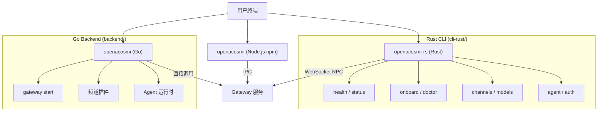

# OpenAcosmi CLI 架构文档

> 最后更新: 2026-02-23

---

## 1. 概述

OpenAcosmi CLI 采用**三层架构**，由 Go、Rust、Node.js 协同工作：

| 层 | 语言 | 职责 | 入口 |
| --- | --- | --- | --- |
| **Gateway 层** | Go | 网关服务、频道插件、Agent 运行时 | `backend/cmd/openacosmi/` |
| **CLI 命令层** | Rust | 全部 21 个 CLI 子命令（替代 TS commands/） | `cli-rust/crates/oa-cli/` |
| **npm 包 / 开发工具链** | Node.js | npm 包入口、TS 插件运行时、开发脚本 | `openacosmi.mjs` |



---

## 2. 入口点详解

### 2.1 Rust CLI (`openacosmi-rs`)

- **二进制**: `cli-rust/target/release/openacosmi`
- **安装位置**: `~/.local/bin/openacosmi-rs`
- **框架**: Clap 4.5 (derive 模式)
- **异步运行时**: Tokio (多线程)
- **启动流程**:

```
main() → Cli::parse() → init_tracing() → apply_global_flags()
       → tokio::Runtime::new() → commands::dispatch()
```

### 2.2 Go CLI (`openacosmi`)

- **二进制**: `backend/build/openacosmi`
- **框架**: Cobra
- **职责**: Gateway 启动、频道/插件/Agent 相关运行时命令
- **启动流程**:

```
main() → rootCmd.Execute()
       → PersistentPreRunE: i18n → profile → banner → verbose → config guard → plugin registry
       → 子命令路由
```

### 2.3 Node.js (`openacosmi.mjs`)

- **角色**: npm 包分发入口、TS 插件运行时、开发工具链
- **流程**: `openacosmi.mjs` → `dist/entry.js` → TS 运行时
- **使用场景**: `pnpm dev` / `pnpm gateway:dev` / `npm -g` 安装后的全局命令

---

## 3. 全局标志体系

三层共享一致的全局标志集：

| 标志 | Rust | Go | 说明 |
|------|------|----|------|
| `--dev` | ✅ | ✅ | 隔离状态到 `~/.openacosmi-dev` |
| `--profile <name>` | ✅ | ✅ | 命名 profile 隔离 |
| `--verbose` / `-v` | ✅ | ✅ | 详细输出 |
| `--json` | ✅ | ✅ | JSON 格式输出 |
| `--no-color` | ✅ | ✅ | 禁用 ANSI 颜色 |
| `--lang` | ✅ | ✅ | UI 语言覆盖 (zh-CN, en-US) |
| `--yes` / `-y` | ✅ | ✅ | 非交互模式 |

环境变量映射：

```
--dev         → OPENACOSMI_PROFILE=dev
--profile X   → OPENACOSMI_PROFILE=X
--verbose     → OPENACOSMI_VERBOSE=1
--no-color    → NO_COLOR=1
--lang X      → OPENACOSMI_LANG=X
```

---

## 4. Rust CLI Crate 分层架构

25 个 crate 组成严格分层的 Cargo workspace，依赖只能向下流动：

```
┌─────────────────────────────────────────────────────────┐
│  Binary 层: oa-cli (main.rs + commands.rs)              │
├─────────────────────────────────────────────────────────┤
│  Command 层 (13 crates): oa-cmd-*                       │
│  health │ status │ sessions │ channels │ models │ agents │
│  sandbox │ auth │ configure │ onboard │ doctor │ agent  │
│  supporting                                             │
├─────────────────────────────────────────────────────────┤
│  Shared 层: oa-cli-shared                               │
│  (banner, globals, progress, config_guard, argv)        │
├─────────────────────────────────────────────────────────┤
│  Service 层:                                            │
│  oa-gateway-rpc │ oa-agents │ oa-channels │ oa-daemon   │
├─────────────────────────────────────────────────────────┤
│  Infrastructure 层:                                     │
│  oa-config │ oa-infra │ oa-routing                      │
├─────────────────────────────────────────────────────────┤
│  Leaf 层 (无内部依赖):                                    │
│  oa-types │ oa-runtime │ oa-terminal                    │
└─────────────────────────────────────────────────────────┘
```

### 4.1 层级规则

| 层 | 允许依赖 | 禁止依赖 |
|----|---------|---------|
| Leaf | 仅第三方 crate | 任何内部 crate |
| Infrastructure | Leaf 层 | 同层或更高层 |
| Service | Infrastructure + Leaf | 同层或更高层 |
| Shared | 所有 Service/Infra/Leaf | Command 或 Binary |
| Command | Shared + 选定 Service | 其他 Command crate |
| Binary | 所有 Command crate | — |

### 4.2 关键 crate 说明

| Crate | 模块数 | 职责 |
|-------|--------|------|
| `oa-types` | 25 | 全部共享域类型 (config/session/health/channel 等) |
| `oa-config` | 10 | 配置文件 I/O (TOML/JSON/JSON5)、路径解析、env 替换 |
| `oa-gateway-rpc` | 6 | WebSocket RPC 客户端 (tokio-tungstenite) |
| `oa-terminal` | 8 | 终端 UI：主题/调色板/表格/进度条/ANSI |
| `oa-infra` | 8 | 基础设施：env/dotenv/设备ID/时间格式化 |
| `oa-daemon` | 7 | 守护进程管理 (macOS: launchd, Linux: systemd) |
| `oa-cli-shared` | 7 | CLI 共享工具：banner/globals/progress/config_guard |

---

## 5. 命令职责分配

### 5.1 Rust CLI 命令 (21 个子命令)

| 命令 | Crate | 说明 |
|------|-------|------|
| `health` | oa-cmd-health | 探测 gateway/channels/agents 健康状态 |
| `status` | oa-cmd-status | 系统状态仪表盘 |
| `status-all` | oa-cmd-status | 全面状态报告 (debug) |
| `gateway-status` | oa-cmd-status | 探测 gateway 端点 |
| `sessions` | oa-cmd-sessions | 会话存储浏览 |
| `channels *` | oa-cmd-channels | 频道管理 (list/add/remove/resolve/capabilities/logs/status) |
| `models *` | oa-cmd-models | 模型配置 (list/set/aliases/fallbacks/image-fallbacks) |
| `agents *` | oa-cmd-agents | Agent 管理 (list) |
| `sandbox *` | oa-cmd-sandbox | 沙箱容器管理 (list/recreate/explain) |
| `auth` | oa-cmd-auth | 认证向导 (API key/OAuth) |
| `configure` | oa-cmd-configure | 配置向导 (gateway/channels/daemon) |
| `onboard` | oa-cmd-onboard | 首次运行设置向导 |
| `doctor` | oa-cmd-doctor | 系统诊断与修复 (20 个检查模块) |
| `agent` | oa-cmd-agent | 发送消息给 AI agent |
| `message` | oa-cmd-supporting | 通过频道发送消息 |
| `dashboard` | oa-cmd-supporting | 打开浏览器仪表盘 |
| `docs` | oa-cmd-supporting | 搜索文档 |
| `reset` | oa-cmd-supporting | 重置状态 |
| `setup` | oa-cmd-supporting | 工作区初始化 |
| `uninstall` | oa-cmd-supporting | 卸载组件 |
| `completion` | oa-cli (内置) | 生成 shell 补全脚本 |

### 5.2 Go CLI 命令 (18 个子命令组)

| 命令组 | 文件 | 说明 |
|--------|------|------|
| `gateway` | cmd_gateway.go | **核心**: 启动/停止 Gateway 服务 |
| `agent` | cmd_agent.go | Agent 运行时操作 |
| `sandbox` | cmd_sandbox.go | 沙箱运行时管理 (Docker) |
| `status` | cmd_status.go | 运行时状态探测 |
| `setup` | cmd_setup.go | 完整安装向导 (含 auth) |
| `models` | cmd_models.go | 模型运行时命令 |
| `channels` | cmd_channels.go | 频道运行时命令 |
| `daemon` | cmd_daemon.go | 守护进程管理 |
| `doctor` | cmd_doctor.go | 运行时诊断 |
| `cron` | cmd_cron.go | 定时任务管理 |
| `skills` | cmd_skills.go | 技能管理 |
| `hooks` | cmd_hooks.go | 钩子执行 |
| `plugins` | cmd_plugins.go | 插件管理 |
| `browser` | cmd_browser.go | 浏览器沙箱 |
| `nodes` | cmd_nodes.go | 节点管理 |
| `infra` | cmd_infra.go | 基础设施 (Tailscale/mDNS) |
| `security` | cmd_security.go | 安全管理 |
| `misc` | cmd_misc.go | 杂项 (version/logs/memory) |

---

## 6. Rust ↔ Go 边界

### 6.1 职责划分原则

| 维度 | Rust CLI | Go Backend |
|------|----------|------------|
| 角色 | 客户端工具 | 服务端运行时 |
| 生命周期 | 一次性执行 | 长驻守护进程 |
| 通信 | WebSocket RPC → Gateway | 直接调用 internal 包 |
| 配置 | 读取 TOML/JSON/JSON5 | 读取 + 写入 |
| 状态 | 只读探测 | 读写管理 |

### 6.2 数据通信协议

Rust CLI 通过 `oa-gateway-rpc` crate 与 Go Gateway 通信：

```
Rust CLI ──[WebSocket]──→ Go Gateway (:19001)
  ├── 认证: Token / Password 握手
  ├── 帧格式: JSON envelope (camelCase)
  ├── 请求/响应: 多路复用 dispatch
  └── HTTP 回退: reqwest (rustls)
```

所有 Rust 类型使用 `#[serde(rename_all = "camelCase")]` 以保持与 TS/Go 的 JSON 线格式兼容。

---

## 7. 关键设计决策

| 决策 | 细节 |
|------|------|
| **Rust 2024 Edition** | MSRV 1.85, `set_var` 变为 unsafe — 在 tokio 启动前调用 |
| **Clap Derive 模式** | 所有参数结构使用 `#[derive(Parser/Args/Subcommand)]` |
| **thiserror + anyhow** | 库 crate 用 thiserror (结构化错误), 命令 crate 用 anyhow (便捷传播) |
| **Async-First** | 所有命令入口函数为 async, tokio runtime 手动构建 |
| **Command 隔离** | 13 个 oa-cmd-* crate 互不依赖, 可并行编译 |
| **camelCase JSON** | 保持与 TS gateway 的线格式兼容, 无需改服务端 |
| **平台条件编译** | `oa-daemon` 用 `#[cfg(target_os)]` 区分 launchd/systemd |
| **JSON5 配置** | 支持注释/尾逗号/无引号键, 兼容 TS 配置加载器 |

---

## 8. 构建与度量

### 8.1 构建命令

```sh
# Rust CLI
cd cli-rust && cargo build --workspace --release   # 编译
cd cli-rust && cargo test --workspace              # 测试
cd cli-rust && cargo clippy --workspace -- -D warnings  # Lint

# Go Backend
cd backend && make build      # 编译 Go
cd backend && make build-rust  # 编译 Rust
cd backend && make install-rust # 编译 + 安装

# npm scripts
pnpm cli:rust:build   # 编译 Rust
pnpm cli:rust:test    # 测试 Rust
pnpm gateway:go:build # 编译 Go
```

### 8.2 度量

| 指标 | Rust CLI | Go Backend |
|------|----------|------------|
| 源代码行数 | ~104,730 | ~46 文件 |
| 测试数量 | 1,289 | ~120 |
| 二进制大小 | 4.3 MB (stripped) | ~25 MB |
| 冷启动时间 | ~5ms | ~50ms |
| Workspace 成员 | 25 crates | 1 module |
| 迁移来源 | 231 TS 文件 | 原生 Go |

### 8.3 Release Profile

```toml
[profile.release]
lto = true          # 全链接时优化
strip = true        # 去除调试符号
opt-level = "z"     # 优化体积
codegen-units = 1   # 单 codegen 单元, 最大内联
panic = "abort"     # 去除 unwind 机制
```

---

## 9. 文件结构速查

```
cli-rust/
├── Cargo.toml              # workspace 根配置
├── Cargo.lock
├── rust-toolchain.toml     # stable channel
├── crates/
│   ├── oa-types/           # 共享域类型 (25 模块)
│   ├── oa-runtime/         # RuntimeEnv trait
│   ├── oa-terminal/        # 终端 UI (8 模块)
│   ├── oa-config/          # 配置 I/O (10 模块)
│   ├── oa-infra/           # 基础设施 (8 模块)
│   ├── oa-routing/         # 路由/会话键 (3 模块)
│   ├── oa-gateway-rpc/     # WebSocket RPC (6 模块)
│   ├── oa-agents/          # Agent 作用域 (6 模块)
│   ├── oa-channels/        # 频道注册表 (4 模块)
│   ├── oa-daemon/          # 守护进程 (7 模块)
│   ├── oa-cli-shared/      # CLI 共享工具 (7 模块)
│   ├── oa-cmd-health/      # health 命令 (4 模块)
│   ├── oa-cmd-status/      # status 命令 (11 模块)
│   ├── oa-cmd-sessions/    # sessions 命令 (3 模块)
│   ├── oa-cmd-channels/    # channels 命令 (9 模块)
│   ├── oa-cmd-models/      # models 命令 (10 模块)
│   ├── oa-cmd-agents/      # agents 命令 (5 模块)
│   ├── oa-cmd-sandbox/     # sandbox 命令 (6 模块)
│   ├── oa-cmd-auth/        # auth 命令 (15 模块)
│   ├── oa-cmd-configure/   # configure 命令 (7 模块)
│   ├── oa-cmd-onboard/     # onboard 命令 (12 模块)
│   ├── oa-cmd-doctor/      # doctor 命令 (20 模块)
│   ├── oa-cmd-agent/       # agent 命令 (9 模块)
│   ├── oa-cmd-supporting/  # 辅助命令 (12 模块)
│   └── oa-cli/             # 二进制入口 (main.rs + commands.rs)
└── target/
    └── release/openacosmi  # 编译产物 (4.3MB)
```
