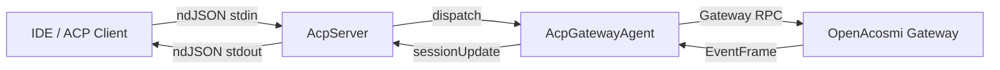

# ACP 协议模块 架构文档

> 最后更新：2026-02-26 | 代码级审计确认 | 9 源文件

## 一、模块概述

ACP（Agent Client Protocol）模块实现 ACP 协议的 ⇔ Gateway 翻译层，是 IDE 集成（Cursor、VS Code 等）通过 ACP 标准协议与 OpenAcosmi Gateway 交互的桥梁。模块位于 `internal/acp/`。

## 二、原版实现（TypeScript）

### 源文件列表

| 文件 | 大小 | 职责 |
|------|------|------|
| `translator.ts` | 14KB | ACP ⇔ Gateway 翻译器核心 |
| `client.ts` | 5KB | ACP 客户端（子进程 + ndJSON 通信） |
| `server.ts` | 4.5KB | ACP 服务端入口（stdin/stdout） |
| `session.ts` | 3KB | 内存会话存储 |
| `session-mapper.ts` | 3KB | 会话 key 解析 + reset |
| `event-mapper.ts` | 3KB | 事件映射工具函数 |
| `commands.ts` | 1.5KB | 可用命令列表 |
| `meta.ts` | 1.5KB | 元数据解析工具 |
| `types.ts` | 1KB | 类型定义 + 常量 |
| `index.ts` | 0.2KB | 模块入口 |

### 核心逻辑摘要

ACP 翻译器接收 ACP 标准请求（`initialize`/`newSession`/`prompt`/`cancel`），翻译为 Gateway RPC（`chat.send`/`chat.abort`/`sessions.list`）。Gateway 事件（`chat.delta`/`chat.final`/`agent.tool_call.*`）反向翻译为 ACP `sessionUpdate` 通知。

## 三、依赖分析

### 显式依赖图

| 依赖模块 | 类型 | 方向 | 用途 |
|----------|------|------|------|
| `@agentclientprotocol/sdk` | 值 | ↓ | ndJSON 流、SDK 连接类 → Go 自建等价 |
| `gateway/client` | 值 | ↓ | Gateway WebSocket RPC → `GatewayRequester` 接口 |
| `gateway/protocol` | 类型 | ↓ | EventFrame → Go 等价类型 |
| `config/config` | 值 | ↓ | `BuildVersion` → 版本号 |
| `infra/path-env` | 值 | ↓ | CLI 路径保证 → CLI 层处理 |
| `utils/message-channel` | 值 | ↓ | 客户端名/模式常量 → Go 常量 |

### 隐藏依赖审计

| 类别 | 结果 | Go 等价方案 |
|------|------|-------------|
| npm 包黑盒行为 | ⚠️ 已处理 | `@agentclientprotocol/sdk` → Go ndJSON 自建实现 |
| 全局状态/单例 | ✅ | `DefaultSessionStore` 包级单例 |
| 事件总线/回调链 | ⚠️ 已处理 | `HandleGatewayEvent`/`Reconnect`/`Disconnect` |
| 环境变量依赖 | ✅ | 委托到 CLI 层 |
| 文件系统约定 | ✅ | 无 |
| 协议/消息格式 | ⚠️ 已处理 | 事件路由结构对齐、增量 delta 切片 |
| 错误处理约定 | ⚠️ 已处理 | `StopReasonRefusal`/`thinkingLevel` |

详见 `docs/renwu/acp-hidden-dep-audit.md`。

## 四、重构实现（Go）

### 文件结构

| 文件 | 行数 | 对应原版 |
|------|------|----------|
| `types.go` | 267 | `types.ts` + SDK 等价类型 |
| `translator.go` | 470 | `translator.ts` |
| `client.go` | 230 | `client.ts` |
| `server.go` | 250 | `server.ts` (部分) |
| `session.go` | 142 | `session.ts` |
| `session_mapper.go` | 145 | `session-mapper.ts` |
| `event_mapper.go` | 100 | `event-mapper.ts` |
| `meta.go` | 95 | `meta.ts` |
| `commands.go` | 35 | `commands.ts` |
| `acp_test.go` | 250 | 单元测试 |

### 接口定义

- `GatewayRequester` — Gateway RPC 请求抽象
- `AcpSessionStore` — 会话存储接口
- `AcpServerHandler` — ACP 请求处理器接口

### 数据流

## 五、差异对照

| 维度 | 原版 TS | 重构 Go |
|------|---------|---------|
| 并发模型 | async/await + Promise | goroutine + channel + sync.Mutex |
| 错误处理 | throw + catch | error 返回值 |
| 隐藏依赖等价 | SDK npm 包 | 自建 ndJSON + 等价类型 |
| SessionID 生成 | `randomUUID()` | ✅ `uuid.New().String()` （Phase 9 D2 对齐） |

## 六、Rust 下沉候选

| 函数/模块 | 优先级 | 原因 |
|-----------|--------|------|
| (无) | — | 协议翻译层无热路径 |

## 七、测试覆盖

| 测试类型 | 覆盖范围 | 状态 |
|----------|----------|------|
| 单元测试 | meta/session/event_mapper/session_mapper | ✅ 11 cases |
| 集成测试 | — | ❌ 需 Gateway mock |
| 隐藏依赖行为验证 | requireExisting/prefixCwd/delta 切片 | ✅ 代码对齐 |
