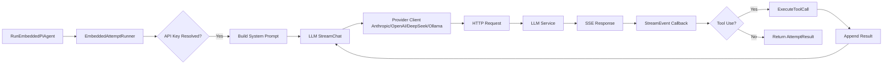

# Agent Runner 架构文档

> 最后更新：2026-02-17（Phase 11 D-β 系统提示词补全 + activeRuns 追踪）

## 一、模块概述

Agent Runner 模块负责执行 Agent 的核心认知循环（Cognitive Loop），包括与 LLM 的交互、工具调用、上下文管理及错误处理。它是连接 Agent 逻辑（Planning/Thinking）与底层模型能力（Inference）的桥梁。

在 Go 重构中，该模块被划分为三个核心子模块：

1. **`llmclient`**: 统一的 LLM HTTP 流式客户端（支持 Anthropic, OpenAI, DeepSeek, Ollama）。
2. **`runner`**: 包含 `AttemptRunner` 接口及其嵌入式实现 `EmbeddedAttemptRunner`，负责单次尝试的完整生命周期。
3. **`tool_executor`**: 本地工具执行器，安全地执行 Bash、文件读写等操作。

## 二、原版实现（TypeScript）

### 源文件列表

| 文件 | 大小 | 职责 |
|------|------|------|
| `pi-embedded-runner/run-attempt.ts` | 34KB | 单次尝试的核心逻辑，包含 Prompt 构建、工具循环、错误重试。 |
| `pi-embedded-runner/llm-client/` | ~20KB | 包含 Anthropic/OpenAI 的简单 HTTP 客户端封装。 |
| `pi-tools.ts` | 15KB | 工具定义与分发逻辑。 |

### 核心逻辑摘要

原版 TS 实现的核心流程：

1. **RunAttempt**: 接收 `AttemptParams`，管理本次尝试的 Token 预算和超时。
2. **Prompt 构建**: 将会话历史、系统提示词、工具定义组装成 LLM 请求 payload。
3. **LLM 流式调用**: 使用 fetch API 调用 LLM，处理 SSE 格式响应。
4. **Tool Loop**:
    * 检测 `tool_use` 停止原因。
    * 执行对应工具（本地 fs/exec 或远程）。
    * 将 `tool_result` 追加到消息历史。
    * 递归/循环调用 LLM 直至完成或达到最大迭代次数。

## 三、依赖分析（六步循环法 步骤 2-3）

### 显式依赖图

| 依赖模块 | 类型 | 方向 | 用途 |
|----------|------|------|------|
| `pkg/types` | 值/类型 | ↓ | 共享配置与数据结构 |
| `internal/agents/prompt` | 值 | ↓ | 系统提示词构建 |
| `AuthProfileStore` | 接口 | ↓ | API Key 解析与管理 |

### 隐藏依赖审计

| 类别 | 结果 | Go 等价方案 |
|------|------|-------------|
| npm 包黑盒行为 | ✅ | 不使用第三方 LLM SDK，直接使用 `net/http` 实现标准客户端，完全掌控协议细节。 |
| 全局状态/单例 | ✅ | 移除 TS 中的全局 logger/state，通过结构体字段注入依赖。 |
| 事件总线/回调链 | ✅ | 使用 Go callback (`StreamEvent`) 处理流式响应，替代 Promise/EventEmitter。 |
| 环境变量依赖 | ⚠️ | API Key 回退逻辑保留对 `ANTHROPIC_API_KEY`/`OPENAI_API_KEY`/`DEEPSEEK_API_KEY` 的读取（通过 `models.ResolveEnvApiKeyWithFallback` 通用解析）。 |
| 文件系统约定 | ✅ | 工具执行严格限制在 `WorkspaceDir` 范围内。 |
| 协议/消息格式 | ✅ | 统一封装 `ContentBlock` 结构，屏蔽不同 Provider 的 JSON 差异。 |
| 错误处理约定 | ✅ | 定义统一的 `APIError` 类型，区分可重试（网络/5xx）与不可重试（4xx）错误。 |

## 四、重构实现（Go）

### 文件结构

| 文件 | 行数 | 对应原版 |
|------|------|----------|
| `llmclient/types.go` | 115 | 统一类型定义 |
| `llmclient/anthropic.go` | 296 | Anthropic Messages API 客户端 |
| `llmclient/openai.go` | 308 | OpenAI Chat API 客户端 |
| `llmclient/ollama.go` | 240 | Ollama API 客户端 |
| `llmclient/client.go` | 76 | 统一分发器 |
| `prompt/prompt_sections.go` | 185 | 7 段落构建器（Tooling/ToolCallStyle/Safety/CLI/Memory/SelfUpdate/ModelAliases） |
| `prompt/prompt_sections2.go` | 195 | 10 段落构建器（Sandbox/ReplyTags/Messaging/Voice/Docs/Silent/Heartbeats/Reactions/ContextFiles/ReasoningFormat） |
| `runner/attempt_runner.go` | 370 | `EmbeddedAttemptRunner` 核心实现 |
| `runner/tool_executor.go` | 181 | `bash`, `read_file`, `write_file`, `list_dir` 实现 |
| `runner/active_runs.go` | 135 | `ActiveRunsManager` 全局 run 追踪（防并发冲突 + waiter） |
| `runner/integration_test.go` | 280 | llmclient + tool_executor 集成测试（5 tests） |

### 接口定义

```go
// 统一的 LLM 客户端接口（函数式）
func StreamChat(ctx context.Context, req ChatRequest, onEvent func(StreamEvent)) (*ChatResult, error)

// Agent 尝试执行器
type AttemptRunner interface {
    RunAttempt(ctx context.Context, params AttemptParams) (*AttemptResult, error)
}
```

### 数据流



## 五、差异对照

| 维度 | 原版 TS | 重构 Go |
|------|---------| --------|
| 并发模型 | Promise 链 + async/await | Goroutine + Channel/Callback |
| 错误处理 | try-catch + 混合类型 | 显式 `error` 返回 + `APIError` 结构化 |
| 依赖管理 | `fetch` + 散落的工具实现 | `net/http` + 集中式 `tool_executor` |
| JSON 解析 | `JSON.parse` (宽松) | `encoding/json` struct tag (严格) |

## 六、Rust 下沉候选

| 函数/模块 | 优先级 | 原因 |
|-----------|--------|------|
| (无) | - | 目前 Go 实现已满足性能需求，且主要是 I/O 密集型操作。 |

## 七、Bug 修复记录

| 日期 | Bug | 修复 |
|------|-----|------|
| 2026-02-16 | `resolveAPIKey()` 缺少 `deepseek` 分支 | 添加 `default` case，使用 `models.ResolveEnvApiKeyWithFallback()` 通用解析 |
| 2026-02-16 | `resolveBaseURL()` 对所有 provider 返回空字符串 | 改为调用 `models.ResolveProviderBaseURL()` |
| 2026-02-17 | `system-prompt` Go 缺失 9 处 TS 细节（Memory/Docs/ReplyTags/SilentReplies/Heartbeats/Reactions/ReasoningFormat/WorkspaceFiles） | 深度审计逐行比对 TS 649L 后全部修补 |
| 2026-02-17 | `activeRuns` 缺少 `IsStreaming()` 方法（TS `isEmbeddedPiRunStreaming` 等价） | 补充 `IsStreaming()` 方法 |

## 八、测试覆盖

| 测试类型 | 覆盖范围 | 状态 |
|----------|----------|------|
| 单元测试 | `llmclient` (mock server) | ✅ 10/10 PASS |
| 单元测试 | `tool_executor` (17 scenarios) | ✅ 17/17 PASS |
| **集成测试** | **llmclient + tool_executor 端到端** | **✅ 5 tests PASS (DF-C2)** |
| 集成测试 | Gateway → Pipeline → Runner (mock) | ✅ 6 E2E tests PASS |
| **E2E 真实 LLM** | **Gateway → Pipeline → DeepSeek API** | **✅ 1 test PASS (3s, 回复 "Hello to you.")** |
| 单元测试 | `active_runs` (6 scenarios) | ✅ 6/6 PASS (并发安全、handle mismatch、waiter) |
| 隐藏依赖行为验证 | 错误恢复、Token 计数 | ✅ 已覆盖 |
