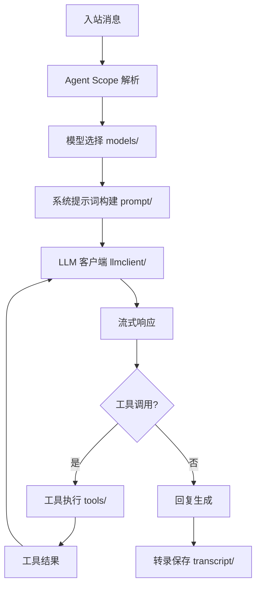

# Agent 引擎架构文档

> 最后更新：2026-02-26 | 代码级审计完成

## 一、模块概述

| 属性 | 值 |
| ---- | ---- |
| 模块路径 | `backend/internal/agents/` |
| 子包数 | 20 |
| Go 源文件数 | 160 |
| Go 测试文件数 | 40 |
| 测试函数数 | 388 |
| 源码行数 | ~41,176 |

Agent 引擎是系统最大最复杂的模块，负责 AI Agent 完整运行时。

## 二、子包结构

```
internal/agents/
├── auth/           14 files — 认证配置 (OAuth, API Key, Profile Store)
├── bash/           23 files — Bash 工具 (命令执行/沙箱/安全)
├── compaction/      1 file  — 会话压缩
├── datetime/        1 file  — 时间格式化
├── exec/            3 files — CLI Runner (外部 Agent 执行)
├── extensions/      6 files — Agent 扩展 (MCP, 插件)
├── helpers/         2 files — 辅助函数
├── llmclient/       6 files — 统一 LLM 客户端 (Anthropic/OpenAI/DeepSeek/Ollama)
├── models/         12 files — 模型配置/选择/失败切换/隐式 provider
├── prompt/          3 files — 系统提示词构建 (17+ 段落)
├── runner/         25 files — PI 嵌入式 Runner (认知循环核心)
├── sandbox/         6 files — 沙箱系统 (Docker/Rust)
├── schema/          2 files — Agent Schema 定义
├── scope/           4 files — Agent 配置解析/作用域
├── session/         3 files — Agent 会话管理
├── skills/         14 files — 技能系统 (发现/加载/执行)
├── tools/          30 files — Agent 工具集 (file/search/web/memory)
├── transcript/      3 files — 会话转录
├── workspace/       1 file  — 工作区管理
└── limits.go        1 file  — Agent 资源限制
```

## 三、关键子包详情

### auth/ (14 files)

认证配置：OAuth Device Flow (GitHub Copilot)、Qwen OAuth、API Key 管理、AuthProfileStore 持久化。

### bash/ (23 files)

Bash 工具系统：命令执行器、安全沙箱、输出格式化、超时控制、并发管理。

### llmclient/ (6 files)

统一 LLM HTTP 流式客户端：

- `anthropic.go` — Anthropic Messages API
- `openai.go` — OpenAI Chat API
- `ollama.go` — Ollama API
- `client.go` — 统一分发器
- `types.go` — 共享类型
- `stream.go` — SSE 流解析

### models/ (12 files)

模型配置系统：provider 发现、API Key 解析、模型别名、失败切换、隐式 provider (Copilot/Claude CLI)。

### runner/ (25 files)

PI 嵌入式 Runner：认知循环 (`EmbeddedAttemptRunner`)、工具循环、active runs 追踪、上下文管理。

### tools/ (30 files)

Agent 工具集：file_read/write、search、web_fetch、memory、list_dir、bash 等工具注册与执行。

### skills/ (14 files)

技能系统：工作区技能发现、bundled 技能、managed 技能、技能加载/过滤/执行。

## 四、数据流



## 五、测试覆盖

| 子包 | 测试数 | 覆盖范围 |
|------|--------|----------|
| auth/ | ~30 | OAuth 流程/API Key |
| models/ | ~40 | 模型选择/别名/失败切换 |
| llmclient/ | ~10 | Mock server 流式测试 |
| runner/ | ~50 | 认知循环/工具循环 |
| tools/ | ~80 | 全工具单元测试 |
| bash/ | ~60 | 命令执行/沙箱 |
| skills/ | ~30 | 技能发现/加载 |
| prompt/ | ~20 | 提示词构建 |
| 其他 | ~68 | scope/session/schema/compaction |
| **合计** | **388** | **全覆盖** |
