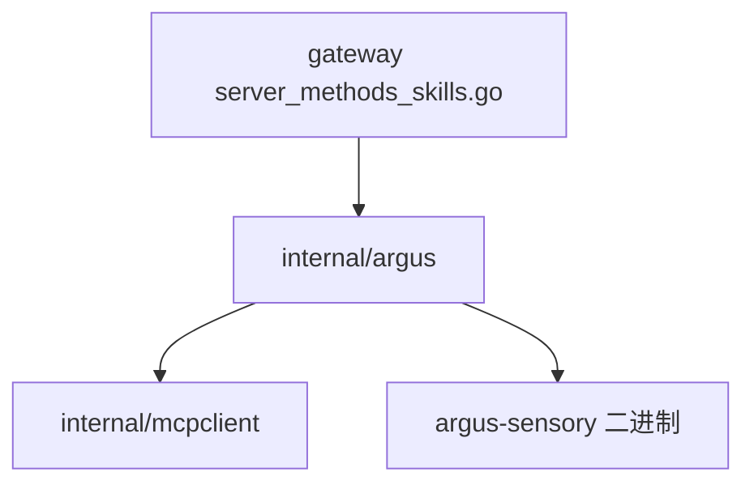

# Argus 视觉子智能体桥接模块架构文档

> 最后更新：2026-02-26 | 代码级审计完成 | 4 源文件, 3 测试文件, 20 测试, ~811 行

## 一、模块概述

| 属性 | 值 |
| ---- | ---- |
| 模块路径 | `backend/internal/argus/` |
| Go 源文件数 | 4 |
| Go 测试文件数 | 3 |
| 测试函数数 | 20 |
| 总行数 | ~811 |
| 依赖 | `internal/mcpclient` |

Argus 是系统的**视觉子智能体**（VLM — Vision Language Model）桥接模块。它将 Rust 实现的 `argus-sensory` CLI 工具通过 MCP (Model Context Protocol) 协议集成到 Go 网关中，提供屏幕感知（截屏、OCR、元素定位）和 GUI 操控（点击、打字、快捷键）能力。

## 二、文件索引

| 文件 | 行数 | 职责 |
|------|------|------|
| `bridge.go` | 469 | **核心**：子进程生命周期管理、MCP 握手、健康检查、自动重启、工具调用转发 |
| `skills.go` | 145 | MCP 工具 → Gateway 技能条目转换、工具分类与风险等级映射 |
| `codesign_darwin.go` | 183 | macOS 代码签名与 .app bundle 发现（解决 TCC 授权持久化问题）|
| `codesign_other.go` | ~14 | 非 macOS 平台空实现桩 |

## 三、核心设计：Bridge 状态机

```text
init ──Start()──▸ starting ──handshake OK──▸ ready ◀──ping OK──▸ degraded
  ▲                                           │                     │
  │                                      Stop()                ping fail ≥3
  └──────────────── stopped ◀──────────────┘◀────────────────────┘
```

### 状态定义

| 状态 | 含义 |
| ---- | ---- |
| `init` | 初始状态，等待 `Start()` 调用 |
| `starting` | 正在启动子进程、执行 MCP 握手 |
| `ready` | 子进程健康，可接受工具调用 |
| `degraded` | 连续 3 次 ping 失败，仍可尝试调用 |
| `stopped` | 已关闭或重启失败 |

### Bridge 结构体

```go
type Bridge struct {
    cfg        BridgeConfig
    mu         sync.RWMutex
    state      BridgeState
    client     *mcpclient.Client    // MCP JSON-RPC 客户端
    cmd        *exec.Cmd            // argus-sensory 子进程
    tools      []mcpclient.MCPToolDef  // 已发现的工具列表
    pid        int
    lastPing   time.Time
    lastRTT    time.Duration
    crashTimes []time.Time          // 快速崩溃熔断器记录
    cancel     context.CancelFunc
    done       chan struct{}
}
```

## 四、启动流程 `Start() → spawnAndHandshake()`

1. **状态检查**：仅允许从 `init` 或 `stopped` 状态启动
2. **子进程创建**：`exec.Command("argus-sensory", "-mcp")`, stderr 重定向到 slog
3. **MCP 握手** (5s 超时)：`client.Initialize(ctx)` → 获取 serverInfo + protocolVersion
4. **工具发现** (5s 超时)：`client.ListTools(ctx)` → 缓存 `[]MCPToolDef`
5. **转入 ready**：启动两个后台 goroutine

## 五、后台 goroutine

### healthLoop — 健康检查

- 每 `30s` 执行 `client.Ping(ctx)` (5s 超时)
- 连续 **3 次失败** → `ready` 降级到 `degraded`
- ping 恢复 → `degraded` 回到 `ready`
- 记录 `lastPing` 时间和 `lastRTT`

### processMonitor — 进程监控与自动重启

- 监听 `cmd.Wait()` 子进程退出
- **指数退避重启**：`1s → 2s → 4s → 8s → 16s → 32s → 60s` (cap)
- **最大重试 5 次**
- **快速崩溃熔断器**：60 秒窗口内崩溃 ≥ 3 次 → 永久 stopped，不再重试
- 重启成功后退避计数器重置，但 crashTimes 记忆跨重启保留

## 六、优雅关闭 `Stop()`

1. 取消后台 goroutine (cancel context)
2. 关闭 stdin 管道 (通知子进程 EOF)
3. 等待最多 **3 秒**优雅退出
4. 超时后 `Process.Kill()` 强制终止

## 七、工具调用 `CallTool()`

- 状态检查：仅 `ready` 或 `degraded` 可调用
- 转发到 `mcpclient.Client.CallTool(ctx, name, arguments, timeout)`
- 返回 `*MCPToolsCallResult`（含 text/image content blocks）

## 八、技能系统集成 (skills.go)

`BuildArgusSkillEntries()` 将 MCP 工具列表转为 Gateway 兼容的 `ArgusSkillEntry` 结构体。

### 工具分类映射 (16 个工具)

| 分类 | 工具 | 风险 |
|------|------|------|
| perception 👁 | `capture_screen`, `describe_scene`, `locate_element`, `read_text`, `detect_dialog`, `watch_for_change` | low |
| action 👆 | `click`, `double_click`, `type_text`, `press_key`, `hotkey`, `scroll`, `mouse_position` | medium (scroll/mouse_position: low) |
| shell 💻 | `run_shell` | **high** |
| macos 🍎 | `macos_shortcut`, `open_url` | medium |

## 九、macOS 代码签名 (codesign_darwin.go)

### 问题

每次 `go build` 产生新二进制哈希，macOS TCC (Transparency, Consent, Control) 按哈希追踪辅助功能/屏幕录制授权，导致**每次重编译后授权失效**。

### 解决方案

**方案 A（优先）**：`FindAppBundleBinary()` — 发现 `.app bundle` 内的已签名二进制

搜索优先级：

1. `{monoRoot}/Argus/build/Argus.app/Contents/MacOS/argus-sensory`
2. `{monoRoot}/Argus/go-sensory/Argus Sensory.app/Contents/MacOS/sensory-server`
3. `/Applications/Argus.app/Contents/MacOS/argus-sensory`
4. `~/Applications/Argus.app/...`
5. `~/.openacosmi/Argus.app/...`

**方案 B（兜底）**：`EnsureCodeSigned()` — 用 `"Argus Dev"` 持久化证书签名裸二进制

- 检查 `codesign --verify` 现有签名
- 用 `security find-identity` 查找 Keychain 中的 `"Argus Dev"` 证书
- 执行 `codesign --force --options runtime -s "Argus Dev" --identifier com.argus.sensory.mcp`

## 十、测试覆盖

| 测试文件 | 测试数 | 覆盖范围 |
|----------|--------|----------|
| `bridge_test.go` | ~8 | 状态机转换、Start/Stop、CallTool |
| `codesign_test.go` | ~6 | 签名检查、bundle 发现 |
| `integration_test.go` | ~6 | 端到端 MCP 握手+工具调用 |
| **合计** | **20** | |

## 十一、并发安全

- `sync.RWMutex` 保护 Bridge 全部可变状态
- `healthLoop` 和 `processMonitor` 通过 `context.Cancel` 精确控制生命周期
- 所有公开方法（`State()`, `Tools()`, `PID()`, `LastPing()`）使用 RLock
- 写操作（`Start()`, `Stop()`, 状态变更）使用 Lock

## 十二、依赖关系


