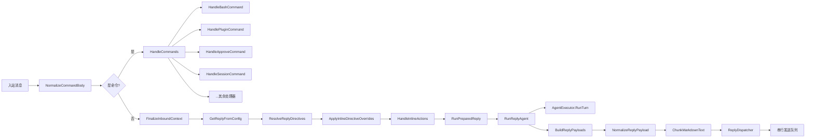

# 自动回复引擎 架构文档

> 最后更新：2026-02-19（Phase 13 G-W1: bash handler 370L + status 520L 全量补全）

## 一、模块概述

自动回复引擎是 OpenAcosmi 的核心模块，负责接收入站消息、解析命令、调度 AI 回复、格式化输出。TS 原版 `src/auto-reply/` 包含 71 个顶层文件 + 139 个 `reply/` 子目录文件（合计 ~22,028 行），是项目中最大的模块。

Go 端采用两级包结构：`internal/autoreply/`（主包）+ `internal/autoreply/reply/`（子包），经 Phase 7 D1-D3 + Phase 8 W1-W4 + Pre-Phase 9 WB/WC + Phase 9 D5 + Phase 13 G-W1 完成 86 文件 ~12,200 行。Phase 13 G-W1 将 `commands_handler_bash.go` 从 56L 扩展至 370L、`status.go` 从 300L 扩展至 520L。

## 二、原版实现（TypeScript）

### 源文件列表

| 目录 | 文件数 | 行数 | 职责 |
|------|--------|------|------|
| `src/auto-reply/` | 71 | ~9,000 | 类型、命令、入站、模板、心跳、分块 |
| `src/auto-reply/reply/` | 139 | ~13,000 | 回复核心、Agent Runner、指令、投递 |

### 核心逻辑摘要

1. **入站处理**：消息接收 → 防抖 → 命令检测 → 授权 → 上下文最终化
2. **命令系统**：16+ 注册命令（/status, /model, /thinking, /config...）
3. **回复生成**：Agent Runner → Provider 调用 → 流式处理
4. **回复投递**：规范化 → 分块 → 人类延迟 → 串行发送

## 三、依赖分析

### 隐藏依赖审计

| 类别 | 结果 | Go 等价方案 |
|------|------|-------------|
| npm 包黑盒行为 | ✅ | 无第三方 npm 依赖 |
| 全局状态/单例 | ⚠️ 命令注册表 | `var globalCommands = make(map[string]*ChatCommandDefinition)` |
| 事件总线/回调链 | ⚠️ ReplyDispatcher | goroutine + channel 串行队列 |
| 环境变量依赖 | ✅ | 无直接 env 依赖 |
| 文件系统约定 | ✅ | 无文件操作 |
| 协议/消息格式 | ✅ | ReplyPayload 结构体对齐 |
| 错误处理约定 | ✅ | Go 标准 error 返回 |

> 详细审计报告：[phase7-d456-hidden-dep-audit.md](file:///Users/fushihua/Desktop/Claude-Acosmi/docs/renwu/phase7-d456-hidden-dep-audit.md)

## 四、重构实现（Go）

### 文件结构

| 文件 | 行数 | 对应原版 | 状态 |
|------|------|----------|------|
| `tokens.go` | 50 | `tokens.ts` | ✅ |
| `thinking.go` | 345 | `thinking.ts` | ✅ |
| `model.go` | 95 | `model.ts` | ✅ |
| `types.go` | 59 | `types.ts` | ✅ |
| `heartbeat.go` | 190 | `heartbeat.ts` | ✅ |
| `commands_types.go` | 123 | `commands-registry.types.ts` | ✅ |
| `commands_args.go` | 121 | `commands-args.ts` | ✅ |
| `commands_registry.go` | 232 | `commands-registry.ts` | ✅ |
| `commands_data.go` | 212 | `commands-registry.data.ts` | ✅ |
| `group_activation.go` | 69 | `group-activation.ts` | ✅ |
| `send_policy.go` | 64 | `send-policy.ts` | ✅ |
| `templating.go` | 110 | `templating.ts` | ✅ |
| `media_note.go` | 56 | `media-note.ts` | ✅ |
| `inbound_debounce.go` | 89 | `inbound-debounce.ts` | ✅ |
| `command_detection.go` | 61 | `command-detection.ts` | ✅ |
| `command_auth.go` | 70 | `command-auth.ts` | ✅ |
| `dispatch.go` | 28 | `dispatch.ts` | 🔸 类型 |
| `tool_meta.go` | 60 | `tool-meta.ts` | ✅ |
| `envelope.go` | 66 | `envelope.ts` | 🔸 简化 |
| `chunk.go` | 447 | `chunk.ts` | ✅ 围栏感知 |
| `reply/types.go` | 42 | reply 子包类型 | ✅ |
| `reply/normalize_reply.go` | 84 | `normalize-reply.ts` | ✅ |
| `reply/inbound_context.go` | 254 | `inbound-context.ts` + text + meta | ✅ 含审计修复 |
| `reply/reply_dispatcher.go` | 227 | `reply-dispatcher.ts` | ✅ |
| `reply/dispatch_from_config.go` | 145 | `dispatch-from-config.ts` | ✅ 音频检测+路由框架 |
| `reply/abort.go` | 58 | `abort.ts` | ✅ 含审计修复 |
| `reply/response_prefix.go` | 21 | `response-prefix-template.ts` | ✅ |
| `reply/body.go` | 109 | `response-body.ts` | ✅ |
| `reply/directives.go` | 200 | `directives.ts` | ✅ Phase 8 W1 |
| `reply/directive_parse.go` | 200 | `directive-handling.parse.ts` | ✅ Phase 8 W1 |
| `reply/directive_shared.go` | 100 | `directive-handling.shared.ts` | ✅ Phase 8 W1 |
| `reply/exec_directive.go` | 115 | `directives.ts` exec部分 | ✅ Phase 8 W1 |
| `reply/queue_directive.go` | 135 | `queue-directive.ts` | ✅ Phase 8 W1 |
| `reply/mentions.go` | 130 | `mentions.ts` | ✅ Phase 8 W1 |
| `reply/history.go` | 170 | `history.ts` | ✅ Phase 8 W1 |
| `reply/typing.go` | 250 | `typing.ts` | ✅ Phase 8 W1 |
| `reply/typing_mode.go` | 160 | `typing-mode.ts` | ✅ Phase 8 W1 |
| `reply/route_reply.go` | 180 | `route-reply.ts` | ✅ Phase 8 W1 |
| `reply/followup_runner.go` | 100 | `followup-runner.ts` | ✅ W2 填充 |
| `reply/agent_runner.go` | 163 | `agent-runner.ts` | ✅ Phase 8 W2 |
| `reply/agent_runner_execution.go` | 100 | `agent-runner-execution.ts` | ✅ Phase 8 W2 |
| `reply/model_fallback_executor.go` | 204 | `agent-runner-execution.ts` L146-465 | ✅ Pre-Phase 9 WB |
| `reply/agent_runner_memory.go` | 87 | `agent-runner-memory.ts` | ✅ Phase 8 W2 + D5 统一 SessionEntry |
| `reply/memory_flush.go` | 160 | `memory-flush.ts` | ✅ Phase 9 D5 决策逻辑 |
| `reply/reply_inline.go` | 80 | `reply-inline.ts` | ✅ Phase 9 D5 内联命令 |
| `reply/directive_persist.go` | 140 | `directive-handling.persist.ts` | ✅ Phase 9 D5 指令持久化 |
| `reply/agent_runner_payloads.go` | 115 | `agent-runner-payloads.ts` | ✅ Phase 8 W2 |
| `reply/agent_runner_utils.go` | 226 | `agent-runner-utils.ts` | ✅ Phase 8 W2 |
| `reply/get_reply.go` | 196 | `get-reply.ts` | ✅ Phase 8 W2 |
| `reply/get_reply_run.go` | 170 | `get-reply-run.ts` | ✅ Phase 8 W2 |
| `reply/get_reply_directives.go` | 262 | `get-reply.ts` 指令部分 | ✅ Phase 8 W2 |
| `reply/get_reply_directives_apply.go` | 160 | `get-reply.ts` 应用部分 | ✅ Phase 8 W2 + D5 持久化 |
| `reply/get_reply_directives_utils.go` | 13 | `get-reply.ts` 工具 | ✅ Phase 8 W2 |
| `reply/get_reply_inline_actions.go` | 170 | `get-reply-inline-actions.ts` | ✅ Phase 8 W2 + D5 填充 |
| `commands_handler_types.go` | 95 | `commands-types.ts` | ✅ Phase 8 W3 |
| `commands_context.go` | 90 | `commands-context.ts` | ✅ Phase 8 W3 |
| `commands_core.go` | 89 | `commands-core.ts` | ✅ Phase 8 W3 |
| `commands_handler_bash.go` | 370 | `commands-bash.ts` | ✅ Phase 13 G-W1 全量补全 |
| `commands_handler_plugin.go` | 45 | `commands-plugin.ts` | ✅ Phase 8 W3 |
| `commands_handler_approve.go` | 126 | `commands-approve.ts` | ✅ Phase 8 W3 |
| `commands_handler_compact.go` | 80 | `commands-compact.ts` | ✅ Phase 8 W3 |
| `commands_handler_info.go` | 195 | `commands-info.ts` | ✅ Phase 8 W3 |
| `commands_handler_ptt.go` | 175 | `commands-ptt.ts` | ✅ Phase 8 W3 |
| `commands_handler_status.go` | 175 | `commands-status.ts` | ✅ Phase 8 W3 |
| `commands_handler_config.go` | 230 | `commands-config.ts` | ✅ Phase 8 W3 |
| `commands_handler_tts.go` | 200 | `commands-tts.ts` | ✅ Phase 8 W3 |
| `commands_handler_models.go` | 240 | `commands-models.ts` | ✅ Phase 8 W3 |
| `commands_handler_session.go` | 260 | `commands-session.ts` | ✅ Phase 8 W3 |
| `commands_handler_context_report.go` | 170 | `commands-context-report.ts` | ✅ Phase 8 W3 |
| `commands_handler_subagents.go` | 215 | `commands-subagents.ts` | ✅ Phase 8 W3 |
| `commands_handler_allowlist.go` | 300 | `commands-allowlist.ts` | ✅ Phase 8 W3 |
| `status.go` | 520 | `status.ts` | ✅ Phase 13 G-W1 全量补全 |
| `skill_commands.go` | 175 | `skill-commands.ts` | ✅ Phase 8 W4 |
| `reply/abort.go` | 196 | `abort.ts` | ✅ Phase 8 W4 扩展 |

### 数据流

## 五、差异对照

| 维度 | 原版 TS | 重构 Go |
|------|---------|---------|
| 并发模型 | Promise 链 + setTimeout | goroutine + channel + sync.Mutex |
| 中止信号 | AbortSignal | context.WithCancel |
| 命令注册 | 模块级 Map + init | `var globalCommands = make(...)` |
| 命令分发 | switch-case 链 | CommandHandler 链 + HandleCommands 迭代 |
| 防抖器 | setTimeout + clearTimeout | time.AfterFunc + sync.Mutex |
| 回复分发 | async/await 串行 | goroutine processLoop + channel |
| 人类延迟 | setTimeout | time.Sleep |
| 分块策略 | 围栏感知 + 段落模式 | 同等实现（pkg/markdown 集成） |

## 六、Rust 下沉候选

| 函数/模块 | 优先级 | 原因 |
|-----------|--------|------|
| (无) | — | 当前无 CPU 密集操作 |

## 七、测试覆盖

| 测试类型 | 覆盖范围 | 状态 |
|----------|----------|------|
| 单元测试 | D1: tokens/thinking/model/heartbeat | ✅ 35 tests |
| 单元测试 | D2: commands/registry/args/activation/policy | ✅ 13 tests |
| 单元测试 | D3: templating/media/detection/auth/debounce | ✅ 13 tests |
| 单元测试 | D4: normalize_reply/inbound_context/reply_dispatcher | ✅ 32 tests |
| 单元测试 | D6: chunk (围栏感知 + 段落 + 配置) | ✅ 30 tests |
| 单元测试 | W1: directives/exec/queue/typing/mentions | ✅ 35 tests |
| 单元测试 | W2: agent_runner_utils/directives_utils | ✅ 16 tests |
| 单元测试 | W3: commands handlers (parse+dispatch+auth) | ✅ 88 tests |
| 单元测试 | W4: status/skill_commands (format+parse+build) | ✅ 12 tests |
| 单元测试 | Pre-Phase 9 WB: model_fallback_executor + auth cooldown | ✅ 7 tests |
| 单元测试 | Pre-Phase 9 WC: model_fallback_executor_test 更新 (MessagingToolSend) | ✅ |
| 单元测试 | Phase 9 D5: memory_flush + reply_inline + directive_persist | ✅ 26 tests |
| 单元测试 | pkg/markdown fence spans | ✅ 9 tests |
| 集成测试 | 端到端回复流程 | ❌ Phase 9 |
