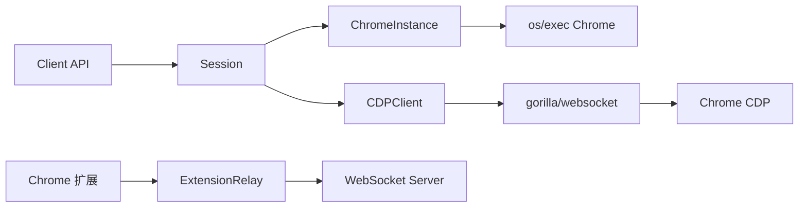

# 浏览器自动化架构文档

> 最后更新：2026-02-26 | 代码级审计确认 | 28 源文件, 24 测试

## 一、模块概述

浏览器自动化模块 (`internal/browser/`) 通过 Chrome DevTools Protocol (CDP) 提供程序化浏览器控制。支持 Chrome 生命周期管理、多 profile 隔离、扩展中继、页面导航/执行/截图等自动化操作。

## 二、原版实现（TypeScript）

### 源文件列表

| 文件 | 大小 | 职责 |
|------|------|------|
| `profiles.ts` | ~114L | CDP 端口分配 + profile 颜色 |
| `config.ts` | ~200L | 配置解析 |
| `chrome.executables.ts` | ~626L | 三平台 Chrome 可执行文件发现 |
| `chrome.ts` | ~500L | Chrome 进程管理 |
| `cdp.helpers.ts` | ~174L | CDP WebSocket sender + HTTP fetch |
| `cdp.ts` | ~454L | 高级 CDP 命令 |
| `extension-relay.ts` | ~790L | Chrome 扩展 WebSocket 中继 |
| `pw-session.ts` | ~300L | 浏览器会话 |
| `server.ts` | ~600L | 浏览器控制 HTTP 服务器 |
| `client.ts` | ~400L | 客户端操作 |

### 核心逻辑摘要

- **Chrome 发现**：macOS (Application bundle) / Linux (`which`) / Windows (`PROGRAMFILES`) 自动检测
- **CDP 通信**：WebSocket JSON-RPC 协议，pending request map + message dispatch
- **扩展中继**：HTTP WebSocket 服务器，auth token 验证，浏览器扩展 ↔ 后端双向通信
- **多 Profile**：每个 profile 独立 CDP 端口 (18800-18899)、数据目录、颜色标识

## 三、依赖分析

### 显式依赖图

| 依赖模块 | 类型 | 方向 | 用途 |
|----------|------|------|------|
| `gorilla/websocket` | 值 | ↓ | WebSocket CDP 通信 |
| `net/http` | 值 | ↓ | HTTP fetch + 扩展中继 |
| `os/exec` | 值 | ↓ | Chrome 进程管理 |
| `crypto/rand` | 值 | ↓ | Auth token 生成 |
| `auto-reply/` | 类型 | ↑ | 页面内容提取 |

### 隐藏依赖审计

| 类别 | 结果 | Go 等价方案 |
|------|------|-------------|
| npm 包黑盒行为 | ⚠️ `ws` WebSocket | `gorilla/websocket`（已在 go.mod） |
| 全局状态/单例 | ⚠️ Chrome 进程池 | `sync.Mutex` 保护 Client.sessions map |
| 事件总线/回调链 | ⚠️ CDP message dispatch | `sync.Map` pending requests + goroutine |
| 环境变量依赖 | ✅ | — |
| 文件系统约定 | ⚠️ `~/.openacosmi/browser-profiles/` | 同路径约定 |
| 协议/消息格式 | ⚠️ CDP JSON-RPC | CdpResponse struct + json.Unmarshal |
| 错误处理约定 | ⚠️ WebSocket 断连 | closeWithError 广播 pending |

## 四、重构实现（Go）

### 文件结构 — `internal/browser/` (12 文件)

| 文件 | 行数 | 对应原版 |
|------|------|----------|
| [constants.go](file:///Users/fushihua/Desktop/Claude-Acosmi/backend/internal/browser/constants.go) | ~25 | 端口常量 |
| [config.go](file:///Users/fushihua/Desktop/Claude-Acosmi/backend/internal/browser/config.go) | ~121 | config.ts |
| [profiles.go](file:///Users/fushihua/Desktop/Claude-Acosmi/backend/internal/browser/profiles.go) | ~112 | profiles.ts |
| [chrome_executables.go](file:///Users/fushihua/Desktop/Claude-Acosmi/backend/internal/browser/chrome_executables.go) | ~168 | chrome.executables.ts |
| [chrome.go](file:///Users/fushihua/Desktop/Claude-Acosmi/backend/internal/browser/chrome.go) | ~169 | chrome.ts |
| [cdp_helpers.go](file:///Users/fushihua/Desktop/Claude-Acosmi/backend/internal/browser/cdp_helpers.go) | ~210 | cdp.helpers.ts |
| [cdp.go](file:///Users/fushihua/Desktop/Claude-Acosmi/backend/internal/browser/cdp.go) | ~158 | cdp.ts |
| [extension_relay.go](file:///Users/fushihua/Desktop/Claude-Acosmi/backend/internal/browser/extension_relay.go) | ~150 | extension-relay.ts |
| [session.go](file:///Users/fushihua/Desktop/Claude-Acosmi/backend/internal/browser/session.go) | ~107 | pw-session.ts |
| [client.go](file:///Users/fushihua/Desktop/Claude-Acosmi/backend/internal/browser/client.go) | ~126 | client.ts |
| [server.go](file:///Users/fushihua/Desktop/Claude-Acosmi/backend/internal/browser/server.go) | ~270 | bridge-server.ts + control-service.ts |
| [client_actions.go](file:///Users/fushihua/Desktop/Claude-Acosmi/backend/internal/browser/client_actions.go) | ~155 | client-actions.ts |

### 接口定义

- `CDPClient` — 高级 CDP 命令封装（Navigate/Evaluate/CaptureScreenshot/ListTargets）
- `ChromeInstance` — Chrome 进程管理（Start/Stop/WaitForCDP）
- `Session` — Chrome + CDP 绑定会话
- `Client` — 公共 API（Launch/Navigate/Evaluate/Screenshot/Close）
- `ExtensionRelay` — 扩展 WebSocket 中继服务器

### 数据流

## 五、差异对照

| 维度 | 原版 TS | 重构 Go |
|------|---------|---------|
| WebSocket | `ws` npm | `gorilla/websocket` |
| 进程管理 | `child_process.spawn` | `exec.CommandContext` |
| CDP pending | Map + EventEmitter | `sync.Map` + channel |
| 浏览器发现 | 3 平台 + bundle ID 检测 | 3 平台简化（核心路径） |
| Auth token | `crypto.randomBytes` | `crypto/rand` |
| HTTP 控制服务 | express + Bearer auth | `net/http` + `MaxBytesHandler` |
| 客户端操作 | fetch wrapper | `net/http` client |

## 六、Rust 下沉候选

| 函数/模块 | 优先级 | 原因 |
|-----------|--------|------|
| (无) | — | 浏览器模块以 I/O 为主，无 CPU 密集计算 |

## 七、测试覆盖

| 测试类型 | 覆盖范围 | 状态 |
|----------|----------|------|
| 编译验证 | 全包 | ✅ |
| 静态分析 | go vet | ✅ |
| 单元测试 | — | ❌ 待实现 |
| CDP 集成测试 | — | ❌ 需真实 Chrome |
