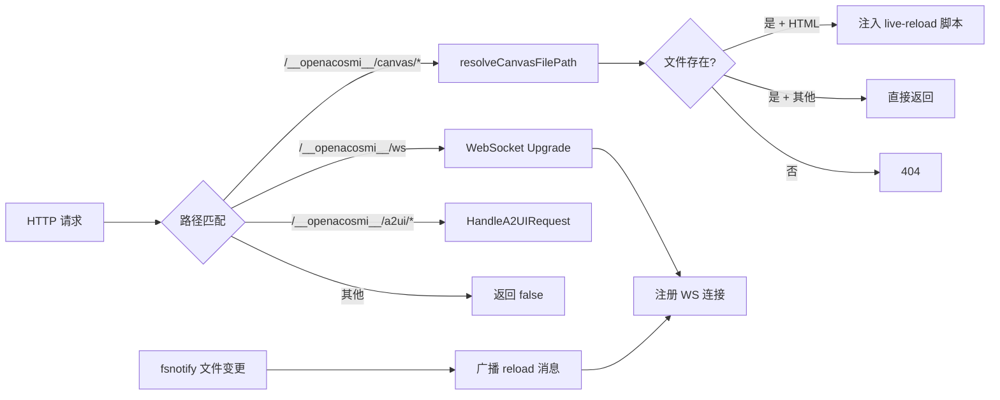

# Canvas Host 架构文档

> 最后更新：2026-02-26 | 代码级审计确认 | 4 源文件

## 一、模块概述

Canvas Host 是 Agent 生成的 HTML/JS 可视化页面的嵌入式 HTTP+WebSocket 服务器。它提供静态文件托管、live-reload 热更新、iOS/Android WebView 原生桥接脚本注入，以及安全的文件路径解析。

在整体架构中，Canvas Host 是 Gateway 的独立子服务，可通过 `StartCanvasHost()` 作为独立进程启动，也可作为 `CanvasHandler` 嵌入到主 Gateway HTTP 路由中。

## 二、原版实现（TypeScript）

### 源文件列表

| 文件 | 大小 | 职责 |
|------|------|------|
| `src/canvas-host/a2ui.ts` | 219L | A2UI 静态文件服务 + live-reload 注入 |
| `src/canvas-host/server.ts` | 516L | Canvas HTTP+WS 服务器 + fsnotify 热更新 |
| `src/infra/canvas-host-url.ts` | 82L | Canvas Host URL 解析 |

### 核心逻辑摘要

1. **A2UI**: 提供 OpenAcosmi 内置 UI 资源的静态文件服务，在 HTML 响应中注入 live-reload WebSocket 客户端脚本和 WebView 原生桥接脚本
2. **Server**: 创建 HTTP 服务器处理静态文件请求 + WebSocket 服务处理 live-reload 通知；使用 `chokidar`(TS)/`fsnotify`(Go) 监视文件变更
3. **URL 解析**: 根据端口、主机覆盖、请求头、转发协议等参数构建 Canvas Host URL

## 三、依赖分析（六步循环法 步骤 2-3）

### 显式依赖图

| 依赖模块 | 类型 | 方向 | 用途 |
|----------|------|------|------|
| `internal/config` | 值 | ↓ | 路径解析（ResolveStateDir, DeriveDefaultCanvasHostPort） |
| `internal/media` | 值 | ↓ | MIME 类型检测（DetectMime） |
| `fsnotify/fsnotify` | 值 | ↓ | 文件系统变更监视（live-reload） |
| `gorilla/websocket` | 值 | ↓ | WebSocket 连接管理 |
| `pkg/types` | 类型 | ↓ | CanvasHostConfig 类型 |
| gateway | 类型 | ↑ | CanvasHostURL 字段消费 |

### 隐藏依赖审计

| 类别 | 结果 | Go 等价方案 |
|------|------|-------------|
| npm 包黑盒行为 | ⚠️ chokidar 文件监视 | `fsnotify/fsnotify` — 跨平台 inotify/kqueue/FSEvents |
| 全局状态/单例 | ✅ 无 | — |
| 事件总线/回调链 | ⚠️ WS broadcast | `sync.Mutex` + `[]*websocket.Conn` 手动广播 |
| 环境变量依赖 | ⚠️ OPENACOSMI_HOME 等 | 通过 `internal/config/paths.go` 统一解析 |
| 文件系统约定 | ⚠️ A2UI 资源路径 | `resolveA2UIRoot()` 基于可执行文件位置解析 |
| 协议/消息格式 | ⚠️ WS reload 消息 | JSON `{"type":"reload"}` 格式对齐 |
| 错误处理约定 | ✅ 无特殊 | — |

## 四、重构实现（Go）

### 文件结构

| 文件 | 行数 | 对应原版 |
|------|------|----------|
| `host_url.go` | 113 | `canvas-host-url.ts` |
| `a2ui.go` | 250 | `a2ui.ts` |
| `handler.go` | 423 | `server.ts` (handler 部分) |
| `server.go` | 168 | `server.ts` (server 启动部分) |
| `canvas_test.go` | 338 | 新增测试 |

### 接口定义

```go
// 核心类型
type CanvasHandlerOpts struct {
    RootDir    string        // Canvas 文件根目录
    BasePath   string        // URL 基路径（默认 /__openacosmi__/canvas）
    LiveReload *bool         // 是否启用 live-reload
    Logger     *slog.Logger
}

type CanvasHandler struct {
    RootDir string           // 公开的根目录路径
    // 内部: rootReal, liveReload, logger, watcher, wsConns, mu
}

// 主要方法
func NewCanvasHandler(opts CanvasHandlerOpts) (*CanvasHandler, error)
func (h *CanvasHandler) HandleHTTP(w, r) bool
func (h *CanvasHandler) HandleUpgrade(w, r) bool
func (h *CanvasHandler) Close() error

// URL 解析
func ResolveCanvasHostURL(params CanvasHostURLParams) string

// 独立服务器
func StartCanvasHost(opts CanvasHostServerOpts) (*CanvasHostServer, error)
```

### 数据流



## 五、差异对照

| 维度 | 原版 TS | 重构 Go |
|------|---------|---------|
| 并发模型 | 单线程 EventLoop | `sync.Mutex` + goroutine (watchLoop) |
| 文件监视 | `chokidar` npm | `fsnotify/fsnotify` |
| WS 库 | `ws` npm (内置 http upgrade) | `gorilla/websocket` |
| 日志 | `console.log` | `log/slog` 结构化日志 |
| 安全 | `fs.realpath` + 前缀检查 | `filepath.EvalSymlinks` + `strings.HasPrefix` |

## 六、Rust 下沉候选

| 函数/模块 | 优先级 | 原因 |
|-----------|--------|------|
| (无) | — | 纯 I/O 模块，无计算密集型逻辑 |

## 七、测试覆盖

| 测试类型 | 覆盖范围 | 状态 |
|----------|----------|------|
| 单元测试 | URL 解析 (8 case) + loopback/parseHost | ✅ |
| 单元测试 | A2UI 注入 + normalizeURLPath | ✅ |
| 单元测试 | 安全路径解析 (遍历/子目录/不存在) | ✅ |
| 集成测试 | HTTP handler (200/404/405 + MIME) | ✅ |
| 集成测试 | live-reload 注入 | ✅ |
| 集成测试 | StartCanvasHost 独立服务器 | ✅ |
| 隐藏依赖行为验证 | fsnotify + WS broadcast | ✅ |
