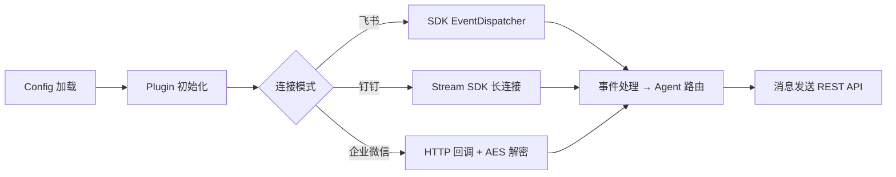

# 中国频道 SDK 架构文档

> 最后更新：2026-02-26 | 代码级审计确认 | feishu 7 + dingtalk 5 + wecom 5 = 17 源文件, ~2,275 行

## 一、模块概述

中国频道 SDK 集成飞书（Lark）、钉钉（DingTalk）、企业微信（WeCom）三个中国主流办公平台，为 Open Acosmi 提供国内远程聊天能力。

位于 `backend/pkg/types/`（类型层）+ `backend/internal/channels/{feishu,dingtalk,wecom}/`（Plugin 层）。

### 连接模式

| 平台 | 长连接（推荐） | HTTP 回调 | 需公网 IP |
| ---- | :---: | :---: | :---: |
| 飞书 | ✅ WebSocket (`oapi-sdk-go/v3/ws`) | ✅ | 长连接不需要 |
| 钉钉 | ✅ Stream (`dingtalk-stream-sdk-go`) | ✅ | 长连接不需要 |
| 企业微信 | ❌ 不支持 | ✅ | 需要 |

## 二、SDK 依赖

| 平台 | Go SDK | 版本 | 官方仓库 |
|------|--------|------|----------|
| 飞书 | `github.com/larksuite/oapi-sdk-go/v3` | v3.5.3 | [larksuite/oapi-sdk-go](https://github.com/larksuite/oapi-sdk-go) |
| 钉钉 | `github.com/open-dingtalk/dingtalk-stream-sdk-go` | v0.9.1 | [open-dingtalk/dingtalk-stream-sdk-go](https://github.com/open-dingtalk/dingtalk-stream-sdk-go) |
| 企业微信 | 标准库 `crypto/aes` + `crypto/sha1` | stdlib | N/A（直接 HTTP API） |

## 三、类型定义（Phase 2）

### 类型定义文件

| 文件 | 内容 |
|------|------|
| `types_feishu.go` | `FeishuConfig` + `FeishuAccountConfig`（AppID/AppSecret/VerifyToken/EncryptKey/Domain） |
| `types_dingtalk.go` | `DingTalkConfig` + `DingTalkAccountConfig`（AppKey/AppSecret/RobotCode/Token/AESKey） |
| `types_wecom.go` | `WeComConfig` + `WeComAccountConfig`（CorpID/Secret/AgentID/Token/AESKey） |

### 常量注册

| 文件 | 变更 |
|------|------|
| `types.go` | `ChannelType`: `ChannelFeishu`/`ChannelDingTalk`/`ChannelWeCom` |
| `types_channels.go` | `ChannelsConfig` +3 字段 + `channelsConfigKnownKeys` +3 键 |
| `channels.go` | `ChannelID`: `ChannelFeishu`/`ChannelDingTalk`/`ChannelWeCom` |

## 四、Channel Plugin 实现（Phase 4 ✅）

### 飞书 Plugin（oapi-sdk-go/v3 SDK）

| 文件 | 说明 |
|------|------|
| `feishu/config.go` | 多账号解析 + 校验 + Feishu/Lark 域名切换 |
| `feishu/client.go` | SDK 客户端封装（`lark.NewClient`）+ 消息发送 API |
| `feishu/sender.go` | 便捷消息发送（text/richtext/card） |
| `feishu/handler.go` | 消息事件类型定义 + 文本提取 |
| `feishu/webhook.go` | SDK `EventDispatcher`（自动验签/解密/URL challenge/去重） |
| `feishu/plugin.go` | `channels.Plugin` 实现（ID/Start/Stop） |

### 钉钉 Plugin（dingtalk-stream-sdk-go）

| 文件 | 说明 |
|------|------|
| `dingtalk/config.go` | 多账号解析 + 校验 |
| `dingtalk/client.go` | Stream SDK 长连接 + `recover` 防护 SDK panic |
| `dingtalk/handler.go` | SDK `BotCallbackDataModel` 解析 |
| `dingtalk/sender.go` | HTTP API 消息发送（O2O/群聊）+ token 缓存 |
| `dingtalk/plugin.go` | `channels.Plugin` 实现 |

### 企业微信 Plugin（标准库 crypto）

| 文件 | 说明 |
|------|------|
| `wecom/config.go` | 多账号解析 + 校验 |
| `wecom/client.go` | HTTP API 客户端 + access_token 自动缓存（7200s） |
| `wecom/handler.go` | AES-256-CBC 解密 + SHA1 签名验证 + XML 解析 |
| `wecom/sender.go` | 消息发送（text/markdown/textcard） |
| `wecom/plugin.go` | `channels.Plugin` 实现 |

### Registry 更新

`internal/channels/registry.go`：chatChannelOrder + channelAliases（`lark`/`ding`/`wechat`/`wxwork`）+ chatChannelMeta

### 设计模式

- **Config 嵌入模式**：与 Telegram/Discord/Slack 一致，`AccountConfig` 嵌入 `Config`，支持多账号
- **JSON 对齐**：所有 JSON tag 与 tracker 配置示例 + 前端 UI 字段名一致
- **AgentID 类型**：WeCom `AgentID` 使用 `*int`（指针）匹配应用商店返回的数值类型
- **DingTalk recover 防护**：SDK pre-v1（v0.9.1）有已知 panic bug，所有 goroutine 加 `recover` 兜底

## 五、Gateway 集成（Phase 5 ✅）

| 文件 | 说明 |
|------|------|
| `boot.go` | `GatewayState` 添加 `ChannelManager` + accessor |
| `server.go` | 启动时从 config 读取频道配置并初始化 plugin |
| `server_methods_channels.go` | `channels.status` 合并运行时快照 + `channels.logout` 真实 Stop |
| `server_channel_webhooks.go` | 飞书 webhook + 企业微信回调 HTTP 路由 |
| `ws_server.go` + `server_methods.go` | ChannelManager DI 注入 |

## 六、Schema + UI 表单（Phase 6 ✅）

| 文件 | 说明 |
|------|------|
| `config/schema.go` | `knownChannelIDs` 添加 feishu/dingtalk/wecom |
| `config/schema_hints_data.go` | 中英双语字段标签 + 帮助文本 |
| UI 频道卡片 | `t()` 国际化，zh/en locale 已有翻译 |

## 七、消息路由管线 + 向导（Phase 7 ✅）

| 文件 | 说明 |
|------|------|
| `outbound.go` | feishu/dingtalk/wecom 出站配置 |
| `channels.go` | `MessageSender` 可选接口 + `Manager.SendMessage` |
| 各 `plugin.go` | 实现 `SendMessage`（飞书/钉钉/企微） |
| `bridge/feishu_actions.go` | `FeishuActionDeps` + `HandleFeishuAction` |
| `bridge/dingtalk_actions.go` | `DingTalkActionDeps` + `HandleDingTalkAction` |
| `bridge/wecom_actions.go` | `WeComActionDeps` + `HandleWeComAction` |
| `wizard-channel.ts` | 频道配置向导（Apple 风格 3 步流程） |
| `en.ts` + `zh.ts` | `wizard.channel.*` i18n（22 keys × 2） |

## 八、主动消息推送 + HMAC 验签（Phase 8 ✅）

| 文件 | 说明 |
|------|------|
| `permission_escalation.go` | 30 分钟审批超时自动拒绝 + 结果推送 |
| `remote_approval.go` | `ApprovalResultNotification` + `ResultNotifier` + `NotifyResult` |
| `remote_approval_feishu.go` | 审批结果互动卡片（绿色批准/红色拒绝） |
| `remote_approval_dingtalk.go` | 审批结果 ActionCard |
| `remote_approval_wecom.go` | 审批结果 TextCard |
| `remote_approval_callback_verify.go` [NEW] | 钉钉 HMAC-SHA256 + 企微 SHA1+AES-256-CBC |
| Config 扩展 | 钉钉 `apiSecret` + 企微 `token`/`encodingAESKey` |

## 九、隐藏依赖审计（Phase 4）

| # | 类别 | 结果 | 说明 |
| --- | ------ | ------ | ------ |
| 1 | npm 包黑盒行为 | ✅ | 新增功能，无 TS 原版对照 |
| 2 | 全局状态/单例 | ✅ | 无全局状态，全部通过 Plugin 结构体管理 |
| 3 | 事件总线/回调链 | ✅ | 使用 SDK 回调 + func 注入 |
| 4 | 环境变量依赖 | ✅ | 无，全部通过 Config 传入 |
| 5 | 文件系统约定 | ✅ | 无文件系统操作 |
| 6 | 协议/消息格式 | ✅ | JSON tag 与前端契约一致 |
| 7 | 错误处理约定 | ✅ | 全部返回 `error`，使用 `fmt.Errorf` + `%w` |

## 十、测试覆盖

| 测试类型 | 范围 | 状态 |
| -------- | ------ | ------ |
| 编译验证 | `go build ./...` | ✅ |
| 静态分析 | `go vet ./...` | ✅ |
| 竞态检测 | `go test -race ./internal/channels/...` | ✅ |
| Gateway 竞态 | `go test -race ./internal/gateway/...` | ✅ |
| ChannelType 常量 | `TestChannelTypeValues` | ✅ |
| JSON 序列化 | ChannelsConfig 反序列化 | ✅ |
| 远程审批 | `TestRemoteApproval*` | ✅ |
| HMAC 验签 | `VerifyDingTalkSignature` / `VerifyWeComSignature` | ✅ |
