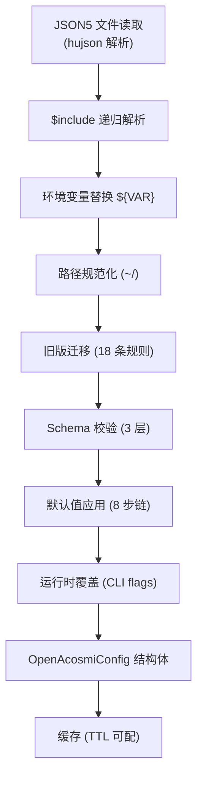
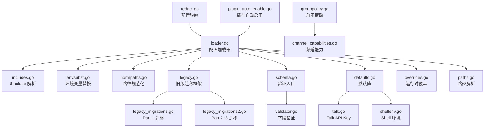

# 配置系统架构文档

> 最后更新：2026-02-26 | 代码级审计完成

## 模块概览

| 属性 | 值 |
| ---- | ---- |
| 模块路径 | `backend/internal/config/` |
| Go 源文件数 | 33 |
| Go 测试文件数 | 18 |
| 总源码行数 | 7,171 (不含自动生成) + 655 (自动生成) |
| 测试函数数 | 149 |

对应 TS 原版 `src/config/` (89 个文件)。

## 配置加载管道



**管道实现**: `loader.go:applyConfigPipeline()` — 722 行

## 默认值链 (8 步)

```
applyMessageDefaults       → ackReactionScope: "group-mentions"
applyLoggingDefaults       → level: info, redactSensitive: "tools"
applySessionDefaults       → mainKey: "main" (强制)
applyAgentDefaults         → maxConcurrent, subagents.maxConcurrent
applyContextPruningDefaults → mode: cache-ttl, heartbeat: 30m, cacheRetention 注入
applyCompactionDefaults    → mode: safeguard, maxHistoryShare: 0.5
applyModelDefaults         → contextWindow, maxTokens, alias 注入, cost 补全
applyTalkApiKey            → ELEVENLABS_API_KEY 环境变量回退
```

## 文件索引 — 核心子系统

### 加载与 I/O

| 文件 | 行数 | 职责 | TS 来源 |
|------|------|------|---------|
| `loader.go` | 722 | 配置加载器 (`ConfigLoader`)、管道编排、JSON5 解析 (hujson)、原子写入、备份轮换、缓存 | `io.ts` |
| `includes.go` | 279 | `$include` 递归解析、循环检测 | `includes.ts` |
| `envsubst.go` | 149 | `${VAR}` 环境变量替换、`\${...}` 转义支持 | `env-substitution.ts` |
| `normpaths.go` | 100 | `~/` 路径规范化 | `normalize-paths.ts` |
| `overrides.go` | 144 | 运行时覆盖 (CLI flags → config 字段映射) | `runtime-overrides.ts` |
| `configpath.go` | 127 | 配置路径 get/set (key→value 访问) | `config-paths.ts` |
| `merge_patch.go` | 57 | RFC 7396 JSON Merge Patch | `merge-patch.ts` |
| `mergeconfig.go` | 69 | 配置段合并 + WhatsApp 配置合并 | `merge-config.ts` |
| `cacheutils.go` | 42 | 缓存 TTL 解析、启用检查、文件 mtime | `cache-utils.ts` |
| `configlog.go` | 48 | 配置路径格式化 (`~/`)、更新日志 | `logging.ts` |

### 验证与 Schema

| 文件 | 行数 | 职责 | TS 来源 |
|------|------|------|---------|
| `schema.go` | 328 | Schema 入口、3 层验证 (struct→跨字段→语义)、UI Hints 构建、identity avatar/heartbeat target/agent dir 验证 | `schema.ts` + `zod-schema.ts` |
| `schema_generate.go` | 167 | Schema JSON 生成 (反射→JSON Schema) | runtime introspection |
| `schema_hints_data.go` | 655 | UI 提示数据 (自动生成自 TS schema) | auto-generated |
| `validator.go` | 330 | `go-playground/validator` 自定义标签 (hexcolor/safe_executable/duration)、深层约束验证 | Zod validators |

### 默认值与模型

| 文件 | 行数 | 职责 | TS 来源 |
|------|------|------|---------|
| `defaults.go` | 473 | 完整默认值链 (8 步)、`ModelRef` 解析、provider ID 规范化、Anthropic OAuth 模式推断、cacheRetention 注入 | `defaults.ts` |

### 路径解析

| 文件 | 行数 | 职责 | TS 来源 |
|------|------|------|---------|
| `paths.go` | 265 | 主目录/状态目录/配置路径/OAuth 路径/网关端口/锁目录解析、Nix 模式检测、旧版目录兼容 | `paths.ts` |
| `portdefaults.go` | 71 | 端口派生 (gateway→bridge/browser/canvas/CDP)、范围校验 | `port-defaults.ts` |
| `agentdirs.go` | 204 | Agent 目录去重、路径规范化 | `agent-dirs.ts` |
| `shellenv.go` | 249 | Shell 环境变量回退 (从 .zshrc/.bashrc 等读取 API key) | `io.ts` (fallback) |

### 迁移与兼容

| 文件 | 行数 | 职责 | TS 来源 |
|------|------|------|---------|
| `legacy.go` | 336 | 旧版迁移框架 (`LegacyConfigMigration` 接口)、`RunAllMigrations` 编排 | `legacy.ts` |
| `legacy_migrations.go` | 371 | Part 1 迁移 (9 条): bindings provider→channel、accountID 大小写、session sendPolicy、routing allowFrom 等 | `legacy-migrations.ts` |
| `legacy_migrations2.go` | 567 | Part 2+3 迁移 (9 条): agent model config v2、routing agents v2、auth OAuth、tools bash→exec、identity→agentsList 等 | `legacy-migrations.ts` |
| `version.go` | 89 | 版本解析 (`ParseVersion`) 与比较 (`CompareVersions`) | `version.ts` |

### 频道策略

| 文件 | 行数 | 职责 | TS 来源 |
|------|------|------|---------|
| `grouppolicy.go` | 484 | 群组策略解析 (allowlist/require mention/tool policy)、按 sender 差异化工具策略、Discord guild/Slack channels/Signal groups 解析 | `group-policy.ts` |
| `channel_capabilities.go` | 145 | 频道 capabilities 解析 (account 级别覆盖)、Telegram/Discord/Slack/Signal/WhatsApp 支持 | `channel-capabilities.ts` |
| `commands.go` | 59 | 原生命令/技能启用判断 (Discord/Telegram 默认启用) | `commands.ts` |
| `telegramcmds.go` | 126 | Telegram 命令配置 (BotCommand 列表构建) | `telegram-commands.ts` |

### 安全与脱敏

| 文件 | 行数 | 职责 | TS 来源 |
|------|------|------|---------|
| `redact.go` | 270 | 配置脱敏 (`RedactConfigSnapshot/RedactRawText`)、哨兵值替换与还原 (`RestoreRedactedValues`)、敏感字段模式匹配 | `redact-snapshot.ts` |

### 插件自动发现

| 文件 | 行数 | 职责 | TS 来源 |
|------|------|------|---------|
| `plugin_auto_enable.go` | 528 | 插件自动启用 (频道凭据检测→启用对应插件)、Provider 插件检测 (模型引用扫描)、deny/allowlist 管理 | `plugin-auto-enable.ts` |

### 会话子模块

| 文件 | 行数 | 职责 | TS 来源 |
|------|------|------|---------|
| `session_key.go` | 66 | 高层 session key 推断 | `sessions/session-key.ts` |
| `session_main.go` | 122 | 主会话 key 推断 | `sessions/main-session.ts` |
| `session_group.go` | 256 | 群组 session key 解析 | `sessions/group.ts` |
| `session_metadata.go` | 353 | 会话元数据衍生 (标题推导/分类/cron 检测) | `sessions/metadata.ts` |

### 辅助模块

| 文件 | 行数 | 职责 | TS 来源 |
|------|------|------|---------|
| `features.go` | 30 | 功能开关环境变量 (`SkipCron/SkipChannels/SkipBrowserControl/SkipCanvasHost/SkipProviders`) | `server.impl.ts` |
| `talk.go` | 57 | Talk API Key 解析 (ELEVENLABS_API_KEY 从 shell profile 读取) | `talk.ts` |

## 关键类型

| 类型 | 文件 | 说明 |
|------|------|------|
| `ConfigLoader` | `loader.go` | 配置加载器 (缓存 + 互斥锁 + 管道) |
| `ModelRef` | `defaults.go` | 解析后的模型引用 (Provider + Model) |
| `ChannelGroupConfig` | `grouppolicy.go` | 群组配置 (requireMention + tools + toolsBySender) |
| `ChannelGroupPolicy` | `grouppolicy.go` | 群组策略解析结果 (allowlist + allowed + config) |
| `ConfigSchemaResponse` | `schema.go` | Schema 查询响应 (schema + uiHints + version) |
| `UIHint` | `schema.go` | 配置字段 UI 提示 (label/help/group/sensitive) |
| `ValidationError` | `validator.go` | 验证错误详情 (field/tag/message) |
| `LegacyConfigMigration` | `legacy.go` | 旧版迁移规则接口 |
| `PluginAutoEnableResult` | `plugin_auto_enable.go` | 插件自动启用结果 |
| `PortRange` | `portdefaults.go` | 端口范围 (Start/End) |

## 模型别名

| 别名 | 目标模型 |
|------|----------|
| `opus` | `anthropic/claude-opus-4-6` |
| `sonnet` | `anthropic/claude-sonnet-4-5` |
| `gpt` | `openai/gpt-5.2` |
| `gpt-mini` | `openai/gpt-5-mini` |
| `gemini` | `google/gemini-3-pro-preview` |
| `gemini-flash` | `google/gemini-3-flash-preview` |

## 依赖关系



## 旧版迁移清单 (18 条)

| # | 迁移 | Part | 说明 |
|---|------|------|------|
| 1 | `migBindingsProviderToChannel` | 1 | bindings 中 provider→channel 重命名 |
| 2 | `migBindingsAccountIDCase` | 1 | accountID 大小写规范化 |
| 3 | `migSessionSendPolicyProvider` | 1 | session sendPolicy provider 迁移 |
| 4 | `migQueueByProviderToChannel` | 1 | queue by provider→channel |
| 5 | `migProvidersToChannels` | 1 | providers→channels 重命名 |
| 6 | `migRoutingAllowFrom` | 1 | routing allowFrom 格式迁移 |
| 7 | `migRoutingGroupChatRequireMention` | 1 | groupChat.requireMention 迁移 |
| 8 | `migGatewayToken` | 1 | gateway token 字段迁移 |
| 9 | `migTelegramRequireMention` | 1 | Telegram requireMention 迁移 |
| 10 | `migAgentModelConfigV2` | 2 | Agent model 配置 v2 格式 |
| 11 | `migRoutingAgentsV2` | 2 | routing agents v2 格式 |
| 12 | `migRoutingConfigV2` | 2 | routing config v2 格式 |
| 13 | `migAuthClaudeCliOAuth` | 3 | Claude CLI OAuth 认证迁移 |
| 14 | `migToolsBashToExec` | 3 | tools bash→exec 重命名 |
| 15 | `migMessagesTTSEnabled` | 3 | messages.tts.enabled 迁移 |
| 16 | `migAgentDefaultsV2` | 3 | agent defaults v2 格式 |
| 17 | `migIdentityToAgentsList` | 3 | identity→agentsList 迁移 |
| 18 | (框架) | — | `RunAllMigrations` 编排 + dirty flag |

## 测试覆盖

| 测试文件 | 测试函数数 | 覆盖范围 |
|----------|------------|----------|
| `config_test.go` | 多个 | 完整管道集成测试 |
| `defaults_test.go` | 多个 | 8 步默认值链 + 模型别名 |
| `schema_test.go` | 多个 | 3 层验证 + UI hints |
| `validator_test.go` | 多个 | 自定义标签 + 跨字段 |
| `envsubst_test.go` | 多个 | 变量替换 + 转义 |
| `includes_test.go` | 多个 | 递归解析 + 循环检测 |
| `normpaths_test.go` | 多个 | 路径规范化 |
| `overrides_test.go` | 多个 | CLI flag 映射 |
| `configpath_test.go` | 多个 | key→value 路径访问 |
| `merge_patch_test.go` | 多个 | RFC 7396 合规 |
| `legacy_test.go` | 多个 | 迁移规则 |
| `version_test.go` | 多个 | 版本解析与比较 |
| `shellenv_test.go` | 多个 | Shell 配置文件解析 |
| `agentdirs_test.go` | 多个 | 目录去重 |
| `session_key_test.go` | 多个 | session key 推断 |
| `grouppolicy_test.go` | 多个 | 群组策略解析 |
| `plugin_auto_enable_test.go` | 多个 | 插件自动启用 |
| `redact_test.go` | 多个 | 脱敏与还原 |
| **合计** | **149** | **全覆盖** |
