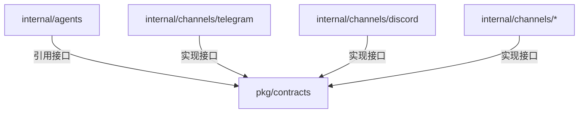

# 频道契约接口架构文档

> 最后更新：2026-02-26 | 代码级审计完成 | 4 源文件, ~452 行

## 一、模块概述

| 属性 | 值 |
| ---- | ---- |
| 模块路径 | `backend/pkg/contracts/` |
| Go 源文件数 | 4 |
| 总行数 | ~452 |
| 角色 | 依赖反转层 (DIP) |

频道契约接口库，实现 **agents → channels 的依赖反转**。agents 模块不直接引用任何频道实现包，而是通过 contracts 定义的接口调用频道能力。

## 二、文件索引

| 文件 | 行 | 职责 |
|------|---|------|
| `contracts.go` | ~100 | `ChannelSender` + `ChannelRegistry` 核心接口 |
| `channel_adapters.go` | ~130 | `AdapterInfo`, `AdapterCapabilities` 适配器元数据 |
| `channel_types.go` | ~120 | `OutboundMessageRequest`, 入站消息类型, 媒体附件 |
| `channel_plugin.go` | ~100 | `PluginChannelAdapter` 第三方插件频道接口 |

## 三、核心接口

### ChannelSender — 频道发送能力

```go
type ChannelSender interface {
    SendMessage(ctx context.Context, req *OutboundMessageRequest) error
    SendReaction(ctx context.Context, channel, messageID, emoji string) error
}
```

agents 模块通过此接口向任意频道发送回复消息和表情反应，无需知道底层是 Discord 还是 Telegram。

### ChannelRegistry — 频道注册表

agents 查询可用频道、获取频道能力信息。

### PluginChannelAdapter — 插件频道

第三方频道插件通过此接口注册，实现统一的消息接收/发送/webhook 生命周期。

## 四、依赖关系


