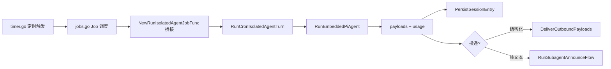

# Cron 服务 架构文档

> 最后更新：2026-02-26 | 代码级审计确认 | 20 源文件, 34 测试

## 一、模块概述

Cron 服务层负责定时任务调度、隔离 Agent 运行和投递，位于 `internal/cron/`。包含 C1（服务层）和 C2（Agent Runner）两个批次。

## 二、原版实现（TypeScript）

### 源文件列表

| 目录/文件 | 大小 | 职责 |
|-----------|------|------|
| `cron/types.ts` | 2.5KB | 核心类型 |
| `cron/normalize.ts` | 13KB | Cron 表达式解析/标准化 |
| `cron/service/` (5 文件) | ~70KB | 服务状态/定时器/Job 管理/持久化 |
| `cron/isolated-agent/` (4 文件) | ~46KB | Agent 运行器/辅助/投递 |
| `cron/delivery.ts` | 2KB | 投递计划解析 |

## 三、隐藏依赖审计

| 类别 | C1 结果 | C2 结果 |
|------|---------|---------|
| npm 包黑盒行为 | ✅ | ✅ |
| 全局状态/单例 | ✅ | ✅ DI 注入（agent-events, agent-scope, date-time） |
| 事件总线/回调链 | ✅ | ⚠️ 1 处（registerAgentRunContext → P2 延后） |
| 环境变量依赖 | ✅ | ✅ DI 处理（process.env → deps 函数） |
| 文件系统约定 | ⚠️ store 持久化 | ✅ session store + transcript path（已修复） |
| 协议/消息格式 | ✅ | ⚠️ MessagingToolSentTargets 类型不一致（P0 延后） |
| 错误处理约定 | ✅ | ✅ resolveAllowedModelRef（已接入 DI） |

## 四、重构实现（Go）

### 文件结构

| 文件 | 行数 | 对应原版 | 批次 |
|------|------|----------|------|
| `types.go` | 200 | types.ts | C1 |
| `normalize.go` | 380 | normalize.ts | C1 |
| `schedule.go` | 120 | schedule logic | C1 |
| `store.go` | 350 | service/store.ts | C1 |
| `timer.go` | 280 | service/timer.ts | C1 |
| `jobs.go` | 250 | service/jobs.ts | C1 |
| `ops.go` | 180 | CRUD 操作 | C1 |
| `delivery.go` | 112 | delivery.ts | C1→C2 升级 |
| `isolated_agent.go` | 596 | isolated-agent/run.ts | C2 |
| `isolated_agent_helpers.go` | 226 | helpers/session/delivery-target | C2 |

### 新增共享模块

| 文件 | 行数 | 职责 |
|------|------|------|
| `internal/security/external_content.go` | 345 | 外部内容安全包装（12 regex, Unicode 折叠, 标记净化） |
| `pkg/markdown/tables.go` | 250 | Markdown 表格转换（off/bullets/code 三模式） |

### 关键接口

```go
// C1: 服务层依赖
type CronServiceDeps struct {
    RunIsolatedAgentJob func(IsolatedAgentJobParams) (*IsolatedAgentJobResult, error)
    // ... store, scheduler deps
}

// C2: Agent Runner 依赖（17 个函数）
type IsolatedAgentDeps struct {
    Config                       *types.OpenAcosmiConfig
    ResolveDefaultAgentID        func(...)
    RunEmbeddedPiAgent           func(...)
    DeliverOutboundPayloads      func(...)
    PersistSessionEntry          func(...)
    ResolveDeliveryTarget        func(...)
    ResolveSessionTranscriptPath func(sessionID, agentID string) string
    ResolveAllowedModelRef       func(cfg, raw, defaultProvider) (string, string, error)
    // ...
}
```

### 数据流



## 五、差异对照

| 维度 | 原版 TS | 重构 Go |
|------|---------|---------|
| 依赖注入 | 直接 import | `IsolatedAgentDeps` struct |
| Model fallback | `runWithModelFallback` 多候选 | 直接调用（P1 延后） |
| CLI Agent | `isCliProvider` → `runCliAgent` | 忽略（P1 延后） |
| 安全包装 | 15 regex + Unicode sanitization | ✅ `security.BuildSafeExternalPrompt`（12 regex + Unicode 折叠） |
| Model 验证 | `resolveAllowedModelRef` + catalog | ✅ DI 接入（含兜底切割） |
| 表格转换 | `convertMarkdownTables` | ✅ `pkg/markdown/tables.go`（regex 解析器） |
| 投递计划 | delivery.ts 完整 legacy mode | ✅ 完整实现（含 auto/explicit/off） |
| Transcript path | `resolveSessionTranscriptPath` | ✅ DI 实现 |

## 六、Rust 下沉候选

| 函数/模块 | 优先级 | 原因 |
|-----------|--------|------|
| `normalize.go` | P3 | CPU 密集型 cron 表达式解析 |

## 七、测试覆盖

| 测试类型 | 覆盖范围 | 状态 |
|----------|----------|------|
| 编译验证 | `go build ./...` | ✅ |
| 静态分析 | `go vet ./internal/cron/...` | ✅ |
| 单元测试 | `internal/security/` (17 tests) | ✅ |
| 单元测试 | `pkg/markdown/` (9 tests) | ✅ |
| 单元测试 | C1: 17 文件 | ❌ 待补 |
| 单元测试 | C2: isolated agent | ❌ 待补 |
