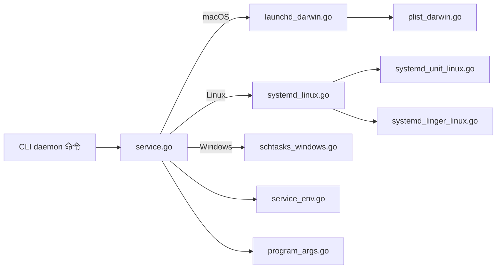

# Daemon 守护进程架构文档

> 最后更新：2026-02-26 | 代码级审计完成

## 一、模块概述

| 属性 | 值 |
| ---- | ---- |
| 模块路径 | `backend/internal/daemon/` |
| Go 源文件数 | 24 |
| Go 测试文件数 | 3 |
| 测试函数数 | 20 |
| 总行数 | 3,437 |

守护进程模块，将 OpenAcosmi 作为后台服务运行。支持 macOS (launchd)、Linux (systemd)、Windows (schtasks)。

## 二、文件索引

### 核心框架 (6 文件)

| 文件 | 行数 | 职责 |
|------|------|------|
| `types.go` | 104 | 核心类型 (`DaemonConfig`/`ServiceInfo`/`DaemonPlatform`) |
| `constants.go` | 149 | 服务名/标签/路径常量 |
| `service.go` | 64 | 服务管理主入口 (Install/Uninstall/Status 分发) |
| `service_env.go` | 192 | 服务环境变量构建 |
| `program_args.go` | 112 | 程序参数构建 |
| `inspect.go` | 363 | 服务状态检查与进程探测 |

### macOS 适配 (4 文件)

| 文件 | 行数 | 职责 |
|------|------|------|
| `launchd_darwin.go` | 239 | launchd Install/Uninstall/Status |
| `plist_darwin.go` | 180 | plist XML 模板生成 |
| `platform_darwin.go` | 32 | macOS 平台分发 (build tag) |
| `notify_darwin.go` | 36 | macOS 通知 (osascript) |

### Linux 适配 (6 文件)

| 文件 | 行数 | 职责 |
|------|------|------|
| `systemd_linux.go` | 259 | systemd Install/Uninstall/Status |
| `systemd_unit_linux.go` | 215 | systemd unit 文件模板生成 |
| `systemd_availability_linux.go` | 48 | systemd 可用性检测 |
| `systemd_hints_linux.go` | 47 | systemd 配置建议 |
| `systemd_linger_linux.go` | 118 | loginctl linger 管理 |
| `platform_linux.go` | 7 | Linux 平台分发桩 |

### Windows 适配 (2 文件)

| 文件 | 行数 | 职责 |
|------|------|------|
| `schtasks_windows.go` | 167 | schtasks XML 任务创建 |
| `platform_windows.go` | 7 | Windows 平台分发桩 |

### 路径与运行时 (3 文件)

| 文件 | 行数 | 职责 |
|------|------|------|
| `paths.go` | 117 | 通用路径解析 (日志/PID/socket) |
| `runtime_paths.go` | 72 | 运行时路径 |
| `runtime_parse.go` | 26 | 运行时信息解析 |

### 诊断与审计 (3 文件)

| 文件 | 行数 | 职责 |
|------|------|------|
| `audit.go` | 319 | 配置审计 (plist/unit 与配置一致性) |
| `diagnostics.go` | 64 | 诊断信息收集 |
| `node_service.go` | 48 | 节点服务管理 |

## 三、数据流

## 四、测试覆盖

| 测试文件 | 测试数 | 覆盖范围 |
|----------|--------|----------|
| `constants_test.go` | — | 服务名/路径常量 |
| `paths_test.go` | — | 路径解析 |
| `service_env_test.go` | — | 环境变量构建 |
| **合计** | **20** | |
