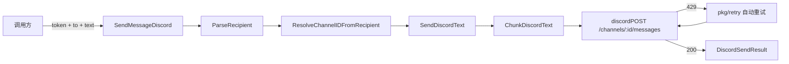

# Discord SDK 架构文档

> 最后更新：2026-02-26 | 代码级审计确认 | 43 源文件, 5 测试文件, 178 测试, ~12,757 行

## 一、模块概述

Discord SDK 提供与 Discord 平台通信的完整能力：账户管理、目标解析、消息发送（文本/媒体/贴纸/投票）、频道/服务器管理、权限计算、线程处理、Gateway 事件监听、消息处理管线、执行审批 UI、原生命令。采用 `discordgo` v0.29.0 全托管 Gateway v10 WebSocket。

位于 `backend/internal/channels/discord/`，对应原版 `src/discord/` 目录（44 个 TS 文件，8733L）。

## 二、原版实现（TypeScript）

### 源文件分层

| 层 | 文件数 | 总行数 | 职责 |
|----|--------|--------|------|
| 叶子工具 | 5 | ~500L | token 规范化、PluralKit API、REST 客户端、日志、账户 ID |
| 账户/目标 | 4 | ~576L | Discord 账户解析、目标解析、权限审计、bot 探测 |
| 解析/分块 | 4 | ~886L | 目录查询、频道/用户解析、文本分块 |
| Send 层 | 8 | ~1300L | 消息 CRUD、反应、频道管理、服务器管理、权限计算、Emoji 上传 |
| Monitor 层 | 26 | ~5400L | Gateway 事件、消息处理管线、允许列表、线程、审批 |

### 核心逻辑摘要

- **`@buape/carbon` RequestClient** 封装了所有 Discord REST API 调用，内含 token 注入和 rate limit 处理
- **`discord-api-types`** 提供完整的 Discord API 类型定义和路由常量
- **Monitor 层** 深度依赖 `@buape/carbon` 的 Gateway/Client/Message 运行时类型

## 三、依赖分析（六步循环法 步骤 2-3）

### 显式依赖图

| 依赖模块 | 类型 | 方向 | 用途 |
|----------|------|------|------|
| `@buape/carbon` | 值+类型 | ↓ | REST 客户端、Message/User/Guild 类型、Gateway 事件 |
| `discord-api-types/v10` | 类型+值 | ↓ | API 类型、路由常量、权限位、频道类型枚举 |
| `../channels/allowlist-match` | 类型 | ↓ | 允许列表匹配接口 |
| `../channels/channel-config` | 值+类型 | ↓ | 频道配置解析工具 |
| `../config/config` | 类型 | ↓ | `OpenAcosmiConfig` 配置类型 |
| `../globals` | 值 | ↓ | `logVerbose` 日志 |
| `../logger` | 值 | ↓ | `logDebug`/`logError` |
| `../routing/resolve-route` | 值 | ↓ | `buildAgentSessionKey` |
| `../media/fetch` + `../media/store` | 值 | ↓ | 远程媒体下载 + 本地存储 |
| `../utils` | 值 | ↓ | `truncateUtf16Safe` 工具 |
| `pkg/retry` | 值 | ↓ | 通用重试逻辑 |

### 隐藏依赖审计

| 类别 | 结果 | Go 等价方案 |
|------|------|-------------|
| npm 包黑盒行为 | ✅ | `@buape/carbon` → `discordgo` v0.29.0 全托管 Gateway |
| 全局状态/单例 | ✅ | `sync.Map` presence cache + reply context |
| 事件总线/回调链 | ✅ | `discordgo` AddHandler 回调 (Phase 9 A6) |
| 环境变量依赖 | ✅ | `os.Getenv("DISCORD_BOT_TOKEN")` |
| 文件系统约定 | ✅ | 无 |
| 协议/消息格式约定 | ✅ | Interactions API + Embed + REST 端点 |
| 错误处理约定 | ✅ | `DiscordSendError` + `DiscordAPIError` |

## 四、重构实现（Go）

### 文件结构（36 个文件）

**基础层（25 文件 — Phase 5D）**：`token.go`, `pluralkit.go`, `api.go`, `gateway_logging.go`, `account_id.go`, `accounts.go`, `targets.go`, `audit.go`, `probe.go`, `directory_live.go`, `resolve_channels.go`, `resolve_users.go`, `chunk.go`, `send_types.go`, `send_shared.go`, `send_permissions.go`, `send_messages.go`, `send_reactions.go`, `send_channels.go`, `send_guild.go`, `monitor_format.go`, `monitor_sender_identity.go`, `monitor_allow_list.go`, `monitor_message_utils.go`, `monitor_threading.go`

**Gateway 层（11 文件 — Phase 9 A6 新增）**：

| 文件 | 行数 | 职责 |
|------|------|------|
| `monitor_deps.go` | ~114 | DI 接口（10 项注入点） |
| `monitor_provider.go` | ~190 | discordgo session + 事件绑定 + 生命周期 |
| `monitor_message_preflight.go` | ~155 | 11 步入站过滤管线 |
| `monitor_message_dispatch.go` | ~150 | agent 路由 + MsgContext + session |
| `monitor_exec_approvals.go` | ~120 | InteractionCreate + Button + Embed |
| `monitor_native_command.go` | ~130 | 8 个原生命令 |
| `monitor_presence_cache.go` | ~50 | sync.Map 在线状态缓存 |
| `monitor_reply_context.go` | ~45 | 回复上下文映射 |
| `monitor_reply_delivery.go` | ~100 | 分块发送 + 反应状态 |
| `monitor_system_events.go` | ~25 | 系统事件格式化 |
| `monitor_typing.go` | ~15 | typing 指示器 |

### 核心设计决策

- **`@buape/carbon` → raw `net/http`**：所有 Discord REST API 调用通过 `discordREST`/`discordGET`/`discordPOST` 等 helper 函数实现，内置 `pkg/retry` 处理 429 速率限制
- **`discord-api-types` → 手写 Go 类型**：权限位使用 `math/big` 的 `Int` 类型进行 bitfield 运算
- **`DiscordSendError`**：自定义错误类型，`Kind` 字段区分 `missing-permissions` 和 `dm-blocked`

### 数据流

## 五、差异对照

| 维度 | 原版 TS | 重构 Go |
|------|---------|---------|
| REST 客户端 | `@buape/carbon` RequestClient（隐式 token 注入 + 429 处理） | `discordREST` 显式 helper（`pkg/retry` 处理 429） |
| 权限位运算 | `BigInt` 原生支持 | `math/big.Int` |
| 错误处理 | `throw new DiscordSendError(...)` | `return ..., &DiscordSendError{...}` |
| Monitor 层 | 完整实现（依赖 `@buape/carbon` Gateway） | ✅ 完整实现（`discordgo` v0.29.0 — Phase 9 A6） |
| 并发模型 | 单线程 + async/await | goroutine + context |

## 六、Rust 下沉候选

| 函数/模块 | 优先级 | 原因 |
|-----------|--------|------|
| (无) | — | Discord SDK 均为 I/O 密集型，无 CPU 热点 |

## 七、测试覆盖

| 测试类型 | 覆盖范围 | 状态 |
|----------|----------|------|
| 编译验证 | `go build ./...` | ✅ |
| go vet | `./internal/channels/discord/...` | ✅ |
| 回归测试 | `go test ./internal/channels/...` | ✅ |
| 单元测试 | 纯逻辑函数 | ❌ 待补 |
| Gateway 集成 | 需 Bot Token + 测试环境 | Phase 10 |

## 八、延迟项

| ID | 描述 | 目标 |
|----|------|------|
| DIS-F-4 | `loadWebMedia` 提取到 `pkg/media/` 共享包 | Phase 10 |
