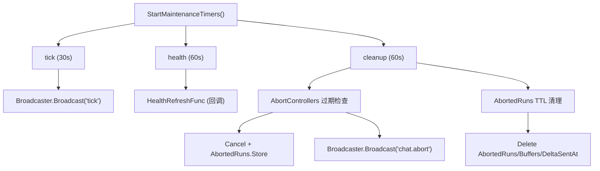

# gateway/maintenance + ws_log 扩展架构文档

> 最后更新：2026-02-26 | 代码级审计确认 | 包含在 gateway.md 中
> 关联 TS：`server-maintenance.ts`, `ws-log.ts`, `chat-abort.ts`, `redact.ts`
> 完成：2026-02-18 Window 8

## 一、模块概述

### 1.1 maintenance.go — 维护定时器

扩展网关维护系统从单一 tick 广播到**三定时器架构**：

| 定时器 | 间隔 | 职责 | TS 来源 |
|--------|------|------|---------|
| tick | 30s | 心跳广播 | `server-maintenance.ts` L56-60 |
| health | 60s | 健康快照刷新（回调注入） | `server-maintenance.ts` L63-67 |
| cleanup | 60s | chatAbort 超时 + abortedRuns TTL | `server-maintenance.ts` L75-117 |

### 1.2 ws_log.go — WS 日志扩展

新增三个功能函数：

| 函数 | 职责 | TS 来源 |
|------|------|---------|
| `CompactPreview` | 多行文本→单行预览 | `ws-log.ts` L95-101 |
| `SummarizeAgentEventForWsLog` | agent 事件结构化摘要 | `ws-log.ts` L103-191 |
| `RedactSensitiveText` | 敏感信息脱敏（15 正则模式） | `redact.ts` |

## 二、核心数据流



## 三、新增类型

### ChatAbortControllerEntry (chat.go)

```go
type ChatAbortControllerEntry struct {
    Cancel      func()    // context.CancelFunc（替代 TS AbortController）
    SessionKey  string
    StartedAtMs int64
    ExpiresAtMs int64
}
```

### ResolveChatRunExpiresAtMs (chat.go)

```
过期时间 = max(min(now + timeout + 60s_grace, now + 24h_max), now + 2min_min)
```

## 四、RedactSensitiveText 模式清单

| # | 模式 | 匹配目标 |
|---|------|----------|
| 1 | ENV assignments | `API_KEY=xxx` |
| 2 | JSON fields | `"apiKey": "xxx"` |
| 3 | CLI flags | `--api-key xxx` |
| 4-5 | Bearer tokens | `Authorization: Bearer xxx` |
| 6 | PEM blocks | `-----BEGIN...PRIVATE KEY-----` |
| 7-15 | Token prefixes | `sk-*`, `ghp_*`, `github_pat_*`, `xox[baprs]-*`, `xapp-*`, `gsk_*`, `AIza*`, `pplx-*`, `npm_*` |

遮蔽规则：<18 字符→`***`，≥18 字符→`前6…后4`，PEM→`BEGIN…redacted…END`

## 五、与 TS 差异

| 点 | TS | Go | 原因 |
|----|----|----|------|
| AbortController | `AbortController` Web API | `context.CancelFunc` | Go 原生 context 模式 |
| Health 刷新 | 内联 `getHealthSnapshot()` | `HealthRefreshFunc` 回调 | 完整 health 依赖 channel plugins/session store，留给 Setup Wizard 阶段 |
| Dedupe cache | `dedupeCache` 清理 | 未移植 | Go 端尚无 dedupe cache 实现 |

## 六、测试覆盖

25 个新增测试，全部通过 `go test -race`：

- maintenance: 常量验证、TTL 清理、chatAbort 超时、health 回调、Stop 幂等
- ws_log: CompactPreview、SummarizeAgentEvent (6 场景)、RedactSensitiveText (7 场景)、maskToken
