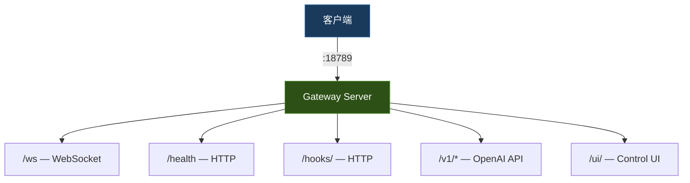

# Gateway 网络底座架构文档

> 最后更新：2026-02-26 | 代码级审计确认 | 包含在 gateway.md 中

## 一、模块概述

Gateway 网络底座负责 HTTP/WebSocket 服务的创建、端口绑定、路由注册和客户端通信。本文档评审 W2-D1 提出的 "WS 18789 vs HTTP 5174 双端口合并" 问题。

## 二、评审结论

**当前架构已正确统一为单端口设计，无需合并。**

### 误解来源

W2-D1 描述中提到 "WS `18789` 与 HTTP `5174` 双端口设计"。经代码审查：

- **`18789`** — Gateway 主端口（WS + HTTP 共享同一个 `http.Server`）
- **`5174`** — Vite 开发服务器端口（前端 `npm run dev`），**不是** Gateway 的 HTTP 端口

### TS 端验证

`server.impl.ts` L155-158:

```typescript
export async function startGatewayServer(
  port = 18789,
  opts: GatewayServerOptions = {},
): Promise<GatewayServer> {
```

单端口 `18789` 上同时注册了：

- WebSocket 升级（`wss` 挂载在 `httpServer` 的 `upgrade` 事件）
- HTTP 路由（`/health`, `/hooks/`, `/v1/chat/completions`, `/v1/responses`, `/tools/invoke/`, `/ui/`）

### Go 端验证

`server.go` L80-409:

```go
func StartGatewayServer(port int, opts GatewayServerOptions) (*GatewayRuntime, error) {
    // 单个 http.NewServeMux()
    mux := http.NewServeMux()
    mux.HandleFunc("/health", ...)
    mux.HandleFunc("/ws", HandleWebSocketUpgrade(wsConfig))
    mux.HandleFunc("/hooks/", ...)
    mux.HandleFunc("/v1/chat/completions", ...)
    // ...
    httpServer := NewGatewayHTTPServer(serverCfg, mux)  // 统一端口
```

### 架构图



## 三、差异对照

| 维度 | TS 端 | Go 端 | 一致性 |
|------|-------|-------|--------|
| 主端口 | 18789 | 由参数传入（默认同） | ✅ |
| WS 路径 | `/` (upgrade) | `/ws` | ⚠️ 路径不同，但功能等价 |
| HTTP 路由 | 同端口 | 同端口 | ✅ |
| TLS | 可选 | 可选 (`tls_runtime.go`) | ✅ |
| 多地址监听 | `ResolveGatewayListenHosts` | `ResolveGatewayListenHosts` | ✅ |

## 四、建议

1. ✅ 无需合并端口 — 已是单端口设计
2. ⚠️ WS 升级路径差异（TS: root `/`, Go: `/ws`）为已知设计选择，不影响功能
3. 此延迟项可标记为**已关闭（非问题）**
