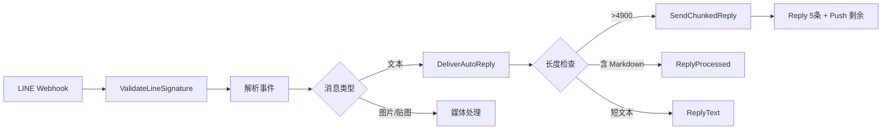

# LINE 频道架构文档

> 最后更新：2026-02-26 | 代码级审计确认 | 15 源文件, 1 测试文件, ~3,718 行

## 一、模块概述

LINE Messaging API 集成模块，负责 LINE Bot 消息收发、Webhook 签名验证、Flex Message 模板构建、Rich Menu 管理和自动回复投递。TS 原版 `src/line/` 包含 34 文件约 5,964 行，Go 端采用纯 REST API 方式（未使用 `line-bot-sdk-go/v8`），精简为 10 文件共 ~1,850 行。

## 二、原版实现（TypeScript）

### 源文件列表

| 目录 | 文件数 | 行数 | 职责 |
|------|--------|------|------|
| `src/line/` | 34 | ~5,964 | SDK 封装、消息解析、Flex 模板、Rich Menu、签名验证、分块发送 |

### 核心逻辑摘要

1. **消息收发**：Webhook 接收 → 签名验证 → 消息解析 → 回复/推送
2. **Flex Message**：结构化卡片（info/list/image/action/notification/receipt/carousel）
3. **Rich Menu**：创建/绑定/切换 → REST API 调用
4. **账号管理**：多账号解析（config → env → file fallback）+ Bot Probe 探测

## 三、依赖分析

### 隐藏依赖审计

| 类别 | 结果 | Go 等价方案 |
|------|------|-------------|
| npm 包黑盒行为 | ✅ 未使用 SDK | 纯 REST API（`net/http` 直调） |
| 全局状态/单例 | ⚠️ `profileCache` | `sync.RWMutex` 保护的 `map[string]*UserProfile`，TTL 5 分钟 |
| 事件总线/回调链 | ✅ 无 | — |
| 环境变量依赖 | ⚠️ | `LINE_CHANNEL_ACCESS_TOKEN` / `LINE_CHANNEL_SECRET`（accounts.go fallback） |
| 文件系统约定 | ⚠️ token file | `resolveToken()` 读取 `tokenFile` 路径（`os.ReadFile`） |
| 协议/消息格式 | ⚠️ HMAC-SHA256 | `ValidateLineSignature()` — `crypto/hmac` + `base64` |
| 错误处理约定 | ✅ | 标准 `error` 返回 |

## 四、重构实现（Go）

### 文件结构

| 文件 | 行数 | 对应原版 | 状态 |
|------|------|----------|------|
| `config_types.go` | 158 | `types.ts` | ✅ 全量类型覆盖 |
| `sdk_types.go` | 226 | SDK 基础类型 | ✅ Flex/Client/Message |
| `client.go` | 222 | REST 客户端 | ✅ PushMessage/ReplyMessage/post |
| `send.go` | 191 | `send.ts` | ✅ 6 发送函数 + profile cache |
| `flex_templates.go` | 307 | `flex-templates.ts`(1512L) | ✅ 7 模板 + carousel |
| `accounts.go` | 153 | `accounts.ts` + `probe.ts` + `signature.ts` | ✅ 多账号解析 + Bot Probe + HMAC 签名 |
| `reply_chunks.go` | 171 | `reply-chunks.ts` + `rich-menu.ts` + `auto-reply-delivery.ts` | ✅ 分块 + Rich Menu + 自动回复 |
| `markdown_to_line.go` | 263 | Markdown → Flex 转换 | ✅ |
| `bot_message_context.go` | ~91 | 消息上下文 | ✅ 原有骨架 |

### 数据流

## 五、差异对照

| 维度 | 原版 TS | 重构 Go |
|------|---------|---------|
| SDK | `@line/bot-sdk` v8 | 纯 REST API (`net/http`) |
| 文件数 | 34 | 10 |
| 行数 | ~5,964 | ~1,850 |
| Flex 模板 | 完整 1,512L | 核心 7 模板 307L |
| Profile 缓存 | 内存 Map | `sync.RWMutex` + TTL 5min |
| 签名验证 | SDK 内置 | `crypto/hmac` + `sha256` |
| Rich Menu | 完整 API | 创建/绑定/设默认 |

## 六、Rust 下沉候选

| 函数/模块 | 优先级 | 原因 |
|-----------|--------|------|
| (无) | — | I/O 密集型，无 CPU 热点 |

## 七、测试覆盖

| 测试类型 | 覆盖范围 | 状态 |
|----------|----------|------|
| 编译验证 | `go build ./internal/channels/line/...` | ✅ |
| 静态分析 | `go vet ./internal/channels/line/...` | ✅ |
| 单元测试 | — | ⚠️ 需后续补充（涉及外部 API mock） |
