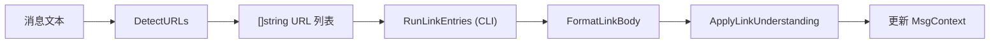

# 链接理解模块架构文档

> 最后更新：2026-02-26 | 代码级审计确认

## 一、模块概述

`internal/linkparse/` 负责从消息文本中提取 URL、过滤不允许的链接、格式化输出、**运行 CLI 链接理解工具并将结果应用到消息上下文**。是 `auto-reply/` 消息预处理管线的前置模块。

位于 `internal/`（内部包），被 `internal/autoreply/` 调用。

## 二、原版实现（TypeScript）

### 源文件列表

| 文件 | 行数 | 职责 |
|------|------|------|
| `defaults.ts` | 3L | 默认超时/数量常量 |
| `detect.ts` | 64L | URL 提取 + Markdown 语法剥离 + 过滤 |
| `format.ts` | 13L | 输出拼接 |
| `runner.ts` | ~200L | 链接内容提取运行器 (延迟) |
| `apply.ts` | ~150L | 结果应用 (延迟) |

### 核心逻辑摘要

1. **URL 检测**：正则提取 URL，剥离 Markdown `[text](url)` 语法，过滤不允许的域名
2. **格式化**：将提取的链接内容拼接为 body 附录
3. **Runner**：通过 CLI 工具抓取页面内容（scope 检查 + 超时 + 多条目回退）
4. **Apply**：运行 Runner 并将结果注入 MsgContext

## 三、依赖分析（六步循环法 步骤 2-3）

### 显式依赖图

| 依赖模块 | 类型 | 方向 | 用途 |
|----------|------|------|------|
| `auto-reply/` | 值 | ↑ | runner/apply 的消费者 |
| `media-understanding/` | 值 | ↓ | runner 依赖媒体理解 |

### 隐藏依赖审计

| 类别 | 结果 | Go 等价方案 |
|------|------|-------------|
| npm 包黑盒行为 | ✅ 无（纯正则） | — |
| 全局状态/单例 | ✅ 无 | — |
| 事件总线/回调链 | ✅ 无 | — |
| 环境变量依赖 | ✅ 无 | — |
| 文件系统约定 | ✅ 无 | — |
| 协议/消息格式 | ✅ 无 | — |
| 错误处理约定 | ✅ 无 | — |

## 四、重构实现（Go）

### 文件结构

| 文件 | 行数 | 对应原版 |
|------|------|----------|
| [defaults.go](file:///Users/fushihua/Desktop/Claude-Acosmi/backend/internal/linkparse/defaults.go) | ~12L | `defaults.ts` |
| [detect.go](file:///Users/fushihua/Desktop/Claude-Acosmi/backend/internal/linkparse/detect.go) | ~95L | `detect.ts` |
| [format.go](file:///Users/fushihua/Desktop/Claude-Acosmi/backend/internal/linkparse/format.go) | ~35L | `format.ts` |
| [runner.go](file:///Users/fushihua/Desktop/Claude-Acosmi/backend/internal/linkparse/runner.go) | ~220L | `runner.ts` |
| [apply.go](file:///Users/fushihua/Desktop/Claude-Acosmi/backend/internal/linkparse/apply.go) | ~60L | `apply.ts` |

### 接口定义

```go
// 常量
const DefaultLinkTimeoutSeconds = 15
const DefaultMaxLinks = 3

// URL 检测
func DetectURLs(text string, disallowed []string) []string
func FormatLinkBody(title, summary string) string

// Runner (Phase 9 D3 新增)
func RunLinkUnderstanding(params RunLinkUnderstandingParams) LinkUnderstandingResult
func RunCliEntry(entry LinkModelConfig, ctx *MsgContext, url string, ...) (string, error)
func ResolveScopeDecision(config *LinkToolsConfig, ctx *MsgContext) string

// Apply (Phase 9 D3 新增)
func ApplyLinkUnderstanding(params ApplyLinkUnderstandingParams) ApplyLinkUnderstandingResult
```

### 数据流



## 五、差异对照

| 维度 | 原版 TS | 重构 Go |
|------|---------|---------|
| URL 正则 | 自定义 | 等价 Go regexp |
| Runner | 完整实现 | ✅ CLI 执行 + scope + timeout |
| Apply | 完整实现 | ✅ Runner + MsgContext 更新 |

## 六、Rust 下沉候选

无。本模块计算量极低。

## 七、测试覆盖

| 测试类型 | 覆盖范围 | 状态 |
|----------|----------|------|
| 单元测试 | — | ❌ 待补 |
| 编译验证 | `go build` + `go vet` | ✅ |
