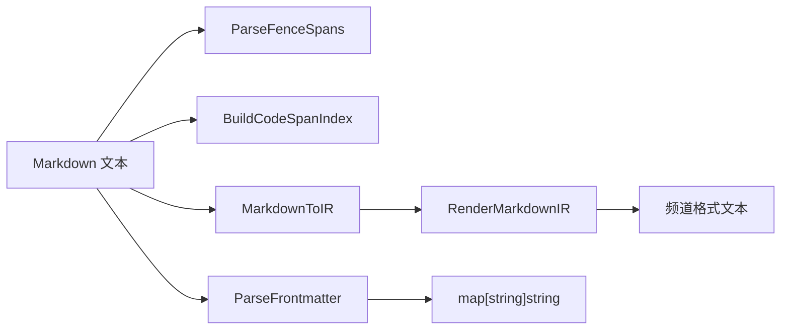

# Markdown 模块架构文档

> 最后更新：2026-02-26 | 代码级审计确认 | 6 源文件

## 一、模块概述

`pkg/markdown/` 提供 Markdown 处理的公共能力，被多个频道适配器共用：围栏/代码 span 解析、frontmatter 提取、Markdown→IR 中间表示转换、IR→频道格式渲染。

位于 `pkg/`（公共包），允许 `internal/channels/*` 和 `internal/autoreply/` 直接引用。

## 二、原版实现（TypeScript）

### 源文件列表

| 文件 | 行数 | 职责 |
|------|------|------|
| `fences.ts` | 82L | 围栏代码块 span 解析 |
| `code-spans.ts` | 106L | 行内代码 span 解析 + 围栏感知 |
| `frontmatter.ts` | 158L | YAML frontmatter 双解析 |
| `ir.ts` | 882L | Markdown→IR 转换（依赖 markdown-it） |
| `render.ts` | 196L | IR→频道格式渲染 |

### 核心逻辑摘要

1. **围栏解析**：识别 `` ``` `` / `~~~` 围栏块，确定安全断行位置
2. **代码 span 索引**：构建字符级索引，判断任意位置是否在代码 span 内
3. **Frontmatter**：YAML 解析 + 行式 key-value 解析，合并结果
4. **IR 转换**：将 Markdown 文本转换为中间表示（styles + links），支持 bold/italic/strikethrough/code/headings/lists/blockquotes
5. **渲染**：按频道规格（Slack mrkdwn / Discord / Signal 等）渲染 IR

## 三、依赖分析（六步循环法 步骤 2-3）

### 显式依赖图

| 依赖模块 | 类型 | 方向 | 用途 |
|----------|------|------|------|
| `markdown-it` (npm) | 值 | ↓ | IR 转换核心引擎 |
| `yaml` (npm) | 值 | ↓ | frontmatter YAML 解析 |
| `auto-reply/chunk.ts` | 值 | ↑ | `chunkMarkdownIR` 依赖 |

### 隐藏依赖审计

| 类别 | 结果 | Go 等价方案 |
|------|------|-------------|
| npm 包黑盒行为 | ⚠️ `markdown-it` 插件系统 | 原生正则+状态机解析器 |
| 全局状态/单例 | ✅ 无 | — |
| 事件总线/回调链 | ✅ 无 | — |
| 环境变量依赖 | ✅ 无 | — |
| 文件系统约定 | ✅ 无 | — |
| 协议/消息格式 | ✅ 无 | — |
| 错误处理约定 | ✅ 无 | — |

## 四、重构实现（Go）

### 文件结构

| 文件 | 行数 | 对应原版 |
|------|------|----------|
| [fences.go](file:///Users/fushihua/Desktop/Claude-Acosmi/backend/pkg/markdown/fences.go) | ~120L | `fences.ts` |
| [code_spans.go](file:///Users/fushihua/Desktop/Claude-Acosmi/backend/pkg/markdown/code_spans.go) | ~155L | `code-spans.ts` |
| [frontmatter.go](file:///Users/fushihua/Desktop/Claude-Acosmi/backend/pkg/markdown/frontmatter.go) | ~210L | `frontmatter.ts` |
| [ir.go](file:///Users/fushihua/Desktop/Claude-Acosmi/backend/pkg/markdown/ir.go) | ~380L | `ir.ts` |
| [render.go](file:///Users/fushihua/Desktop/Claude-Acosmi/backend/pkg/markdown/render.go) | ~210L | `render.ts` |
| [tables.go](file:///Users/fushihua/Desktop/Claude-Acosmi/backend/pkg/markdown/tables.go) | ~250L | Phase 6 已实现 |

### 接口定义

```go
// 核心类型
type StyleKind int    // Bold, Italic, Strikethrough, Code, Spoiler
type IRBlock struct   // 含 Text, Styles, Links
type IRSpan struct    // Start, End, Kind/URL

// 核心函数
func ParseFenceSpans(buffer string) []FenceSpan
func BuildCodeSpanIndex(text string, inlineState *InlineCodeState) *CodeSpanIndex
func ParseFrontmatter(text string) map[string]string
func MarkdownToIR(text string) *MarkdownIR
func RenderMarkdownIR(ir *MarkdownIR, opts RenderOptions) string
```

### 数据流



## 五、差异对照

| 维度 | 原版 TS | 重构 Go |
|------|---------|---------|
| Markdown 解析 | `markdown-it` 插件系统 | 原生正则+状态机（简化） |
| YAML 解析 | npm `yaml` | `gopkg.in/yaml.v3` |
| 并发安全 | 单线程 Node.js | 无共享状态，goroutine 安全 |
| `chunkMarkdownIR` | 已实现 | ⛔ 延迟到 Batch D |

## 六、Rust 下沉候选

| 函数/模块 | 优先级 | 原因 |
|-----------|--------|------|
| `MarkdownToIR` | P3 | 大文本高频调用，可用 `pulldown-cmark` |

## 七、测试覆盖

| 测试类型 | 覆盖范围 | 状态 |
|----------|----------|------|
| 单元测试 | 9 tests PASS（tables + fences + frontmatter） | ✅ |
| 行为探针 | — | ❌ 待补 |
