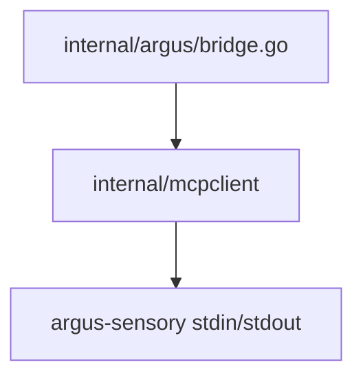

# MCP 客户端模块架构文档

> 最后更新：2026-02-26 | 代码级审计完成 | 2 源文件, 1 测试文件, ~362 行

## 一、模块概述

| 属性 | 值 |
| ---- | ---- |
| 模块路径 | `backend/internal/mcpclient/` |
| Go 源文件数 | 2 |
| Go 测试文件数 | 1 |
| 总行数 | ~362 |
| 协议版本 | MCP `2024-11-05` |
| 传输方式 | stdio (行分隔 JSON-RPC 2.0) |

MCP stdio 客户端，与子进程（主要是 `argus-sensory`）通过 stdin/stdout 管道进行 JSON-RPC 2.0 通信。实现了 MCP 规范的客户端侧：初始化握手、工具发现、工具调用、健康 ping。

## 二、文件索引

| 文件 | 行数 | 职责 |
|------|------|------|
| `client.go` | 257 | **核心**：JSON-RPC 请求/响应复用、后台读循环、超时控制 |
| `types.go` | 107 | MCP 协议类型定义：JSON-RPC 2.0 基础 + MCP 特定消息 |

## 三、Client 架构

```go
type Client struct {
    stdin   io.WriteCloser       // 写入子进程 stdin
    stdout  io.ReadCloser        // 读取子进程 stdout
    nextID  atomic.Int64          // 单调递增请求 ID
    pending sync.Map              // map[int64]chan *JSONRPCResponse — 请求-响应关联
    mu      sync.Mutex
    closed  bool
    done    chan struct{}          // 读循环退出信号
}
```

### 关键设计决策

- **10MB Scanner Buffer**：`maxScannerBuffer = 10 * 1024 * 1024`，匹配 Argus 服务端的行缓冲区限制
- **sync.Map 做请求分发**：atomic ID 生成 + LoadAndDelete 做零锁竞争的请求-响应关联
- **行分隔协议**：每条 JSON-RPC 消息以 `\n` 结尾，bufio.Scanner 按行读取

## 四、核心流程

### 读循环 `readLoop()`

创建 Client 时自动启动后台 goroutine：

1. `bufio.Scanner` 按行扫描 stdout
2. JSON 解码为 `JSONRPCResponse`
3. 通过 `pending.LoadAndDelete(resp.ID)` 找到对应 channel
4. 将响应发送到 channel，唤醒等待的 `send()` 调用

### 请求发送 `send()`

```
请求 → JSON Marshal → 加 \n → 写 stdin → 注册 pending → 等待响应/ctx取消/连接关闭
```

### 通知发送 `notify()`

无 ID 的 JSON-RPC 通知（用于 `notifications/initialized`），不等待响应。

## 五、MCP 方法实现

| 方法 | Go 函数 | 用途 |
|------|---------|------|
| `initialize` + `notifications/initialized` | `Initialize(ctx)` | MCP 握手，返回 ServerInfo |
| `tools/list` | `ListTools(ctx)` | 工具发现，返回 `[]MCPToolDef` |
| `tools/call` | `CallTool(ctx, name, args, timeout)` | 工具调用 (默认 30s 超时) |
| `ping` | `Ping(ctx)` | 健康检查，返回 RTT |

## 六、类型定义 (types.go)

### JSON-RPC 2.0 基础

| 类型 | 用途 |
|------|------|
| `JSONRPCRequest` | 请求（含 ID） |
| `JSONRPCNotification` | 通知（无 ID） |
| `JSONRPCResponse` | 响应（Result 为 `json.RawMessage`） |
| `JSONRPCError` | 错误（Code + Message + Data） |

### MCP 特定类型

| 类型 | 用途 |
|------|------|
| `MCPInitializeParams` / `MCPInitializeResult` | 初始化握手 |
| `MCPToolsListResult` / `MCPToolDef` | 工具发现 |
| `MCPToolsCallParams` / `MCPToolsCallResult` | 工具调用 |
| `MCPContent` | 内容块 (text/image, 支持 base64 data) |

## 七、并发安全

- `atomic.Int64` 生成请求 ID — 无锁
- `sync.Map` 管理 pending 请求 — 无锁读写
- `sync.Mutex` 仅保护 `closed` 标志和 stdin 写入的串行化
- `done` channel 传播读循环退出，确保 `send()` 不会永久阻塞

## 八、依赖关系


