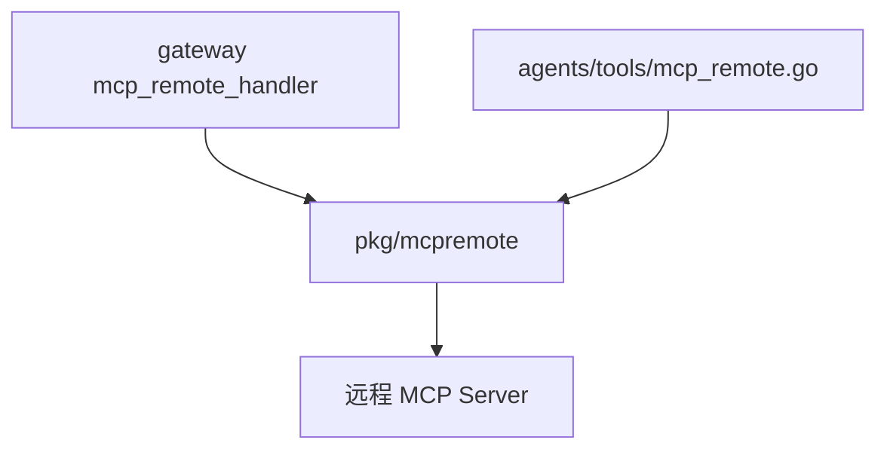

# MCP 远程桥接模块架构文档

> 最后更新：2026-02-26 | 代码级审计完成 | 4 源文件, ~1,204 行

## 一、模块概述

| 属性 | 值 |
| ---- | ---- |
| 模块路径 | `backend/pkg/mcpremote/` |
| Go 源文件数 | 4 |
| 总行数 | ~1,204 |
| 传输方式 | HTTP Streamable (Streamable HTTP transport) |
| 认证方式 | OAuth 2.0 (Device Flow / Authorization Code) |

MCP 远程桥接库，与 `internal/mcpclient`（stdio 本地桥接）互补，支持通过 HTTP + OAuth 连接**远程** MCP 服务器。用于集成第三方 AI 工具服务。

对比：

- `internal/mcpclient` → 本地子进程通信（stdin/stdout），用于 Argus
- `pkg/mcpremote` → 远程 HTTP 通信 + OAuth，用于第三方 MCP servers

## 二、文件索引

| 文件 | 行数 | 职责 |
|------|------|------|
| `bridge.go` | 377 | **核心**：RemoteBridge 生命周期、健康检查、自动重连、工具调用转发 |
| `client.go` | ~300 | RemoteClient：HTTP SSE 传输层、JSON-RPC 2.0 over HTTP |
| `oauth.go` | ~300 | OAuthTokenManager：Device Flow + Authorization Code Grant |
| `types.go` | ~200 | 远程 MCP 类型定义：Tool, ToolCallResult, Content |

## 三、核心设计：RemoteBridge 状态机

与 `internal/argus/bridge.go` **同构**，唯一区别是连接方式从 stdio → HTTP：

```text
init ──Start()──▸ connecting ──connect OK──▸ ready ◀──ping OK──▸ degraded
  ▲                                             │                     │
  │                                         Stop()              ping fail ≥3
  └──────────────── stopped ◀───────────────┘◀────────────────────┘
```

### 常量

```go
bridgeHealthInterval  = 30s    // 健康检查间隔
bridgeMaxPingFailures = 3      // 最大 ping 失败次数
bridgeMaxReconnects   = 5      // 最大重连次数
bridgeInitialBackoff  = 1s     // 初始退避
bridgeMaxBackoff      = 60s    // 最大退避
```

## 四、连接与发现 `Start() → connectAndDiscover()`

1. 创建 `RemoteClient(endpoint, tokenManager)`
2. **MCP 握手** (10s 超时)：`client.Connect(ctx)` → HTTP 连接 + 协议协商
3. **工具发现** (10s 超时)：`client.ListTools(ctx)` → 缓存 `[]Tool`
4. 启动 `healthLoop` 后台 goroutine

## 五、健康循环与自动重连

`healthLoop(ctx)` 统一处理两种场景：

**场景 A — 连接正常时**：

- 每 30s `client.Ping(ctx)` (5s 超时)
- 3 次失败 → degraded → 关闭 client → 进入重连模式

**场景 B — 连接断开时**：

- 指数退避等待 (1s → 2s → 4s → ... → 60s)
- 调用 `connectAndDiscover(ctx)` 重连
- 成功后重置计数器，恢复 ready
- 达到 5 次最大重连 → stopped

## 六、工具调用

- `CallTool(ctx, name, arguments, timeout)` → 转发到 `RemoteClient.CallTool()`
- `Refresh(ctx)` → 重新 `ListTools()` 刷新工具缓存

### Agent 集成辅助

`ToolCallResultToText(result)` — 将 `ToolCallResult` 转为纯文本，处理 text/image content blocks，供 Agent tool executor 使用。

## 七、OAuth 认证 (oauth.go)

`OAuthTokenManager` 管理远程 MCP 服务器的 OAuth 2.0 认证：

- **Device Flow**：适合无浏览器的 CLI/服务端场景
- **Authorization Code Grant**：标准 Web OAuth
- Token 自动刷新与持久化

## 八、优雅关闭 `Stop()`

1. 取消 healthLoop (cancel context)
2. 等待 healthLoop 退出（最多 5s）
3. 关闭 RemoteClient
4. 清空 tools 缓存

## 九、并发安全

- `sync.RWMutex` 保护 RemoteBridge 全部可变状态
- cancel 和 done 在 `Start()` 内连接之前创建，确保 `Stop()` 在连接过程中随时可安全调用
- 连接失败时显式 `close(b.done)` 防止 `Stop()` 死锁

## 十、依赖关系


