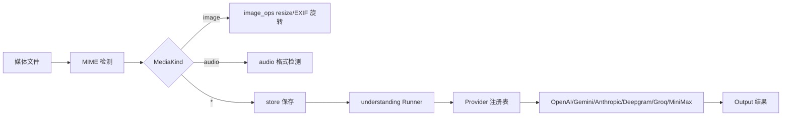

# 媒体模块架构文档

> 最后更新：2026-02-26 | 代码级审计确认 | 32 源文件, 20 测试

## 一、模块概述

媒体模块分为两个子包：`internal/media/`（媒体工具）和 `internal/media/understanding/`（媒体理解），提供媒体文件处理、MIME 检测、远程下载、图像操作、LLM 输出解析，以及多 Provider AI 媒体理解能力。

## 二、原版实现（TypeScript）

### 源文件列表

| 目录 | 文件 | 大小 | 职责 |
|------|------|------|------|
| `media/` | 19 files | ~2,000L | 媒体工具（MIME/存储/下载/解析/图像） |
| `media-understanding/` | 44 files | ~3,000L | 媒体理解（Provider/Runner） |

### 核心逻辑摘要

- **媒体工具**：MIME 检测（`file-type` npm）、UUID 存储、远程下载（SSRF 防护）、MEDIA: token 解析、图像操作（`sharp` npm + EXIF 自动旋转）、HTTP 媒体服务器（CORS + Bearer token 认证）
- **媒体理解**：多 Provider AI 转录/描述（OpenAI Whisper/GPT-4V, Gemini, Anthropic, Deepgram, Groq, MiniMax），批量执行 + 并发控制

## 三、依赖分析

### 显式依赖图

| 依赖模块 | 类型 | 方向 | 用途 |
|----------|------|------|------|
| `net/http` | 值 | ↓ | MIME 检测 + 远程下载 |
| `image/*` | 值 | ↓ | JPEG/PNG 操作 |
| `os/exec` (sips) | 值 | ↓ | HEIC 转换（macOS） |
| `config/` | 值 | ↓ | 媒体理解配置 |

### 隐藏依赖审计

| 类别 | 结果 | Go 等价方案 |
|------|------|-------------|
| npm 包黑盒行为 | ⚠️ file-type/sharp | Go stdlib `net/http.DetectContentType` + `image` |
| 全局状态/单例 | ⚠️ Provider 注册表 | `registry.go` 包级 `DefaultRegistry` |
| 事件总线/回调链 | ✅ | — |
| 环境变量依赖 | ⚠️ 各 AI API key | Provider 构造时注入 |
| 文件系统约定 | ⚠️ 媒体存储目录 + TTL | `store.go` UUID 命名 + 定时清理 |
| 协议/消息格式 | ⚠️ MEDIA: token 格式 | `parse.go` 正则解析 |
| 错误处理约定 | ⚠️ Provider 回退 | `runner.go` 回退链 |

## 四、重构实现（Go）

### 文件结构 — `internal/media/` (11 文件, ~2,100L)

| 文件 | 行数 | 对应原版 |
|------|------|----------|
| [constants.go](file:///Users/fushihua/Desktop/Claude-Acosmi/backend/internal/media/constants.go) | ~44 | constants.ts |
| [mime.go](file:///Users/fushihua/Desktop/Claude-Acosmi/backend/internal/media/mime.go) | ~191 | mime.ts |
| [audio.go](file:///Users/fushihua/Desktop/Claude-Acosmi/backend/internal/media/audio.go) | ~32 | audio.ts |
| [audio_tags.go](file:///Users/fushihua/Desktop/Claude-Acosmi/backend/internal/media/audio_tags.go) | ~44 | audio-tags.ts |
| [store.go](file:///Users/fushihua/Desktop/Claude-Acosmi/backend/internal/media/store.go) | ~243 | store.ts |
| [fetch.go](file:///Users/fushihua/Desktop/Claude-Acosmi/backend/internal/media/fetch.go) | ~191 | fetch.ts |
| [parse.go](file:///Users/fushihua/Desktop/Claude-Acosmi/backend/internal/media/parse.go) | ~191 | parse.ts |
| [image_ops.go](file:///Users/fushihua/Desktop/Claude-Acosmi/backend/internal/media/image_ops.go) | ~523 | image-ops.ts（EXIF 旋转 sips+Go 完整实现） |
| [input_files.go](file:///Users/fushihua/Desktop/Claude-Acosmi/backend/internal/media/input_files.go) | ~250 | input-files.ts |
| [server.go](file:///Users/fushihua/Desktop/Claude-Acosmi/backend/internal/media/server.go) | ~124 | server.ts（CORS + Bearer token 认证） |
| [host.go](file:///Users/fushihua/Desktop/Claude-Acosmi/backend/internal/media/host.go) | ~244 | host.ts |

### 文件结构 — `internal/media/understanding/` (15 文件, ~1,100L)

| 文件 | 行数 | 对应原版 |
|------|------|----------|
| [types.go](file:///Users/fushihua/Desktop/Claude-Acosmi/backend/internal/media/understanding/types.go) | ~221 | types + interfaces |
| [defaults.go](file:///Users/fushihua/Desktop/Claude-Acosmi/backend/internal/media/understanding/defaults.go) | ~65 | defaults |
| [video.go](file:///Users/fushihua/Desktop/Claude-Acosmi/backend/internal/media/understanding/video.go) | ~23 | video utils |
| [scope.go](file:///Users/fushihua/Desktop/Claude-Acosmi/backend/internal/media/understanding/scope.go) | ~65 | scope resolution |
| [concurrency.go](file:///Users/fushihua/Desktop/Claude-Acosmi/backend/internal/media/understanding/concurrency.go) | ~34 | Go 1.18+ generics |
| [registry.go](file:///Users/fushihua/Desktop/Claude-Acosmi/backend/internal/media/understanding/registry.go) | ~75 | provider registry |
| [resolve.go](file:///Users/fushihua/Desktop/Claude-Acosmi/backend/internal/media/understanding/resolve.go) | ~188 | parameter resolution |
| [provider_image.go](file:///Users/fushihua/Desktop/Claude-Acosmi/backend/internal/media/understanding/provider_image.go) | ~79 | 图像 Base64 解析 + URL 下载（`SafeFetchURL` SSRF 防护） |
| provider_*.go (6) | ~1,500+ | 6 providers 完整 HTTP 实现（P7B-2） |
| [runner.go](file:///Users/fushihua/Desktop/Claude-Acosmi/backend/internal/media/understanding/runner.go) | ~241 | main runner + `ProbeBinaries`（exec.LookPath 探测 whisper/sherpa-onnx/gemini） |

### 接口定义

- `MediaKind` — 媒体类型枚举（image/audio/video/document）
- `Provider` — 媒体理解 Provider 接口（TranscribeAudio/DescribeImage/DescribeVideo）
- `Capability` — 能力类型（audio_transcript/image_description/video_description）
- `Registry` — Provider 注册表
- `MediaServerAuthConfig` — 媒体服务器认证配置（Bearer Token + CORS AllowOrigin）
- `BinaryProbeResult` — CLI 工具探测结果（Name/Available/Path/Version）

### 数据流

## 五、差异对照

| 维度 | 原版 TS | 重构 Go |
|------|---------|---------|
| MIME 检测 | `file-type` npm (magic bytes) | `net/http.DetectContentType` |
| 图像处理 | `sharp` npm (libvips) | Go `image` + `x/image/draw.BiLinear` + macOS `sips` |
| EXIF 旋转 | `sharp.rotate()` 自动 | ✅ macOS `sips -r 0` 自动修正 + Go 像素变换 fallback（8 种 orientation） |
| PDF 提取 | 自定义解析 | ✅ `pdfcpu` 库 `ExtractContent` |
| 并发 | Promise.all | `RunWithConcurrency` (semaphore + goroutines) |
| 类型安全 | TypeScript union types | Go interface + 枚举常量 |
| SSRF 防护 | 自定义 SSRF guard | ✅ `security.SafeFetchURL` 已集成 |
| URL 图像下载 | fetch + Buffer | ✅ `SafeFetchURL` + `io.LimitReader` |
| 媒体托管 | Tailscale/Cloudflared | ✅ 本地 HTTP 服务器（隧道延迟 Phase 10+） |
| 媒体服务器认证 | Express CORS + Bearer | ✅ `MediaServerAuthConfig` + OPTIONS 预飞 |
| CLI 工具探测 | `which` + version parse | ✅ `exec.LookPath` + `--version`（whisper/sherpa-onnx/gemini） |

## 六、Rust 下沉候选

| 函数/模块 | 优先级 | 原因 |
|-----------|--------|------|
| image_ops.go 图像缩放 | P2 | 当前双线性插值（`x/image/draw`），Phase 10+ Rust FFI 可升级双三次 |

## 七、测试覆盖

| 测试类型 | 覆盖范围 | 状态 |
|----------|----------|------|
| 编译验证 | 全包 | ✅ |
| 静态分析 | go vet | ✅ |
| 单元测试 | host_test.go (4 tests) | ✅ |
| Provider HTTP 集成 | 6 Provider 完整 HTTP 调用 | ✅ 已实现（P7B-2） |
