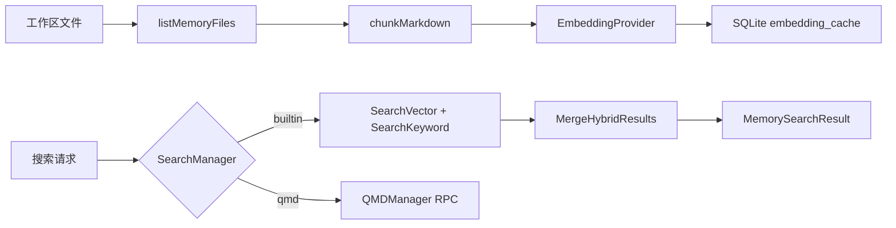

# 记忆系统架构文档

> 最后更新：2026-02-26 | 代码级审计确认 | 161 源文件, 314 测试

## 一、模块概述

记忆系统 (`internal/memory/`) 为 OpenAcosmi 提供持久化语义搜索能力。支持将工作区文件和会话转录编入索引，通过嵌入向量和 FTS5 全文搜索进行混合检索。后端可选 builtin（内嵌 SQLite）或 QMD（外部进程）。

## 二、原版实现（TypeScript）

### 源文件列表

| 文件 | 大小 | 职责 |
|------|------|------|
| `types.ts` | ~60L | 核心类型（MemorySearchResult, MemoryProviderStatus） |
| `internal.ts` | ~350L | 文件列举、Markdown chunking、哈希、余弦相似度 |
| `memory-schema.ts` | ~120L | SQLite schema (meta/files/chunks/cache/FTS5) |
| `backend-config.ts` | ~300L | QMD 后端配置解析 |
| `embeddings.ts` | ~250L | Provider 抽象 + auto 选择 + fallback |
| `embeddings-openai.ts` | ~120L | OpenAI `/v1/embeddings` |
| `embeddings-gemini.ts` | ~160L | Gemini `embedContent` / `batchEmbedContents` |
| `embeddings-voyage.ts` | ~100L | Voyage `/v1/embeddings` |
| `hybrid.ts` | ~130L | BM25 + vector 混合搜索合并 |
| `manager-search.ts` | ~250L | 向量/关键字搜索 |
| `manager.ts` | ~2,411L | 主管理器（init/sync/search/status） |
| `qmd-manager.ts` | ~908L | QMD 子进程管理 |
| `provider-key.ts` | ~30L | 缓存键 fingerprint |
| `status-format.ts` | ~120L | 状态格式化 |

### 核心逻辑摘要

- **索引**：扫描工作区文件 → Markdown chunking → 嵌入向量计算 → SQLite 存储
- **搜索**：混合检索（向量余弦相似度 + FTS5 BM25） → 结果合并排序
- **缓存**：嵌入向量按 provider+model+hash 缓存，避免重复计算

## 三、依赖分析

### 显式依赖图

| 依赖模块 | 类型 | 方向 | 用途 |
|----------|------|------|------|
| `database/sql` + `go-sqlite3` | 值 | ↓ | SQLite 存储 |
| `net/http` | 值 | ↓ | Embedding API 调用 |
| `crypto/sha256` | 值 | ↓ | 内容哈希 |
| `encoding/binary` | 值 | ↓ | float32 → blob 编解码 |
| `config/` | 类型 | ↓ | OpenAcosmiConfig |
| `auto-reply/` | 类型 | ↑ | 搜索结果消费 |

### 隐藏依赖审计

| 类别 | 结果 | Go 等价方案 |
|------|------|-------------|
| npm 包黑盒行为 | ⚠️ `node:sqlite` DatabaseSync | `database/sql` + `go-sqlite3` CGo |
| 全局状态/单例 | ⚠️ Manager 单例 | `sync.RWMutex` 保护 Manager 状态 |
| 事件总线/回调链 | ✅ chokidar → fsnotify | `watcher.go` FileWatcher + debounce |
| 环境变量依赖 | ⚠️ API key (OPENAI_API_KEY 等) | `os.Getenv` + config 注入 |
| 文件系统约定 | ⚠️ `~/.openacosmi/memory/` 数据库路径 | 同路径约定 |
| 协议/消息格式 | ✅ embedding API JSON | 3 batch provider 完整实现 |
| 错误处理约定 | ✅ provider fallback 链 | `CreateEmbeddingProvider` fallback + `pkg/retry` |

## 四、重构实现（Go）

### 文件结构 — `internal/memory/` (20 文件)

| 文件 | 行数 | 对应原版 |
|------|------|----------|
| [types.go](file:///Users/fushihua/Desktop/Claude-Acosmi/backend/internal/memory/types.go) | ~245 | types.ts |
| [internal.go](file:///Users/fushihua/Desktop/Claude-Acosmi/backend/internal/memory/internal.go) | ~334 | internal.ts |
| [schema.go](file:///Users/fushihua/Desktop/Claude-Acosmi/backend/internal/memory/schema.go) | ~131 | memory-schema.ts |
| [config.go](file:///Users/fushihua/Desktop/Claude-Acosmi/backend/internal/memory/config.go) | ~311 | backend-config.ts |
| [embeddings.go](file:///Users/fushihua/Desktop/Claude-Acosmi/backend/internal/memory/embeddings.go) | ~239 | embeddings.ts |
| [embeddings_openai.go](file:///Users/fushihua/Desktop/Claude-Acosmi/backend/internal/memory/embeddings_openai.go) | ~118 | embeddings-openai.ts |
| [embeddings_gemini.go](file:///Users/fushihua/Desktop/Claude-Acosmi/backend/internal/memory/embeddings_gemini.go) | ~165 | embeddings-gemini.ts |
| [embeddings_voyage.go](file:///Users/fushihua/Desktop/Claude-Acosmi/backend/internal/memory/embeddings_voyage.go) | ~100 | embeddings-voyage.ts |
| [batch_openai.go](file:///Users/fushihua/Desktop/Claude-Acosmi/backend/internal/memory/batch_openai.go) | ~305 | batch-openai.ts |
| [batch_gemini.go](file:///Users/fushihua/Desktop/Claude-Acosmi/backend/internal/memory/batch_gemini.go) | ~345 | batch-gemini.ts |
| [batch_voyage.go](file:///Users/fushihua/Desktop/Claude-Acosmi/backend/internal/memory/batch_voyage.go) | ~290 | batch-voyage.ts |
| [sqlite_vec.go](file:///Users/fushihua/Desktop/Claude-Acosmi/backend/internal/memory/sqlite_vec.go) | ~90 | sqlite-vec.ts |
| [watcher.go](file:///Users/fushihua/Desktop/Claude-Acosmi/backend/internal/memory/watcher.go) | ~120 | manager.ts (chokidar) |
| [hybrid.go](file:///Users/fushihua/Desktop/Claude-Acosmi/backend/internal/memory/hybrid.go) | ~135 | hybrid.ts |
| [search.go](file:///Users/fushihua/Desktop/Claude-Acosmi/backend/internal/memory/search.go) | ~250 | manager-search.ts |
| [provider_key.go](file:///Users/fushihua/Desktop/Claude-Acosmi/backend/internal/memory/provider_key.go) | ~33 | provider-key.ts |
| [manager.go](file:///Users/fushihua/Desktop/Claude-Acosmi/backend/internal/memory/manager.go) | ~295 | manager.ts |
| [qmd_manager.go](file:///Users/fushihua/Desktop/Claude-Acosmi/backend/internal/memory/qmd_manager.go) | ~84 | qmd-manager.ts |
| [search_manager.go](file:///Users/fushihua/Desktop/Claude-Acosmi/backend/internal/memory/search_manager.go) | ~129 | 新增（builtin/QMD 委派） |
| [status.go](file:///Users/fushihua/Desktop/Claude-Acosmi/backend/internal/memory/status.go) | ~124 | status-format.ts |

### 接口定义

- `MemorySearchManager` — 搜索管理器接口（Search/ReadFile/Sync/Status/Probe/Close）
- `EmbeddingProvider` — 嵌入向量 Provider 接口（Embed/ProviderKey/Close）
- `Manager` — 内嵌 SQLite 后端管理器
- `QMDManager` — QMD 外部进程后端管理器
- `SearchManager` — 顶层入口（委派到 Manager 或 QMDManager）

### 数据流

## 五、差异对照

| 维度 | 原版 TS | 重构 Go |
|------|---------|---------|
| 并发模型 | Promise + async/await | goroutine + sync.RWMutex |
| 数据库 | node:sqlite (DatabaseSync) | database/sql + go-sqlite3 |
| 文件监控 | chokidar | ✅ fsnotify (`watcher.go` + debounce) |
| 向量扩展 | sqlite-vec | ✅ `sqlite_vec.go` load_extension + vec_version |
| 批处理 | 3 batch TS 文件 | ✅ 3 batch Go 文件 (FormData/multipart-related/JSONL) |
| Embedding | 3 provider + local | 3 provider, local → Phase 10 Rust |

## 六、Rust 下沉候选

| 函数/模块 | 优先级 | 原因 |
|-----------|--------|------|
| CosineSimilarity | P1 | 热路径，批量向量比较 |
| ChunkMarkdown | P2 | 大文件分块性能 |
| local embeddings | P3 | node-llama-cpp → Rust FFI |

## 七、测试覆盖

| 测试类型 | 覆盖范围 | 状态 |
|----------|----------|------|
| 编译验证 | 全包 | ✅ |
| 静态分析 | go vet | ✅ |
| 单元测试 | — | ❌ 待实现 |
| 嵌入 API 集成 | — | ❌ 待 Phase 8 |
