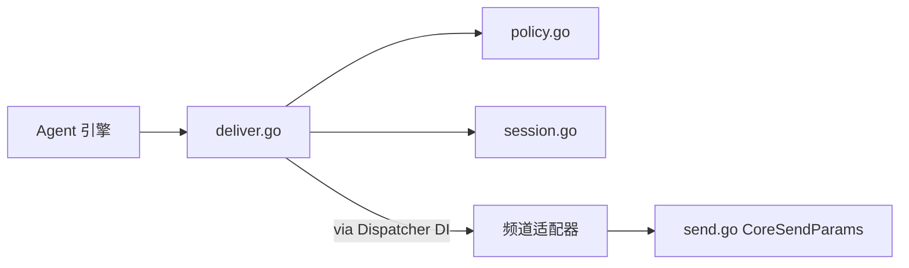

# Outbound 出站消息架构文档

> 最后更新：2026-02-26 | 代码级审计确认 | 8 源文件

## 一、模块概述

出站消息管线，负责将 Agent 引擎产生的回复内容分发到各频道适配器。包括投递策略、会话管理、消息发送核心接口。

## 二、原版实现（TypeScript）

### 源文件列表

| 文件 | 大小 | 职责 |
|------|------|------|
| `infra/outbound/deliver.ts` | 376L | 投递主入口 |
| `infra/outbound/` | 15 文件 | 出站消息完整管线 |

### 核心逻辑摘要

- `ChannelHandler` 接口 + 频道适配器动态加载
- 文本分块 + chunker mode 策略
- 会话转录追加（mirror transcript）
- replyToId/threadId 路由

## 三、重构实现（Go）

### 文件结构（5 文件）

| 文件 | 职责 | 状态 |
|------|------|------|
| `deliver.go` | 投递主入口 + `ChannelOutboundAdapter` + `TextChunkerFunc` + `TranscriptAppender` DI | ✅ |
| `send.go` | `CoreSendParams` 核心发送接口 | ✅ |
| `session.go` | 出站会话管理 | ✅ |
| `policy.go` | 投递策略 | ✅ |
| `outbound_test.go` | 单元测试 | ✅ |

### 数据流

## 四、差异对照

| 维度 | 原版 TS | 重构 Go |
|------|---------|---------|
| 频道加载 | `loadChannelOutboundAdapter` 动态 | `Dispatcher` + `ChannelOutboundAdapter` DI ✅ |
| 分块策略 | chunker mode + text limit | `TextChunkerFunc` DI ✅ |
| Mirror 转录 | `appendAssistantMessageToSessionTranscript` | `TranscriptAppender` DI + `appendMirrorTranscript` ✅ |
| replyTo/thread | 完整传递 | ✅ P1 已修复 |

## 五、已完成待办

- ~~F-DLV1~~ ✅ 完整 Channel Handler 管线 — `ChannelOutboundAdapter` + `TextChunkerFunc` DI (Phase 9 Batch C)
- ~~F-DLV3~~ ✅ Mirror transcript 追加 — `TranscriptAppender` DI + `appendMirrorTranscript()` (Phase 9 Batch C)

## 六、测试覆盖

| 测试类型 | 覆盖范围 | 状态 |
|----------|----------|------|
| 单元测试 | policy, session | ✅ |
| 集成测试 | 待频道集成 | ❌ 待 Phase 6 |
