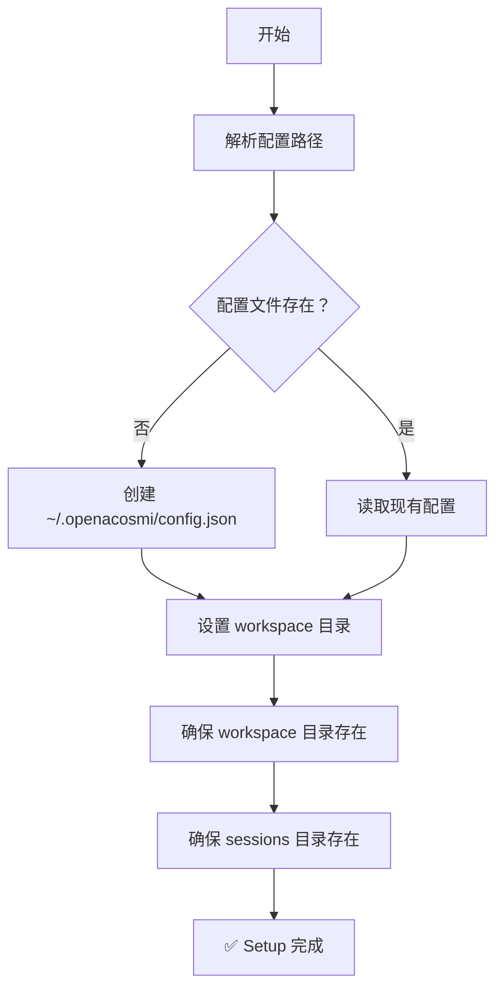
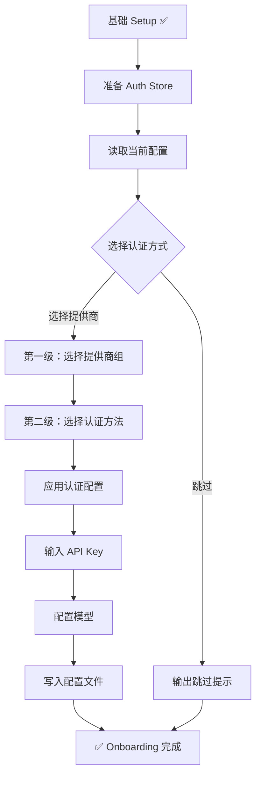
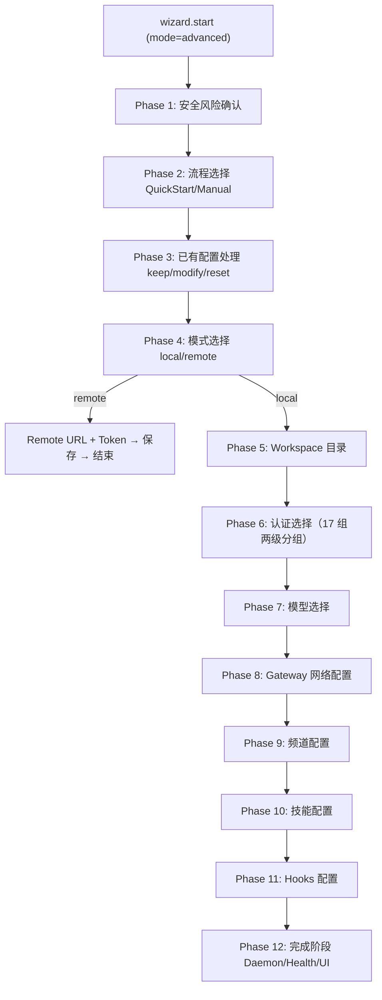
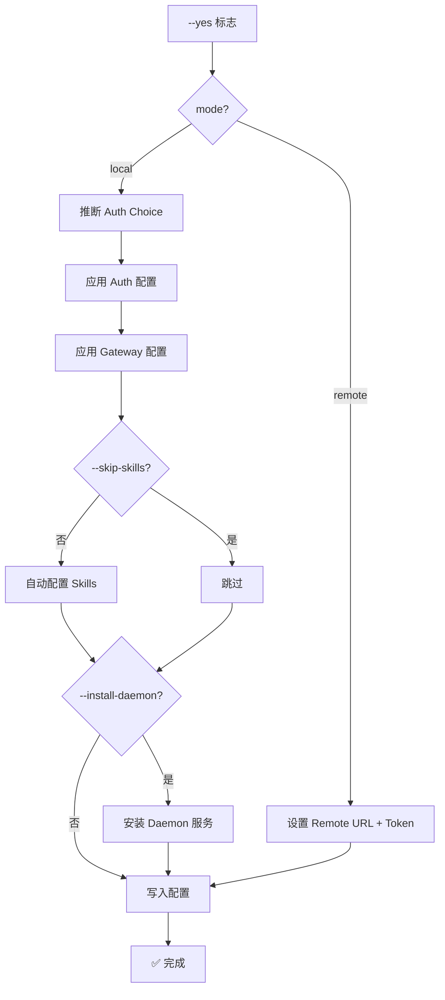

# OpenAcosmi 初始化安装向导 — 操作步骤文档

> 最后更新：2026-02-26 | 代码级审计确认

---

## 目录

1. [入口命令](#1-入口命令)
2. [基础 Setup 阶段](#2-基础-setup-阶段)
3. [Onboard 交互式引导](#3-onboard-交互式引导)
4. [Gateway Web 向导（高级版）](#4-gateway-web-向导高级版)
5. [非交互式模式](#5-非交互式模式)
6. [关键 CLI Flags 速查](#6-关键-cli-flags-速查)

---

## 1. 入口命令

| 命令 | 说明 |
|------|------|
| `openacosmi setup` | 仅执行基础配置初始化（不含认证/频道） |
| `openacosmi setup onboard` | 完整交互式引导，含认证+频道+技能配置 |
| `openacosmi setup onboard --yes` | 非交互式模式（接受默认值） |

> **源文件**：[cmd_setup.go](file:///Users/fushihua/Desktop/Claude-Acosmi/backend/cmd/openacosmi/cmd_setup.go)

---

## 2. 基础 Setup 阶段

执行 `openacosmi setup` 或 `openacosmi setup onboard` 均会先运行此阶段。

### 步骤流程



### 具体操作

| 步骤 | 操作 | 默认值 |
|------|------|--------|
| 1 | 解析配置路径 | `~/.openacosmi/config.json`（可通过 `$OPENACOSMI_CONFIG` 覆盖） |
| 2 | 读取或创建配置文件 | JSON 格式 |
| 3 | 设置 workspace 目录 | `agents`（可通过 `--workspace` 指定） |
| 4 | 创建 workspace 目录 | `~/.openacosmi/agents/` |
| 5 | 创建 sessions 目录 | `~/.openacosmi/sessions/` |

---

## 3. Onboard 交互式引导

执行 `openacosmi setup onboard` 后，在基础 Setup 完成后进入完整引导流程。

### 总体流程



### Step 1：选择认证提供商（两级选择）

**第一级 — 选择提供商组**：

| 序号 | 提供商 | 提示信息 |
|------|--------|----------|
| 1 | OpenAI | Codex OAuth + API key |
| 2 | Anthropic | setup-token + API key |
| 3 | MiniMax | M2.1 (recommended) |
| 4 | Moonshot AI (Kimi K2.5) | Kimi K2.5 + Kimi Coding |
| 5 | Google | Gemini API key + OAuth |
| 6 | xAI (Grok) | API key |
| 7 | OpenRouter | API key |
| 8 | Qwen | OAuth |
| 9 | Z.AI (GLM 4.7) | API key |
| 10 | Qianfan | API key |
| 11 | Copilot | GitHub + local proxy |
| 12 | Vercel AI Gateway | API key |
| 13 | OpenAcosmi Zen | API key |
| 14 | Xiaomi | API key |
| 15 | Synthetic | Anthropic-compatible (multi-model) |
| 16 | Venice AI | Privacy-focused (uncensored models) |
| 17 | Cloudflare AI Gateway | Account ID + Gateway ID + API key |

**第二级 — 选择具体认证方式**（以 Anthropic 为例）：

| 选项 | 说明 |
|------|------|
| Anthropic token | 运行 `claude setup-token`，粘贴 token |
| Anthropic API key | 直接输入 API key |

> 每组均有 **Back** 按钮可返回第一级重选。

### Step 2：输入 API Key / Token

- 系统提示输入对应提供商的 API Key
- 对 API Key 类的凭证，写入 `~/.openacosmi/auth.json`
- OAuth 类（如 GitHub Copilot、Qwen OAuth）走设备授权流程

### Step 3：配置写入

认证选择后，系统自动：

1. 注册 provider 到 `config.json → models.providers`
2. 设置默认模型到 `config.json → agents.defaults.model.primary`
3. 写入 API Key 到 auth profile store

---

## 4. Gateway Web 向导（高级版）

Gateway 模式通过 Web UI 触发，使用 RPC 协议。支持 **简化版**（默认）和 **高级版**（`mode=advanced`）。

### RPC 入口

```json
// 简化版（4 步：Provider → Key → Model → 确认）
{ "method": "wizard.start", "params": {} }

// 高级版（12 阶段完整流程）
{ "method": "wizard.start", "params": { "mode": "advanced" } }
```

### 高级版 12 阶段流程



### Phase 1：安全风险确认

展示安全警告文本，用户必须确认 "I understand this is powerful and inherently risky. Continue?" 才能继续。

### Phase 2：流程选择

| 选项 | 说明 |
|------|------|
| **QuickStart** | 使用默认值，后续通过 `openacosmi configure` 调整 |
| **Manual** | 逐项配置端口、网络、Tailscale、认证 |

### Phase 3：已有配置处理

如系统检测到已有 `config.json`：

| 选项 | 说明 |
|------|------|
| Use existing values | 保留全部现有配置 |
| Update values | 在现有基础上修改 |
| Reset | 清空配置重新开始 |

### Phase 4：模式选择

| 选项 | 说明 |
|------|------|
| Local gateway | 本机运行 Gateway |
| Remote gateway | 仅配置远程 URL + Token（之后流程结束） |

### Phase 5：Workspace 目录

Manual 模式下允许自定义 workspace 路径（默认 `agents`）。QuickStart 跳过。

### Phase 6：认证选择

同 CLI 版两级分组选择（§3 Step 1），含 17 组 Provider，每组支持多种认证方式。

### Phase 7：模型选择

从 ModelCatalog 筛选当前 Provider 可用模型，展示 context window 和推理能力。

### Phase 8：Gateway 网络配置

Manual 模式下逐项配置：

| 配置项 | 选项 | 默认值 |
|--------|------|--------|
| Port | 1-65535 | 18789 |
| Bind | Loopback / LAN / Tailnet / Auto / Custom | Loopback |
| Auth | Token / Password | Token |
| Tailscale | Off / Serve / Funnel | Off |

QuickStart 使用默认值跳过。

### Phase 9-11：频道 / 技能 / Hooks

通过回调函数接入 cmd 层实现，交互方式与 CLI 版一致。

### Phase 12：完成阶段

- Daemon 服务安装（可选）
- Gateway 可达性探测
- Control UI 链接展示
- TUI / Web / Later 选择
- Shell 补全安装
- 最终引导提示

### 简化版流程（默认）

当不传 `mode=advanced` 时，仅执行 4 步：

```
Provider 选择 → API Key 输入 → 模型选择 → 确认保存
```

适用于已有 Gateway 配置、仅需切换 Provider/Model 的场景。

---

## 5. 非交互式模式

通过 `--yes` 标志或 CLI flags 直接传入配置，跳过所有交互提示。

### 本地模式

```bash
openacosmi setup onboard --yes \
  --provider anthropic \
  --anthropic-api-key "sk-xxx" \
  --gateway-port 18789 \
  --gateway-bind loopback \
  --gateway-auth token
```

### 远程模式

```bash
openacosmi setup onboard --yes \
  --mode remote \
  --remote-url "ws://192.168.1.100:18789" \
  --remote-token "my-secret-token"
```

### 非交互式流程



---

## 6. 关键 CLI Flags 速查

### 通用

| Flag | 类型 | 说明 |
|------|------|------|
| `--yes` | bool | 非交互模式 |
| `--provider` | string | 指定 AI Provider |
| `--mode` | string | `local` 或 `remote` |
| `--workspace` | string | Agent workspace 目录 |
| `--accept-risk` | bool | 接受非交互模式风险提示 |

### Provider API Keys

| Flag | Provider |
|------|----------|
| `--anthropic-api-key` | Anthropic |
| `--openai-api-key` | OpenAI |
| `--gemini-api-key` | Google Gemini |
| `--openrouter-api-key` | OpenRouter |
| `--moonshot-api-key` | Moonshot/Kimi |
| `--minimax-api-key` | MiniMax |
| `--xai-api-key` | xAI |
| `--qianfan-api-key` | 百度千帆 |
| `--kimi-code-api-key` | Kimi Coding |
| `--synthetic-api-key` | Synthetic |
| `--venice-api-key` | Venice AI |
| `--zai-api-key` | Z.AI |
| `--xiaomi-api-key` | Xiaomi |
| `--openacosmi-zen-api-key` | OpenAcosmi Zen |

### Gateway

| Flag | 类型 | 说明 |
|------|------|------|
| `--gateway-port` | int | Gateway 监听端口 |
| `--gateway-bind` | string | 绑定模式（loopback/lan/auto/custom/tailnet） |
| `--gateway-auth` | string | 认证方式（token/password） |
| `--gateway-token` | string | Token 值 |
| `--gateway-password` | string | 密码值 |

### Tailscale

| Flag | 类型 | 说明 |
|------|------|------|
| `--tailscale` | string | Tailscale 模式（off/serve/funnel） |
| `--tailscale-reset-on-exit` | bool | 退出时重置 Tailscale |

### 其他

| Flag | 类型 | 说明 |
|------|------|------|
| `--install-daemon` | bool | 安装为后台服务 |
| `--skip-skills` | bool | 跳过技能配置 |
| `--skip-health` | bool | 跳过健康检查 |
| `--skip-channels` | bool | 跳过频道配置 |
| `--node-manager` | string | 节点管理器（npm/pnpm/bun） |
| `--json` | bool | JSON 格式输出 |
| `--remote-url` | string | 远程 Gateway URL |
| `--remote-token` | string | 远程 Gateway Token |

---

## 配置文件结构示意

向导完成后生成的 `~/.openacosmi/config.json` 核心结构：

```json
{
  "agents": {
    "defaults": {
      "workspace": "agents",
      "model": {
        "primary": "claude-4-sonnet"
      }
    }
  },
  "models": {
    "providers": {
      "anthropic": {
        "apiKey": "sk-...",
        "baseUrl": "https://api.anthropic.com"
      }
    }
  },
  "gateway": {
    "mode": "local",
    "local": { "port": 18789, "bind": "loopback" }
  },
  "wizard": {
    "lastRunCommand": "setup",
    "lastRunMode": "local"
  }
}
```

---

## 源文件索引

| 模块 | 文件 | 说明 |
|------|------|------|
| CLI 入口 | [cmd_setup.go](file:///Users/fushihua/Desktop/Claude-Acosmi/backend/cmd/openacosmi/cmd_setup.go) | setup/onboard 命令定义 |
| 类型定义 | [setup_types.go](file:///Users/fushihua/Desktop/Claude-Acosmi/backend/cmd/openacosmi/setup_types.go) | AuthChoice/Onboard 类型 |
| 认证选择 | [setup_auth_options.go](file:///Users/fushihua/Desktop/Claude-Acosmi/backend/cmd/openacosmi/setup_auth_options.go) | 两级分组选择逻辑 |
| 认证应用 | [setup_auth_apply.go](file:///Users/fushihua/Desktop/Claude-Acosmi/backend/cmd/openacosmi/setup_auth_apply.go) | ApplyAuthChoice 分发 |
| Provider 配置 | [setup_auth_config.go](file:///Users/fushihua/Desktop/Claude-Acosmi/backend/cmd/openacosmi/setup_auth_config.go) | 26 个 provider 配置函数 |
| 凭证存储 | [setup_auth_credentials.go](file:///Users/fushihua/Desktop/Claude-Acosmi/backend/cmd/openacosmi/setup_auth_credentials.go) | API Key/OAuth 写入 |
| 频道配置 | [setup_channels.go](file:///Users/fushihua/Desktop/Claude-Acosmi/backend/cmd/openacosmi/setup_channels.go) | 交互式频道向导 |
| 技能配置 | [setup_skills.go](file:///Users/fushihua/Desktop/Claude-Acosmi/backend/cmd/openacosmi/setup_skills.go) | 技能发现与安装 |
| Hooks 配置 | [setup_hooks.go](file:///Users/fushihua/Desktop/Claude-Acosmi/backend/cmd/openacosmi/setup_hooks.go) | Hooks 发现与启用 |
| 远程网关 | [setup_remote.go](file:///Users/fushihua/Desktop/Claude-Acosmi/backend/cmd/openacosmi/setup_remote.go) | Bonjour 发现 + 远程配置 |
| 非交互模式 | [setup_noninteractive.go](file:///Users/fushihua/Desktop/Claude-Acosmi/backend/cmd/openacosmi/setup_noninteractive.go) | CLI flags 驱动 |
| 辅助函数 | [setup_helpers.go](file:///Users/fushihua/Desktop/Claude-Acosmi/backend/cmd/openacosmi/setup_helpers.go) | Reset/Detect/Workspace |
| Gateway 向导 | [wizard_onboarding.go](file:///Users/fushihua/Desktop/Claude-Acosmi/backend/internal/gateway/wizard_onboarding.go) | Web 向导核心（简化版+高级版） |
| Gateway 认证 | [wizard_auth.go](file:///Users/fushihua/Desktop/Claude-Acosmi/backend/internal/gateway/wizard_auth.go) | 两级分组认证选择 |
| Gateway 网络 | [wizard_gateway_config.go](file:///Users/fushihua/Desktop/Claude-Acosmi/backend/internal/gateway/wizard_gateway_config.go) | bind/port/auth/Tailscale |
| 向导完成 | [wizard_finalize.go](file:///Users/fushihua/Desktop/Claude-Acosmi/backend/internal/gateway/wizard_finalize.go) | Daemon 安装 + 健康检查 |
| 会话引擎 | [wizard_session.go](file:///Users/fushihua/Desktop/Claude-Acosmi/backend/internal/gateway/wizard_session.go) | goroutine+channel 驱动 |
| RPC 处理 | [server_methods_wizard.go](file:///Users/fushihua/Desktop/Claude-Acosmi/backend/internal/gateway/server_methods_wizard.go) | wizard.start (mode=advanced) /next/cancel/status |
| Prompter 适配 | [setup_wizard_adapter.go](file:///Users/fushihua/Desktop/Claude-Acosmi/backend/cmd/openacosmi/setup_wizard_adapter.go) | gateway→tui prompter 桥接 |
| TUI 框架 | [wizard.go](file:///Users/fushihua/Desktop/Claude-Acosmi/backend/internal/tui/wizard.go) | bubbletea 全屏向导 |
