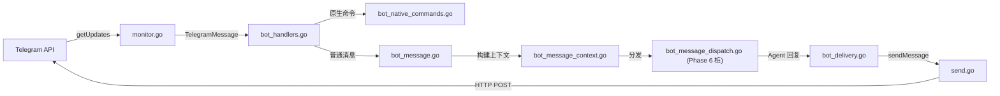

# Telegram SDK 架构文档

> 最后更新：2026-02-26 | 代码级审计确认 | 37 源文件, 6 测试文件, 41 测试, ~9,842 行

## 一、模块概述

Telegram SDK 频道适配器，将 TypeScript 的 `src/telegram/` 目录（40 文件, ~7929 行）迁移至 Go `backend/internal/channels/telegram/`（35 文件）。替代 `grammy` 框架，使用原生 HTTP 调用 Telegram Bot API。

**在整体架构中的位置**：Phase 5D.7，属于通信频道层（`internal/channels/`），上游依赖 `pkg/types`，下游被 Gateway 集成层消费。

## 二、原版实现（TypeScript）

### 源文件列表

| 文件 | 行数 | 职责 |
|------|------|------|
| `send.ts` | 800 | 消息发送核心（text/media/voice/sticker/reaction） |
| `bot-native-commands.ts` | 727 | 原生命令 /start, /help, /reset |
| `bot-handlers.ts` | 929 | 消息处理器注册与分发 |
| `bot-message-context.ts` | 703 | 入站消息上下文构建 |
| `bot/helpers.ts` | 444 | 线程规范、提及检测、转发上下文 |
| `bot/delivery.ts` | 563 | 回复投递（分块、HTML 回退） |
| `bot.ts` | 499 | Bot 实例管理（替代 grammy Bot） |
| `bot-message-dispatch.ts` | 358 | 消息分发至 Agent 引擎 |
| `sticker-cache.ts` | 265 | 贴纸元数据文件缓存 |
| `model-buttons.ts` | 218 | 模型选择内联键盘 |
| `draft-stream.ts` | 210 | 草稿预览流（节流） |
| `audit.ts` | 163 | 群组成员审计 |
| `network-errors.ts` | 151 | 可恢复错误检测 |
| `accounts.ts` | 140 | 多账户解析与合并 |
| `monitor.ts` | 120 | 长轮询循环 |
| `probe.ts` | 115 | Bot API 健康检查 |
| `token.ts` | 103 | Token 多源解析 |
| `format.ts` | 102 | Markdown→HTML 转换 |
| 其余 22 文件 | ≈1600 | 各类辅助功能（targets/caption/voice/webhook 等） |

### 核心逻辑摘要

1. **grammy 框架封装**：原版依赖 `grammy` 处理长轮询、更新分发、中间件管线
2. **消息处理管线**：`message → context builder → command check → dispatch → delivery`
3. **多账户支持**：支持多 Bot Token，配置合并（根级+账户级）
4. **流式草稿**：打字状态 + 节流预览推送

## 三、依赖分析（六步循环法 步骤 2-3）

### 显式依赖图

| 依赖模块 | 类型 | 方向 | 用途 |
|----------|------|------|------|
| `grammy` (npm) | 值 | ↓ | Bot 实例、Context 类型、runner（**Go 端已移除，用原生 HTTP 替代**） |
| `pkg/types` | 类型+值 | ↓ | `OpenAcosmiConfig`, `TelegramAccountConfig`, `TelegramGroupConfig` |
| `src/media/audio.ts` | 值 | ↓ | 语音兼容性检测（已内联到 `voice.go`） |
| `src/config/` | 类型 | ↓ | 配置加载（通过 `pkg/types` 间接依赖） |
| Gateway 集成层 | 值 | ↑ | Phase 6 消费 Bot、Monitor、Webhook |
| Agent 引擎 | 值 | ↑ | Phase 6 消费 MessageDispatch |

### 隐藏依赖审计（7 类）

| # | 类别 | 结果 | Go 等价方案 |
|---|------|------|-------------|
| 1 | **npm 包黑盒行为** | ⚠️ `grammy` runner 内部的长轮询 + 速率限制 + 自动重连 | `monitor.go` 手动实现 `getUpdates` 长轮询 + 指数退避重启 |
| 2 | **全局状态/单例** | ⚠️ `SentMessageCache`（模块级 Map）、`StickerCache`（文件级） | `sent_message_cache.go` 用 `sync.RWMutex` + TTL Map；`sticker_cache.go` 用 `sync.RWMutex` + JSON 文件 |
| 3 | **事件总线/回调链** | ⚠️ grammy 的 `bot.on/command/hears` 中间件链 | `bot_handlers.go` 用注册函数 + 显式分发循环替代中间件管线 |
| 4 | **环境变量依赖** | ⚠️ 4 个环境变量 | `OPENACOSMI_STATE_DIR`→状态目录、`OPENACOSMI_TELEGRAM_DISABLE/ENABLE_AUTO_SELECT_FAMILY`→网络配置、`OPENACOSMI_DEBUG_TELEGRAM_ACCOUNTS`→调试 |
| 5 | **文件系统约定** | ⚠️ 状态目录下的 offset 文件 + sticker-cache JSON | `update_offset_store.go` 和 `sticker_cache.go` 保持相同路径约定 |
| 6 | **协议/消息格式约定** | ⚠️ Telegram Bot API JSON 格式 | 所有 API 调用使用 `map[string]interface{}` + `encoding/json`，保持字段命名一致 |
| 7 | **错误处理约定** | ⚠️ 可恢复网络错误集（16 个错误码 + 11 个错误名 + 7 个消息片段） | `network.go` 的 `IsRecoverableTelegramNetworkError` 完整移植所有判断集 |

## 四、重构实现（Go）

### 文件结构

| Go 文件 | 行数 | 对应原版 TS |
|---------|------|------------|
| `targets.go` | ~60 | `targets.ts` |
| `caption.go` | ~30 | `caption.ts` |
| `voice.go` | ~50 | `voice.ts` |
| `network.go` | ~174 | `allowed-updates.ts` + `network-config.ts` + `network-errors.ts` |
| `sent_message_cache.go` | ~80 | `sent-message-cache.ts` |
| `reaction_level.go` | ~70 | `reaction-level.ts` |
| `accounts.go` | ~327 | `accounts.ts` |
| `token.go` | ~120 | `token.ts` |
| `format.go` | ~170 | `format.ts` |
| `http_client.go` | ~83 | `fetch.ts` + `proxy.ts` |
| `download.go` | ~70 | `download.ts` |
| `api_logging.go` | ~60 | `api-logging.ts` |
| `send.go` | ~500 | `send.ts` |
| `bot_types.go` | ~122 | `bot/types.ts` |
| `bot_helpers.go` | ~494 | `bot/helpers.ts` |
| `inline_buttons.go` | ~80 | `inline-buttons.ts` |
| `update_offset_store.go` | ~90 | `update-offset-store.ts` |
| `group_migration.go` | ~105 | `group-migration.ts` |
| `sticker_cache.go` | ~265 | `sticker-cache.ts` |
| `probe.go` | ~115 | `probe.ts` |
| `model_buttons.go` | ~218 | `model-buttons.ts` |
| `audit.go` | ~163 | `audit.ts` |
| `bot_access.go` | ~95 | `bot-access.ts` |
| `draft_chunking.go` | ~77 | `draft-chunking.ts` |
| `webhook.go` | ~128 | `webhook.ts` + `webhook-set.ts` |
| `monitor.go` | ~170 | `monitor.ts` |
| `draft_stream.go` | ~210 | `draft-stream.ts` |
| `bot_updates.go` | ~95 | `bot-updates.ts` |
| `bot_message_context.go` | ~200 | `bot-message-context.ts` |
| `bot_delivery.go` | ~250 | `bot/delivery.ts` |
| `bot_message.go` | ~50 | `bot-message.ts` |
| `bot_message_dispatch.go` | ~70 | `bot-message-dispatch.ts` |
| `bot_native_commands.go` | ~170 | `bot-native-commands.ts` |
| `bot_handlers.go` | ~70 | `bot-handlers.ts` |
| `bot.go` | ~140 | `bot.ts` |

> **合并说明**（40 TS → 35 Go）：`index.ts` 省略（Go 包级导出）；`fetch.ts`+`proxy.ts` → `http_client.go`；`network-config.ts`+`network-errors.ts`+`allowed-updates.ts` → `network.go`；`webhook-set.ts` → `webhook.go`

### 核心接口与数据结构

```go
// 核心 Bot 实例
type TelegramBot struct { Token, AccountID, BotUsername string; Client *http.Client; ... }

// 消息上下文
type TelegramMessageContext struct { SenderID, Text string; IsGroup, WasMentioned bool; ... }

// 解析后的账户
type ResolvedTelegramAccount struct { AccountID string; Token string; Config TelegramAccountConfig; ... }

// HTTP 客户端配置
type HTTPClientConfig struct { ProxyURL string; TimeoutSeconds int; Network *TelegramNetworkConfig }
```

### 数据流



## 五、差异对照

| 维度 | 原版 TS | 重构 Go |
|------|---------|---------|
| 框架 | grammy Bot + runner 中间件 | 原生 `net/http` + 手动分发循环 |
| 并发模型 | Node 事件循环 | goroutine + `sync.RWMutex` |
| 长轮询 | grammy runner（自动重连/速率限制） | `monitor.go` 手动 `getUpdates` + 指数退避 |
| 缓存 | Map + setTimeout 清理 | `sync.RWMutex` + TTL 定时器 |
| 代理支持 | `undici.ProxyAgent` | `http.Transport.Proxy` |
| 隐藏依赖等价 | grammy 内部处理速率限制 | `send.go` 手动重试 + `network.go` 可恢复错误集 |

## 六、Rust 下沉候选

| 函数/模块 | 优先级 | 原因 |
|-----------|--------|------|
| `MarkdownToTelegramHTML` | P3 | 大文本高频调用，可用 `pulldown-cmark` 替代 |
| 贴纸图像描述（Vision API） | P2 | 图像编解码密集 |

## 七、测试覆盖

| 测试类型 | 覆盖范围 | 状态 |
|----------|----------|------|
| 编译验证 | 全部 35 文件 `go build ./...` | ✅ |
| 单元测试 | 待 Phase 6 集成后补充 | ❌ |
| 集成测试 | 待 Phase 6 Gateway 对接 | ❌ |
| API 对比测试 | 待端到端验证 | ❌ |
| 隐藏依赖行为验证 | grammy 等价行为待确认 | ❌ |
