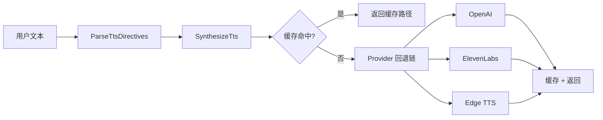

# TTS 架构文档

> 最后更新：2026-02-26 | 代码级审计确认 | 9 源文件, 22 测试

## 一、模块概述

TTS（Text-to-Speech）模块提供文字转语音能力，支持三个 Provider（OpenAI、ElevenLabs、Edge TTS），含配置解析、用户偏好、指令解析、Provider 路由、音频缓存、合成引擎。

## 二、原版实现（TypeScript）

### 源文件列表

| 文件 | 大小 | 职责 |
|------|------|------|
| `tts/tts.ts` | 47KB (1,579L) | 全部 TTS 逻辑（单文件） |

### 核心逻辑摘要

单文件包含：类型定义、配置解析、偏好管理（JSON 持久化）、Provider 路由（API key 自动检测）、`[[tts:...]]` 指令解析、三 Provider 合成、音频缓存、临时文件管理。

## 三、依赖分析

### 显式依赖图

| 依赖模块 | 类型 | 方向 | 用途 |
|----------|------|------|------|
| `config/` | 值 | ↓ | TTS 配置段读取 |
| `os/env` | 值 | ↓ | API key 环境变量 |
| 无上游 | — | ↑ | 独立模块 |

### 隐藏依赖审计

| 类别 | 结果 | Go 等价方案 |
|------|------|-------------|
| npm 包黑盒行为 | ⚠️ edge-tts 包 | `edge-tts` CLI fallback（P7B-1 已实现） |
| 全局状态/单例 | ⚠️ lastTtsAttempt | `tts.go` 包级变量 |
| 事件总线/回调链 | ✅ | — |
| 环境变量依赖 | ⚠️ ELEVENLABS_API_KEY, XI_API_KEY, OPENAI_API_KEY | `provider.go` ResolveTtsApiKey |
| 文件系统约定 | ⚠️ 偏好路径 + 临时文件 | `prefs.go` + `cache.go` |
| 协议/消息格式 | ⚠️ `[[tts:...]]` 指令格式 | `directives.go` 正则解析 |
| 错误处理约定 | ✅ Provider 回退 | `tts.go` providerOrder 循环 |

## 四、重构实现（Go）

### 文件结构

| 文件 | 行数 | 对应原版 |
|------|------|----------|
| [types.go](file:///Users/fushihua/Desktop/Claude-Acosmi/backend/internal/tts/types.go) | ~280 | tts.ts L1-210 |
| [config.go](file:///Users/fushihua/Desktop/Claude-Acosmi/backend/internal/tts/config.go) | ~260 | tts.ts L208-303 |
| [prefs.go](file:///Users/fushihua/Desktop/Claude-Acosmi/backend/internal/tts/prefs.go) | ~180 | tts.ts L305-466 |
| [provider.go](file:///Users/fushihua/Desktop/Claude-Acosmi/backend/internal/tts/provider.go) | ~115 | tts.ts L422-527 |
| [directives.go](file:///Users/fushihua/Desktop/Claude-Acosmi/backend/internal/tts/directives.go) | ~160 | tts.ts L553-780 |
| [synthesize.go](file:///Users/fushihua/Desktop/Claude-Acosmi/backend/internal/tts/synthesize.go) | ~340 | tts.ts L780-1200（P7B-1 完整 HTTP 实现） |
| [cache.go](file:///Users/fushihua/Desktop/Claude-Acosmi/backend/internal/tts/cache.go) | ~110 | tts.ts L1100-1200 |
| [tts.go](file:///Users/fushihua/Desktop/Claude-Acosmi/backend/internal/tts/tts.go) | ~190 | tts.ts L1200-1580 |
| **合计** | **~1,811** | 1,579L |

### 接口定义

- `TtsAutoMode` — 自动模式枚举（off/always/inbound/tagged）
- `TtsProvider` — Provider 枚举（openai/elevenlabs/edge）
- `ResolvedTtsConfig` — 解析后完整配置
- `TtsDirectiveOverrides` — 指令覆盖
- `TtsResult` / `TtsTelephonyResult` — 合成结果
- `OutputFormat` — 输出格式（OpenAI/ElevenLabs 格式映射）

### 数据流

## 五、差异对照

| 维度 | 原版 TS | 重构 Go |
|------|---------|---------|
| 文件组织 | 1,579L 单文件 | 8 文件模块化 |
| 偏好持久化 | fs.writeFileSync | 原子 rename |
| nil 安全 | optional chaining | nil-safe 方法 |
| 合成实现 | 完整 HTTP 调用 | ✅ 完整 HTTP（OpenAI POST + ElevenLabs POST + Edge CLI） |
| 并发安全 | 单线程 N/A | sync.Mutex 缓存 |

## 六、Rust 下沉候选

| 函数/模块 | 优先级 | 原因 |
|-----------|--------|------|
| (无) | — | TTS 为 IO 密集型，无 CPU 瓶颈 |

## 七、测试覆盖

| 测试类型 | 覆盖范围 | 状态 |
|----------|----------|------|
| 编译验证 | 全包 | ✅ |
| 单元测试 | — | ❌ 待实现 |
| 集成测试 | — | ❌ 待 Provider HTTP 实现 |
