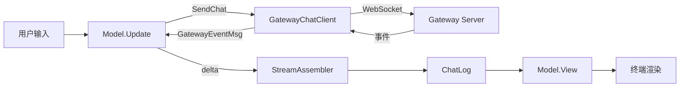

# TUI 终端聊天客户端 架构文档

> 最后更新：2026-02-26 | 代码级审计确认 | 21 源文件, 59 测试

## 一、模块概述

TUI 模块提供终端聊天客户端功能，通过 WebSocket 连接 Gateway 实现实时聊天。使用 Bubble Tea (Elm Architecture) 框架替代 TS 的 Ink.js (@mariozechner/pi-tui)。

位于系统架构的**表现层**，通过 Gateway WebSocket 协议与后端通信。

## 二、原版实现（TypeScript）

### 源文件列表

| 文件 | 行数 | 职责 |
|------|------|------|
| `tui.ts` | 709L | 主入口：runTui + 状态定义 + 辅助函数 |
| `gateway-chat.ts` | 267L | GatewayChatClient + resolveGatewayConnection |
| `tui-types.ts` | 107L | 类型定义（SessionInfo/TuiOptions） |
| `tui-stream-assembler.ts` | 79L | 流式文本增量组装 |
| `tui-formatters.ts` | 220L | 9 个格式化纯函数 |
| `components/chat-log.ts` | 105L | ChatLog 消息列表 + 工具追踪 |
| `tui-command-handlers.ts` | 503L | 命令处理器（20+ 分支）|
| `tui-event-handlers.ts` | 248L | 聊天/Agent 事件处理 |
| `tui-session-actions.ts` | 413L | 会话管理 |
| `tui-local-shell.ts` | 146L | 本地 shell 执行 |

### 核心逻辑摘要

1. 通过 `GatewayChatClient` 建立 WebSocket 连接（含 6 层 token/password fallback）
2. 双向消息流：用户输入 → Gateway → AI 响应流式 delta → 组装 → 渲染
3. 工具调用三阶段追踪：start → update → result
4. 命令系统：`/` 前缀 slash 命令（20+）+ `!` 前缀本地 shell

## 三、依赖分析

### 显式依赖图

| 依赖模块 | 类型 | 方向 | 用途 |
|----------|------|------|------|
| `config/loader` | 值 | ↓ | 加载配置（session scope/agents） |
| `routing` | 值 | ↓ | session key 构建/解析 |
| `gateway/ws` | 值 | ↓ | WebSocket 连接底层 |
| `gateway/protocol` | 类型 | ↓ | 协议版本/连接参数 |
| `agents/helpers/errors` | 值 | ↓ | 错误格式化 |
| `autoreply/status` | 值 | ↓ | token 计数格式化 |
| `bubbletea` | 值 | ↓ | TUI 框架 |
| `lipgloss` | 值 | ↓ | 样式渲染 |
| `glamour` | 值 | ↓ | Markdown 渲染（W3 新增）|

### 隐藏依赖审计

| 类别 | 结果 | Go 等价方案 |
|------|------|-------------|
| npm 包黑盒行为 | ✅ | Ink.js → Bubble Tea 框架替代 |
| 全局状态/单例 | ✅ | bubbletea Model 天然封装 |
| 事件总线/回调链 | ✅ | bubbletea Cmd/Msg 替代回调 |
| 环境变量依赖 | ✅ | `os.Getenv` — 6 层 fallback 已实现 |
| 文件系统约定 | ✅ | 无直接文件系统依赖 |
| 协议/消息格式 | ✅ | Gateway WS 协议 12 字段完整传递 |
| 错误处理约定 | ✅ | Go error wrapping 模式 |

## 四、重构实现（Go）

### 文件结构

| 文件 | 行数 | 对应原版 | 窗口 | 状态 |
|------|------|----------|------|------|
| `model.go` | 532L | `tui.ts` + `tui-types.ts` | W1 | ✅ |
| `gateway_ws.go` | 713L | `gateway-chat.ts` | W1 | ✅ |
| `formatters.go` | 286L | `tui-formatters.ts` | W2 | ✅ |
| `formatters_test.go` | ~200L | 测试 | W2 | ✅ |
| `stream_assembler.go` | 95L | `tui-stream-assembler.ts` | W2 | ✅ |
| `view_chat_log.go` | 311L | `components/chat-log.ts` | W2-W3 | ✅ |
| `view_message.go` | 109L | `user-message/assistant-message` | W3 | ✅ |
| `view_tool.go` | 272L | `tool-execution.ts` | W3 | ✅ |
| `view_input.go` | 201L | `custom-editor.ts` | W3 | ✅ |
| `view_status.go` | 247L | `tui-status-summary.ts` + `tui-waiting.ts` | W3 | ✅ |
| `commands.go` | 593L | `commands.ts` + `command-handlers.ts` | W4 | ✅ |
| `event_handlers.go` | 388L | `tui-event-handlers.ts` | W4 | ✅ |
| `local_shell.go` | 174L | `tui-local-shell.ts` | W4 | ✅ |
| `session_actions.go` | 496L | `tui-session-actions.ts` | W5 | ✅ |
| `overlays.go` | 301L | `tui-overlays.ts` + selectors | W5 | ✅ |
| `theme.go` | 294L | `theme.ts` + `syntax-theme.ts` | W5 | ✅ |
| `stream_assembler_test.go` | ~160L | 测试 | W6 | ✅ |
| `commands_test.go` | ~130L | 测试 | W6 | ✅ |
| `event_handlers_test.go` | ~120L | 测试 | W6 | ✅ |
| `gateway_ws_test.go` | ~170L | 测试 | W6 | ✅ |
| `local_shell_test.go` | ~100L | 测试 | W6 | ✅ |

### 接口定义

```go
// 核心 Model — 实现 tea.Model 接口
type Model struct { ... }  // Init/Update/View

// Gateway 客户端
type GatewayChatClient struct { ... }  // Start/Stop/SendChat/AbortChat/LoadHistory/...

// 流式组装器
type TuiStreamAssembler struct { ... }  // IngestDelta/Finalize/Drop

// 消息列表
type ChatLog struct { ... }  // AddUser/AddSystem/UpdateAssistant/FinalizeAssistant/StartTool/...
```

### 数据流



## 五、差异对照

| 维度 | 原版 TS | 重构 Go |
|------|---------|---------|
| TUI 框架 | Ink.js (React-like) | Bubble Tea (Elm Architecture) |
| 并发模型 | async/await + EventEmitter | goroutine + tea.Cmd/tea.Msg |
| 状态管理 | 闭包 + 可变对象 | 不可变 Model + 消息驱动 |
| 渲染 | JSX 组件树 | 字符串拼接 + lipgloss 样式 |
| 错误处理 | try/catch | Go error 返回值 |

## 六、Rust 下沉候选

| 函数/模块 | 优先级 | 原因 |
|-----------|--------|------|
| (无) | — | TUI 为表现层，无性能热点需 Rust 下沉 |

## 七、测试覆盖

| 测试类型 | 覆盖范围 | 状态 |
|----------|----------|------|
| 单元测试 | formatters 9 函数 / 35 case | ✅ |
| stream_assembler 测试 | IngestDelta/Finalize/Drop/Reset / 7 case | ✅ W6 |
| commands 测试 | ParseCommand/GetSlashCommands/HelpText / 4 case | ✅ W6 |
| event_handlers 测试 | pruneRunMap/parseChatEvent/parseAgentEvent / 5 case | ✅ W6 |
| gateway_ws 测试 | envTrimmed/resolveGatewayConnection 6层fallback / 8 case | ✅ W6 |
| local_shell 测试 | resolveShell/消息类型/输出截断 / 6 case | ✅ W6 |
| 隐藏依赖行为验证 | 7 类全部 ✅ | ✅ |
