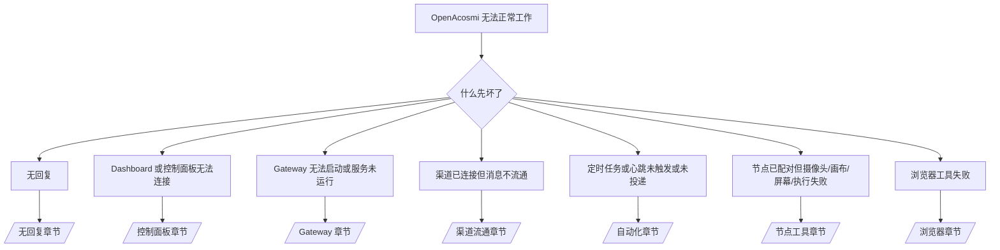

> [!NOTE]
> 本文档已更新以适配 **Rust CLI + Go Gateway** 混合架构。

# 故障排除

如果只有 2 分钟，请将本页面作为分类入口使用。

## 前 60 秒

按以下顺序依次运行：

```bash
openacosmi status
openacosmi status --all
openacosmi gateway probe
openacosmi gateway status
openacosmi doctor
openacosmi channels status --probe
openacosmi logs --follow
```

正常输出一句话总结：

- `openacosmi status` → 显示已配置的渠道，无明显认证错误。
- `openacosmi status --all` → 完整报告已生成且可分享。
- `openacosmi gateway probe` → 目标 Gateway 可达。
- `openacosmi gateway status` → `Runtime: running` 且 `RPC probe: ok`。
- `openacosmi doctor` → 无阻断性配置/服务错误。
- `openacosmi channels status --probe` → 渠道报告 `connected` 或 `ready`。
- `openacosmi logs --follow` → 稳定活动，无重复致命错误。

## 决策树



<AccordionGroup>
  <Accordion title="无回复">
    ```bash
    openacosmi status
    openacosmi gateway status
    openacosmi channels status --probe
    openacosmi pairing list <channel>
    openacosmi logs --follow
    ```

    正常输出应为：

    - `Runtime: running`
    - `RPC probe: ok`
    - 您的渠道在 `channels status --probe` 中显示 connected/ready
    - 发送者已批准（或 DM 策略为 open/allowlist）

    常见日志特征：

    - `drop guild message (mention required` → Discord 中提及门控阻止了消息。
    - `pairing request` → 发送者未批准，等待 DM 配对审批。
    - `blocked` / `allowlist` 出现在渠道日志中 → 发送者、房间或群组被过滤。

    深入页面：

    - [/gateway/troubleshooting#no-replies](/gateway/troubleshooting#no-replies)
    - [/channels/troubleshooting](/channels/troubleshooting)
    - [/channels/pairing](/channels/pairing)

  </Accordion>

  <Accordion title="Dashboard 或控制面板无法连接">
    ```bash
    openacosmi status
    openacosmi gateway status
    openacosmi logs --follow
    openacosmi doctor
    openacosmi channels status --probe
    ```

    正常输出应为：

    - `Dashboard: http://...` 在 `openacosmi gateway status` 中显示
    - `RPC probe: ok`
    - 日志中无认证循环

    常见日志特征：

    - `device identity required` → HTTP/非安全上下文无法完成设备认证。
    - `unauthorized` / 重连循环 → 令牌/密码错误或认证模式不匹配。
    - `gateway connect failed:` → UI 指向了错误的 URL/端口或不可达的 Gateway。

    深入页面：

    - [/gateway/troubleshooting#dashboard-control-ui-connectivity](/gateway/troubleshooting#dashboard-control-ui-connectivity)
    - [/web/control-ui](/web/control-ui)
    - [/gateway/authentication](/gateway/authentication)

  </Accordion>

  <Accordion title="Gateway 无法启动或服务已安装但未运行">
    ```bash
    openacosmi status
    openacosmi gateway status
    openacosmi logs --follow
    openacosmi doctor
    openacosmi channels status --probe
    ```

    正常输出应为：

    - `Service: ... (loaded)`
    - `Runtime: running`
    - `RPC probe: ok`

    常见日志特征：

    - `Gateway start blocked: set gateway.mode=local` → Gateway 模式未设置/为远程模式。
    - `refusing to bind gateway ... without auth` → 非回环绑定但未设置令牌/密码。
    - `another gateway instance is already listening` 或端口被占用 → 端口已被使用。

    深入页面：

    - [/gateway/troubleshooting#gateway-service-not-running](/gateway/troubleshooting#gateway-service-not-running)
    - [/gateway/background-process](/gateway/background-process)
    - [/gateway/configuration](/gateway/configuration)

  </Accordion>

  <Accordion title="渠道已连接但消息不流通">
    ```bash
    openacosmi status
    openacosmi gateway status
    openacosmi logs --follow
    openacosmi doctor
    openacosmi channels status --probe
    ```

    正常输出应为：

    - 渠道传输已连接。
    - 配对/允许列表检查通过。
    - 需要时提及功能被检测到。

    常见日志特征：

    - `mention required` → 群组提及门控阻止了处理。
    - `pairing` / `pending` → DM 发送者尚未被批准。
    - `not_in_channel`、`missing_scope`、`Forbidden`、`401/403` → 渠道权限令牌问题。

    深入页面：

    - [/gateway/troubleshooting#channel-connected-messages-not-flowing](/gateway/troubleshooting#channel-connected-messages-not-flowing)
    - [/channels/troubleshooting](/channels/troubleshooting)

  </Accordion>

  <Accordion title="定时任务或心跳未触发或未投递">
    ```bash
    openacosmi status
    openacosmi gateway status
    openacosmi cron status
    openacosmi cron list
    openacosmi cron runs --id <jobId> --limit 20
    openacosmi logs --follow
    ```

    正常输出应为：

    - `cron.status` 显示已启用，有下次唤醒时间。
    - `cron runs` 显示最近的 `ok` 条目。
    - 心跳已启用且在活跃时段内。

    常见日志特征：

    - `cron: scheduler disabled; jobs will not run automatically` → 定时调度已禁用。
    - `heartbeat skipped` 附 `reason=quiet-hours` → 在配置的活跃时段外。
    - `requests-in-flight` → 主通道繁忙；心跳唤醒被延迟。
    - `unknown accountId` → 心跳投递目标账户不存在。

    深入页面：

    - [/gateway/troubleshooting#cron-and-heartbeat-delivery](/gateway/troubleshooting#cron-and-heartbeat-delivery)
    - [/automation/troubleshooting](/automation/troubleshooting)
    - [/gateway/heartbeat](/gateway/heartbeat)

  </Accordion>

  <Accordion title="节点已配对但工具失败（摄像头/画布/屏幕/执行）">
    ```bash
    openacosmi status
    openacosmi gateway status
    openacosmi nodes status
    openacosmi nodes describe --node <idOrNameOrIp>
    openacosmi logs --follow
    ```

    正常输出应为：

    - 节点列为 connected 且已配对角色为 `node`。
    - 所调用命令的能力已存在。
    - 工具的权限状态为已授予。

    常见日志特征：

    - `NODE_BACKGROUND_UNAVAILABLE` → 将节点应用切到前台。
    - `*_PERMISSION_REQUIRED` → 操作系统权限被拒绝/缺失。
    - `SYSTEM_RUN_DENIED: approval required` → 执行审批待处理。
    - `SYSTEM_RUN_DENIED: allowlist miss` → 命令不在执行允许列表中。

    深入页面：

    - [/gateway/troubleshooting#node-paired-tool-fails](/gateway/troubleshooting#node-paired-tool-fails)
    - [/nodes/troubleshooting](/nodes/troubleshooting)
    - [/tools/exec-approvals](/tools/exec-approvals)

  </Accordion>

  <Accordion title="浏览器工具失败">
    ```bash
    openacosmi status
    openacosmi gateway status
    openacosmi browser status
    openacosmi logs --follow
    openacosmi doctor
    ```

    正常输出应为：

    - 浏览器状态显示 `running: true` 且已选择浏览器/配置。
    - `openacosmi` 配置启动或 `chrome` 中继已附加标签页。

    常见日志特征：

    - `Failed to start Chrome CDP on port` → 本地浏览器启动失败。
    - `browser.executablePath not found` → 配置的浏览器二进制路径错误。
    - `Chrome extension relay is running, but no tab is connected` → 扩展未附加。
    - `Browser attachOnly is enabled ... not reachable` → attach-only 配置无可用 CDP 目标。

    深入页面：

    - [/gateway/troubleshooting#browser-tool-fails](/gateway/troubleshooting#browser-tool-fails)
    - [/tools/browser-linux-troubleshooting](/tools/browser-linux-troubleshooting)
    - [/tools/chrome-extension](/tools/chrome-extension)

  </Accordion>
</AccordionGroup>
