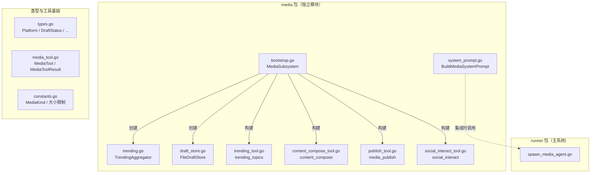

# oa-media 模块架构文档

> **包路径**: `backend/internal/media/`
> **更新日期**: 2026-03-01
> **状态**: Phase 0-4 已完成，Phase 5（集成）待执行

---

## 架构总览



## 模块清单

### 1. 引导模块 — `bootstrap.go` (121L)

**职责**: 一行调用初始化整个媒体子系统。

```go
sub, err := media.NewMediaSubsystem(media.MediaSubsystemConfig{
    Workspace:      "/path/to/workspace",
    EnablePublish:  true,
    EnableInteract: true,
})
```

| 类型 | 说明 |
|------|------|
| `MediaSubsystemConfig` | 初始化配置（工作目录、功能开关） |
| `MediaSubsystem` | 聚合全部运行时组件 |
| `NewMediaSubsystem()` | 构造函数 |
| `.RegisterPublisher()` | 动态注册平台发布器 |
| `.GetTool(name)` | 按名称获取工具 |
| `.ToolNames()` | 返回已注册工具清单 |

**初始化流程**:

1. 创建 `FileDraftStore`（目录: `{workspace}/_media/drafts`）
2. 创建 `TrendingAggregator`
3. 根据配置构建工具列表：
   - 默认启用: `trending_topics` + `content_compose`
   - `EnablePublish=true`: 追加 `media_publish`
   - `EnableInteract=true`: 追加 `social_interact`

---

### 2. 类型定义 — `types.go` (111L)

**职责**: 定义所有公共数据结构和枚举。

| 类型 | 值 |
|------|-----|
| `Platform` | `wechat` / `xiaohongshu` / `website` |
| `ContentStyle` | `informative` / `casual` / `professional` |
| `DraftStatus` | `draft` → `pending_review` → `approved` → `published` |
| `InteractionType` | `comment` / `dm` |

| 数据结构 | 用途 |
|---------|------|
| `TrendingTopic` | 热点话题（标题/来源/URL/热度/分类） |
| `ContentDraft` | 内容草稿（标题/正文/图片/标签/平台/风格/状态） |
| `PublishResult` | 发布结果（平台/帖子ID/URL/状态） |
| `InteractionItem` | 互动项（评论或私信） |

---

### 3. 工具基础 — `media_tool.go` (187L)

**职责**: 定义本地工具类型，避免对 `tools` 包的循环依赖。

| 类型 | 对照系统类型 |
|------|------------|
| `MediaTool` | `tools.AgentTool` |
| `MediaToolResult` | `tools.AgentToolResult` |

**辅助函数**:

| 函数 | 用途 |
|------|------|
| `jsonMediaResult(payload)` | 序列化为 JSON 文本结果 |
| `readStringArg(args, key, required)` | 读取字符串参数 |
| `readIntArg(args, key)` | 读取整数参数 |
| `readStringArrayArg(args, key)` | 读取字符串数组参数 |
| `validatePlatformContent(platform, title, body)` | 校验平台内容约束 |

**平台约束**:

| 平台 | 标题限制 | 正文限制 |
|------|---------|---------|
| `wechat` | 64 字符 | 无限制 |
| `xiaohongshu` | 20 字符 | 1000 字符 |
| `website` | 无限制 | 无限制 |

---

### 4. 热点采集 — `trending.go` (152L) + `trending_tool.go` (217L)

**核心接口**:

```go
type TrendingSource interface {
    Fetch(ctx context.Context, category string, limit int) ([]TrendingTopic, error)
    Name() string
}
```

**TrendingAggregator**:

- `AddSource(src)` — 动态添加数据源
- `FetchAll(ctx, category, limit)` — 并发拉取所有源，按热度排序
- `FetchBySource(ctx, name, category, limit)` — 拉取单个源

**trending_topics 工具 Actions**:

| Action | 参数 | 说明 |
|--------|------|------|
| `fetch` | `source?`, `category?`, `limit?` | 拉取热点话题 |
| `analyze` | `category?`, `limit?` | 生成热点排名文本摘要 |
| `list_sources` | 无 | 返回已注册数据源清单 |

---

### 5. 内容创作 — `content_compose_tool.go` (255L)

**content_compose 工具 Actions**:

| Action | 必需参数 | 说明 |
|--------|---------|------|
| `draft` | `title`, `body`, `platform?`, `style?`, `tags?` | 创建新草稿 |
| `preview` | `draft_id` | 预览已有草稿 |
| `revise` | `draft_id`, `title?`/`body?`/`tags?`/`style?` | 修改草稿 |
| `list` | `platform?` | 列出草稿 |

**注意**: `draft` 和 `revise` 会自动校验平台内容约束。修改后草稿状态重置为 `draft`。

---

### 6. 草稿存储 — `draft_store.go` (177L)

**DraftStore 接口**:

```go
type DraftStore interface {
    Save(draft *ContentDraft) error
    Get(id string) (*ContentDraft, error)
    List(platform string) ([]*ContentDraft, error)
    UpdateStatus(id string, status DraftStatus) error
}
```

**FileDraftStore 实现**:

- 存储路径: `{workspace}/_media/drafts/{id}.json`
- 线程安全（`sync.Mutex`）
- 自动生成 UUID
- 路径遍历防护（`validateID`）

---

### 7. 平台发布 — `publish_tool.go` (220L)

**MediaPublisher 接口**:

```go
type MediaPublisher interface {
    Publish(ctx context.Context, draft *ContentDraft) (*PublishResult, error)
}
```

**media_publish 工具 Actions**:

| Action | 参数 | 说明 |
|--------|------|------|
| `approve` | `draft_id` | 审批草稿（→ `approved`） |
| `publish` | `draft_id` | 发布已审批草稿 |
| `status` | `draft_id` | 查询草稿状态 |

**审批门控**: 只有 `approved` 状态的草稿才能发布。发布后状态变更为 `published`。

---

### 8. 社交互动 — `social_interact_tool.go` (222L)

**SocialInteractor 接口**:

```go
type SocialInteractor interface {
    ListComments(ctx context.Context, noteID string) ([]InteractionItem, error)
    ReplyComment(ctx context.Context, noteID, commentID, reply string) error
    ListDMs(ctx context.Context) ([]InteractionItem, error)
    ReplyDM(ctx context.Context, userID, message string) error
}
```

**social_interact 工具 Actions**:

| Action | 参数 | 说明 |
|--------|------|------|
| `list_comments` | `note_id` | 列出笔记评论 |
| `reply_comment` | `note_id`, `comment_id`, `message` | 回复评论 |
| `list_dms` | 无 | 列出私信 |
| `reply_dm` | `user_id`, `message` | 回复私信 |

---

### 9. 系统提示词 — `system_prompt.go` (260L)

**职责**: 构建 oa-media 子智能体的完整系统提示词。

```go
prompt := media.BuildMediaSystemPrompt(media.MediaPromptParams{
    Task:                "采集热点并创建公众号文章",
    Contract:            contract, // 实现 ContractFormatter 接口
    RequesterSessionKey: "session-xyz",
})
```

**12-Section 架构**: 身份与角色 → 能力 → 内容创作指南 → 平台规范 → HITL 审批 → 社交互动 → 工具使用 → 质量标准 → 任务执行 → 输出格式 → 能力边界 → 会话上下文

---

### 10. 常量与媒体处理 — `constants.go` (89L)

| 常量 | 值 |
|------|-----|
| `MaxImageBytes` | 6MB |
| `MaxAudioBytes` | 16MB |
| `MaxVideoBytes` | 16MB |
| `MaxDocumentBytes` | 100MB |

---

## 工具常量名称

定义于 `media_registry.go`:

| 常量 | 值 |
|------|-----|
| `ToolTrendingTopics` | `"trending_topics"` |
| `ToolContentCompose` | `"content_compose"` |
| `ToolMediaPublish` | `"media_publish"` |
| `ToolSocialInteract` | `"social_interact"` |

---

## 测试覆盖

| 测试文件 | 覆盖模块 |
|---------|---------|
| `bootstrap_test.go` | 子系统初始化、工具注册 |
| `trending_test.go` | 聚合器并发拉取、部分失败 |
| `trending_tool_test.go` | 工具 fetch/analyze/list_sources |
| `content_compose_tool_test.go` | draft/preview/revise/list |
| `draft_store_test.go` | CRUD、路径遍历防护 |
| `publish_tool_test.go` | approve/publish/status、审批门控 |
| `social_interact_tool_test.go` | 评论/私信列表与回复 |
| `system_prompt_test.go` | 12 段完整性、参数注入、安全边界 |

运行全量测试: `go test ./internal/media/ -v`
