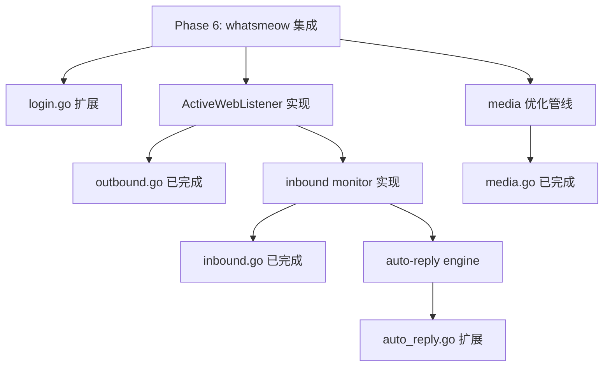

# P5 WhatsApp SDK → P6 延迟项上下文

> 生成时间：2026-02-13 | 来源：Phase 5D.4 WhatsApp SDK 移植

## 概述

Phase 5D.4 已完成 WhatsApp SDK 从 TypeScript 到 Go 的核心移植（14 个 Go 文件），但以下功能因依赖 **Baileys SDK 运行时**（WebSocket 长连接、proto 解码、Signal 协议加密）而创建为**接口骨架**，需在 Phase 6 网关阶段完成实际实现。

---

## 延迟项 A：Baileys WebSocket 连接 + Session 管理

### 现状

- [login.go](file:///Users/fushihua/Desktop/Claude-Acosmi/backend/internal/channels/whatsapp/login.go) — 仅检查已有 `creds.json`，无法建立新连接
- [login_qr.go](file:///Users/fushihua/Desktop/Claude-Acosmi/backend/internal/channels/whatsapp/login_qr.go) — QR 状态管理完整，但无 QR 生成能力

### TS 参考

| 文件 | 行数 | 核心职责 |
|------|------|---------|
| [session.ts](file:///Users/fushihua/Desktop/Claude-Acosmi/src/web/session.ts) | 316L | `createWaSocket()` — Baileys socket 初始化、auth 状态绑定、事件注册 |
| [login.ts](file:///Users/fushihua/Desktop/Claude-Acosmi/src/web/login.ts) | 78L | CLI 登录流程、`DisconnectReason.loggedOut` 和 515 错误处理 |
| [login-qr.ts](file:///Users/fushihua/Desktop/Claude-Acosmi/src/web/login-qr.ts) | 295L | QR DataURL 生成、超时/重试控制、`qrcode-terminal` 渲染 |

### P6 需实现

1. **Go Baileys 替代品**：选择 Go 的 WhatsApp Web 客户端库（如 [whatsmeow](https://github.com/tulir/whatsmeow)）
2. `LoginWeb()` — 集成实际 WebSocket 握手 + QR 码扫描等待
3. `StartWebLoginWithQR()` — 生成 QR DataURL 并通过 channel/callback 推送给调用方
4. Session 持久化 — 将 whatsmeow 的 auth state 写入 `creds.json`（保持与 Baileys 格式兼容或迁移）

---

## 延迟项 B：入站消息监控 + 路由

### 现状

- [inbound.go](file:///Users/fushihua/Desktop/Claude-Acosmi/backend/internal/channels/whatsapp/inbound.go) — 类型定义 + 去重缓存完整，但无实际消息接收
- [active_listener.go](file:///Users/fushihua/Desktop/Claude-Acosmi/backend/internal/channels/whatsapp/active_listener.go) — `ActiveWebListener` 接口已定义，但无实现

### TS 参考

| 文件 | 行数 | 核心职责 |
|------|------|---------|
| [inbound/monitor.ts](file:///Users/fushihua/Desktop/Claude-Acosmi/src/web/inbound/monitor.ts) | 404L | `monitorWebInbox()` — 注册 Baileys messages.upsert 事件、构造 `WebInboundMessage`、去重/debounce |
| [inbound/extract.ts](file:///Users/fushihua/Desktop/Claude-Acosmi/src/web/inbound/extract.ts) | 332L | proto.IMessage 解析：文本/媒体/位置/联系人/引用上下文提取 |
| [inbound/access-control.ts](file:///Users/fushihua/Desktop/Claude-Acosmi/src/web/inbound/access-control.ts) | — | allowFrom / groupAllowFrom 访问控制 |
| [inbound/media.ts](file:///Users/fushihua/Desktop/Claude-Acosmi/src/web/inbound/media.ts) | 50L | `downloadInboundMedia()` 从 Baileys 下载附件 |
| [inbound/send-api.ts](file:///Users/fushihua/Desktop/Claude-Acosmi/src/web/inbound/send-api.ts) | — | 创建 `sendMessage`/`sendComposing`/`reply` 闭包 |

### P6 需实现

1. `monitorWebInbox()` — 注册 whatsmeow 事件处理器，构建 `WebInboundMessage`
2. Baileys proto → Go struct 转换（whatsmeow 有自己的 proto 定义）
3. `downloadInboundMedia()` — 通过 whatsmeow 解密和下载媒体附件
4. 实现 `ActiveWebListener` 接口的具体类型

---

## 延迟项 C：自动回复引擎

### 现状

- [auto_reply.go](file:///Users/fushihua/Desktop/Claude-Acosmi/backend/internal/channels/whatsapp/auto_reply.go) — 配置类型 + `AutoReplyHandler` 接口骨架

### TS 参考（~2776L, 20+ 文件）

| 文件 | 核心职责 |
|------|---------|
| [auto-reply/monitor.ts](file:///Users/fushihua/Desktop/Claude-Acosmi/src/web/auto-reply/monitor.ts) | `monitorWebChannel()` — 总入口：Baileys 连接 + 入站监控 + 断线重连 |
| [auto-reply/monitor/process-message.ts](file:///Users/fushihua/Desktop/Claude-Acosmi/src/web/auto-reply/monitor/process-message.ts) | 消息处理管线：准入检查 → Agent 路由 → 回复发送 |
| [auto-reply/monitor/on-message.ts](file:///Users/fushihua/Desktop/Claude-Acosmi/src/web/auto-reply/monitor/on-message.ts) | 入站消息分发（DM vs Group vs self-chat） |
| [auto-reply/monitor/group-gating.ts](file:///Users/fushihua/Desktop/Claude-Acosmi/src/web/auto-reply/monitor/group-gating.ts) | 群聊准入：mention 检测、`requireMention` 策略 |
| [auto-reply/monitor/ack-reaction.ts](file:///Users/fushihua/Desktop/Claude-Acosmi/src/web/auto-reply/monitor/ack-reaction.ts) | 确认反应（emoji 回应已读消息） |
| [auto-reply/deliver-reply.ts](file:///Users/fushihua/Desktop/Claude-Acosmi/src/web/auto-reply/deliver-reply.ts) | 回复投递：文本分块 + 媒体发送 |
| [auto-reply/heartbeat-runner.ts](file:///Users/fushihua/Desktop/Claude-Acosmi/src/web/auto-reply/heartbeat-runner.ts) | 心跳定时发送 |
| [auto-reply/session-snapshot.ts](file:///Users/fushihua/Desktop/Claude-Acosmi/src/web/auto-reply/session-snapshot.ts) | 会话快照（用于心跳收件人解析） |
| [auto-reply/mentions.ts](file:///Users/fushihua/Desktop/Claude-Acosmi/src/web/auto-reply/mentions.ts) | @mention 检测和提取 |

### P6 需实现

1. `monitorWebChannel()` — 整合 Baileys 连接 + 入站监控 + 自动重连
2. 消息处理管线 — 准入检查 → Agent 引擎调用 → 回复投递
3. 群聊 gating — mention 检测 + `requireMention` 策略
4. 心跳 runner — 周期性向收件人发送心跳消息
5. 会话快照 — 跟踪最近通信对象用于心跳

---

## 延迟项 D：媒体优化管线

### 现状

- [media.go](file:///Users/fushihua/Desktop/Claude-Acosmi/backend/internal/channels/whatsapp/media.go) — 本地/远程加载 + MIME 检测完整，但无图像优化

### TS 参考

| 文件 | 行数 | 核心职责 |
|------|------|---------|
| [media.ts](file:///Users/fushihua/Desktop/Claude-Acosmi/src/web/media.ts) | 336L | HEIC→JPEG 转换、PNG 优化（`pngquant`）、尺寸裁剪（`sharp`）、文件大小钳位 |

### P6 需实现

1. HEIC → JPEG 转换（Go: `goheif` 或 CGo + libheif）
2. PNG 优化（Go: `pngquant` CLI 或纯 Go 库）
3. 图像尺寸钳位（Go: `imaging` 包 resize）
4. 文件大小钳位（WhatsApp 64MB 限制已实现，图像需额外 16MB 限制）

---

## 已完成的 Go 骨架（可直接扩展）

| Go 文件 | 提供的接口/类型 |
|---------|---------------|
| [active_listener.go](file:///Users/fushihua/Desktop/Claude-Acosmi/backend/internal/channels/whatsapp/active_listener.go) | `ActiveWebListener` 接口 — 实现此接口即可接入出站 |
| [auto_reply.go](file:///Users/fushihua/Desktop/Claude-Acosmi/backend/internal/channels/whatsapp/auto_reply.go) | `AutoReplyHandler` 接口 — 实现此接口即可接入自动回复 |
| [login.go](file:///Users/fushihua/Desktop/Claude-Acosmi/backend/internal/channels/whatsapp/login.go) | `LoginWeb()` — 扩展此函数添加 WebSocket 逻辑 |
| [login_qr.go](file:///Users/fushihua/Desktop/Claude-Acosmi/backend/internal/channels/whatsapp/login_qr.go) | `StartWebLoginWithQR()` + `ActiveLogin` 状态机 — 注入 QR 数据即可工作 |
| [inbound.go](file:///Users/fushihua/Desktop/Claude-Acosmi/backend/internal/channels/whatsapp/inbound.go) | `WebInboundMessage` + 去重缓存 — 直接使用 |

---

## 技术选型建议

> [!IMPORTANT]
> **Baileys Go 替代：[whatsmeow](https://github.com/tulir/whatsmeow)**
>
> - 成熟的 Go WhatsApp Web 客户端，支持多设备
> - 提供 QR 码登录、消息收发、媒体上传/下载
> - 与现有 `creds.json` 不直接兼容，需要编写迁移层或使用 whatsmeow 自己的 SQL-based store

## 依赖关系图

