# Phase 间延迟待办汇总 — 已完成归档

> 归档时间：2026-02-17
> 内容：Phase 4~10 全部已完成的延迟待办项
> 原文件：`deferred-items.md`
>
> **当前活跃的待办项请查看**：[deferred-items.md](file:///Users/fushihua/Desktop/Claude-Acosmi/docs/renwu/deferred-items.md)
>
> **Phase 9 分组映射**：本文档中的未解决项已在 [phase9-task.md](file:///Users/fushihua/Desktop/Claude-Acosmi/docs/renwu/phase9-task.md) 中按 4 批次编排：
>
> - **Batch A**：Gateway 集成（WA/SIG/IM/SLK/DIS/TG，~35 项）
> - **Batch B**：Config/Agent 补全（P1-F9/B3/C1 等，~10 项）
> - **Batch C**：Agent 引擎缺口（P4-GA 系列 + C2，~8 项）
> - **Batch D**：辅助/优化（CLI/ACP/Memory/Browser 等，~15 项）

---

## Phase 4 待办（来自 Phase 1 审计）

### P1-F14a: sessions/ 模块（9 文件 ~500 行）✅

- **来源**：Phase 1 审计 F14
- **说明**：`src/config/sessions/` — 会话 key 解析、存储路径、恢复策略
- **完成时间**：2026-02-15
- **Go 位置**：`internal/sessions/` — 6 新文件 + 5 测试文件
  - `paths.go` — 目录/路径解析
  - `reset.go` — daily/idle 重置策略 + 新鲜度评估
  - `group.go` — 群组键解析 + 显示名构建
  - `main_session.go` — 主会话键 + 别名规范化 + 会话键推导
  - `metadata.go` — Origin 合并 + 元数据补丁
  - `transcript.go` — 转录文件管理 + 助手消息追加

### P1-F14b: agent-limits 常量 ✅

- **来源**：Phase 1 审计 F14
- **说明**：`src/config/agent-limits.ts` (~30L) — Agent ContextTokens/Timeout 常量
- **完成时间**：已在 Phase 5 中实现
- **Go 位置**：`internal/agents/limits.go` + `internal/agents/limits_test.go`

---

## Phase 5 待办

### 来自 Phase 1 审计

#### P1-F9: Shell Env Fallback ✅ 已完成

- **TS 来源**：[io.ts:217-225](file:///Users/fushihua/Desktop/Claude-Acosmi/src/config/io.ts#L217-L225) — `loadShellEnvFallback()`
- **Go 实现**：`shellenv.go` (250L) — 完整实现 `exec` login shell + 环境变量注入
- **完成时间**：2026-02-15 (Phase 9 Batch B)

#### P1-B3: ChannelsConfig Extra 字段 ✅ 已完成

- **Go 实现**：`types_channels.go` (107L) — `Extra map[string]interface{}` + 自定义 UnmarshalJSON/MarshalJSON
- **完成时间**：2026-02-15 (Phase 9 Batch B)

#### P1-C1: Discord/Slack/Signal 群组解析 ✅ 已完成

- **Go 实现**：`grouppolicy.go` — 已含 Discord/Slack/Signal 全部频道群组解析
- **完成时间**：2026-02-15 (Phase 9 Batch B)

#### P1-channelPreferOver: 动态查询 ✅ 已确认

- **Go 现状**：`channelPreferOver` 空 map — TS 核心频道同样无 preferOver 值，行为正确
- **完成时间**：2026-02-15 (Phase 9 Batch B 分析确认)

#### P1-F14c: 其余 TS-only 模块（6 个） ✅ 已完成

| TS 模块 | Go 文件 | 状态 |
|---------|---------|------|
| `cache-utils.ts` | `cacheutils.go` (新建) | ✅ |
| `channel-capabilities.ts` | `channel_capabilities.go` (已预存在 146L) | ✅ |
| `commands.ts` | `commands.go` (新建) | ✅ |
| `talk.ts` | `talk.go` (新建) | ✅ |
| `merge-config.ts` | `mergeconfig.go` (新建) | ✅ |
| `telegram-custom-commands.ts` | `telegramcmds.go` (新建) | ✅ |

- **完成时间**：2026-02-15 (Phase 9 Batch B)

---

### 来自 Phase 2 审计

#### P2-D1: Transform 管道 ✅ 已完成

- **TS 来源**：`hooks-mapping.ts` L137-332
- **Go 实现**：`hooks_mapping.go` — `TransformFunc` 类型 + `RegisterTransform()` 注册表 + `ApplyTransform()` (Override/Merge/Skip)
- **完成日期**：2026-02-14

#### P2-D2: HookMappingConfig 嵌套 match 结构 ✅ 已完成

- **Go 实现**：`hooks_mapping.go` — `Match *HookMatchFieldConfig` + `resolveMatchField` 优先级解析
- **完成日期**：2026-02-14

#### P2-D3+D4: resolveSessionKey + session-key 模块 ✅ 已完成

- **TS 来源**：`http-utils.ts` L65-79 + `routing/session-key.ts` (263L)
- **Go 实现**：`internal/routing/session_key.go` (340L, 18 个函数)
- **完成函数**：`NormalizeAgentID` / `NormalizeMainKey` / `BuildAgentMainSessionKey` / `BuildAgentPeerSessionKey` / `ToAgentStoreSessionKey` / `ParseAgentSessionKey` / `ResolveAgentIDFromSessionKey` / `ResolveThreadSessionKeys` / `ResolveThreadParentSessionKey` 等

#### P2-D5: Channel 动态插件注册 ✅ 已完成

- **Go 实现**：`hooks.go` — `validHookChannels` 扩展到 11 entries + `RegisterHookChannel()` 动态注册
- **完成日期**：2026-02-14

#### P2-D6: validateAction 专用函数 ✅ 已确认

- **TS 来源**：`hooks-mapping.ts` L302-313
- **Go 现状**：`buildMappingResult` (内联检查，语义等价)
- **结论**：wake 在 L245-248 有默认值回退，agent 在 L256-258 返回 error，语义与 TS 一致

---

### 来自 Phase 3 审计

#### P3-D1: sessions.list `Path` 字段 ✅ 已完成

- **Go 实现**：`server_methods_sessions.go` — `Path: ctx.Context.StorePath`
- **完成日期**：2026-02-14

#### P3-D2: sessions.list `Defaults` 填充 ✅ 已完成

- **Go 实现**：`server_methods_sessions.go` — `getSessionDefaults()` + `models.ResolveConfiguredModelRef`
- **完成日期**：2026-02-14

#### P3-D3: sessions.delete 完整主 session 保护 ✅ 已完成

- **Go 实现**：`server_methods_sessions.go` — `routing.BuildAgentMainSessionKey` 动态主 session 保护
- **完成日期**：2026-02-14

#### P3-D4: preview tool call 角色检测 ✅ 已完成

- **Go 现状**：`normalizePreviewRole(role, isTool)` + `isToolCallMessage()` 已实现
- **对齐**：TS `session-utils.fs.ts` normalizeRole(role, isTool) + `transcript-tools.ts` hasToolCall()
- **实现**：检查 content 数组中 `type` 为 `tool_use`/`toolcall`/`tool_call` 的块

---

### 来自 Phase 4 审计

#### P4-DRIFT4: API Key 环境变量映射 ✅ 已完成

- **文件**：[providers.go](file:///Users/fushihua/Desktop/Claude-Acosmi/backend/internal/agents/models/providers.go)
- **Go 实现**：`EnvApiKeyVarNames` (31 entries) + `EnvApiKeyFallbacks` (5 条 OAuth 回退链) + `ResolveEnvApiKeyWithFallback()`
- **完成日期**：2026-02-14

#### P4-DRIFT5: `DowngradeOpenAIReasoningBlocks` 已实现 ✅

- **文件**：[helpers.go](file:///Users/fushihua/Desktop/Claude-Acosmi/backend/internal/agents/helpers/helpers.go)
- **实现**：完整降级逻辑（解析 reasoning signature → 过滤尾部孤立 thinking block）
- **对齐**：TS `pi-embedded-helpers/openai.ts` downgradeOpenAIReasoningBlocks()

#### P4-NEW5: 隐式供应商自动发现 ✅ 已完成

- **文件**：[implicit_providers.go](file:///Users/fushihua/Desktop/Claude-Acosmi/backend/internal/agents/models/implicit_providers.go) **[NEW]**
- **Go 实现**：`ResolveImplicitProviders()` (12 specs) + `NormalizeProviders()` + Bedrock/Copilot stub
- **完成日期**：2026-02-14

#### ~~P4-GA-RUN1: ExtraSystemPrompt 未传递到 AttemptParams~~ → ✅ 已完成

- **来源**：Phase 4 全局审计 2026-02-14
- **完成时间**：2026-02-15
- **Go 变更**：
  - `runner/run_attempt.go` — `AttemptParams` 新增 `ExtraSystemPrompt string`
  - `runner/run.go` L127 — 构建 `AttemptParams` 时传递 `ExtraSystemPrompt: params.ExtraSystemPrompt`
  - `autoreply/reply/agent_runner_execution.go` — `AgentTurnParams` 新增 `ExtraSystemPrompt`
  - `autoreply/reply/agent_runner.go` — 从 `FollowupRun.Run.ExtraSystemPrompt` 传入

#### P4-GA-RUN2: messaging tool 元数据未传播 ✅ 已完成

- **来源**：Phase 4 全局审计 2026-02-14
- **完成时间**：2026-02-15
- **Go 变更**：`runner/run.go` L274-275 — 传播 `attempt.DidSendViaMessaging` + `attempt.MessagingSentTargets` 到 `EmbeddedPiRunResult`

#### P4-GA-ANN1: 缺失 subagent steer/queue 机制 ✅ 已完成

- **来源**：Phase 4 全局审计 2026-02-14
- **完成时间**：2026-02-15
- **Go 变更**：`runner/subagent_announce.go` — 新增 `AnnounceQueueHandler` DI 接口 + `QueueAnnounceParams`/`QueueAnnounceResult` 类型 + steer/queue 逻辑集成到步骤 9

#### P4-GA-CLI3: CLI Agent 完整 system prompt 构建 ✅ 已完成

- **来源**：Phase 4 全局审计 2026-02-14
- **完成时间**：2026-02-15
- **Go 变更**：`exec/cli_runner.go` — 新增 `SystemPromptBuilder CliSystemPromptBuilderFunc` 可选 DI 回调 + `CliSystemPromptContext` 类型，步骤 4 优先使用 builder 结果

#### P4-GA-DLV1: 完整 Channel Handler 管线 ✅ 已完成

- **来源**：Phase 4 全局审计 2026-02-14
- **完成时间**：2026-02-15
- **Go 变更**：`outbound/deliver.go` — 新增 `ChannelOutboundAdapter` 接口（ResolveMediaMaxBytes + FormatPayload）+ `TextChunkerFunc` DI 回调

#### P4-GA-DLV3: Mirror transcript 追加 ✅ 已完成

- **来源**：Phase 4 全局审计 2026-02-14
- **完成时间**：2026-02-15
- **Go 变更**：`outbound/deliver.go` — 新增 `TranscriptAppender SessionTranscriptAppender` DI 字段 + `appendMirrorTranscript()` 在两处成功发送后调用

---

### 来自 C2 隐藏依赖审计

> 来源：2026-02-14 C2 Isolated Agent Runner 隐藏依赖审计

#### ~~C2-P0: MessagingToolSentTargets 类型不一致~~ → ✅ 已完成

- **完成时间**：2026-02-15
- **Go 变更**：
  - `runner/types.go` — 新增 `MessagingToolSend` struct（tool/provider/accountId/to）+ 重命名 `MessagingToolSentTexts` → `MessagingToolSentTargets`
  - 级联更新 6 文件: `run_attempt.go`, `agent_runner_execution.go`, `model_fallback_executor.go`, `agent_runner_payloads.go`, `agent_runner.go`, `model_fallback_executor_test.go`

#### ~~C2-P1a: runWithModelFallback 未实现~~ → ✅ 已完成

- **来源**：C2 Isolated Agent Runner 隐藏依赖审计
- **完成时间**：2026-02-15
- **Go 变更**：
  - `agents/models/fallback.go` — 新增 `AuthProfileChecker` 接口 + `RunWithModelFallback` 添加 auth profile cooldown 跳过逻辑（对齐 TS L242-260）
  - `autoreply/reply/model_fallback_executor.go` **[NEW]** (204L) — `ModelFallbackExecutor` 实现 `AgentExecutor` 接口，管线: `RunTurn` → `models.RunWithModelFallback` → `runner.RunEmbeddedPiAgent`
  - `autoreply/reply/model_fallback_executor_test.go` **[NEW]** — 7 个测试覆盖成功路径、ExtraSystemPrompt 透传、auth cooldown 跳过

#### C2-P1b: isCliProvider + runCliAgent ✅ 已完成（Phase 9 B2 已存在）

- **说明**: `IsCliProvider` 在 `models/selection.go:68`，`RunCliAgent` 在 `exec/cli_runner.go:68`，均已完整实现
- **状态**: 无需额外变更

#### C2-P2a: buildSafeExternalPrompt 简化 ✅ 已修复

- **TS 来源**: `security/external-content.ts` (283L) — Unicode marker sanitization + 15 regex prompt injection 检测
- **Go 实现**: `internal/security/external_content.go`（345L, 12 regex + Unicode 折叠 + 标记净化）
- **完成日期**: 2026-02-14 | 17 单元测试 PASS

#### C2-P2b: registerAgentRunContext 全局状态 ✅ 已完成

- **来源**: C2 隐藏依赖审计
- **完成时间**: 2026-02-15
- **Go 变更**: **[NEW]** `internal/infra/agent_events.go` (150L) — 线程安全全局注册表 (sync.RWMutex) + EmitAgentEvent + per-run seq 计数器 + 监听器注册
- **测试**: `agent_events_test.go` (3 测试 PASS)

#### C2-P2c: buildWorkspaceSkillSnapshot ✅ 已完成

- **来源**: C2 隐藏依赖审计
- **完成时间**: 2026-02-15
- **Go 变更**: **[NEW]** `internal/agents/skills/workspace_skills.go` (245L) — LoadSkillEntries（4 来源目录扫描）+ filterSkillEntries + formatSkillsForPrompt + BuildWorkspaceSkillSnapshot
- **测试**: `workspace_skills_test.go` (5 测试 PASS)

## Phase 6+ 待办

### P4-NEW1: resolveAgentModelFallbacksOverride hasOwn 语义 ✅ 已完成

- **文件**：[scope.go](file:///Users/fushihua/Desktop/Claude-Acosmi/backend/internal/agents/scope/scope.go) L197-204
- **完成时间**：2026-02-15 (Phase 9 Batch B)
- **Go 变更**：`pkg/types/types_agents.go` + `types_agent_defaults.go` — `Fallbacks *[]string`（指针语义区分 nil vs empty）+ 4 处引用修复

### P4-NEW2: resolveHooksGmailModel ✅ 已完成

- **TS 参考**：`model-selection.ts` L422-447
- **完成时间**：2026-02-15 (Phase 9 Batch B)
- **Go 实现**：`internal/agents/models/selection.go:394-407` — `ResolveHooksGmailModel` 完整逻辑（nil 防护 + alias 索引 + model ref 解析）

### P1-F14d: port-defaults.ts / logging.ts ✅ 已完成

- **完成时间**：2026-02-15 (Phase 9 Batch B)
- **Go 实现**：
  - `internal/config/portdefaults.go` (72L) — 4 个导出 Derive 函数 + `PortRange` 类型 + `clampPort` 安全校验
  - `internal/config/configlog.go` (49L) — `FormatConfigPath` (home → ~) + `ConfigLogger` 接口 + `LogConfigUpdated`

### ACP-P2-1: SessionID 使用 UUID 生成 ✅ 已完成

- **来源**：ACP 隐藏依赖审计 P2-1
- **完成时间**：2026-02-15 (Phase 9 D2)
- **Go 变更**：`session.go` — `uuid.New().String()` 替换计数器，移除 `counter` 字段

### ACP-P2-2: ListSessions 支持 limit 参数 ✅ 已完成

- **来源**：ACP 隐藏依赖审计 P2-4
- **完成时间**：2026-02-15 (Phase 9 D2)
- **Go 变更**：`translator.go` — `ReadNumber(req.Meta, "limit")` 替换硬编码 100

### CLI-P2-1: Plugin registry singleton (H2-2) ✅ 已完成

- **来源**：CLI 隐藏依赖审计
- **完成时间**：2026-02-15 (Phase 9 D1)
- **Go 实现**：`internal/cli/plugin_registry.go` (80L) — `EnsurePluginRegistryLoaded` (sync.Once) + `PluginRegistryDeps` DI 接口

### CLI-P2-2: dotenv 加载 (H5-2) ✅ 已完成

- **来源**：CLI 隐藏依赖审计
- **完成时间**：2026-02-15 (Phase 9 D1)
- **Go 实现**：`internal/cli/dotenv.go` (85L) — `LoadDotEnv` CWD + global fallback (不覆盖已有，自包含解析无需 godotenv)

### CLI-P2-3: --update flag 重写 (H7-2) ✅ 已完成

- **来源**：CLI 隐藏依赖审计
- **完成时间**：2026-02-15 (Phase 9 D1)
- **Go 实现**：`internal/cli/argv.go` `RewriteUpdateFlagArgv` — `--update` → `update` 子命令替换

### CLI-P2-4: Runtime clearProgressLine 联动 (H2-4) ✅ 已完成

- **来源**：CLI 隐藏依赖审计
- **完成时间**：2026-02-15 (Phase 9 D1)
- **Go 实现**：`internal/cli/progress.go` `ClearProgressLine` — 活跃进度时清除 stderr spinner 行

### CLI-P2-5: OPENACOSMI_EAGER_CHANNEL_OPTIONS (H4-4) ✅ 已完成

- **来源**：CLI 隐藏依赖审计
- **完成时间**：2026-02-15 (Phase 9 D1)
- **Go 实现**：`internal/cli/utils.go` `ResolveCliChannelOptions` — 动态插件频道合并 + `registry.go` `GetChannelNames` accessor

### CLI-P3-1: 快速路由机制 (H6-1) ✅ 已完成

- **来源**：CLI 隐藏依赖审计
- **完成时间**：2026-02-15 (Phase 9 D1)
- **Go 实现**：`internal/cli/route.go` (100L) — `TryRouteCli` + `RegisterRoutedCommand` 快速命令路由（接口对等，Go/Cobra 不需性能优化）

### CLI-P3-2: PATH bootstrap (H5-1 + H4-6) ✅ N/A

- **来源**：CLI 隐藏依赖审计
- **完成时间**：2026-02-15 (Phase 9 D1)
- **结论**：Go 二进制为独立编译产物，无需动态 PATH 补全。TS `ensureOpenAcosmiCliOnPath()` 功能不适用于 Go

---

## Phase 6 Signal Gateway 集成

> 来源：Phase 5D.5 Signal SDK 移植

### SIG-A: 入站消息分发管线 ✅ (Phase 9 A3, 2026-02-15)

- **状态**：已解决
- **Go 实现**：`event_handler.go` `dispatchSignalInbound()` + `formatSignalEnvelope()` + 反应事件 `EnqueueSystemEvent`
- **新增**：`monitor_deps.go` (DI 接口 `SignalMonitorDeps`)

### SIG-B: 配对请求管理 ✅ (Phase 9 A3, 2026-02-15)

- **状态**：已解决
- **Go 实现**：`handleSignalPairing()` + `BuildPairingReply()` — DI 注入 `UpsertPairingRequest`

### SIG-C: 媒体下载 + 已读回执 ✅ (Phase 9 A3, 2026-02-15)

- **状态**：已解决
- **Go 实现**：`FetchAttachmentSignal` 集成 + `SendReadReceiptSignal` 集成 + `DeliverSignalReplies`

---

## Phase 6 WhatsApp 网关集成

> 来源：Phase 5D.4 WhatsApp SDK 移植

### WA-A: Baileys WebSocket 连接 + Session 管理 ✅ Phase 9 A4 (2026-02-15)

- **Go 骨架**：`login.go` + `login_qr.go`（QR 状态管理完整，无 WebSocket）
- **TS 参考**：`session.ts` (316L) / `login.ts` (78L) / `login-qr.ts` (295L)
- **P6 需实现**：选择 [whatsmeow](https://github.com/tulir/whatsmeow)，实现 WebSocket 握手 + QR + Session 持久化

### WA-B: 入站消息监控 + 路由 ✅ Phase 9 A4 (2026-02-15)

- **Go 骨架**：`inbound.go`（类型+去重）+ `active_listener.go`（接口）
- **TS 参考**：`inbound/monitor.ts` (404L) / `extract.ts` (332L) / `media.ts` (50L)
- **P6 需实现**：whatsmeow 事件处理器 + proto→struct 转换 + 媒体下载

### WA-C: 自动回复引擎 ✅ Phase 9 A4 (2026-02-15)

- **Go 骨架**：`auto_reply.go`（接口定义）
- **TS 参考**：~2776L, 20+ 文件（`auto-reply/monitor.ts` + 处理管线 + 心跳）
- **P6 需实现**：Baileys 连接 + 入站监控 + 重连 + 消息处理管线 + 群聊 gating

### WA-D: 媒体优化管线 ✅ Phase 9 A4 (2026-02-15)

- **Go 骨架**：`media.go`（本地/远程加载 + MIME 检测完整）
- **TS 参考**：`media.ts` (336L) — HEIC→JPEG + PNG 优化 + 尺寸钳位
- **P6 需实现**：`goheif`/`imaging` 包 + `pngquant` CLI

### WA-E: 出站消息 Markdown 表格转换 ✅ Phase 9 A4 (2026-02-15)

> 来源：2026-02-13 隐藏依赖深度审计

- **Go 位置**：[outbound.go](file:///Users/fushihua/Desktop/Claude-Acosmi/backend/internal/channels/whatsapp/outbound.go) `SendMessageWhatsApp()`
- **TS 参考**：[outbound.ts:31-36](file:///Users/fushihua/Desktop/Claude-Acosmi/src/web/outbound.ts#L31-L36) — `resolveMarkdownTableMode()` + `convertMarkdownTables()`
- **隐藏依赖类别**：协议/消息格式
- **前置已完成（2026-02-14）**：`pkg/markdown/tables.go` 已实现（250L, 3 模式）+ `Markdown *MarkdownConfig` 已添加到 `OpenAcosmiConfig`
- **P6 剩余**：仅需在 WhatsApp `outbound.go` 中调用 `markdown.ConvertMarkdownTables()` 接入

### WA-F: auth-store 辅助函数 + 结构化日志 ✅ Phase 9 A4 (2026-02-15)

> 来源：2026-02-13 隐藏依赖深度审计

- **Go 位置**：[auth_store.go](file:///Users/fushihua/Desktop/Claude-Acosmi/backend/internal/channels/whatsapp/auth_store.go)、[outbound.go](file:///Users/fushihua/Desktop/Claude-Acosmi/backend/internal/channels/whatsapp/outbound.go)
- **TS 参考**：`auth-store.ts:17` (`WA_WEB_AUTH_DIR`)、`auth-store.ts:177` (`logWebSelfId`)、`auth-store.ts:189` (`pickWebChannel`)
- **缺失项**：
  1. `WA_WEB_AUTH_DIR` 模块级常量（Go 可 `var WAWebAuthDir = ResolveDefaultWebAuthDir()`）
  2. `logWebSelfId()` — CLI 友好身份显示
  3. `pickWebChannel()` — Web/Legacy 通道选择
  4. 结构化日志（correlationId 追踪、warn 级别备份恢复提示）
- **P6 需实现**：Gateway 日志基础设施就绪后补充

---

## Phase 6 iMessage Gateway 集成

> 来源：Phase 5D.6 iMessage SDK 移植

### IM-A: 入站消息分发管线

- **Go 位置**：[monitor_inbound.go](file:///Users/fushihua/Desktop/Claude-Acosmi/backend/internal/channels/imessage/monitor_inbound.go) `HandleInboundMessageFull`
- **状态**：✅ **已完成** (Phase 9 A2, 2026-02-15)
  - 新增 5 个文件：`monitor_deps.go` (DI)、`monitor_envelope.go`、`monitor_history.go`、`monitor_gating.go`、`monitor_inbound.go` (~640L 核心管线)
  - 移除 Phase 6 骨架 `handleInboundMessage`
  - 13 项子依赖全部覆盖：防抖、群组策略、mention 检测、控制命令门控、allowFrom、信封格式化、历史管理、UTF-16 截断等
  - 共享基础设施（routing/dispatch/session/pairing store）通过 `MonitorDeps` DI 接口预留

### IM-B: 配对请求管理

- **Go 位置**：[monitor_inbound.go](file:///Users/fushihua/Desktop/Claude-Acosmi/backend/internal/channels/imessage/monitor_inbound.go) `handlePairing` + [monitor_gating.go](file:///Users/fushihua/Desktop/Claude-Acosmi/backend/internal/channels/imessage/monitor_gating.go) `BuildPairingReply`
- **状态**：✅ **已完成** (Phase 9 A2, 2026-02-15)
  - DI 接口 `UpsertPairingRequest` + `ReadAllowFromStore`
  - `handlePairing` 函数：dmPolicy 检查 → upsert → 发送配对回复

### IM-C: 媒体附件下载 + 存储

- **Go 位置**：[monitor_deps.go](file:///Users/fushihua/Desktop/Claude-Acosmi/backend/internal/channels/imessage/monitor_deps.go) `ResolveMedia` DI 接口
- **状态**：✅ **已完成** (Phase 9 A2, 2026-02-15)
  - DI 接口 `ResolveMedia` 定义就绪
  - `resolveAttachments` 过滤逻辑已实现（仅保留非 missing 附件）

### IM-D: Markdown 表格转换 + DeliverReplies 分块

- **Go 位置**：[monitor.go](file:///Users/fushihua/Desktop/Claude-Acosmi/backend/internal/channels/imessage/monitor.go) `DeliverReplies`
- **状态**：✅ **已完成** (Phase 9 A2, 2026-02-15)
  - `DeliverReplies` 集成 `markdown.ConvertMarkdownTables` + `autoreply.ChunkTextWithMode`
  - 使用 `resolveIMessageTableMode` 解析表格模式
  - 分块限制通过 `autoreply.ResolveTextChunkLimit` 解析

### IM-E: 客户端优雅关闭 + 订阅清理

> 来源：2026-02-13 隐藏依赖审计 H1/H8/H11，已在审计后立即修复

- **Go 位置**：[client.go](file:///Users/fushihua/Desktop/Claude-Acosmi/backend/internal/channels/imessage/client.go) `Stop()` + [monitor.go](file:///Users/fushihua/Desktop/Claude-Acosmi/backend/internal/channels/imessage/monitor.go) ctx 取消处理
- **状态**：✅ **已修复**
  - H11: `Stop()` 先关闭 stdin 再 Kill（client.go `stdinCloser`）
  - H1: ctx 取消时发送 `watch.unsubscribe` RPC（monitor.go `subscriptionID`）
  - H8: subscription ID 已保存并在 unsubscribe 中使用

---

## Phase 6 Slack Gateway 集成

> 来源：Phase 5D.8 Slack SDK 移植（37 Go 文件，3591L）

### SLK-A: Socket Mode WebSocket 连接 + 事件循环 ✅ (Phase 9, 2026-02-15)

- **解决方案**：集成 `slack-go/slack` v0.17.3 `socketmode` 子包（全托管 WebSocket + 自动重连 + envelope ack）
- **Go 位置**：[monitor_provider.go](file:///Users/fushihua/Desktop/Claude-Acosmi/backend/internal/channels/slack/monitor_provider.go) `monitorSlackSocket`

### SLK-B: HTTP 事件验证 + 签名校验 + 分发 ✅ (Phase 9, 2026-02-15)

- **解决方案**：HMAC-SHA256 签名验证 + url_verification challenge + event_callback 分发
- **Go 位置**：[monitor_provider.go](file:///Users/fushihua/Desktop/Claude-Acosmi/backend/internal/channels/slack/monitor_provider.go) `monitorSlackHTTP` + `verifySlackSignature`

### SLK-C: 入站消息分发管线 ✅ (Phase 9, 2026-02-15)

- **解决方案**：新增 `monitor_deps.go` (DI) + `monitor_message_prepare.go` (11 步过滤) + `monitor_message_dispatch.go` (路由+分发)
- **Go 位置**：[monitor_message_prepare.go](file:///Users/fushihua/Desktop/Claude-Acosmi/backend/internal/channels/slack/monitor_message_prepare.go) + [monitor_message_dispatch.go](file:///Users/fushihua/Desktop/Claude-Acosmi/backend/internal/channels/slack/monitor_message_dispatch.go)

### SLK-D: 事件处理器 ✅ (Phase 9, 2026-02-15)

- **解决方案**：12 个事件处理器完整实现（6 频道 + 2 成员 + 2 pin + 2 反应）+ 缓存更新 + system event 入队

### SLK-E: 监控上下文 ✅ (Phase 9, 2026-02-15)

- **解决方案**：`monitor_context.go` 重写 — conversations.info/users.info API 回填 + dedup cache + 策略门控 + auth.test

### SLK-F: 线程历史补全 + 回复发送 ✅ (Phase 9, 2026-02-15)

- **解决方案**：conversations.replies API + 历史裁剪 + 分块发送 + 反应状态生命周期 (⏳→✅/❌)

### SLK-G: 斜杠命令处理 ✅ (Phase 9, 2026-02-15)

- **解决方案**：命令解析 + agent 路由 + MsgContext + auto-reply 分发 + ephemeral 回复

### SLK-H: Pairing Store 集成 ✅ (Phase 9, 2026-02-15)

- **解决方案**：静态+动态 allowlist 合并 + DI 注入 `ReadAllowFromStore` / `UpsertPairingRequest`

### SLK-I: 媒体下载 ✅ (Phase 9, 2026-02-15)

- **解决方案**：Bot token `Authorization: Bearer` 授权 HTTP 文件下载 + 安全化文件名

---

## Phase 7 Slack 高级管线

> 来源：Phase 5D.8 Slack SDK 移植

### SLK-P7-A: Markdown IR 中间层 ✅ 已完成 (Phase 9 + Phase 10 审计确认, 2026-02-17)

- **已完成**：`pkg/markdown/ir.go` + `render.go` + `MarkdownToSlackMrkdwnChunks` 分块
- **已完成**：`chunkMarkdownIR` 调用方接入 — `slack/format.go:139` + `telegram/format.go:123` 已使用 `markdown.ChunkMarkdownIR`

### SLK-P7-B: 媒体上传 + 分块策略 ✅ (Phase 9 + DF-C1, 2026-02-16)

- **已完成**：chunked reply 分块发送（`monitor_replies.go`）
- **已完成 (DF-C1)**：`files.uploadV2` 3 步 API 升级（`getUploadURLExternal` → PUT → `completeUploadExternal`）+ 6 tests

---

## Phase 6 Discord Gateway 集成 ✅ Phase 9 A6 完成 (2026-02-15)

> 来源：Phase 5D.9 Discord SDK 移植（25 Go 文件）
> 完成：Phase 9 A6 窗口 — 新增 11 Go 文件 + 修改 2 文件 + 添加 `discordgo` v0.29.0

### DIS-A: Gateway 事件绑定 + Monitor 生命周期 ✅

- **实现**：`monitor_deps.go` (10 项 DI) + `monitor_provider.go` (discordgo session + 10 事件处理器)
- **方案**：采用 `discordgo` v0.29.0 替代 TS 端 `@buape/carbon`，全托管 Gateway v10 WebSocket

### DIS-B: 消息处理管线 ✅

- **实现**：`monitor_message_preflight.go` (11 步过滤) + `monitor_message_dispatch.go` (agent 路由 + MsgContext)

### DIS-C: 执行审批 UI ✅

- **实现**：`monitor_exec_approvals.go` (InteractionCreate + Button Components + Embed 更新)

### DIS-D: 原生命令 ✅

- **实现**：`monitor_native_command.go` (8 命令: /help, /ping, /status, /reset, /model, /compact, /verbose, /pair)

### DIS-E: 缓存 + 辅助模块 ✅

- **实现**：5 文件 — `monitor_presence_cache.go`, `monitor_reply_context.go`, `monitor_reply_delivery.go`, `monitor_system_events.go`, `monitor_typing.go`

### DIS-F: Send 层铺砌延迟项 ✅

1. ~~**convertMarkdownTables** → Phase 7~~ → ✅ 已完成（2026-02-14）
2. ~~**recordChannelActivity**~~ → ✅ Phase 9：DI 回调 `RecordChannelActivityFn` in `send_guild.go`
3. ~~**DirectoryLookupFunc**~~ → ✅ Phase 9：DI 回调 `DirectoryLookupFnVar` in `send_guild.go`
4. **loadWebMedia 提取到 pkg/media/** → Phase 10 — 当前 discord/whatsapp 各有本地实现，应统一到共享包

### TG-HD5: resolveMarkdownTableMode 完整实现 ✅ 已完成

> 来源：Phase 5D.7 隐藏依赖审计 HD-5

- **完成时间**：2026-02-15 (Phase 9 A1)
- **Go 实现**：`send.go:230-243` — `resolveTableMode` 完整逻辑（账户级 → 全局级 → 默认值优先级链）+ `mapGlobalTableMode` 映射
- **测试**：`send_table_mode_test.go` — 7 个测试用例覆盖 nil/empty/bullets/code/账户覆盖场景

---

## Phase 7 Batch A 延迟项

> 来源：Phase 7 Batch A 叶子模块移植（2026-02-15）

### P7A-1: 链接理解 Runner + Apply ✅ 已完成

- **完成时间**：2026-02-15 (Phase 9 D3)
- **Go 变更**：
  - **[NEW]** `internal/linkparse/runner.go` (220L) — `RunLinkUnderstanding` + CLI 执行 + 作用域检查
  - **[NEW]** `internal/linkparse/apply.go` (60L) — `ApplyLinkUnderstanding` → Runner + 上下文更新

### P7A-2: chunkMarkdownIR ✅ 已完成

- **完成时间**：2026-02-15 确认 (Phase 9 D3)
- **Go 位置**：`pkg/markdown/ir.go:599-629` — 已在 Phase 7 完成完整实现

### P7A-3: Security audit → 完整实现 ✅

- **完成时间**：2026-02-16（从骨架升级为完整实现）；2026-02-17（CLI 入口串联）
- **Go 变更**：
  - `internal/security/audit.go` (101L→~400L) — 完整安全审计逻辑：文件系统检查、网关配置审计、浏览器控制、日志、特权工具
  - **[NEW]** `internal/security/audit_extra.go` (~300L) — 攻击面汇总、云同步目录、密钥泄露、钩子加固、模型卫生
  - **[NEW]** `internal/security/audit_test.go` (~350L) — 30+ 单元测试
  - `cmd/openacosmi/cmd_security.go` (40L→~200L) — CLI `security audit` 入口串联 `RunSecurityAudit`，支持 `--json`/`--deep` flags

---

## Phase 7 Batch B 延迟项

> 来源：Phase 7 Batch B TTS + 媒体模块移植（2026-02-15）

### ~~P7B-1: TTS Provider HTTP 调用~~ → ✅ 已完成

- **完成时间**：2026-02-15
- **Go 变更**：`internal/tts/synthesize.go` — 从骨架到完整实现
  - OpenAI: POST `/v1/audio/speech` (JSON body)
  - ElevenLabs: POST `/v1/text-to-speech/{voiceId}` (voice_settings 支持)
  - Edge: `edge-tts` CLI fallback + 超时控制

### ~~P7B-2: 媒体理解 Provider HTTP 调用~~ → ✅ 已完成

- **完成时间**：2026-02-15
- **Go 变更**：6 个 `provider_*.go` 文件从骨架到完整 HTTP 实现
  - OpenAI Whisper (multipart) + GPT-4V (chat completions)
  - Google Gemini (generateContent, 3 种能力共用)
  - Anthropic Claude Vision (/v1/messages, base64)
  - Deepgram Nova-2 (/v1/listen, raw audio)
  - Groq Whisper (OpenAI-compat)
  - MiniMax (chatcompletion_v2)

### ~~P7B-3: SSRF 防护集成~~ → ✅ 已完成

- **完成时间**：2026-02-15
- **Go 变更**：
  - `internal/security/ssrf.go` **[NEW]** — `IsPrivateIP()` + `IsBlockedHostname()` + `SafeFetchURL()` (DNS rebinding + 重定向防护)
  - `internal/security/ssrf_test.go` **[NEW]** — 12 个测试
  - `internal/media/fetch.go` + `input_files.go` — 替换裸 `http.Get` 为 `SafeFetchURL`

### P7B-4: PDF 文本提取 ✅ 已完成

- **完成时间**：2026-02-15 (Phase 9 D3)
- **Go 变更**：`internal/media/input_files.go` — `pdfcpu` 库 `ExtractContent` + 临时目录 → 文本合并

### P7B-5: 图像双三次缩放 ✅ 已完成 (CatmullRom + RUST_CANDIDATE P2 可选)

- **完成时间**：2026-02-16（从 BiLinear 升级为 CatmullRom）
- **Go 变更**：`internal/media/image_ops.go` — `xdraw.CatmullRom.Scale` 替换 `xdraw.BiLinear.Scale`
- **说明**：Rust FFI 保留为 RUST_CANDIDATE P2 可选优化（SIMD 加速批量处理场景）

### P7B-6: 媒体隧道集成 ✅ 已完成

- **完成时间**：2026-02-16（从本地 HTTP 升级为隧道集成）
- **Go 变更**：`internal/media/host.go` (116L→~230L) — Tailscale funnel + Cloudflared quick tunnel CLI 集成
  - **[NEW]** `internal/media/host_test.go` — CLI 检测、DNS 提取、URL 透传测试
- **降级链**：Tailscale → Cloudflared → 本地 HTTP

---

## Phase 7 Batch C 延迟项

> 来源：Phase 7 Batch C 记忆系统 + 浏览器自动化模块移植（2026-02-15）

### ~~P7C-1: Embedding 批处理~~ ✅ Phase 9 D4 已完成

- **Go 文件**：`batch_openai.go` / `batch_gemini.go` / `batch_voyage.go`
- **完成内容**：三种 provider 的完整批处理生命周期（split→upload→create→poll→parse）

### ~~P7C-2: SQLite 向量扩展~~ ✅ Phase 9 D4 已完成

- **Go 文件**：`sqlite_vec.go` + `manager.go` 更新
- **完成内容**：`LoadSqliteVecExtension` + `ProbeVectorAvailability` 调用实际加载逻辑

### ~~P7C-3: 文件监控 (fsnotify)~~ ✅ Phase 9 D4 已完成

- **Go 文件**：`watcher.go` + `manager.go` 集成
- **完成内容**：`FileWatcher` with debounce + `StartWatch`/`StopWatch`/`Close` 集成

### P7C-4: Local Embeddings → ✅ Ollama PureGo 实现完成

- **完成时间**：2026-02-16（从 stub 升级为 Ollama `/api/embed` 实现）
- **Go 变更**：
  - **[NEW]** `internal/memory/embeddings_local.go` (~200L) — Ollama 嵌入 provider：可用性检测 + 配置解析 + `/api/embed` HTTP 调用
  - **[NEW]** `internal/memory/embeddings_local_test.go` (~284L) — 15 个 httptest mock 测试
  - `internal/memory/embeddings.go` — 启用 `case "local"` + 修复 `sqrtFloat64` 为 `math.Sqrt`
- **说明**：Rust FFI 直接加载 GGUF 保留为 Phase 13+ 可选升级

### ~~P7C-5: Browser HTTP 控制服务器~~ ✅ Phase 9 D4 已完成

- **Go 文件**：`server.go`
- **完成内容**：`BrowserServer` with auth middleware + 6 route handlers

### ~~P7C-6: Browser 高级操作~~ ✅ Phase 9 D4 已完成

- **Go 文件**：`client_actions.go`
- **完成内容**：`ClientActions` HTTP 客户端包装（navigate/screenshot/evaluate/launch/close/status）

## Phase 7 Batch D 延迟项

> 来源：Phase 7 Batch D 自动回复引擎移植 窗口 1-3（2026-02-15）

### ~~P7D-1: status.ts 完整移植~~ → ✅ 已完成

- **状态**：✅ Phase 8 Window 4 已完成。创建 `status.go` (300L)：StatusDeps DI 接口、FormatTokenCount、FormatContextUsageShort、BuildStatusMessage、BuildHelpMessage、FormatCommandsGrouped + 9 tests PASS。

### ~~P7D-2: skill-commands.ts 移植~~ → ✅ 已完成

- **状态**：✅ Phase 8 Window 4 已完成。创建 `skill_commands.go` (175L)：SkillCommandDeps DI 接口、NormalizeSkillCommandLookup、FindSkillCommand、ResolveSkillCommandInvocation + 3 tests PASS。

### ~~P7D-3: reply/agent-runner-*+ get-reply-* (13 文件)~~ → ✅ 已完成

- **状态**：✅ Phase 8 Window 2 已完成。创建 11 新 Go 文件：`agent_runner.go`, `agent_runner_execution.go`, `agent_runner_memory.go`, `agent_runner_payloads.go`, `agent_runner_utils.go`, `get_reply.go`, `get_reply_run.go`, `get_reply_directives.go`, `get_reply_directives_apply.go`, `get_reply_directives_utils.go`, `get_reply_inline_actions.go`。DI 接口：`AgentExecutor`, `MemoryFlusher`。47 tests PASS。
- **新增延迟项**：见 P8W2-D1~D5

### ~~P7D-4: reply/commands-* (14 文件)~~ → ✅ 已完成

- **状态**：✅ Phase 8 Window 3 已完成。创建 17 新 Go 文件 + 1 测试文件：4 批次（A: types+context+core+bash+plugin, B: approve+compact+info+ptt, C: status+config+tts+models, D: session+context-report+subagents+allowlist）。15 DI 接口。100 tests PASS（88 新 + 12 已有）。
- **新增延迟项**：W3 DI 接口实现需等对应模块迁移（P2/P3 优先级）

### ~~P7D-5: reply/directive-handling-* (10 文件)~~ → ✅ 已完成

- **状态**：✅ Phase 8 Window 1 已完成。创建 `directives.go`, `directive_parse.go`, `directive_shared.go`, `exec_directive.go`, `queue_directive.go` — 指令解析链 + 格式化 + 队列/exec 选项。35+ 测试用例通过。

### ~~P7D-6: dispatch_from_config 完善~~ → ✅ 已完成

- **状态**：✅ Phase 8 W1 完善框架 + W2 接入 `GetReplyFromConfig` + `RunReplyAgent`。`followup_runner.go` TODO 已填充。
- **新增文件**：`route_reply.go`（DI 路由器）, `typing.go`（控制器）, `typing_mode.go`（模式解析器）, `followup_runner.go`（已填充）, `mentions.go`, `history.go`

### ~~P7D-7: chunk.go 围栏感知分块~~ → ✅ 已完成

- **状态**：✅ 窗口 2 已完成，87L → 380L + 30 tests PASS

### ~~P7D-8: reply/body.go 回复体处理~~ → ✅ 已完成

- **状态**：✅ 窗口 2 已完成，StripThinkingTags + BuildResponseBody + BuildResponseBodyIR

### ~~P7D-9: sanitizeUserFacingText~~ → ✅ 已完成

- **状态**：✅ 已在 `internal/agents/helpers/errors.go` L550-600 完整实现。含 finalTag 清洗、角色冲突、上下文溢出、账单、API payload、过载/限流/超时、重复块折叠。与 TS L403-446 完全对齐。

### ~~P7D-10: abort.go ABORT_MEMORY + tryFastAbort~~ → ✅ 已完成

- **状态**：✅ Phase 8 Window 4 已完成。`abort.go` 从 59L 扩展至 196L：ABORT_MEMORY (sync.Map)、AbortDeps DI、TryFastAbortFromMessage、StopSubagentsForRequester、FormatAbortReplyText。

---

## Phase 8 Window 2：agent-runner + get-reply 新增延迟项

### ~~P8W2-D1: AgentExecutor.RunTurn 完整实现~~ → ✅ 已完成

- **完成时间**：2026-02-15
- **Go 变更**：新建 `model_fallback_executor.go` (204L)，`ModelFallbackExecutor` 替代 `StubAgentExecutor`
- **管线**：`RunTurn` → `models.RunWithModelFallback`（含 auth cooldown skip）→ `runner.RunEmbeddedPiAgent`
- **含**：`authStoreAdapter`（循环导入适配器）、`convertEmbeddedResult`（类型转换）、`resolveAuthProfileID`（provider 匹配保护）
- **测试**：7 tests PASS（成功路径 + ExtraSystemPrompt + OnModelSelected + 结果转换 + auth cooldown）

### P8W2-D2: MemoryFlusher.RunFlush 决策逻辑 ✅

- **状态**：已完成 (Phase 9 D5, 2026-02-16)
- **实现**：`memory_flush.go` — `ShouldRunMemoryFlush`、`ResolveMemoryFlushSettings`、`ResolveMemoryFlushContextWindowTokens`
- **变更**：`RunMemoryFlushIfNeeded` 集成决策前置（token 阈值 + compaction count）
- **测试**：8 tests PASS
- **备注**：agent 执行链（`runWithModelFallback` + `runEmbeddedPiAgent`）保持 DI stub

### P8W2-D3: HandleInlineActions 技能命令解析 ✅

- **状态**：已完成 (Phase 9 D5, 2026-02-16)
- **实现**：`reply_inline.go` — `ExtractInlineSimpleCommand`、`StripInlineStatus`
- **变更**：`HandleInlineActions` 6 个 TODO 桩全部填充（技能命令、内联命令、状态查询、directive ack、通用命令）
- **DI**：通过 `BuildStatusReplyFn`/`HandleCommandsFn`/`SendInlineReplyFn` 回调解耦
- **测试**：9 tests PASS

### P8W2-D4: ApplyInlineDirectiveOverrides 指令持久化 ✅

- **状态**：已完成 (Phase 9 D5, 2026-02-16)
- **实现**：`directive_persist.go` — `PersistInlineDirectives`（think/verbose/reasoning/elevated/exec/queue 持久化到 SessionEntry）
- **变更**：`ApplyInlineDirectiveOverrides` 2 个 TODO 桩填充（`HandleDirectiveOnlyFn`、`ApplyFastLaneFn` DI 回调 + 持久化调用）
- **测试**：9 tests PASS

### P8W2-D5: SessionEntry 字段完善（统一到 session 包） ✅

- **状态**：已完成 (Phase 9 D5 + Phase 10 Window 4 循环导入修复, 2026-02-16)
- **实现**：`internal/session/types.go` — 规范定义（50+ 字段，与 TS 完全对齐）
- **别名**：`agent_runner_memory.go` — `type SessionEntry = session.SessionEntry`（原为 `gateway.SessionEntry`，已修正）
- **别名**：`gateway/sessions.go` — `type SessionEntry = session.SessionEntry`
- **import cycle 修复**：`directive_persist_test.go` 移除 `gateway` 导入，使用包内别名
- **测试**：全量编译 + `go vet` 通过，无回归、无循环导入

## 依赖关系总图

```mermaid
graph TD
    subgraph "Phase 4 前置"
        A1["sessions/ 模块"] --> P4["Phase 4 Agent Engine"]
        A2["agent-limits 常量"] --> P4
    end
    
    subgraph "Phase 5 Config 依赖"
        B1["P1-B3 Extra 字段"] --> CR["Channel Registry"]
        B2["P1-C1 群组解析"] --> GP["grouppolicy.go"]
        B3["P2-D3 session-key"] --> SK["routing/session_key.go"]
        B4["P3-D1/D2/D3"] --> CFG["cfg.Session.*"]
    end
    
    subgraph "Phase 5 Agent 补全"
        C1["P4-DRIFT4 API Key"] --> PROVIDERS["providers.go"]
        C2["P4-DRIFT5 Reasoning"] --> HELPERS["helpers.go"]
        C3["P4-NEW5 隐式发现"] --> CONFIG["models/config.go"]
    end
    
    subgraph "Phase 6 WhatsApp"
        D1["WA-A WebSocket"] --> D2["WA-B 入站监控"]
        D2 --> D3["WA-C 自动回复"]
        D1 --> D4["WA-D 媒体优化"]
    end
    
    subgraph "Phase 6 Signal"
        S1["SIG-A 消息分发"] --> SK
        S2["SIG-B 配对注册"]
        S3["SIG-C 媒体+回执"]
    end
    
    subgraph "Phase 6 Slack"
        SL1["SLK-A Socket Mode"] --> SL3["SLK-C 消息分发"]
        SL2["SLK-B HTTP 事件"] --> SL3
        SL3 --> SK
        SL4["SLK-D 事件处理"] --> SL5["SLK-E 监控上下文"]
        SL6["SLK-F 线程+回复"]
        SL7["SLK-G 斜杠命令"]
        SL8["SLK-H Pairing"]
        SL9["SLK-I 媒体下载"]
    end
    
    subgraph "Phase 6 Discord"
        DI1["DIS-A Gateway+Monitor"] --> DI2["DIS-B 消息管线"]
        DI2 --> SK
        DI3["DIS-C 执行审批"]
        DI4["DIS-D 原生命令"]
        DI5["DIS-E 缓存+辅助"]
    end
    
    subgraph "Phase 6+"
        E1["P4-NEW1 hasOwn"]
        E2["P4-NEW2 Gmail Model"]
    end
```

---

## Phase 10 Agent Runner 补充待办

### P10-W2: Session 管理模块 (Window 2 延迟) ✅

> 来源：Phase 10 Agent Runner Window 2 规划，为 MVP 暂时使用内存/简单实现，需补全完整 Session 管理。

- **`internal/agents/session/manager.go`**: 完整的 session file 读写、锁管理。✅
- **`internal/agents/session/system_prompt.go`**: 更复杂的系统提示词动态组装（含 context pruning）。✅
- **`internal/agents/session/history.go`**: 历史消息清理、验证、Token 限制截断。✅
- **状态**: ✅ 已完成 (2026-02-16)
- **优先级**: P1 (生产环境必需)

### P10-W3: Runner 鲁棒性增强 ✅

- **集成测试**: `integration_test.go` — 5 tests (llmclient + tool_executor 端到端验证)。✅
- **E2E 验证**: 真实 LLM API 的端到端对话验证 — 保留为可选。
- **完成时间**: 2026-02-16 (DF-C2)

---

## 扩大审计发现：Telegram Phase 6 集成缺口（缺口 A）

> 来源：2026-02-16 扩大审计 — `internal/channels/telegram/` 全量 TODO 扫描
> 优先级：**高** — iMessage/Signal/Slack/Discord 均已完成 Phase 9 集成，唯独 Telegram 仍为骨架

### TG-P6-A: Bot 消息处理管线（7 处 TODO） ✅

- **文件**：`bot_message_dispatch.go` (2), `bot_message.go` (2), `bot_handlers.go` (1), `bot_message_context.go` (1), `bot_native_commands.go` (3)
- **说明**：agent dispatch pipeline / 会话重置 / 模型切换 / 完整上下文构建 均已实现
- **状态**：✅ 已完成 — `monitor_deps.go` DI 接口 + 完整 dispatch 管线
- **完成时间**：2026-02-16 (DF2-A1)

### TG-P6-B: Monitor + Webhook 集成（4 处 TODO） ✅

- **文件**：`monitor.go` (2), `webhook.go` (2)
- **说明**：update 分发到 bot handler 已完成，webhook secret 验证已实现
- **状态**：✅ 已完成
- **完成时间**：2026-02-16 (DF2-A2)

### TG-P6-C: 媒体发送 + 投递（4 处 TODO） ✅

- **文件**：`send.go` (2), `bot_delivery.go` (2)
- **说明**：媒体下载 → MIME 检测 → multipart 上传 已完成
- **状态**：✅ 已完成
- **完成时间**：2026-02-16 (DF2-A3)

### TG-P6-D: Draft Stream + SOCKS5（2 处 TODO） ✅

- **文件**：`draft_stream.go` (1), `http_client.go` (1)
- **说明**：draft stream 降级为 sendMessage + editMessageText 已完成；SOCKS5 代理已在 `http_client.go` L53-67 实现
- **状态**：✅ 已完成
- **完成时间**：2026-02-16 (DF2-A4)，SOCKS5 经 2026-02-17 复核确认已实现

### TG-P6-E: Sticker 描述（1 处 TODO） ✅

- **文件**：`sticker_cache.go`
- **说明**：`DescribeStickerImage` 已通过 DI 回调实现，带缓存 + fallback
- **状态**：✅ 已完成
- **完成时间**：2026-02-16 (DF2-A4)

---

## 扩大审计发现：Bridge Actions 桩（缺口 B）✅ 已完成

> 来源：2026-02-16 扩大审计 — `internal/channels/bridge/` 全量扫描
> 优先级：**中** — 影响 messaging tool 的频道动作执行 → **已解决**

### BRG-1: Telegram Bridge Actions（5 桩）

- **文件**：`bridge/telegram_actions.go`
- **已实现动作**：messaging / reaction / poll / pin / admin / sticker（16 case）
- **状态**：✅ 通过 DI 接口 `TelegramActionDeps` 对接

### BRG-2: Slack Bridge Actions（3 桩）

- **文件**：`bridge/slack_actions.go`
- **已实现动作**：messaging / reactions / pin / memberInfo / emojiList（11 case）
- **状态**：✅ 通过 DI 接口 `SlackActionDeps` 对接

### BRG-3: Discord Bridge Actions（4 桩）

- **文件**：`bridge/discord_actions.go` + 4 子文件
- **已实现动作**：messaging / guild / moderation / presence（37 case）
- **状态**：✅ 通过 DI 接口 `DiscordActionDeps` 对接

---

## 扩大审计发现：内部模块残留骨架（缺口 E） ✅

> 来源：2026-02-16 扩大审计 — 全量 skeleton/stub/not-implemented 扫描
> 优先级：**中** — ~~影响生产可用性的核心功能缺口~~ **已全部修复**

### INT-1: Memory Manager 搜索/同步骨架

- **文件**：`internal/memory/manager.go`
- **说明**：`Search` 和 `Sync` 已实现完整的混合搜索和文件索引同步
- **状态**：✅ 已完成

### INT-2: Cron 定时任务 Agent Runner

- **文件**：`internal/cron/timer.go`
- **说明**：DI 错误信息已更新，isolated_agent.go 中已有完整实现
- **状态**：✅ 已完成

### INT-3: Outbound Deliver 完善项（5 子项）

- **文件**：`internal/outbound/deliver.go`
- **说明**：ChannelOutboundAdapter / TextChunker / Signal 格式化 / 媒体限制 / AbortSignal 均已集成
- **状态**：✅ 已完成

### INT-4: FollowupRunner 类型待定

- **文件**：`internal/autoreply/reply/followup_runner.go`
- **说明**：3 个 `interface{}` 已替换为 `*types.OpenAcosmiConfig`、`*session.SessionSkillSnapshot`、`*ExecOverrides`
- **状态**：✅ 已完成

### INT-5: QMD Manager 骨架

- **文件**：`internal/memory/qmd_manager.go`
- **说明**：qmd search / update / embed 子进程调用已实现
- **状态**：✅ 已完成

### INT-6: Browser Extension Relay

- **文件**：`internal/browser/extension_relay.go`
- **说明**：CDP 双向 WebSocket 转发已实现
- **状态**：✅ 已完成

### INT-7: Discord Native Commands Phase 10 TODO

- **文件**：`internal/channels/discord/monitor_native_command.go`
- **说明**：session 重置 / 模型切换已通过 DI 接入
- **状态**：✅ 已完成

---

## Phase 10 前端集成审计发现（缺口 F）

> 来源：2026-02-17 前端逐文件审计 — `ui/src/` vs `backend/internal/gateway/`
> 审计报告：[phase10-frontend-audit.md](file:///Users/fushihua/Desktop/Claude-Acosmi/docs/renwu/phase10-frontend-audit.md)
> 任务文档：[phase10-frontend-task.md](file:///Users/fushihua/Desktop/Claude-Acosmi/docs/renwu/phase10-frontend-task.md)

### FE-F1: Go Gateway 缺失 RPC 方法（14 个） ✅

- **严重性**：🔴 P0 阻塞 — 前端调用报 `unknown method` 错误
- **缺失方法**：`web.login.start/wait`、`update.run`、`sessions.usage/timeseries/logs`、`exec.approvals.get/set/node.get/node.set`、`agents.files.list/get/set`、`sessions.preview`
- **修复文件**：`server_methods_stubs.go` + `server_methods.go`
- **状态**：✅ 已完成（2026-02-17，Batch FE-A）

### FE-F2: Node.js 遗留编译依赖（7 处）

- **严重性**：🔴 P0 阻塞 — 前端构建依赖 TS 后端 `src/` 目录
- **涉及文件**：`gateway.ts`、`app-render.ts`、`format.ts`、`app-chat.ts`
- **引用模块**：`device-auth.ts`、`client-info.ts`、`session-key.ts`、`format-time/*.ts`、`reasoning-tags.ts`
- **状态**：✅ 已完成（2026-02-17，Batch FE-B）— 9 处跨系统 import 全部内联，Vite 构建通过

### FE-F3: Stub 方法待升级（3 组高优先级） ✅

- **严重性**：🟡 P1 功能完善
- **agents.files.***：Agent 文件编辑 UI 不可用
- **sessions.usage.***：Usage 页面完全不可用
- **exec.approvals.***：审批配置管理不可用
- **状态**：✅ 已完成（2026-02-17，Batch FE-C）— 10 个 RPC 方法升级为真实处理器，17 项单元测试通过

### FE-F4: i18n 国际化基础设施 ✅

- **严重性**：🟢 P2 增强
- **现状**：i18n 核心模块 + 双语 locale + 语言切换器已搭建
- **状态**：✅ 已完成（2026-02-17，Batch FE-D）— `i18n.ts` + `locales/zh.ts` + `locales/en.ts` + 语言切换器 UI

---

## Phase 11 模块 A: Gateway 方法 ✅ (6 项)

> 来源：2026-02-17~18 Phase 11 审计 + Batch A~F 修复
> 归档时间：2026-02-18（深度审计通过）

### P11-A-P0-1: `agent` 主处理器 ✅

- **状态**：✅ 已完成 (2026-02-17)
- **Go 实现**：`server_methods_agent_rpc.go` ~317L
- **审计备注**：8 处简化已知（delivery plan/attachment/timestamp/channel/policy/tool event/group context/expectFinal），均已追踪为延迟项

### P11-A-P1-1: `usage` 空数据返回 ✅

- **状态**：✅ 已完成 (2026-02-17)
- **Go 实现**：`server_methods_usage.go` 808L — byModel/byProvider/byAgent/tools 聚合有真实数据

### P11-A-P1-2: `agents` CRUD 操作 ✅

- **状态**：✅ 已完成 (2026-02-17) — D-α 审计修复: 配置持久化 + agents.files.list/get/set

### P11-A-P1-3: `send` outbound 管线 ✅

- **状态**：✅ 已完成 (2026-02-17) — D-α 审计修复: send/poll 参数对齐 TS 协议

### P11-A-P1-4: `agent.wait` ✅

- **状态**：✅ 已完成 (2026-02-17) — timeout 30s(ms) + AgentCommandSnapshot

### P11-A-P2-1: `channels.status` + `chat.send` ✅

- **状态**：✅ 已完成 (2026-02-18 Batch F) — channels.status 增加 probeAt，chat.send ACK 增加 ts

---

## Phase 11 模块 B: Session 管理 ✅ (5 项)

### P11-B1: SessionStore 磁盘持久化 ✅

- **状态**：✅ 已完成 (2026-02-17)
- **Go 实现**：`sessions.go` 515L — 原子写入 + 文件锁 + 遗留迁移

### P11-B2: `resolveSessionStoreKey` ✅

- **状态**：✅ 已完成 (2026-02-17)
- **Go 实现**：`session_utils.go` `ResolveSessionStoreKey` + 4 辅助函数 + 5 单元测试

### P11-B3: `loadCombinedSessionStoreForGateway` ✅

- **状态**：✅ 已完成 (2026-02-17)
- **Go 实现**：`sessions.go` `LoadCombinedStore` + `mergeSessionEntryIntoCombined`

### P11-B4: `sessions.patch` +7 字段 ✅

- **状态**：✅ 已完成 (2026-02-17) — 总计 15 字段

### P11-B6: `sessions.list` 模型解析与投递上下文 ✅

- **状态**：✅ 已完成 (2026-02-18 Batch F) — `session_utils.go` +174L (3 函数 + 14 测试) + `handleSessionsList` 集成

---

## Phase 11 模块 C: AutoReply 管线 ✅ (6 项)

### P11-C-P0-1: `model-selection.ts` 移植 ✅

- **状态**：✅ 已完成 (2026-02-17) — `selection.go` 408L

### P11-C-P0-2: session 管理 4 文件 ✅

- **状态**：✅ 已完成 (2026-02-17) — session.go (183L) + session_updates.go (155L) + session_usage.go (80L) + session_reset_model.go (133L)

### P11-C-P0-3: dispatch 顶层统一分发入口 ✅

- **状态**：✅ 已完成 (2026-02-17) — dispatch.go (173L, 3 函数 + DI 接口)

### P11-C-P1-1: queue/* followup 系统 ✅

- **状态**：✅ 已完成 (2026-02-18) — 7 新文件 + 17 单测 = ~867L Go
- **审计备注**：tokenizer vs regex 架构差异已追踪为 C-EXTRA-4

### P11-C-P1-2: commands-data 缺失命令 ✅

- **状态**：✅ 已完成 — 28 个命令全量对齐，13 个补 ArgsParsing，think 改用动态 ChoicesProvider

### P11-C-P1-3: commands-registry 缺失函数 ✅

- **状态**：✅ 已完成 — 11 个函数全量移植，含 ChoicesProvider 动态回调支持

---

## Phase 11 模块 D: Agent Runner ✅ (6 项)

### P11-D-P0-1: `tool_executor.go` 高级工具补全 ✅

- **状态**：✅ 已完成 (2026-02-17) — tool_executor.go 421L (kill-tree + 权限守卫 + search/glob + 路径验证)
- **审计备注**：PTY/browser/mcp 高级工具延迟至 P3

### P11-D-P0-2: `tool-result-truncation` 移植 ✅

- **状态**：✅ 已完成 (2026-02-17) — tool_result_truncation.go 197L + 15 单元测试，与 TS 100% 对齐

### P11-D-P1-1: `system-prompt.ts` 缺失段落补全 ✅

- **状态**：✅ 已完成 (2026-02-17) — prompt.go + prompt_sections.go + prompt_sections2.go 补全 17 段落 + 9 处 TS 差异修补

### P11-D-P1-2: `pi-embedded-subscribe` 流式订阅层 ✅

- **状态**：✅ 已完成 (2026-02-17) — subscribe.go (314L) + subscribe_handlers.go (448L) + subscribe_directives.go (82L)

### P11-D-P1-3: `run/images.ts` 图片注入 ✅

- **状态**：✅ 已完成 (2026-02-17) — images.go 447L，与 TS 448L 近乎逐行对齐

### P11-D-P1-4: `google.ts` Gemini 特殊处理 ✅

- **状态**：✅ 已完成 (2026-02-17) — google.go 460L + transcript_repair.go 210L

---

## Phase 11 模块 E: WS 协议 ✅ (7 项)

### P11-E-P0-1: MaxPayloadBytes 50 倍偏差 ✅

- **状态**：✅ 已修复 (2026-02-17) — `MaxPayloadBytes = 512 * 1024`

### P11-E-P1-1: connect.challenge nonce 握手 ✅

- **状态**：✅ 已完成 (2026-02-18) — ws_server.go Phase 0 + Phase 1.5 + ws_nonce_test.go 5 测试

### P11-E-P1-2: 设备认证 (device auth) ✅

- **状态**：✅ 已完成 (2026-02-18) — device_auth.go 255L (Ed25519 全套) + 14 测试

### P11-E-P1-3: Origin 检查 ✅

- **状态**：✅ 已完成 (2026-02-18) — origin_check.go 128L + 11 测试

### P11-E-P2-1: 协议版本协商 ✅

- **状态**：✅ 已完成 (2026-02-18 Batch F)

### P11-E-P2-2: Handshake 超时 ✅

- **状态**：✅ 已完成 (2026-02-18 Batch F) — WsServerConfig.HandshakeTimeout 可配置

### P11-E-P3-1: WS 日志子系统 ✅

- **状态**：✅ 已完成 (2026-02-18 Batch G) — ws_log.go 412L，3 模式 (auto/compact/full) + 21 测试

---

## Batch F 审计额外发现 (F-EXTRA) ✅ (4 项)

### F-EXTRA-1: displayName 回退链不完整 ✅

- **状态**：✅ 已完成 (2026-02-18) — server_methods_sessions.go 补齐 4 级回退

### F-EXTRA-2: LastChannel 字段意外丢失 ✅

- **状态**：✅ 已完成 (2026-02-18) — 恢复 entry.LastChannel 赋值

### F-EXTRA-3: FormatInboundFromLabel 行为偏差 ✅

- **状态**：✅ 已完成 (2026-02-18) — envelope.go 签名重写 + 7 测试

### F-EXTRA-4: WS 协议协商条件错误 ✅

- **状态**：✅ 已完成 (2026-02-18) — ws_server.go 协商逻辑 + close code 对齐 TS

---

## 深度审计归档 (2026-02-18)

> W1~W9 TS↔Go 逐文件对比审计通过的 24 项

### W1: H1-1 sessions 类型去重 ✅ · H1-2 ResolveDefaultModelForAgent ✅（含差异 AUDIT-6）

### W2: H2-1 command-lane 清理 ✅（含差异 onWait） · H2-2 directive tokenizer ✅

### W3: H3-1 session marker ✅ · H3-2 compactionFailureEmitter ✅ · H3-3 rawStream 日志 ✅ · H3-4 promoteThinking ✅（含差异 AUDIT-7） · H3-5 normalizeToolParams ✅（含差异 AUDIT-1~5） · H3-6 loadWebMedia ✅

### W4: H4-前置 dock 注册表 ✅ · H4-1 IsNativeCommandSurface ✅ · H4-2 plugin debounce ✅ · H4-3 block-streaming dock ✅

### W5: H5-1 reply-elevated ✅ · H5-2 LINE 指令 ✅ · H5-3 updateLastRoute ✅ · H5-4 recordSessionMeta ✅

### W6: H6-1 设备配对 ✅ (844L 全 API)

### W7: H7-1 schema hints ✅ · H7-2 Zod 校验 ✅ · H7-3 语义验证 ✅

### W8: H8-1 health 定时器 ✅ · H8-2 chatAbort 清理 ✅ · H8-3 abortedRuns TTL ✅ · H8-4 WS 日志 summarize+redact ✅

### W9: H9-1 wizard 后端 ✅ · H9-2 wizard 前端 ✅

---

## Phase 12 模块实现归档 (2026-02-18)

> 深度审计验证通过，代码级 TS↔Go 功能对等确认

### Phase 12 W1: NEW-8 node-host 远程节点执行运行时 ✅

- **TS**：`config.ts` (73L) + `runner.ts` (1,309L) = 1,382L
- **Go**：`internal/nodehost/` 7 文件 — config.go / types.go / sanitize.go / skill_bins.go / exec.go / invoke.go / runner.go
- **覆盖**：Shell 执行、环境消毒、PATH 解析、which、exec approvals (get/set+OCC)、NodeHostService 分派、sendInvokeResult/sendNodeEvent
- **残留 D1~D3 保留在活跃 deferred-items.md**

### Phase 12 W2: P11-C-P1-4 block-streaming 管线 ✅

- **TS**：block-reply-pipeline.ts (242L) + block-streaming.ts (165L) + block-reply-coalescer.ts (147L) = 554L
- **Go**：`internal/autoreply/reply/` — block_reply_pipeline.go (320L) + block_reply_coalescer.go (249L) + block_streaming.go (117L)
- **覆盖**：去重 key、上下文切换 flush、maxChars 溢出拆分、pendingKeys/seenKeys/sentKeys 三级锁、buffer (audioAsVoice)、idle timeout、FlushOnEnqueue、dock 联动
- **测试**：31 tests pass (race)

### Phase 12 W3: NEW-9 canvas-host 画布托管服务 ✅

- **TS**：`a2ui.ts` (219L) + `server.ts` (516L) = 735L
- **Go**：`internal/canvas/` 5 文件 — a2ui.go / handler.go / server.go / host_url.go / canvas_test.go
- **覆盖**：路径常量、A2UI root 解析、安全路径(symlink 拒绝+traversal 防护)、live-reload 注入、WS upgrade/broadcast、debounce 75ms、defaultIndexHTML
- **库替换**：chokidar→fsnotify, ws→gorilla/websocket
- **测试**：12 tests pass (race)

### Phase 12 W4: AUDIT 差异修复 ✅ (7 项)

> 来源：W1~W9 TS↔Go 逐文件对比审计，以下 7 项存在功能差异

#### AUDIT-1: normalizeToolParameters — extractEnumValues 缺 const 处理 (P2)

- **TS**：`src/agents/pi-tools.schema.ts` L12-13
- **Go**：`backend/internal/agents/runner/normalize_tool_params.go` L226-240
- **问题**：TS 处理 `"const" in record` → `[record.const]`，Go 缺失
- **状态**：✅ 已修复 (Phase 12 W4)

#### AUDIT-2: normalizeToolParameters — extractEnumValues 缺递归嵌套提取 (P2)

- **TS**：`src/agents/pi-tools.schema.ts` L15-26
- **Go**：`backend/internal/agents/runner/normalize_tool_params.go` L226-240
- **问题**：TS 递归处理嵌套 anyOf/oneOf 提取 enum，Go 只做一层
- **状态**：✅ 已修复 (Phase 12 W4)

#### AUDIT-3: normalizeToolParameters — required 合并应基于 count 判断 (P2)

- **TS**：`src/agents/pi-tools.schema.ts` L147-154
- **Go**：`backend/internal/agents/runner/normalize_tool_params.go`
- **问题**：TS 仅所有 objectVariants 都要求的字段才 required，Go 简单合并
- **状态**：✅ 已修复 (Phase 12 W4)

#### AUDIT-4: normalizeToolParameters — 缺 additionalProperties 保留 (P2)

- **TS**：`src/agents/pi-tools.schema.ts` L172
- **Go**：`backend/internal/agents/runner/normalize_tool_params.go`
- **问题**：TS 保留 `additionalProperties`，Go 不保留
- **状态**：✅ 已修复 (Phase 12 W4)

#### AUDIT-5: normalizeToolParameters — early-return 和 fallback 差异 (P2)

- **TS**：`src/agents/pi-tools.schema.ts` L83, L170
- **Go**：`backend/internal/agents/runner/normalize_tool_params.go` L33
- **问题**：TS L83 检查 `!anyOf` 才 early-return；L170 merged 为空时回退 `schema.properties`
- **状态**：✅ 已修复 (Phase 12 W4)

#### AUDIT-6: BuildAllowedModelSet — 缺 configuredProviders 分支 (P2)

- **TS**：`src/agents/model-selection.ts` L290-306
- **Go**：`backend/internal/agents/models/selection.go` L265-275
- **问题**：TS 额外允许 configuredProviders 中显式配置的 provider，Go 缺此分支
- **状态**：✅ 已修复 (Phase 12 W5)

#### AUDIT-7: promoteThinkingTagsToBlocks — 缺 hasThinkingBlock guard + trimStart (P2)

- **TS**：`src/agents/pi-embedded-utils.ts` L334-336, L357
- **Go**：`backend/internal/agents/runner/promote_thinking.go`
- **问题**：缺已有 thinking block 跳过 guard + text trimStart()
- **状态**：✅ 已修复 (Phase 12 W5)

### Phase 12 W5-W6: 全局健康度修复 ✅ (5 项)

> 来源：[global-health-audit.md](file:///Users/fushihua/Desktop/Claude-Acosmi/docs/renwu/global-health-audit.md)

#### NEW-2: Discord send_shared.go 含 2 处 panic (P2)

- **Go**：`backend/internal/channels/discord/send_shared.go` L71, L173
- **问题**：业务代码使用 `panic()`，违反编码规范，应改为 `return fmt.Errorf(...)` 并上层处理
- **状态**：✅ 已修复 (Phase 12 W5) — `resolveClientToken` + `NormalizeReactionEmoji` 改为 `(string, error)` 返回

#### NEW-3: memory/ 包 DDL/DML 错误静默 (P2)

- **Go**：`backend/internal/memory/schema.go` L133, `manager.go` L407/L435
- **问题**：`_, _ = db.Exec(ALTER TABLE...)` / `_, _ = tx.Exec(DELETE/INSERT...)` — 数据库操作失败静默忽略
- **状态**：✅ 已修复 (Phase 12 W5) — 4 处改为 warn 日志

#### NEW-4: tts/ 8 文件零测试 (P3)

- **Go**：`backend/internal/tts/` — cache.go/config.go/directives.go/prefs.go/provider.go/synthesize.go/tts.go/types.go
- **问题**：整个 TTS 包无任何单元测试
- **状态**：✅ 已补充 (Phase 12 W6) — `tts_test.go` 15 tests pass (race)

#### NEW-5: linkparse/ 零测试 (P3)

- **Go**：`backend/internal/linkparse/` — apply.go/defaults.go/detect.go/format.go/runner.go
- **问题**：链接检测解析模块无测试
- **状态**：✅ 已补充 (Phase 12 W6) — `detect_test.go` 7 tests pass (race)

#### NEW-6: routing/ 零测试 (P3)

- **Go**：`backend/internal/routing/session_key.go` (340L)
- **问题**：session key 路由模块无测试
- **状态**：✅ 已补充 (Phase 12 W6) — `session_key_test.go` 11 tests pass (race)

## Phase 12 剩余项 — ~~优先级执行计划~~ ✅ D1-D3 已清除

> D-W0 完成：2026-02-18

| 执行顺序 | ID | 描述 | 状态 |
|----------|------|------|------|
| ✅ | P12-W1-D1 | requestJSON RequestFunc 注入 | **已完成** — `runner.go` |
| ✅ | P12-W1-D3 | allowlist 评估移植 | **已完成** — `allowlist_*.go` 3 文件 |
| ✅ | P12-W1-D2 | browser.proxy 集成 | **已完成** — `browser_proxy.go` |
| ④ | NEW-7 | LINE channel SDK 集成 | **P2** — 待 Phase 13 |

### ✅ ① P12-W1-D1: requestJSON（已完成 2026-02-18）

- **方案**：注入 `RequestFunc` 回调，nil 时降级为 sendRequest
- **文件**：`runner.go`（+20L 改动）

### ✅ ② P12-W1-D3: allowlist 评估移植（已完成 2026-02-18）

- **方案**：5 文件拆分 — `allowlist_types.go` + `allowlist_parse.go` + `allowlist_eval.go` + `allowlist_win_parser.go` + `allowlist_resolve.go`（~1,300L 新增）
- **覆盖函数**：全量 19+ 函数移植，含 Windows 分词（`tokenizeWindowsSegment` / `findWindowsUnsupportedToken` / `AnalyzeWindowsShellCommand` / `IsWindowsPlatform`）、`ResolveExecApprovalsFromFile`（三层合并）、`RequestExecApprovalViaSocket`（Unix socket IPC）、`MinSecurity` / `MaxAsk`
- **注**：`detectMacApp()` 经核查**不存在于 TS 源码**，原任务文档误引用

### ✅ ③ P12-W1-D2: browser.proxy 集成（已完成 2026-02-18）

- **方案**：`BrowserProxyHandler` 接口注入 + `SetBrowserProxy()` 方法
- **文件**：`browser_proxy.go`（~270L 新建）

### ④ NEW-7: LINE channel SDK 集成 (P2) — ✅ 已完成 (Phase 13 G-W2)

- **位置**：`backend/internal/channels/line/` (8 Go 文件)
- **完成状态**：TS 34 文件 → Go 8 文件全量实现
  - `sdk_types.go` + `markdown_to_line.go` + `client.go` + `config_types.go` + `send.go` + `flex_templates.go` + `accounts.go` + `reply_chunks.go`

---

## Phase 13 新增项 — Skills 模块补全（深度审计发现）

> **审计来源**：TS `src/agents/skills/` 10 文件 1,375L → Go `agents/skills/` 1 文件 253L
>
> Go 当前仅覆盖 `workspace.ts` 的 `BuildWorkspaceSkillSnapshot` + `LoadSkillEntries` + 基本过滤。
> 以下 3 项为审计发现的功能缺口，均需在 Phase 13 补全。

### ⑤ SKILLS-1: Frontmatter 元数据解析 + 适用性判断 (P2)

- **TS 来源**：`frontmatter.ts`(172L) + `config.ts`(191L) + `types.ts`(87L)
- **缺失功能**：
  - `resolveOpenAcosmiMetadata()` — 从 SKILL.md frontmatter 中解析 JSON5 格式的 `openacosmi` 元数据块，含 `always`/`emoji`/`homepage`/`skillKey`/`primaryEnv`/`os`/`requires`/`install` 字段
  - `resolveSkillInvocationPolicy()` — 解析 `user-invocable` 和 `disable-model-invocation` 前置属性
  - `shouldIncludeSkill()` — 综合判断技能是否应包含：检查 OS 平台匹配、`always` 标记、二进制依赖（`hasBinary()`）、环境变量存在性、配置路径真值性
  - `resolveSkillConfig()` — 从 `config.skills.entries[skillKey]` 解析每技能配置
  - `hasBinary()` — 扫描 `$PATH` 检查可执行文件是否存在
- **隐藏依赖**：
  - **npm `json5` 包** — TS 使用 `JSON5.parse()` 解析元数据，Go 需使用 `tailscale/hujson`（已在 go.mod）
  - **全局状态** — `serialize.ts` 维护 `SKILLS_SYNC_QUEUE` Map 单例，用于按 key 串行化异步操作
  - **环境变量** — `process.env.PATH` 扫描、`process.env[primaryEnv]` 读写
- **Go 当前状态**：✅ **D-W2b 已完成** — `frontmatter.go`(323L) + `eligibility.go`(293L) 全量实现
- **方案**：✅ 已完成：`agents/skills/frontmatter.go` + `agents/skills/eligibility.go`

### ⑥ SKILLS-2: 环境变量注入 + 文件监控刷新 (P2)

- **TS 来源**：`env-overrides.ts`(89L) + `refresh.ts`(184L) + `bundled-dir.ts`(90L) + `bundled-context.ts`(34L)
- **缺失功能**：
  - `applySkillEnvOverrides()` — 根据技能配置中的 `env` 和 `apiKey` 字段注入/恢复环境变量
  - `applySkillEnvOverridesFromSnapshot()` — 从快照恢复环境变量
  - `ensureSkillsWatcher()` — 使用 chokidar（Go 需用 fsnotify）监控技能目录变更，debounce 后触发版本 bump
  - `bumpSkillsSnapshotVersion()` — 全局/工作区级版本号管理（时间戳+单调递增）
  - `resolveBundledSkillsDir()` — 解析 bundled skills 目录（env override → 可执行文件同级 → 包根目录）
  - `resolveBundledSkillsContext()` — 加载 bundled context 并收集名称集合
- **隐藏依赖**：
  - **chokidar 背压** — `awaitWriteFinish.stabilityThreshold` 防文件写入抖动（Go fsnotify 需手动实现 debounce）
  - **全局单例** — `listeners` Set + `workspaceVersions` Map + `watchers` Map + `globalVersion` 计数器
  - **EventEmitter 模式** — `registerSkillsChangeListener` + `emit()` 广播
  - **环境变量副作用** — `process.env[key] = value` + `delete process.env[key]`（Go 用 `os.Setenv`/`os.Unsetenv`）
- **Go 当前状态**：✅ **D-W2b 已完成** — `env_overrides.go`(119L) + `refresh.go`(171L) + bundled-dir 合并入 `eligibility.go` + `serialize.go`(72L) + `bundled_context.go`(87L)
- **方案**：✅ 已完成：`agents/skills/env_overrides.go` + `agents/skills/refresh.go` + `agents/skills/serialize.go` + `agents/skills/bundled_context.go`

### ⑦ SKILLS-3: Skills 安装和 Gateway WS 方法 (P2) — ✅ D-W2b 已完成

- **TS 来源**：`skills-install.ts`(571L) + Gateway `server-methods/skills.ts`
- **缺失功能**：
  - `installSkill()` — 技能安装管线：brew/node/go/uv/download 5 种安装方式 ✅ **D-W2b 已完成** (`install.go`)
  - `uninstallSkill()` — 技能卸载 ✅ **D-W2b 已完成** (`install.go`)
  - `checkSkillStatus()` — 技能状态检查（已安装/可用/缺依赖） ✅ **D-W2b 已完成** (`install.go`)
  - ~~Gateway WS 方法：`skills.status`、`skills.install`、`skills.update`、`skills.bins`~~ ✅ **D-W1 已完成** — `server_methods_skills.go` (280L)
  - `buildWorkspaceSkillCommandSpecs()` ✅ **D-W2b 已完成** (`install.go`)
  - `syncSkillsToWorkspace()` ✅ **D-W2b 已完成** (`install.go`)
- **隐藏依赖**：
  - **npm `fetchWithSsrFGuard`** — 带重试和超时的下载逻辑
  - **npm `runCommandWithTimeout`** — 外部命令执行（brew install/npm install/go install 等）
  - **npm `scanDirectoryWithSummary`** — 安全扫描（安装后目录校验）
  - **文件系统** — `fs.cp(recursive)` 递归复制、`fs.rm(recursive)` 递归删除
- **Go 当前状态**：✅ **D-W2b 已完成** — `install.go`(156L) + `plugin_skills.go`(178L)
- **方案**：✅ 已完成：`agents/skills/install.go` + `agents/skills/plugin_skills.go`

---

## Phase 13 A-W2 审计发现（工具辅助函数延迟）

> 发现日期：2026-02-18 | 完成度审计 A-W1 + A-W2

以下 3 项原为 TS sessions/nodes 工具的**实现细节辅助函数**，现已全量移植完成。

| ID | 文件 | 行数 | Go 实现 | 状态 |
|----|------|------|---------|------|
| AW2-D1 | `sessions-helpers.ts` | 393L | `sessions_helpers.go` ✅ | 已完成 |
| AW2-D2 | `sessions-send-helpers.ts` + `sessions-send-tool.a2a.ts` + `sessions-announce-target.ts` | 366L | `sessions_send_helpers.go` ✅ | 已完成 |
| AW2-D3 | `nodes-utils.ts` | 177L | `nodes_utils.go` ✅ | 已完成 |

---

## Phase 13 B-W2/B-W3 审计发现（隐藏依赖延迟）✅ 已全量补全

> 发现日期：2026-02-18 | 补全日期：2026-02-18

| ID | TS 来源 | 补全方式 | FIX | 状态 |
|----|---------|----------|-----|------|
| BW2-D1 | `state-migrations.ts` | 接入 routing/sessions 包 + JSON5 via hujson + store 操作 | FIX-1/2 | ✅ |
| BW2-D2 | `exec-approval-forwarder.ts` | 全量重写含消息构建、目标解析、session filter、投递 | FIX-3 | ✅ |
| BW2-D3 | `skills-remote.ts` | `RecordNodeInfo` + `DescribeNode` + `RefreshNodeBins` | FIX-5 | ✅ |
| BW2-D4 | `node-pairing.ts` | 10+ 字段全量扩展 + `UpdatePairedNodeMetadata` | FIX-4 | ✅ |
| BW3-D1 | `heartbeat-runner.ts` | channel adapter + thinking token 剥离 + batch 执行 | FIX-6 | ✅ |

> **备注**：`MinSecurity`/`MaxAsk` 已在 `nodehost/allowlist_resolve.go` 和 `bash/exec_security.go` 中实现，无需在 `infra/` 重复。
> B-W3 跨包依赖（auto-reply, channels, outbound）全部使用接口注入模式避免循环引用。

## V2-W6 Browser 补全完成项 + 新增延迟项

> 完成日期：2026-02-20 | V2-W6 Browser 模块补全

### ✅ 已完成项

| ID | TS 来源 | 补全方式 | 状态 |
| ---- | ------- | -------- | ------ |
| W6-02 | `pw-ai.ts` + `pw-role-snapshot.ts` + `pw-tools-core.snapshot.ts` | `pw_role_snapshot.go`(380L) + `pw_tools_cdp.go`(500L) CDP 实现 | ✅ P0 |
| W6-03 | `pw-tools-core.*.ts` (8 子模块) | `pw_tools_cdp.go` + `pw_tools_shared.go`(115L) | ✅ P1 |
| W6-04 | `routes/agent.*.ts` (4 子路由) | `agent_routes.go`(400L) 16 个 HTTP 端点 | ✅ P1 |

> **设计说明**：Go 端不引入 `playwright-go`，全部通过原生 CDP 协议实现。
> `server.go` 已集成 `PlaywrightTools` 接口 + Agent 路由注册。14 个单元测试全部通过。

---

## Phase 13 P11-1 审计发现（Ollama 本地 LLM 集成）

> 完成日期：2026-02-20 | 深度审计验证

| ID | TS 来源 | 补全方式 | 状态 |
|----|---------|----------|------|
| P11-1 | `api/chat` Ollama Provider | `ollama.go` 完整实现了 NDJSON 流式解析与 Token usage 提取，并接入路由器 | ✅ P3 |

---

## Phase 13 exec_tool.go GAP-1~GAP-8 审计发现

> 发现及验证日期：2026-02-20 | 深度代码验证

原标记为延迟的底层执行安全特性，均已在当前实现中完备修补：

| ID | 描述 | Go 验证实现 | 状态 |
|----|------|-------------|------|
| GAP-1 | gateway/node 审批同步阻塞无法返回 pending | 已通过 goroutine 并发执行并立即返回 `approval-pending` | ✅ P1 |
| GAP-2 | `invokeBody` 缺少必要元数据组合 | Node 发送逻辑中已全量封装所需各字段 | ✅ P1 |
| GAP-3 | node 缺少 `system.run` 安全限制 | 发送任务前已存在权限能力扫描 | ✅ P1 |
| GAP-4 | payload 缺少结构化 `success`/`error` | `payload` 二次解包均规范实现 | ✅ P1 |
| GAP-5 | 缺少 Warning text 前缀 | `getWarningText` 被所有路径正确附着 | ✅ P2 |
| GAP-6 | Gateway/Node 分支忽略系统事件 | `emitExecSystemEvent` 已被完全铺设调用 | ✅ P2 |
| GAP-7 | 缺少 `allowlist-miss` 终章拦截 | gateway 回落环节已补充拦截与清理 | ✅ P2 |
| GAP-8 | `onAbortSignal` 未处理后台无守护进程 | 取消时有 `!Backgrounded` 判断条件防误伤 | ✅ P2 |

---

## 交叉审计归档 (2026-02-21)

> 发现及验证日期：2026-02-21 | deferred-items.md 交叉审计

### TUI-2 redactToolDetail() ✅ 已实现

- **原标记**：`redactToolDetail()` 日志脱敏未实现
- **验证结论**：`RedactToolDetail()` 已完整实现于 `backend/pkg/log/redact.go` L141-142
- **测试**：`log_test.go` L249 `TestRedactToolDetail`
- **调用**：`agents/tools/display.go` L508-509 已接入
- **状态**：✅ 虚标修正，实际已完成

### P11-2 前端 View 文件 i18n 全量抽取 ✅ 已完成

- **原标记**：⏭️ 推迟 Phase 13
- **验证结论**：全部 13 个 view 文件均已接入 `t()` i18n 函数
- **locale 文件**：`ui/src/ui/locales/en.ts`(34KB) + `zh.ts`(34KB) 双语言包完备
- **抽查数据**：overview(35) + channels(26) + config(32) + debug(22) + sessions(21) + cron(65) + skills(28) + nodes(107) + agents(189) + usage(302) + instances(9) + logs(2) = 总计 858 个 `t()` 调用
- **状态**：✅ 确认完成，文档已归档至 `archive/frontend-deferred-items.md`

---

## 2026-02-22 归档前复核审计 — 50 项通过归档

> 审计日期：2026-02-22 | 审计结论：✅ 通过（无虚标）
> 审计报告：`docs/renwu/deferred-items-audit-report.md`

### i18n 模块 ✅

- I18N-D1~D3: channels/onboarding else 分支 `i18n.Tp()` 替换
- I18N-D4: channel_access Confirm → `i18n.Tf()`
- I18N-D5~D6: 帮助函数 Note 标题 → `i18n.Tp()`

### Onboarding 模块 ✅

- OB-1-DEFERRED: daemon OS-Specific 安装 → `wizard_finalize.go` `handleDaemonInstall`
- OB-4-D1: HandleConfiguredChannel 重配置 → `setup_channels.go` L309
- OB-4-D2: NoteChannelPrimer 入门说明 → `setup_channels.go` L627
- OB-6-D1: Non-Interactive 子模块 → `setup_noninteractive.go` 3 函数
- OB-6-D2: CLI Flag 补全 → 42 flags 绑定
- OB-10-D1: WhatsApp QR loginWeb → `onboarding_whatsapp.go` L154

### Autoreply 模块 ✅

- AR-3: Bash 聊天命令系统 → `commands_handler_bash.go` 370L / 12 函数
- AR-4: 模型指令处理 → `directive_handling_model.go` + `directive_model_picker.go`
- AR-5: 队列指令验证 → `directive_queue_validation.go` + 10 测试
- AR-6: dispatch_from_config → 589L / 5 DI 注入函数
- AR-7: response_prefix → `ExtractShortModelName` + `HasTemplateVariables`
- AR-8: autoreply TODO 桩清除 → 4 处全部 clean

### Phase 5 ✅

- PHASE5-1: Gemini SSE → `llmclient/gemini.go` 387L + 10 测试
- PHASE5-2: OpenResponses → `openresponses_http.go` 581L + types + 测试
- PHASE5-6: E2E 测试 → `e2e_helpers_test.go`
- W2-D2: Gemini 分块 → 与 PHASE5-1 合并（2MB buffer）

### W1~W4 审计延迟项 ✅

- W1-D1: 宽域 DNS-SD → `widearea_dns.go` + 测试
- W1-D2: Gateway 插件加载器 → `server_plugins.go` L48
- W1-TTS1: 长文本 TTS 摘要 → `tts/summarize.go` + 测试
- W1-SEC1: JSONC 解析 → `security/jsonc.go` + 测试
- W2-D1: Gateway 网络底座 → 非问题已关闭
- W2-D3: bundled-dir → `skills/bundled_dir.go`
- W2-D4: Skills config → `skills/config.go`
- W3-D1: 速率限制 → `ratelimit/ratelimit.go` 96L + 测试
- W3-D2: 白名单去重 → `channels/allowlist_helpers.go`
- W4-D1: Cron 协议一致性 → `protocol_conformance_test.go`
- W4-D2: Plugin-hooks → `hooks/plugin_hooks.go`

### TUI + Health + Hidden Deps ✅

- TUI-D1: resolveGatewayConnection DI → `GatewayConfigSource` 接口
- TUI-1: 核心组件 → `FormatStatusSummary` + 6 测试
- TUI-2: 外部依赖细节 → `RedactToolDetail` + `ShortenHomeInString` + `ensureExplicitGatewayAuth`
- HEALTH-D1: Skills 安装 → `skills_install.go` 570L
- HEALTH-D2: Browser proxy media → base64→SHA256 写入
- HEALTH-D3: 节点命令策略 → cfg 读取
- HEALTH-D5: Followup context → `context.WithTimeout` 替换
- HIDDEN-1: 10 个环境变量 → `env_vars.go` 160L
- HIDDEN-2: 第三方 API Key → 5 个访问器
- HIDDEN-3: 文件路径格式 → normalize.go 修复
- HIDDEN-5: Webhook 签名验证 → 5 通道全覆盖
- HIDDEN-6: 结构化错误类型 → `errors.go` 251L
- HIDDEN-7: 启动顺序 → 23/27 步骤覆盖

### BW1 + misc ✅

- BW1-D1: Sandbox/Cost 测试 → 各 25+ 测试
- BW1-D2: Provider Fetch 测试 → HTTP mock
- BW1-D3: Provider Auth 接口 → `AuthProfileReader`
- W5-D2: memory-cli → `cmd_memory.go` 267L
- W5-D3: logs-cli → `cmd_logs.go` 280L
- GAP-9: exec 设计差异 → 已关闭
- P11-2: 前端 i18n → 已归档

---

## 2026-02-25 shenji-016 虚标清除（17 项）

> 审计报告：`docs/claude/goujia/shenji-016-deferred-items-fuhe-audit.md`
> 审计方法：技能三交叉代码层颗粒度复核审计，TS src/ ↔ Go backend/ 全量比对

### 独立 Open 项虚标（7 项）✅

- SANDBOX-D1: recreate --session 浏览器容器过滤 → `filterBrowserContainers()` L201-206 已实现
- SANDBOX-D2: explain --session 会话存储查询 → `sessions.NewSessionStore` L370-386 三步查询链
- W5-D1: Windows 进程检测 → `OpenProcess` + `GetProcessTimes` Windows API（已从 tasklist 升级）
- W-FIX-7 OR-IMAGE: input_image 处理 → `case "input_image"` L530 + `extractORImageDescription()`
- W-FIX-7 OR-FILE: input_file 处理 → `case "input_file"` L535 + `extractORFileDescription()` + 20MB 限制
- W-FIX-7 OR-USAGE: 实时 usage 聚合 → `extractUsageFromAgentEvent()` L654-699 实际 token 统计
- GW-TOKEN-D1: Gateway 自动生成 token → `ReadOrGenerateGatewayToken()` crypto/rand 32 字节 + 0600 持久化
- GW-WIZARD-D1: Google OAuth 模式 → `GetOAuthProviderConfig` + `RunOAuthWebFlow` L195-259
- CH-PAIRING-D1: 统一 channel 配对模块 → `internal/pairing/` 包 5 文件（store.go + messages.go + tests）

### HIDDEN 子项虚标（2 项）✅

- HIDDEN-4 iso-639-1: 语言代码映射 → `infra/iso639.go` (69L) 纯静态双向映射
- HIDDEN-8 clipboard: 剪贴板 → `platform_clipboard.go` + `github.com/atotto/clipboard`

### TS-MIG 虚标（8 项）✅

- TS-MIG-CH1 Discord: 声称"仅基础骨架" → 实际 48 文件 17,330 LOC（85% 完成）
- TS-MIG-CH2 Slack: 声称"仅基础骨架" → 实际 41 文件 7,454 LOC（大量实现）
- TS-MIG-CH4 Signal: 声称"无对应模块" → 实际 14 文件 2,599 LOC（72% 完成）
- TS-MIG-CH6 iMessage: 声称"无对应模块" → 实际 13 文件 2,956 LOC（92% 完成）
- TS-MIG-MISC1 Providers: 声称"无对应模块" → 实际 8 文件 1,059 LOC（Copilot + Qwen 全量）
- TS-MIG-MISC4 Terminal: 声称"无对应模块" → 实际 `agents/bash/pty_*.go` PTY 全功能
- TS-MIG-MISC5 Subprocess: 声称"无对应模块" → 实际 `agents/bash/process*.go` + `exec*.go`
- TS-MIG-MISC3: 设备配对 → `device_pairing.go` 21KB 843L 完整（仅留 TS 清理标记）
