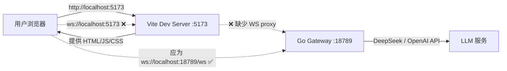
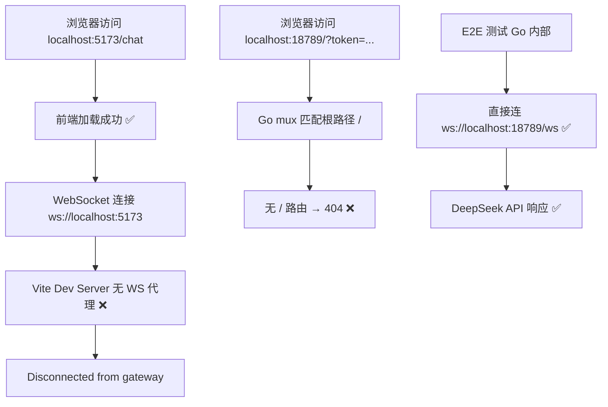

# 网关连通性审计报告

**日期**: 2026-02-17  
**现象**: 前端显示 "Disconnected from gateway" + `localhost:18789/?token=...` 返回 404

---

## 端口架构说明

开发模式下存在**两个独立服务**，各有自己的端口，这是正常设计：

| 端口 | 服务 | 用途 | 访问方式 |
|------|------|------|----------|
| **5173** | Vite 前端开发服务器 | 提供 HTML/JS/CSS 页面 | 浏览器访问 `http://localhost:5173` ✅ |
| **18789** | Go 后端网关 | WebSocket API + REST API | 前端通过 WS 连接，不直接浏览器访问 |

> [!NOTE]
> 用户应访问 **5173**（前端）而非 18789（后端裸 API）。`localhost:18789/?token=...` 返回 404 是因为后端没有前端页面，这在双端口架构下是正常的。  
> 真正的问题是：**前端（5173）无法连接到后端（18789）的 WebSocket**，缺少端口间的桥接。



---

## 问题 1: 前端 WebSocket "Disconnected from gateway"

### 根因: 前端 WebSocket 连接的目标 URL 错误

**连接链路**:

```
storage.ts:22-23  →  app-gateway.ts:127  →  gateway.ts:142
```

**前端默认 `gatewayUrl` 的计算逻辑** (`ui/src/ui/storage.ts:21-24`):

```typescript
const defaultUrl = (() => {
  const proto = location.protocol === "https:" ? "wss" : "ws";
  return `${proto}://${location.host}`; // → "ws://localhost:5173"
})();
```

- 前端在 `localhost:5173` (Vite 开发服务器) 上运行
- `location.host` = `localhost:5173`
- 因此 `gatewayUrl` = **`ws://localhost:5173`** ← ❌ 应该是 `ws://localhost:18789/ws`

**但 `vite.config.ts` 没有配置 WebSocket proxy**:

```typescript
// vite.config.ts:35-39
server: {
  host: true,
  port: 5173,
  strictPort: true,
  // ❌ 缺少 proxy 配置将 /ws 代理到 localhost:18789
}
```

> [!IMPORTANT]
> 前端连接 `ws://localhost:5173`，但 Vite 不代理 WebSocket，导致连接失败。

### 可选修复方案

| 方案 | 改动点 | 适用场景 |
|------|--------|----------|
| **A. Vite proxy** | `vite.config.ts` 加 WS 代理 | 开发模式 |
| **B. 环境变量** | `.env` 设 `VITE_GATEWAY_URL=ws://localhost:18789/ws` | 开发模式 |
| **C. 手动设置** | 前端 Overview 页面手动填写 Gateway URL | 临时验证 |

---

## 问题 2: `localhost:18789/?token=...` 返回 404

### 根因: 网关没有根路径 `/` 的处理器

**`server.go:206-228`** 注册的路由:

| 路径 | 处理器 | 状态 |
|------|--------|------|
| `/health` | `GetHealthStatus` | ✅ 正常 |
| `/ws` | `HandleWebSocketUpgrade` | ✅ 正常 |
| `/hooks/` | `CreateGatewayHTTPHandler` | ✅ 正常 |
| `/ui/` | `http.FileServer` (仅在 ControlUIDir 非空时) | ⚠️ 见下 |
| **`/`** | **无** | ❌ **404** |
| **`/v1/chat/completions`** | **未暴露** (被嵌套在 `/hooks/` 内) | ❌ **404** |

**三个子问题**:

#### 2a. 根路径 `/` 没有处理器

`localhost:18789/?token=...` 访问 `/`，没有匹配任何路由 → 404。
Go `http.ServeMux` 不会自动把 `/` 兜底到 `/ui/`。

#### 2b. Control UI 静态文件未加载

`server.go:225-228`:

```go
if opts.ControlUIDir != "" {  // ControlUIDir 为空时不注册 /ui/
    fs := http.FileServer(http.Dir(opts.ControlUIDir))
    mux.Handle("/ui/", http.StripPrefix("/ui/", fs))
}
```

需要检查启动时 `GatewayServerOptions.ControlUIDir` 是否被正确设置。

#### 2c. `/v1/chat/completions` 路由被嵌套

`server.go:221-222`:

```go
hooksHandler := CreateGatewayHTTPHandler(httpCfg)  // 内含 /v1/chat/completions
mux.Handle("/hooks/", hooksHandler)                 // 只挂载在 /hooks/ 下
```

`CreateGatewayHTTPHandler` 内部注册了 `/v1/chat/completions`，但整个 handler 被挂到 `/hooks/` 子路径下，导致 OpenAI 兼容 API 无法从顶层访问。

---

## 问题总结



---

## 需要讨论的问题

1. **Vite proxy vs 独立 URL**: 开发模式下，前端应通过 Vite proxy 转发 WS，还是直接指向 `ws://localhost:18789/ws`？
2. **根路径 `/` 行为**: 是否应重定向到 `/ui/`？还是直接在 `/` 提供 Control UI？
3. **OpenAI API 路由**: `/v1/chat/completions` 是否需要暴露到顶层？（目前前端不用，但第三方工具可能需要）

---

## 全局审计发现（2026-02-17 补充）

### Issue 3: 🔴 WS Connect 协议帧类型不匹配（P0 关键）

**现象**: 前端连接网关后立即被断开，日志显示 `"expected connect frame"`

**根因**: 前端 `gateway.ts` 的 `sendConnect()` 通过 `this.request("connect", params)` 发送连接请求。而 `request()` 方法构造的帧格式为：

```json
{ "type": "req", "id": "...", "method": "connect", "params": {...} }
```

后端 `ws_server.go:118` 期望的首帧格式为：

```json
{ "type": "connect", "role": "operator", "scopes": [...], "auth": {...} }
```

**涉及文件**:

- `ui/src/ui/gateway.ts:262` — `void this.request<GatewayHelloOk>("connect", params)`
- `ui/src/ui/gateway.ts:339` — `request()` 方法生成 `{type: "req", ...}`
- `backend/internal/gateway/ws_server.go:118` — `if frameType != FrameTypeConnect`
- `backend/internal/gateway/protocol.go:250-253` — `FrameTypeRequest = "req"`, `FrameTypeConnect = "connect"`

**修复方案**: 在 `gateway.ts` 中新增 `sendRawConnect()` 方法，直接发送 `{type: "connect", ...params}` 格式的帧，而不是复用 `request()` 方法。

### Issue 4: 🔴 HTTP 路由嵌套 + nil 回调导致 panic（P0）

**现象**: `/v1/chat/completions` 返回 404；访问 `/hooks/` 路径触发 nil pointer panic

**根因**: `server.go:221-222` 将 `CreateGatewayHTTPHandler` 返回的 `http.ServeMux` 整体挂载到 `/hooks/` 路径下：

```go
hooksHandler := CreateGatewayHTTPHandler(httpCfg)
mux.Handle("/hooks/", hooksHandler)
```

但 `CreateGatewayHTTPHandler` 内部（`server_http.go:44-80`）自己注册了 `/hooks/`、`/v1/chat/completions`、`/health` 等路由。嵌套后实际生效路径变为 `/hooks/hooks/`、`/hooks/v1/chat/completions` — 外部无法按预期访问。

另外，`httpCfg`（第 217-220 行）未设置 `GetHooksConfig` 和 `GetAuth` 回调函数，均为 nil。调用 `cfg.GetHooksConfig()`（server_http.go:104）或 `cfg.GetAuth()`（openai_http.go:68）时会触发 nil pointer panic。

**涉及文件**:

- `backend/internal/gateway/server.go:217-222`
- `backend/internal/gateway/server_http.go:40-86`

**修复方案**:

1. 将 `CreateGatewayHTTPHandler` 内的路由直接注册到 `server.go` 的顶层 `mux` 上，去除嵌套
2. 填充 `GatewayHTTPHandlerConfig` 的 `GetHooksConfig` 和 `GetAuth` 回调

### Issue 5: 🟡 Stub 覆盖真实方法处理器（P1）

**现象**: `sessions.preview` 调用返回 `{ok:true, stub:true}` 而非真实数据

**根因**: `server.go` 先注册真实 handler（第 102 行 `sessions.preview`），后注册 `StubHandlers()`（第 122 行）。`StubHandlers()` 中包含 `sessions.preview`，由于 `RegisterAll` 是覆盖式写入 map，stub 覆盖了真实 handler。

**涉及文件**:

- `backend/internal/gateway/server.go:102,122`
- `backend/internal/gateway/server_methods_stubs.go:50`

**修复方案**: 从 `StubHandlers()` 中移除 `sessions.preview`。

### Issue 6: 🟡 根路径 `/` 无处理器（P2）

**现象**: 浏览器访问 `http://localhost:18789/` 返回 404

**根因**: `server.go` 的 `mux` 未注册 `/` 路径。Go `http.ServeMux` 对 `/` 无默认 fallback。

**修复方案**: 注册 `/` 路径，重定向到 `/ui/` 或返回欢迎 JSON。

### Issue 7: 🟡 connect 帧的 hello-ok 响应不进入 pending map（P1）

**现象**: 前端 `sendConnect()` 的 Promise 永远不 resolve（即使修复了 Issue 3）

**根因**: 后端 `ws_server.go:170` 发送的 `hello-ok` 帧格式为 `{type: "hello-ok", ...}`，不是 `{type: "res", id: ..., ok: true, ...}` 格式。前端 `handleMessage()` 中 `hello-ok` 不匹配 `type === "res"` 分支，因此 pending map 中对应的 Promise 永不消费。

**涉及文件**:

- `ui/src/ui/gateway.ts:292-331` — `handleMessage()` 只处理 `event` 和 `res` 两种 type
- `backend/internal/gateway/ws_server.go:167-186` — 发送 `{type: "hello-ok"}`

**修复方案**: 修复 Issue 3 后，connect 不再通过 `request()` 发送，而是直接发送 raw frame 并在 `handleMessage()` 中添加 `hello-ok` 分支。

### Issue 8: 🟡 Vite 开发服务器无 WS 代理配置（P2）

**现象**: 前端 `storage.ts:22-23` 使用 `location.host`（即 Vite 端口 5173）构造 WS URL，无法连接到网关端口 18789

**根因**: `vite.config.ts` 无 `/ws` 代理配置；`storage.ts` 默认 URL 指向当前页面 host

**修复方案**: 二选一：

1. 在 `vite.config.ts` 添加 `/ws` → `ws://localhost:18789/ws` 代理
2. 在 `storage.ts` 中硬编码开发模式默认 URL 为 `ws://localhost:18789/ws`

---

## 全局审计汇总

| # | 优先级 | 问题 | 状态 |
|---|--------|------|------|
| 1 | P1 | WS URL 指向 Vite 端口 | 已记录（原报告） |
| 2 | P2 | 根路径 `/` 返回 404 | 已记录（原报告） |
| 3 | **P0** | WS connect 协议帧类型不匹配 | 🆕 |
| 4 | **P0** | HTTP 路由嵌套 + nil 回调 panic | 🆕 |
| 5 | P1 | Stub 覆盖真实 `sessions.preview` | 🆕 |
| 6 | P2 | 根路径 `/` 无处理器 | 🆕（与 #2 合并） |
| 7 | P1 | hello-ok 不进入前端 pending map | 🆕 |
| 8 | P2 | Vite 无 WS 代理配置 | 🆕（与 #1 合并） |

**审计范围**: 30+ 文件，覆盖 `backend/internal/gateway/*`、`backend/cmd/*`、`ui/src/ui/*`、`ui/vite.config.ts`

**审计结论**: 发现 2 个 P0 阻断性问题（Issue 3、4），3 个 P1 功能性问题（Issue 1、5、7），3 个 P2 体验问题（Issue 2/6、8）。修复 Issue 3 + 4 是网关能正常工作的前提。
