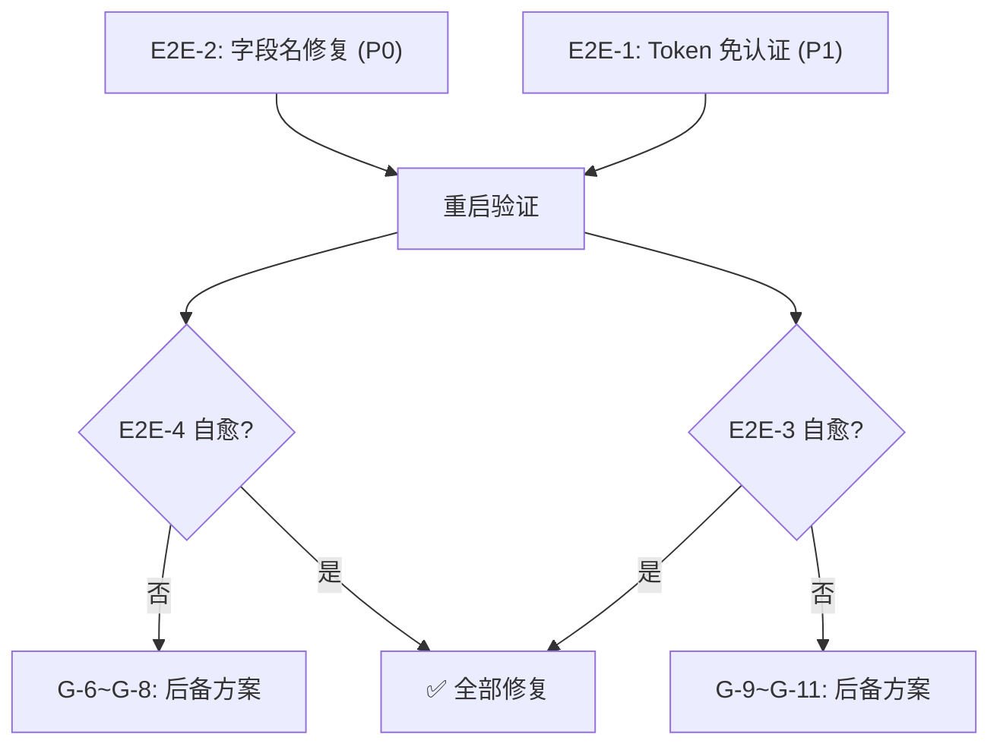

# 网关 E2E 修复 — 新窗口 Bootstrap

**创建日期**: 2026-02-17
**前置文档**:

- `docs/renwu/gateway-e2e-audit.md` — E2E 审计报告（4 个 Issue）
- `docs/renwu/gateway-fix-task.md` — 上一轮修复记录（Batch A-D ✅）
- `docs/renwu/gateway-e2e-fix-task.md` — 本轮修复任务清单

---

## 新窗口启动模板

> 复制以下内容到新窗口作为首条消息：

```
@/refactor 我需要修复网关 E2E 验证中发现的问题。请按以下步骤操作：

1. 读取 `docs/renwu/gateway-e2e-fix-bootstrap.md`（本文件）
2. 读取 `docs/renwu/gateway-e2e-fix-task.md`（任务清单）
3. 读取 `docs/renwu/gateway-e2e-audit.md`（审计报告）
4. 按任务清单中的 Batch E → F → G 顺序逐批修复
5. 每个 Batch 完成后运行验证命令
```

---

## 项目概况

- **后端**: Go，入口 `backend/cmd/acosmi/main.go`，核心在 `backend/internal/gateway/`
- **前端**: TypeScript/Lit，入口 `ui/src/ui/app.ts`，WS 客户端在 `ui/src/ui/gateway.ts`
- **网关端口**: 18789（可配置）
- **前端端口**: 5173（Vite dev server）
- **运行方式**:
  - 后端: `DEEPSEEK_API_KEY=xxx go run ./cmd/acosmi/` (`backend/` 目录)
  - 前端: `npm run dev` (`ui/` 目录)

---

## 当前问题摘要

| Issue | 严重度 | 问题 | 修复方案 | 关键文件 |
|-------|--------|------|---------|---------|
| E2E-2 | P0 | 聊天字段名不匹配 (`message` vs `text`) | 后端兼容读取 `message` | `server_methods_chat.go:174` |
| E2E-1 | P1 | Token 未自动传递 → 4008 断连 | 后端 localhost 免认证 | `auth.go:294-335` |
| E2E-4 | P1 | WS 频繁重连 (~15s) | E2E-1 修复后可能自愈 | `gateway.ts:164-170` |
| E2E-3 | P1 | 用户消息不在聊天框显示 | E2E-4 修复后可能自愈 | `chat.ts:92-99` |

---

## 关键文件速查

### 后端 — 本轮修改文件

| 文件 | 修改说明 |
|------|---------|
| `backend/internal/gateway/server_methods_chat.go` | Batch E: L174 增加 `message` 字段兼容 |
| `backend/internal/gateway/auth.go` | Batch F: `AuthorizeGatewayConnect` 增加 localhost 免认证 |
| `backend/internal/gateway/auth_test.go` | Batch F: 新增 localhost 免认证测试用例 |
| `backend/internal/gateway/ws_server.go` | Batch F: 确认 HTTP request 传递给 auth |

### 后端 — 参考文件（只读）

| 文件 | 用途 |
|------|------|
| `backend/internal/gateway/server.go` | 启动编排 |
| `backend/internal/gateway/server_methods_e2e_test.go` | 现有 E2E 测试模式 |
| `backend/internal/gateway/protocol.go` | 帧类型定义 |

### 前端 — 参考文件（只读）

| 文件 | 用途 |
|------|------|
| `ui/src/ui/gateway.ts` | WS 客户端 — 连接/重连逻辑 |
| `ui/src/ui/controllers/chat.ts` | 聊天发送 — L126-128 使用 `message` 字段 |
| `ui/src/ui/app-settings.ts` | URL 参数解析 — L92-106 已支持 `?token=` |
| `ui/src/ui/app-gateway.ts` | WS 连接管理 — `onHello` 回调 |
| `ui/src/ui/storage.ts` | 设置持久化 — token 存储 |

---

## 修复执行顺序

```
Batch E  →  Batch F  →  重启服务  →  Batch G (验证)
  ↓            ↓                          ↓
P0 字段修复  P1 Token修复             观察 E2E-4/E2E-3 是否自愈
(1行代码)   (~10行代码)              如未自愈 → G-6~G-11 后备方案
```

---

## 验证命令

每个 Batch 完成后：

```bash
# 后端编译 + 测试
cd backend && go build ./... && go vet ./... && go test -race ./internal/gateway/...

# 前端编译
cd ui && npx tsc --noEmit

# E2E 手动验证
# 1. 重启后端: DEEPSEEK_API_KEY=xxx go run ./cmd/acosmi/ 2>&1
# 2. 重启前端: npm run dev 2>&1
# 3. 浏览器访问 http://localhost:5173/
# 4. 检查控制台和后端日志
```

---

## 依赖关系图


