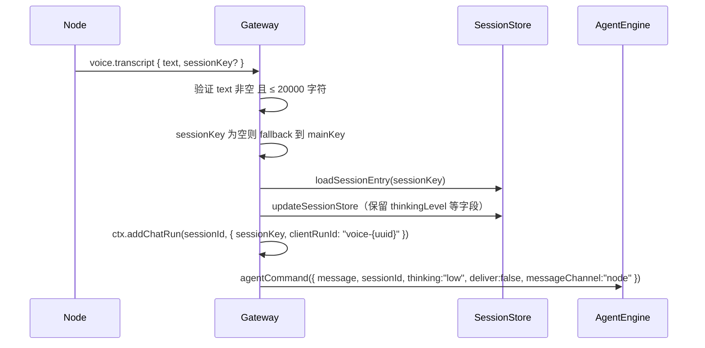

# handleNodeEvent 完整处理器 — 上下文参考文档

> 本文档为后续 Phase 移植提供完整上下文。Go 端目前仅实现了事件**解析器**，
> 缺失完整的业务逻辑处理。

---

## 一、TS 源码定位

- **文件**: `src/gateway/server-node-events.ts`
- **行数**: 249 行
- **入口函数**: `handleNodeEvent(ctx: NodeEventContext, nodeId: string, evt: NodeEvent)`

---

## 二、事件类型及处理逻辑

### 1. `voice.transcript`（语音转文字 → 触发 agent）



**关键依赖**:

- `loadConfig()` — 获取 `session.mainKey`
- `normalizeMainKey(cfg.session?.mainKey)` — mainKey 规范化
- `updateSessionStore(storePath, mutator)` — 持久化 session 变更
- `ctx.addChatRun()` — 注册 chat bus → webchat 映射

### 2. `agent.request`（深度链接 → 完整 agent 调用）

解析 `AgentDeepLink` 结构并调用 `agentCommand`：

| 字段 | 类型 | 说明 |
|------|------|------|
| `message` | string (必填) | 消息内容，≤20000 字符 |
| `sessionKey` | string? | 为空时 fallback 到 `node-{nodeId}` |
| `thinking` | string? | 思考级别覆盖 |
| `deliver` | boolean | 仅 channel 有效时为 true |
| `to` | string? | 发送目标（联系人） |
| `channel` | string? | 经 `normalizeChannelId` 规范化 |
| `timeoutSeconds` | number? | 转为字符串传递 |

**关键依赖**:

- `normalizeChannelId(raw)` — channel ID 规范化
- `agentCommand(opts, runtime, deps)` — agent 执行引擎
- `updateSessionStore()` — 同 voice.transcript

### 3. `chat.subscribe` / `chat.unsubscribe`（节点订阅会话事件）

**逻辑简洁**：

```typescript
// subscribe:
const sessionKey = obj.sessionKey.trim();
ctx.nodeSubscribe(nodeId, sessionKey);

// unsubscribe:
ctx.nodeUnsubscribe(nodeId, sessionKey);
```

**Go 待实现**：`NodeEventContext` 需添加 `NodeSubscribe` 和 `NodeUnsubscribe` 回调。

### 4. `exec.started` / `exec.finished` / `exec.denied`（命令执行生命周期）

**解析字段**:

| 字段 | exec.started | exec.finished | exec.denied |
|------|-------------|---------------|-------------|
| `sessionKey` | `node-{nodeId}` | `node-{nodeId}` | `node-{nodeId}` |
| `runId` | ✓ | ✓ | ✓ |
| `command` | ✓ | — | ✓ |
| `exitCode` | — | ✓ (number, isFinite) | — |
| `timedOut` | — | ✓ (boolean) | — |
| `output` | — | ✓ (trimmed) | — |
| `reason` | — | — | ✓ |

**构建系统事件文本**:

```typescript
// exec.started:
text = `Exec started (node=${nodeId}${runId ? ` id=${runId}` : ""})`;
if (command) text += `: ${command}`;

// exec.finished:
const exitLabel = timedOut ? "timeout" : `code ${exitCode ?? "?"}`;
text = `Exec finished (node=${nodeId}${runId ? ` id=${runId}` : ""}, ${exitLabel})`;
if (output) text += `\n${output}`;

// exec.denied:
text = `Exec denied (node=${nodeId}${runId ? ` id=${runId}` : ""}${reason ? `, ${reason}` : ""})`;
if (command) text += `: ${command}`;
```

**副作用**:

```typescript
enqueueSystemEvent(text, { sessionKey, contextKey: runId ? `exec:${runId}` : "exec" });
requestHeartbeatNow({ reason: "exec-event" });
```

---

## 三、Go 端现状与缺口

### 已实现（`events.go`）

| 解析器 | 对应事件 | 状态 |
|--------|---------|------|
| `ParseVoiceTranscript` | `voice.transcript` | ✅ 正确 |
| `ParseAgentRequest` | `agent.request` | ✅ 正确 |
| `ParseSystemContext` | `system.context` | ✅ 正确（TS 中无此事件处理，但解析器有效） |
| `ParseAgentUpdate` | `agent.update` | ✅ 正确（TS 中无此事件处理） |
| `ParseHealthPing` | `health.ping` | ✅ 正确（TS 中无此事件处理） |

### 缺失：完整 handler 主体

需要实现一个 `HandleNodeEvent` 函数，在 `NodeEventDispatcher` 中注册，调用解析器后执行副作用：

```go
// 伪代码 - 待实现
func HandleNodeEvent(ctx *NodeEventContext, nodeID string, evt *NodeEvent) error {
    switch evt.Event {
    case "voice.transcript":
        text, sessionKey, err := ParseVoiceTranscript(evt.PayloadJSON)
        if err != nil { return nil } // 静默忽略
        // 1. 解析 mainKey
        // 2. loadSessionEntry
        // 3. updateSessionStore
        // 4. ctx.AddChatRun(...)
        // 5. agentCommand(...)
    case "agent.request":
        link, err := ParseAgentRequest(evt.PayloadJSON)
        // ...
    case "chat.subscribe":
        // ParseSubscription → ctx.NodeSubscribe
    case "chat.unsubscribe":
        // ParseSubscription → ctx.NodeUnsubscribe
    case "exec.started", "exec.finished", "exec.denied":
        // 解析 → 构建文本 → enqueueSystemEvent → requestHeartbeatNow
    }
    return nil
}
```

---

## 四、依赖清单

| 依赖 | Go 位置 | 状态 |
|------|---------|------|
| `ConfigLoader` (loadConfig) | `internal/config` | ✅ 已有 |
| `SessionStore` (loadSessionEntry) | `internal/gateway/sessions.go` | ✅ 已有 |
| `SessionStore.UpdateStore` | `internal/config` | ❌ 需实现（持久化 mutator） |
| `AgentCommand` | `internal/agent` | ❌ Phase 4 实现 |
| `SystemEventQueue` (enqueueSystemEvent) | `internal/infra` | ✅ 已有 |
| `HeartbeatWaker` (requestHeartbeatNow) | `internal/gateway/heartbeat_wake.go` | ✅ 已有 |
| `ChannelNormalizer` (normalizeChannelId) | `internal/channels` | ❌ 需实现 |

---

## 五、`NodeEventContext` 需扩展

当前 Go 定义：

```go
type NodeEventContext struct {
    ChatState *ChatRunState
    Logger    func(format string, args ...interface{})
}
```

需扩展为：

```go
type NodeEventContext struct {
    ChatState       *ChatRunState
    Logger          func(format string, args ...interface{})
    AddChatRun      func(sessionID string, entry ChatRunEntry)
    NodeSubscribe   func(nodeID, sessionKey string)
    NodeUnsubscribe func(nodeID, sessionKey string)
    Deps            interface{} // AgentCommand 需要的依赖
}
```

---

## 六、时序注意事项

1. **`voice.transcript` 中的 ChatRun 注册必须在 `agentCommand` 之前**，确保 agent 事件能正确映射到 webchat
2. **`exec.*` 事件的 `enqueueSystemEvent` 是同步的**，`requestHeartbeatNow` 是异步唤醒
3. **所有事件的 error 均被静默吞掉**（TS 中 `.catch(err => log.warn(...))`）
