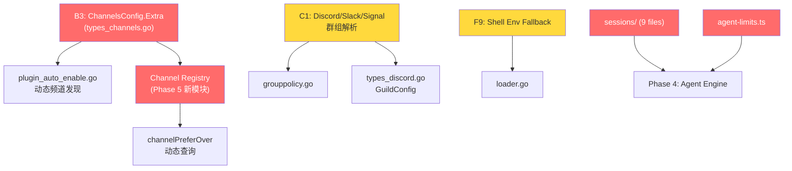

# Phase 1 → Phase 4-5 上下文 (Config 层遗留待办)

> **生成时间**: 2026-02-12T21:49 | **来源**: Phase 1 Post-Fix 审计
> **目的**: 为新会话窗口提供 Phase 4-5 中 config 模块剩余待办的完整上下文

---

## 一、Phase 1 已完成总结

Phase 1 聚焦 `backend/internal/config/` 与 `src/config/` 的逻辑 100% 继承。经过两轮深度审计 + 修复，**所有可在 Phase 1 范围内修复的问题均已解决**：

| 轮次 | 修复数 | 关键修复 |
|------|--------|----------|
| 第一轮 | 9 项 | A1 cacheRetention 注入、A2 logging nil 对齐、A4 session.mainKey 警告、B1 偏好冲突检测、B2 accounts 子对象检测、C1 Telegram 群组解析、D1 Config 脱敏、D2 regex 优化、B5/E1 死代码删除 |
| 第二轮 | 11 项 | F1-F3 删除多余默认值、F4 ReadConfigFileSnapshot defaults 链、F5-F8 管道辅助函数、F10 normalizeConfigPaths 顺序、F12 writeConfigFile 对齐、F13 ttl 条件修正 |

**验证**: `go build ./...` ✅ + `go test ./internal/config/...` ✅

---

## 二、遗留待办 (Phase 4-5 范围)

### 待办 1: F9 — Shell Env Fallback

| 项 | 详情 |
|----|------|
| **TS 来源** | [io.ts:217-225, 299-308](file:///Users/fushihua/Desktop/Claude-Acosmi/src/config/io.ts#L217-L225) — `loadShellEnvFallback()` |
| **Go 现状** | 无对应实现。`shellenv.go` 仅处理 `$()` 扩展 |
| **影响** | macOS/Linux 用户的 `PATH`/`API keys` 可能仅在 login shell 中设置，不走 shell env fallback 会导致找不到这些变量 |
| **实现方案** | 需要 `exec` login shell (`bash -l -c env` 或 `zsh -l -c env`) 并解析输出，注入到 `os.Environ` |
| **依赖** | 无前置依赖，可独立实现 |
| **建议阶段** | Phase 5 |

---

### 待办 2: B3 — ChannelsConfig Extra 字段

| 项 | 详情 |
|----|------|
| **位置** | [plugin_auto_enable.go:364-366](file:///Users/fushihua/Desktop/Claude-Acosmi/backend/internal/config/plugin_auto_enable.go#L364-L366) |
| **TS 行为** | TS `resolveConfiguredPlugins` 从 `cfg.channels` 对象的 **所有 keys** 动态发现自定义频道（如 `matrix`, `line` 等第三方插件频道） |
| **Go 现状** | `ChannelsConfig` 是强类型 struct，没有 `Extra` 字段，只能硬编码已知频道列表 |
| **影响** | 用户添加的自定义频道插件不会被 `resolveConfiguredPlugins` 发现，无法自动启用 |

**修复方案**:

```go
// types_channels.go
type ChannelsConfig struct {
    Telegram *TelegramConfig    `json:"telegram,omitempty"`
    Discord  *DiscordConfig     `json:"discord,omitempty"`
    Slack    *SlackConfig       `json:"slack,omitempty"`
    WhatsApp *WhatsAppConfig    `json:"whatsapp,omitempty"`
    Signal   *SignalConfig      `json:"signal,omitempty"`
    // Phase 5: 自定义频道支持
    Extra    map[string]interface{} `json:"-"` // 需要自定义 UnmarshalJSON
}
```

需要实现 `UnmarshalJSON` 将已知字段反序列化到各具名字段，未知字段收集到 `Extra`。

**依赖**: `pkg/types/types_channels.go` 修改 → 影响所有使用 `ChannelsConfig` 的代码

**建议阶段**: Phase 5

---

### 待办 3: C1 — Discord/Slack/Signal 群组解析

| 项 | 详情 |
|----|------|
| **位置** | [grouppolicy.go:164-167](file:///Users/fushihua/Desktop/Claude-Acosmi/backend/internal/config/grouppolicy.go#L164-L167) |
| **Go 现状** | `resolveChannelGroups` 仅实现了 Telegram，Discord/Slack/Signal 走 `default: return nil` |
| **TS 行为** | TS 版 `resolveChannelGroups` 同样主要实现 Telegram，其他频道的群组结构各不相同 |

**实现要点**:

| 频道 | 群组结构 | 复杂度 |
|------|----------|--------|
| **Discord** | `Guilds` (不叫 Groups)，`DiscordGuildConfig` 含 `GroupPolicy` | 中等 — 需要映射 Guild → ChannelGroup |
| **Slack** | `Workspaces`，无 Groups 概念 | 低 — 可能不需要 |
| **Signal** | 无 Accounts 结构 | 低 — 可能不需要 |

**依赖**: 需要 `types_discord.go` 中 `DiscordGuildConfig` 的 `GroupPolicy` 字段

**建议阶段**: Phase 5

---

### 待办 4: channelPreferOver 动态查询

| 项 | 详情 |
|----|------|
| **位置** | [plugin_auto_enable.go:432-437](file:///Users/fushihua/Desktop/Claude-Acosmi/backend/internal/config/plugin_auto_enable.go#L432-L437) |
| **Go 现状** | `channelPreferOver` 是空的硬编码 map（架构已就位，但无数据） |
| **TS 行为** | TS 版通过 `getChatChannelMeta(channelId).preferOver` 动态查询频道注册表 |
| **影响** | 当前无影响（map 为空），但如果频道插件定义了 `preferOver` 关系，Go 版不会检测到 |

**修复方案**: 需要频道注册表（Channel Registry）— 一个统一的频道元数据查询接口：

```go
type ChannelMeta struct {
    ID         string
    Label      string
    PreferOver []string // 此频道优先于哪些频道
}

// ChannelRegistry 频道注册表接口
type ChannelRegistry interface {
    GetChannelMeta(channelID string) *ChannelMeta
    ListChannels() []ChannelMeta
}
```

**依赖**: 频道插件系统 (Phase 5 核心)

**建议阶段**: Phase 5

---

### 待办 5: F14 — 18 个 TS-only 模块

以下 TS 模块在 `src/config/` 中存在但 Go `internal/config/` 无对应实现：

| TS 模块 | 行数 | 功能 | 建议阶段 | 优先级 |
|---------|------|------|----------|--------|
| `sessions/` (9 files) | ~500 | 会话管理 (key 解析、存储、恢复) | **Phase 4** | 🔴 高 |
| `agent-limits.ts` | ~30 | Agent ContextTokens/Timeout 常量 | **Phase 4** | 🔴 高 |
| `port-defaults.ts` | 44 | 端口派生 (bridge/browser/canvas) | **Phase 4** | 🟡 中 |
| `logging.ts` | ~60 | 日志管理 (log 旋转、格式化) | **Phase 4** | 🟡 中 |
| `cache-utils.ts` | ~40 | 配置缓存工具 | Phase 5 | 🟠 低 |
| `channel-capabilities.ts` | 74 | 频道能力解析 | Phase 5 | 🟡 中 |
| `commands.ts` | 65 | 原生命令启用判断 | Phase 5 | 🟠 低 |
| `talk.ts` | ~100 | Talk API 会话管理 | Phase 5 | 🟠 低 |
| `merge-config.ts` | 39 | 配置合并工具 | Phase 5 | 🟠 低 |
| `merge-patch.ts` | ~30 | JSON Merge Patch | Phase 5 | 🟠 低 |
| `telegram-custom-commands.ts` | ~80 | TG 自定义命令解析 | Phase 5 | 🟠 低 |

> [!IMPORTANT]
> `sessions/` 和 `agent-limits.ts` 是 **Phase 4 (Agent Engine) 的前置依赖**。Agent Engine 需要会话管理来跟踪对话状态，需要 agent-limits 常量来设置运行时默认值（这些常量之前被 F1 从 config defaults 层移除，需要在 Agent Engine 层重新注入）。

---

## 三、Go Config 模块当前文件清单

```
backend/internal/config/
├── agentdirs.go          ✅ 完整
├── agentdirs_test.go     ✅
├── configpath.go         ✅ 完整
├── configpath_test.go    ✅
├── defaults.go           ✅ 完整 (TS 对齐)
├── defaults_test.go      ✅
├── config_test.go        ✅
├── envsubst.go           ✅ 完整
├── envsubst_test.go      ✅
├── grouppolicy.go        ⚠️  Telegram only (TODO: C1)
├── grouppolicy_test.go   ✅
├── includes.go           ✅ 完整
├── includes_test.go      ✅
├── legacy.go             ✅ 完整
├── legacy_migrations.go  ✅ 完整
├── legacy_migrations2.go ✅ 完整
├── loader.go             ✅ 完整 (F4-F8/F10/F12 已修复)
├── normpaths.go          ✅ 完整
├── normpaths_test.go     ✅
├── overrides.go          ✅ 完整
├── overrides_test.go     ✅
├── paths.go              ✅ 完整
├── paths_test.go         ✅
├── plugin_auto_enable.go ⚠️  B3/channelPreferOver TODO
├── plugin_auto_enable_test.go ✅
├── redact.go             ✅ 完整
├── redact_test.go        ✅
├── schema.go             ✅ 完整
├── validator.go          ✅ 完整
├── validator_test.go     ✅
├── version.go            ✅ 完整
└── version_test.go       ✅
```

---

## 四、关键 TS ↔ Go 类型映射

| TS 类型/字段 | Go 类型/字段 | 所在文件 |
|-------------|-------------|----------|
| `TelegramConfig.accounts` | `TelegramConfig.Accounts map[string]*TelegramAccountConfig` | `types_telegram.go` |
| `TelegramAccountConfig.groups` | `TelegramAccountConfig.Groups map[string]*TelegramGroupConfig` | `types_telegram.go` |
| `DiscordConfig.accounts` | `DiscordConfig.Accounts map[string]*DiscordAccountConfig` | `types_discord.go` |
| `DiscordGuildConfig` | `DiscordGuildConfig` (含 GroupPolicy) | `types_discord.go` |
| `OpenAcosmiConfig.meta` | `OpenAcosmiConfig.Meta *OpenAcosmiMeta` | `types_openacosmi.go` |
| `config.channels` (dynamic keys) | `ChannelsConfig` (强类型, **无 Extra**) | `types_channels.go` |

---

## 五、修复依赖关系图



---

## 六、Phase 4 前置检查清单

在开始 Phase 4 (Agent Engine) 前，确认以下 config 层依赖已就绪：

- [x] `ApplyDefaults` 仅注入 TS 对齐的默认值 (maxConcurrent, subagents.maxConcurrent)
- [x] `applyContextPruningDefaults` 正确处理 Anthropic auth mode
- [x] `ReadConfigFileSnapshot` 返回带 defaults 的完整 config
- [x] `stampConfigVersion` 在写入时注入版本信息
- [ ] **sessions/ 模块** — Phase 4 需要实现
- [ ] **agent-limits 常量** — 需要在 Agent Engine 层定义（不在 config defaults）
