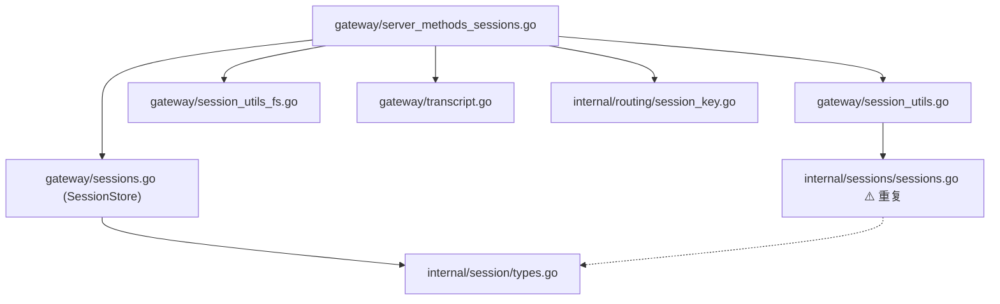

# Phase 11 — 模块 B: 会话管理审计报告

> **生成时间**: 2026-02-17
> **引导文档**: [phase11-session-mgmt-bootstrap.md](file:///Users/fushihua/Desktop/Claude-Acosmi/docs/renwu/phase11-session-mgmt-bootstrap.md)
> **范围**: 会话存储、键归一化、转录文件 I/O、RPC 处理器

---

## 1. 概要

Go 会话管理移植**功能不完整**。RPC 处理器与转录文件 I/O 移植质量良好，但**存储层**是关键缺口：Go 使用易失性内存 map，TS 使用磁盘 JSON + 文件锁 + TTL 缓存。多项键归一化与多 agent 合并函数完全缺失。

| 类别 | 状态 | 严重性 |
|------|------|--------|
| 存储模型（磁盘持久化） | ❌ 缺失 | **P0 关键** |
| `resolveSessionStoreKey` | ❌ 缺失 | **P1 高** |
| `loadCombinedSessionStoreForGateway` | ❌ 缺失 | **P1 高** |
| `sessions.patch` 字段覆盖 | ⚠️ 不全 | **P1 高** |
| `sessions.list` 模型解析 | ⚠️ 缺失 | **P2 中** |
| `sessions.resolve` 键归一化 | ⚠️ 简化 | **P2 中** |
| `sessions.compact` | ✅ 已实现 | — |
| 转录文件 I/O | ✅ 完整 | — |
| 类型定义 (`SessionEntry`) | ✅ 完整 | — |
| 工具函数（标题、头像、键分类） | ✅ 完整 | — |

---

## 2. 文件映射

### TS 源 → Go 目标

| TS 文件 | 行数 | Go 文件 | 行数 | 覆盖率 |
|---------|------|---------|------|--------|
| `config/sessions/store.ts` | 495 | `gateway/sessions.go` | 121 | **25%** — 磁盘 I/O、锁、缓存全部缺失 |
| `config/sessions/types.ts` | 169 | `session/types.go` | 150 | **95%** — 字段齐全 |
| `gateway/session-utils.ts` | 734 | `gateway/session_utils.go` + `session_utils_types.go` | 279+140 | **60%** — 键归一化、合并存储、模型解析缺失 |
| `gateway/session-utils.fs.ts` | 454 | `gateway/session_utils_fs.go` + `transcript.go` | 509+319 | **90%** — 移植良好 |
| `routing/session-key.ts` | ~263 | `routing/session_key.go` | 449 | **95%** — 全面移植 |
| TS RPC 处理器 (`sessions.ts`) | ~500 | `gateway/server_methods_sessions.go` | 657 | **75%** — 全部处理器存在，行为差异见下方 |

---

## 3. 关键发现

### 3.1 存储模型不匹配 (P0)

> [!CAUTION]
> Go `SessionStore` 为纯内存实现，进程重启后所有会话数据丢失。

**TS 实现** (`store.ts`):

- `loadSessionStore()` — 从磁盘读取 JSON 文件，TTL 缓存（45 秒），基于 mtime 失效
- `saveSessionStore()` — 原子写入（Unix 上 tmp+rename，Windows 直写），0o600 权限
- `withSessionStoreLock()` — 基于文件的建议锁 + 过期锁驱逐（30 秒）
- `updateSessionStore()` — 锁内读-改-写
- `normalizeSessionStore()` — 加载时迁移投递字段
- 遗留字段迁移（`provider→channel`、`room→groupChannel`）

**Go 实现** (`sessions.go`):

- `SessionStore` — `sync.RWMutex` + `map[string]*SessionEntry`
- `NewSessionStore()` — 启动时为空
- `Save()`/`LoadSessionEntry()`/`List()`/`Delete()`/`Count()`/`Reset()` — 全部仅内存
- **无磁盘 I/O、无缓存、无锁、无迁移**

**影响**: 通过 RPC 创建的会话仅在进程生命周期内存在。缺少多进程安全性。Go 网关无法在崩溃或重启后恢复会话状态。

### 3.2 缺失 `resolveSessionStoreKey` (P1)

TS `resolveSessionStoreKey()` (L354-386) 执行：

1. 去空格 + 特殊键检测（`global`、`unknown`）
2. 对 `agent:` 前缀键调用 `parseAgentSessionKey()`
3. 通过 `canonicalizeMainSessionAlias()` 处理主/默认会话别名
4. 为裸键添加 `agent:<defaultAgentId>:` 前缀

Go 无等效函数。`handleSessionsResolve` 使用 `store.ResolveMainSessionKey()`，仅检查条目是否有 `MainKey` 字段 — **不做**键归一化、agent 前缀注入或主会话别名处理。

### 3.3 缺失 `loadCombinedSessionStoreForGateway` (P1)

TS `loadCombinedSessionStoreForGateway()` (L471-512) 将多个 agent 域的存储合并为统一视图。`sessions.list` 必须跨所有 agent 展示会话。Go 的 `handleSessionsList` 从单一扁平内存存储读取，跳过了 per-agent 存储合并逻辑。

### 3.4 `sessions.patch` 字段缺失 (P1)

Go `handleSessionsPatch` 可修改 8 个字段，TS 可修改至少 15 个：

| 字段 | Go | TS |
|------|----|----|
| `displayName` | ✅ | ✅ |
| `label` | ✅ | ✅ |
| `contextTokens` | ✅ | ✅ |
| `modelOverride` | ✅ | ✅ |
| `providerOverride` | ✅ | ✅ |
| `sendPolicy` | ✅ | ✅ |
| `thinkingLevel` | ✅ | ✅ |
| `responseUsage` | ✅ | ✅ |
| `verboseLevel` | ❌ | ✅ |
| `reasoningLevel` | ❌ | ✅ |
| `elevatedLevel` | ❌ | ✅ |
| `ttsAuto` | ❌ | ✅ |
| `groupActivation` | ❌ | ✅ |
| `subject` | ❌ | ✅ |
| `queueMode` | ❌ | ✅ |

### 3.5 `sessions.list` 功能缺失 (P2)

| 功能 | Go | TS |
|------|----|----|
| 每会话模型解析 | ❌ 使用原始 override 字段 | ✅ `resolveSessionModelRef()` 带 agent 默认值回退 |
| 投递上下文归一化 | ❌ | ✅ `normalizeSessionDeliveryFields()` |
| 群组键 `displayName` 回退 | ❌ | ✅ `buildGroupDisplayName()` 多级回退链 |
| Origin label 回退 | ❌ | ✅ `displayName → label → originLabel` 回退 |

### 3.6 `sessions.resolve` 简化 (P2)

- **TS**: 调用 `resolveSessionStoreKey()` → 完整归一化、主会话别名解析、agent 前缀注入
- **Go**: 调用 `store.ResolveMainSessionKey()` → 仅检查 `entry.MainKey` 字段

### 3.7 `SessionEntry` 类型重复

`SessionEntry` 在两个 Go 包中存在，且字段集不同：

- `internal/session/types.go` — 完整结构体（40+ 字段），通过 `gateway/sessions.go` 别名引用
- `internal/sessions/sessions.go` — 精简结构体（5 字段：`SessionID`、`DisplayName`、`Subject`、`ChatType`、`UpdatedAt`）

`internal/sessions` 包重复了 `DeriveSessionTitle`、`ClassifySessionKey`、`ParseGroupKey`、`ParseAgentSessionKey`、`NormalizeMainKey`、`NormalizeAgentID` — 这些函数在 `gateway/session_utils.go` 或 `routing/session_key.go` 中已存在。

---

## 4. 隐藏依赖审计

### 4.1 全局可变状态

| 项目 | TS | Go | 风险 |
|------|----|----|------|
| `SESSION_STORE_CACHE` | 全局 `Map` + TTL | 不适用（无缓存） | **低** — 无缓存意味着无过期数据，但也无性能优化 |
| `SessionStore.sessions` | 不适用（磁盘） | 全局 `sync.RWMutex` map | **高** — 所有 goroutine 共享单一可变 map |

### 4.2 隐式配置依赖

- TS `loadSessionEntry()` 内部调用 `loadConfig()` — 隐式配置依赖
- Go 处理器通过 `ctx.Context.Config` 显式接收 — **更清晰的模式** ✅

### 4.3 文件系统副作用

| 操作 | TS | Go |
|------|----|----|
| 会话存储读写 | ✅ `readFileSync`/`writeFile` | ❌ 无 |
| 转录文件读写 | ✅ | ✅ 等效 |
| 归档文件 | ✅ | ✅ 等效 |
| 锁文件管理 | ✅ `storePath.lock` | ❌ 无 |

### 4.4 跨包耦合



> [!WARNING]
> `internal/sessions/sessions.go` 与 `internal/session/types.go` 和 `gateway/session_utils.go` 存在类型和函数重复。修改时需在多处同步，存在维护风险。

---

## 5. 行动项

### P0 — 发布前必须修复

| # | 项目 | 工作量 |
|---|------|--------|
| P0-1 | 为 `SessionStore` 实现磁盘持久化（启动时加载、变更时保存） | L |
| P0-2 | 添加基于文件的锁以确保并发访问安全 | M |

### P1 — 应当修复

| # | 项目 | 工作量 |
|---|------|--------|
| P1-1 | 在 Go 中实现完整的 `resolveSessionStoreKey()` | M |
| P1-2 | 实现 `loadCombinedSessionStoreForGateway()` 多 agent 存储合并 | M |
| P1-3 | 补充 `sessions.patch` 缺失的 7 个字段 | S |
| P1-4 | 合并 `internal/sessions/` → 移除重复，统一使用 `internal/session/` 类型 | S |

### P2 — 可优化

| # | 项目 | 工作量 |
|---|------|--------|
| P2-1 | `sessions.list` 添加模型解析 (`resolveSessionModelRef`) | S |
| P2-2 | `sessions.list` 添加投递上下文归一化 | S |
| P2-3 | `sessions.list` 添加 `buildGroupDisplayName` 回退 | S |
| P2-4 | `sessions.resolve` 使用完整键归一化 | S |
| P2-5 | 加载时添加遗留字段迁移 (`provider→channel`) | S |

### 延迟项

| # | 项目 | 原因 |
|---|------|------|
| D-1 | 会话存储 TTL 缓存（45 秒） | 性能优化，非正确性问题 |
| D-2 | `updateLastRoute()` / `recordSessionMetaFromInbound()` | 复杂投递上下文逻辑，依赖频道集成 |

---

## 6. 验证方案

### 自动化

```bash
go build ./...
go vet ./...
go test ./internal/gateway/... ./internal/session/... ./internal/sessions/... ./internal/routing/...
```

### 手动验证

- 启动 Go 网关 → 通过 RPC 创建会话 → 重启进程 → 验证会话是否持久化
- 测试多 agent 会话列表（per-agent 存储路径）
- 验证 `sessions.patch` 能接受 TS 支持的全部 15 个字段
- 对比 TS 与 Go 的 `sessions.resolve` 输出（裸键、`main`、`agent:` 前缀键）
