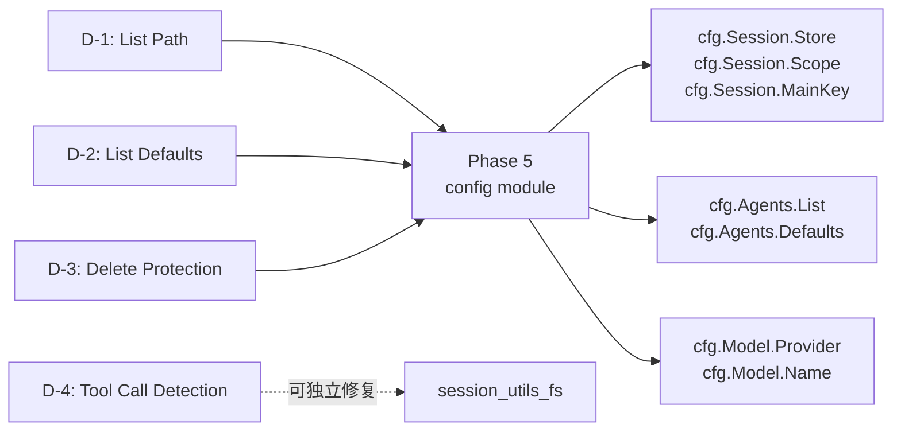

# Phase 3 → Phase 5 延迟项上下文

> 来源：Phase 3 Round 3 审计 | 共 4 项
> 用途：Phase 5 config 模块就绪后，按此文档完成 Phase 3 遗留修复

---

## 项目总览

| 编号 | 项目 | Go 文件 | 依赖模块 | 预估代码量 |
|------|------|---------|----------|-----------|
| D-1 | sessions.list `Path` 字段 | `server_methods_sessions.go` | config store | ~5 行 |
| D-2 | sessions.list `Defaults` 填充 | `server_methods_sessions.go` + `session_utils.go` | config model | ~30 行 |
| D-3 | sessions.delete 完整主 session 保护 | `server_methods_sessions.go` | config session | ~15 行 |
| D-4 | preview tool call 角色检测 | `session_utils_fs.go` | 无外部依赖 | ~25 行 |

---

## D-1: sessions.list `Path` 字段

### 问题

Go `SessionsListResult.Path` 始终返回空字符串。TS 返回实际的 store 文件路径。

### TS 源码参考

**文件**: [sessions.ts](file:///Users/fushihua/Desktop/Claude-Acosmi/src/gateway/server-methods/sessions.ts) L58-62

```typescript
const { storePath, store } = loadCombinedSessionStoreForGateway(cfg);
// ...
return { ts, path: storePath, count, sessions, defaults };
```

**`loadCombinedSessionStoreForGateway`**: [session-utils.ts](file:///Users/fushihua/Desktop/Claude-Acosmi/src/gateway/session-utils.ts) L471-512

```typescript
export function loadCombinedSessionStoreForGateway(cfg: OpenAcosmiConfig): {
  storePath: string;
  store: Record<string, SessionEntry>;
} {
  const storeConfig = cfg.session?.store;
  if (storeConfig && !isStorePathTemplate(storeConfig)) {
    const storePath = resolveStorePath(storeConfig);
    // ... 单 agent 模式：直接加载
    return { storePath, store: combined };
  }
  // 多 agent 模式：遍历所有 agentId 的 store 并合并
  const agentIds = listConfiguredAgentIds(cfg);
  for (const agentId of agentIds) {
    const storePath = resolveStorePath(storeConfig, { agentId });
    // ...
  }
  const storePath = typeof storeConfig === "string" && storeConfig.trim()
    ? storeConfig.trim() : "(multiple)";
  return { storePath, store: combined };
}
```

### Go 修复指引

当 Phase 5 config 提供 `cfg.Session.Store` 后：

```go
// 在 handleSessionsList 中
storePath := "(in-memory)" // 默认
if cfg := ctx.Context.Config; cfg != nil && cfg.Session != nil {
    storePath = cfg.Session.Store  // 或通过 resolveStorePath 解析
}
result := SessionsListResult{
    Path: storePath,
    // ...
}
```

---

## D-2: sessions.list `Defaults` 填充

### 问题

Go `GatewaySessionsDefaults` 始终返回空结构体 `{}`。TS 返回默认 model/provider/contextTokens。

### TS 源码参考

**文件**: [session-utils.ts](file:///Users/fushihua/Desktop/Claude-Acosmi/src/gateway/session-utils.ts) L514-529

```typescript
export function getSessionDefaults(cfg: OpenAcosmiConfig): GatewaySessionsDefaults {
  const resolved = resolveConfiguredModelRef({
    cfg,
    defaultProvider: DEFAULT_PROVIDER,   // "anthropic"
    defaultModel: DEFAULT_MODEL,         // "claude-sonnet-4-20250514"
  });
  const contextTokens =
    cfg.agents?.defaults?.contextTokens ??
    lookupContextTokens(resolved.model) ??
    DEFAULT_CONTEXT_TOKENS;              // 200000
  return {
    modelProvider: resolved.provider ?? null,
    model: resolved.model ?? null,
    contextTokens: contextTokens ?? null,
  };
}
```

### 依赖链

```
getSessionDefaults(cfg)
  └→ resolveConfiguredModelRef({ cfg, defaultProvider, defaultModel })
       └→ cfg.model (字符串) 或 cfg.model.name / cfg.model.provider
       └→ cfg.agents.defaults.model / cfg.agents.defaults.provider
  └→ lookupContextTokens(model)
       └→ 内置模型→token 映射表
```

### Go 修复指引

```go
// 新增到 session_utils.go
func GetSessionDefaults(cfg *config.OpenAcosmiConfig) GatewaySessionsDefaults {
    provider := "anthropic"  // DEFAULT_PROVIDER
    model := "claude-sonnet-4-20250514" // DEFAULT_MODEL
    contextTokens := 200000

    if cfg != nil {
        if cfg.Model != nil {
            if cfg.Model.Provider != "" { provider = cfg.Model.Provider }
            if cfg.Model.Name != "" { model = cfg.Model.Name }
        }
        if cfg.Agents != nil && cfg.Agents.Defaults != nil {
            if cfg.Agents.Defaults.ContextTokens > 0 {
                contextTokens = cfg.Agents.Defaults.ContextTokens
            }
        }
    }
    return GatewaySessionsDefaults{
        ModelProvider: provider,
        Model:         model,
        ContextTokens: &contextTokens,
    }
}
```

### Go 类型参考

Go 已定义 `GatewaySessionsDefaults` 在 [session_utils_types.go](file:///Users/fushihua/Desktop/Claude-Acosmi/backend/internal/gateway/session_utils_types.go)：

```go
type GatewaySessionsDefaults struct {
    ModelProvider string `json:"modelProvider,omitempty"`
    Model         string `json:"model,omitempty"`
    ContextTokens *int   `json:"contextTokens,omitempty"`
}
```

---

## D-3: sessions.delete 完整主 session 保护

### 问题

Go 当前仅硬编码保护 `global` 和 `unknown`。TS 通过 `resolveMainSessionKey(cfg)` 动态计算主 session key 并禁止删除。

### TS 源码参考

**delete handler**: [sessions.ts](file:///Users/fushihua/Desktop/Claude-Acosmi/src/gateway/server-methods/sessions.ts) L292-302

```typescript
const cfg = loadConfig();
const mainKey = resolveMainSessionKey(cfg);
const target = resolveGatewaySessionStoreTarget({ cfg, key });
if (target.canonicalKey === mainKey) {
  respond(false, undefined,
    errorShape(ErrorCodes.INVALID_REQUEST,
      `Cannot delete the main session (${mainKey}).`));
  return;
}
```

**`resolveMainSessionKey`**: [main-session.ts](file:///Users/fushihua/Desktop/Claude-Acosmi/src/config/sessions/main-session.ts) L11-24

```typescript
export function resolveMainSessionKey(cfg?: {
  session?: { scope?: SessionScope; mainKey?: string };
  agents?: { list?: Array<{ id?: string; default?: boolean }> };
}): string {
  if (cfg?.session?.scope === "global") {
    return "global";
  }
  const agents = cfg?.agents?.list ?? [];
  const defaultAgentId =
    agents.find((agent) => agent?.default)?.id ?? agents[0]?.id ?? DEFAULT_AGENT_ID;
  const agentId = normalizeAgentId(defaultAgentId);
  const mainKey = normalizeMainKey(cfg?.session?.mainKey);
  return buildAgentMainSessionKey({ agentId, mainKey });
}
```

**`buildAgentMainSessionKey`** 生成格式: `"agent:<agentId>:<mainKey||main>"`

### 依赖链

```
resolveMainSessionKey(cfg)
  └→ cfg.session.scope   → 如果 "global" 直接返回 "global"
  └→ cfg.agents.list     → 找 default agent 的 id
  └→ normalizeAgentId()  → 已在 Go 中实现
  └→ normalizeMainKey()  → 已在 Go 中实现
  └→ buildAgentMainSessionKey({ agentId, mainKey })
       └→ `agent:${agentId}:${mainKey || "main"}`
```

### Go 修复指引

```go
// 新增到 session_utils.go（Phase 5 config 就绪后）
func ResolveMainSessionKey(cfg *config.OpenAcosmiConfig) string {
    if cfg != nil && cfg.Session != nil && cfg.Session.Scope == "global" {
        return "global"
    }
    defaultAgentId := "default"  // DEFAULT_AGENT_ID
    if cfg != nil && cfg.Agents != nil {
        for _, a := range cfg.Agents.List {
            if a.Default { defaultAgentId = a.Id; break }
        }
        if defaultAgentId == "default" && len(cfg.Agents.List) > 0 {
            defaultAgentId = cfg.Agents.List[0].Id
        }
    }
    agentId := NormalizeAgentId(defaultAgentId)
    mainKey := NormalizeMainKey(cfg.Session.MainKey)
    if mainKey == "" { mainKey = "main" }
    return fmt.Sprintf("agent:%s:%s", agentId, mainKey)
}

// 在 handleSessionsDelete 中替换硬编码保护：
mainSessionKey := ResolveMainSessionKey(ctx.Context.Config)
if key == mainSessionKey {
    ctx.Respond(false, nil, NewErrorShape(ErrCodeBadRequest,
        fmt.Sprintf("Cannot delete the main session (%s).", mainSessionKey)))
    return
}
```

### 当前降级处理

Go 已硬编码保护 `global` 和 `unknown`，覆盖了 `scope=global` 的场景。当 `scope=per-sender`（默认）时，主 session key 格式为 `agent:xxx:main`，此 key **当前不受保护**。Phase 5 修复后将动态保护。

---

## D-4: preview tool call 角色检测

### 问题

Go `normalizePreviewRole` 仅基于 `role` 字段判断角色。TS 额外检测消息是否为 tool call，如果是则归类为 `"tool"` 而非 `"assistant"`。

### TS 源码参考

**`buildPreviewItems`**: [session-utils.fs.ts](file:///Users/fushihua/Desktop/Claude-Acosmi/src/gateway/session-utils.fs.ts) L335-377

```typescript
for (const message of messages) {
  const toolCall = isToolCall(message);          // ← 检测 tool call
  const role = normalizeRole(message.role, toolCall);
  let text = extractPreviewText(message);
  if (!text) {
    const toolNames = extractToolNames(message); // ← 提取工具名
    if (toolNames.length > 0) {
      const shown = toolNames.slice(0, 2);
      text = `call ${shown.join(", ")}`;         // ← 生成 "call foo, bar" 文本
      if (overflow > 0) text += ` +${overflow}`;
    }
  }
  if (!text) {
    text = extractMediaSummary(message);         // ← 提取媒体摘要
  }
  // ...
}
```

**`normalizeRole`**: L265-281

```typescript
function normalizeRole(role: string | undefined, isTool: boolean) {
  if (isTool) return "tool";   // ← 关键：tool call 消息归类为 "tool"
  // ...
}
```

**`isToolCall`** 检测逻辑（未直接在代码中找到独立函数，推测基于 content 数组中是否存在 `type: "tool_use"` 或 `type: "tool_call"` 的 entry）。

**`extractToolNames`** 从 content 数组中提取 tool 名称列表。

**`extractMediaSummary`**: L321-333

```typescript
function extractMediaSummary(message: TranscriptPreviewMessage): string | null {
  for (const entry of message.content) {
    const raw = entry.type.trim().toLowerCase();
    if (!raw || raw === "text" || raw === "toolcall" || raw === "tool_call") continue;
    return `[${raw}]`;   // 例如 "[image]", "[audio]"
  }
  return null;
}
```

### Go 修复指引

```go
// 在 session_utils_fs.go 中修改 buildPreviewItems

func isToolCall(msg transcriptMessage) bool {
    arr, ok := msg.Content.([]interface{})
    if !ok { return false }
    for _, item := range arr {
        m, ok := item.(map[string]interface{})
        if !ok { continue }
        typ, _ := m["type"].(string)
        typ = strings.ToLower(strings.TrimSpace(typ))
        if typ == "tool_use" || typ == "tool_call" || typ == "toolcall" {
            return true
        }
    }
    return false
}

func extractToolNames(msg transcriptMessage) []string {
    arr, ok := msg.Content.([]interface{})
    if !ok { return nil }
    var names []string
    for _, item := range arr {
        m, ok := item.(map[string]interface{})
        if !ok { continue }
        typ, _ := m["type"].(string)
        if strings.HasPrefix(strings.ToLower(typ), "tool") {
            name, _ := m["name"].(string)
            if name != "" { names = append(names, name) }
        }
    }
    return names
}

func extractMediaSummary(msg transcriptMessage) string {
    arr, ok := msg.Content.([]interface{})
    if !ok { return "" }
    for _, item := range arr {
        m, ok := item.(map[string]interface{})
        if !ok { continue }
        raw, _ := m["type"].(string)
        raw = strings.ToLower(strings.TrimSpace(raw))
        if raw == "" || raw == "text" || raw == "toolcall" || raw == "tool_call" {
            continue
        }
        return "[" + raw + "]"
    }
    return ""
}

// 修改 buildPreviewItems：
func buildPreviewItems(messages []transcriptMessage, maxItems, maxChars int) []SessionPreviewItem {
    var items []SessionPreviewItem
    for _, msg := range messages {
        isTool := isToolCall(msg)
        role := normalizePreviewRole(msg.Role)
        if isTool { role = "tool" }

        text := extractPreviewText(msg)
        if text == "" {
            toolNames := extractToolNames(msg)
            if len(toolNames) > 0 {
                shown := toolNames
                overflow := 0
                if len(shown) > 2 {
                    overflow = len(shown) - 2
                    shown = shown[:2]
                }
                text = "call " + strings.Join(shown, ", ")
                if overflow > 0 {
                    text += fmt.Sprintf(" +%d", overflow)
                }
            }
        }
        if text == "" { text = extractMediaSummary(msg) }
        if text == "" { continue }
        // ...
    }
}
```

> **注意**: D-4 实际不依赖 Phase 5 config，可随时修复（优先级 P3）。
> 之所以归类为延迟项，是因为对用户体验影响较小（仅 preview 角色标签差异）。

---

## 依赖关系图


