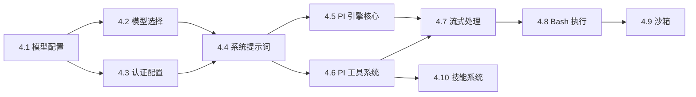

# Phase 4 启动上下文 — Agent 引擎移植

> 本文档为新对话窗口提供完整的 Phase 4 启动上下文，包含 Phase 1-3 的完成状态、
> Go 代码库现状、TS 源码结构、以及 Phase 4 的任务规划。

---

## 一、项目概览

**目标**: 将 Open Acosmi 后端从 TypeScript/Node.js 重构为 Go + Rust 分层架构。

**核心规范**: `skills/acosmi-refactor/SKILL.md` — 四步原子化重构（提取→分析→重写→验证）

**语言策略**: 中文交互/文档 + 英文代码标识符

**全局规划**: `docs/renwu/refactor-plan-full.md` (360L, 9 个 Phase, 43 个子任务)

---

## 二、Phase 1-3 完成状态

### Phase 1: 类型系统与配置 ✅

| 包 | 文件 | 测试 | 说明 |
|----|----|------|------|
| `internal/config` | 16 实现 | 13 测试 | Schema + Loader + Defaults + Validator + Legacy 迁移 |
| `pkg/types` | 基础类型 | — | 共享类型定义 |

**审计修复**: 10 项修复 + 22 新测试 → `docs/renwu/phase1-2-fix-report.md`

**延迟项**:

- `applyTalkApiKey` — 需 shell profile 读取
- Auth-mode heartbeat — 需 auth profile 解析

### Phase 2: 基础设施层 ✅

| 包 | 文件 | 说明 |
|----|------|------|
| `pkg/log` | 日志系统 | slog 封装 |
| `pkg/retry` | 重试+退避 | 指数退避策略 |
| `internal/infra` | 8 实现 + 4 测试 | ports, heartbeat(4), bonjour, discovery, system_events |
| `internal/outbound` | 3 实现 + 1 测试 | policy, send, session (15 频道解析器) |

### Phase 3: 网关核心层 ✅

| 包 | 文件 | 说明 |
|----|------|------|
| `internal/gateway` | 14 实现 + 10 测试 | auth, broadcast, chat, events, sessions, channels, tools, etc. |
| `internal/hooks` | 1 实现 + 1 测试 | 钩子系统 |
| `internal/sessions` | 1 实现 + 1 测试 | 会话工具 |
| `internal/channels` | 1 实现 + 1 测试 | 频道管理 |

**审计修复 (Phase 3.1)**: 14 项修复 → `docs/renwu/phase3-fix-report.md`

**深度审计修复 (Phase 3.2)**: 3 个 bug 修复:

1. `NormalizeVerboseLevel` — 映射对齐 TS (`"compact"→"on"`, unknown→`""`)
2. `ShouldSuppressHeartbeat` — 集成到广播路径
3. Buffer key — `sessionKey→runID` 修复并发覆盖

**未移植但已文档化的 handler**:

- `handleNodeEvent` 完整处理逻辑 → 详见 `docs/renwu/handleNodeEvent-context.md`
- 依赖 Phase 4 的 `AgentCommand` 才能实现

**架构再审计评级**: 并发安全 9/10, API 对齐 8/10, 代码健康 9/10

---

## 三、Go 代码库现状

### 目录结构

```
backend/
├── cmd/acosmi/main.go           # CLI 入口
├── bridge/
│   ├── inference/inference.go   # Rust 推理 FFI 桥接 (Phase 10+)
│   └── vision/vision.go        # Rust 视觉 FFI 桥接 (Phase 10+)
├── internal/
│   ├── agents/                  # ❌ 空目录 — Phase 4 目标
│   ├── autoreply/               # 空 — Phase 7
│   ├── browser/                 # 空 — Phase 7
│   ├── channels/                # ✅ 2 文件
│   ├── config/                  # ✅ 29 文件
│   ├── cron/                    # 空 — Phase 6
│   ├── daemon/                  # 空 — Phase 6
│   ├── gateway/                 # ✅ 24 文件
│   ├── hooks/                   # ✅ 2 文件
│   ├── infra/                   # ✅ 12 文件
│   ├── media/                   # 空 — Phase 7
│   ├── memory/                  # 空 — Phase 7
│   ├── ollama/                  # Phase 8
│   ├── outbound/                # ✅ 4 文件
│   ├── security/                # 空 — Phase 7
│   └── sessions/                # ✅ 2 文件
└── pkg/
    ├── log/                     # ✅ 日志
    ├── retry/                   # ✅ 重试
    ├── types/                   # ✅ 基础类型
    └── utils/                   # ✅ 工具函数
```

### 验证状态

```bash
go build ./...                 ✅
go vet ./...                   ✅
go test -race ./...            ✅ (15+ packages, 130+ tests)
```

---

## 四、Phase 4 目标: Agent 引擎

### TS 源码结构 (`src/agents/` — 233 文件)

```
src/agents/
├── auth-profiles/        # API Key 密钥管理
├── cli-runner/           # CLI 模式运行器
├── pi-embedded-helpers/  # PI 嵌入式辅助函数
├── pi-embedded-runner/   # PI 嵌入式引擎核心 (32 文件)
│   └── run/             # 运行循环
├── pi-extensions/        # PI 扩展
│   └── context-pruning/ # 上下文裁剪
├── sandbox/              # 沙箱系统 (17 文件)
├── schema/               # Agent 配置 Schema
├── skills/               # 技能系统 (13 文件)
├── test-helpers/         # 测试辅助
└── tools/                # 工具系统
```

### 关键 TS 文件（按大小排序）

| 文件 | 大小 | 职责 | Go 目标 |
|------|------|------|---------|
| `bash-tools.exec.ts` | 54KB | Bash 命令执行 | `internal/agents/exec/` |
| `system-prompt.ts` | 26KB | 系统提示词构建 | `internal/agents/prompt/` |
| `pi-embedded-subscribe.ts` | 22KB | 流式订阅处理 | `internal/agents/stream/` |
| `pi-tools.ts` | 17KB | 工具注册+调用 | `internal/agents/tools/` |
| `model-selection.ts` | ~10KB | 模型选择+降级 | `internal/agents/models/` |

### 子任务清单

| 编号 | 子任务 | 复杂度 | 建议优先级 |
|------|--------|--------|-----------|
| 4.1 | 模型配置与发现 | ⭐⭐⭐ | P1 (基础依赖) |
| 4.2 | 模型选择 & 失败切换 | ⭐⭐⭐⭐ | P1 |
| 4.3 | 认证配置 (auth-profiles) | ⭐⭐⭐⭐ | P1 |
| 4.4 | 系统提示词 | ⭐⭐⭐⭐ | P2 |
| 4.5 | PI 嵌入式引擎核心 | ⭐⭐⭐⭐⭐ | P2 (核心) |
| 4.6 | PI 工具系统 | ⭐⭐⭐⭐⭐ | P2 |
| 4.7 | PI 订阅 & 流式处理 | ⭐⭐⭐⭐⭐ | P2 |
| 4.8 | Bash 工具执行 | ⭐⭐⭐⭐⭐ | P3 |
| 4.9 | 沙箱系统 | ⭐⭐⭐⭐ | P3 |
| 4.10 | 技能系统 | ⭐⭐⭐ | P3 |

---

## 五、已知的跨 Phase 依赖

### Phase 4 需要的 Phase 3 接口

| 接口 | 位置 | 说明 |
|------|------|------|
| `AgentRunContextStore` | `gateway/agent_run_context.go` | 存储运行上下文 (IsHeartbeat, verboseLevel 等) |
| `SystemEventQueue` | `infra/system_events.go` | 入队系统事件 |
| `HeartbeatWaker` | `infra/heartbeat_wake.go` | 触发心跳（实例级，非全局） |
| `HeartbeatRunner` | `infra/heartbeat.go` | 心跳调度器（agent 状态管理、HEARTBEAT.md 读取） |
| `ChatRunState` | `gateway/chat.go` | 聊天状态管理 |
| `NormalizeVerboseLevel` | `gateway/chat.go` | verbose 映射: "off"\|"on"\|"full"\|"" |
| `OutboundSendService` | `outbound/send.go` | 出站消息发送（plugin-first + core fallback） |
| `SessionResolver` | `outbound/session.go` | 出站会话路由（15 频道解析器注册表） |
| `SessionStore` | `gateway/sessions.go` | 会话 CRUD |
| `ChannelRegistry` | `gateway/channels.go` | 频道配置 |

### Phase 4 需要的 Phase 1 接口

| 接口 | 位置 | 说明 |
|------|------|------|
| `ConfigLoader` | `config/loader.go` | 配置加载 |
| `Schema` 类型 | `config/schema.go` | Agent 配置结构体 |
| `ApplyDefaults` | `config/defaults.go` | 默认值填充 |

### Phase 4 完成后解锁的能力

- `handleNodeEvent` 可完整实现（需要 `AgentCommand`）
- Phase 9 端到端测试可执行
- 前端 UI 可发送消息并收到 AI 回复

---

## 六、并发模型参考

Phase 3 已建立的并发模式（Phase 4 应沿用）：

| 模式 | 用于 | 工具 |
|------|------|------|
| `sync.Mutex` | 独占写操作 | ChatRunRegistry, ToolRecipients |
| `sync.RWMutex` | 读多写少 | Broadcaster, ChannelRegistry, ConfigWatcher |
| `sync.Map` | 高并发无锁读写 | Buffers, DeltaSentAt, AgentRunContextStore |
| `atomic.Int64` | 单值计数器 | Broadcaster.seq |
| `time.AfterFunc` | 延迟/合并调度 | HeartbeatWaker |

---

## 七、文档索引

| 文档 | 路径 | 内容 |
|------|------|------|
| 技能规范 | `skills/acosmi-refactor/SKILL.md` | 四步原子化原则、目录结构、风险矩阵 |
| 全局重构计划 | `docs/renwu/refactor-plan-full.md` | 9 Phase、43 子任务、风险矩阵 |
| 重构顺序 | `skills/acosmi-refactor/references/refactor-order.md` | 模块依赖排序 |
| Gateway 架构 | `docs/gouji/gateway.md` | 网关模块详细架构 |
| Config 架构 | `docs/gouji/config.md` | 配置系统架构 |
| Phase 1-2 修复报告 | `docs/renwu/phase1-2-fix-report.md` | 10 项修复、22 新测试 |
| Phase 3 修复报告 | `docs/renwu/phase3-fix-report.md` | 14 项修复 |
| Phase 3 审计报告 | 当前对话 artifact | 能力缺口分析 |
| handleNodeEvent 上下文 | `docs/renwu/handleNodeEvent-context.md` | 6 种事件完整逻辑+依赖清单 |

---

## 八、Phase 4 代办规划

### 推荐执行顺序



### P1 批次（基础依赖，先行）

- [ ] **4.1 模型配置与发现** — `src/agents/models-config*.ts` → `internal/agents/models/config.go`
  - 解析 providers、model definitions、aliases
  - 依赖: `internal/config` (已完成)
  - 预估: ~300L Go

- [ ] **4.2 模型选择 & 失败切换** — `model-selection.ts`, `model-fallback.ts` → `internal/agents/models/selection.go`
  - 模型排名、fallback 链、cost-aware 选择
  - 依赖: 4.1
  - 预估: ~400L Go

- [ ] **4.3 认证配置** — `auth-profiles/`, `model-auth.ts` → `internal/agents/auth/`
  - API key 管理、provider 认证、env 变量解析
  - 依赖: `internal/config`
  - 预估: ~350L Go

### P2 批次（核心引擎）

- [ ] **4.4 系统提示词** — `system-prompt.ts` (26KB) → `internal/agents/prompt/`
  - 提示词模板、变量注入、上下文组装
  - 依赖: 4.1, 4.3
  - 预估: ~600L Go

- [ ] **4.5 PI 嵌入式引擎核心** — `pi-embedded-runner/` (32 文件) → `internal/agents/runner/`
  - 运行循环、多轮对话、context compaction
  - 依赖: 4.4, gateway chat
  - 预估: ~800L Go（最复杂）

- [ ] **4.6 PI 工具系统** — `pi-tools.ts` (17KB) → `internal/agents/tools/`
  - 工具注册、参数验证、调用编排
  - 依赖: 4.5
  - 预估: ~500L Go

- [ ] **4.7 PI 订阅 & 流式处理** — `pi-embedded-subscribe.ts` (22KB) → `internal/agents/stream/`
  - SSE/streaming、token 计数、中断处理
  - 依赖: 4.5, 4.6
  - 预估: ~550L Go

### P3 批次（扩展功能）

- [ ] **4.8 Bash 工具执行** — `bash-tools.exec.ts` (54KB!) → `internal/agents/exec/`
  - 命令执行、沙箱限制、输出捕获
  - 建议拆分 5+ 文件
  - 预估: ~700L Go

- [ ] **4.9 沙箱系统** — `sandbox/` (17 文件) → `internal/agents/sandbox/`
  - 文件系统隔离、资源限制、清理
  - 预估: ~400L Go

- [ ] **4.10 技能系统** — `skills/` (13 文件) → `internal/agents/skills/`
  - 技能定义、加载、执行
  - 预估: ~300L Go

### 里程碑检查点

| 节点 | 触发条件 | 验证内容 |
|------|---------|----------|
| M1 | P1 完成 | `go build ./internal/agents/models/... ./internal/agents/auth/...` ✅ |
| M2 | 4.5 完成 | 最小可运行引擎：config → model select → prompt → run loop |
| M3 | P2 完成 | 完整引擎：工具调用 + 流式输出端到端 |
| M4 | P3 完成 | Phase 4 关闭，解锁 Phase 5-9 |

### 已知风险

| 风险 | 缓解策略 |
|------|----------|
| `bash-tools.exec.ts` 54KB 巨文件 | 按功能域拆分：parse → validate → execute → capture → sandbox |
| PI Runner 流式处理复杂度 | 先实现同步版本，再加 streaming |
| LLM API 调用依赖外部服务 | 使用 interface mock，测试不依赖真实 API |
| 上下文窗口管理 | 沿用 Phase 3 的 `AgentRunContextStore` 模式 |

---

## 九、Phase 5~9 待执行总览

> 以下 Phase 均在 Phase 4 完成后解锁。详见 `docs/renwu/refactor-plan-full.md`。

### Phase 5: 通信频道适配器 (4 子任务)

| 编号 | 子任务 | 源 → 目标 | 复杂度 |
|------|--------|-----------|--------|
| 5.1 | 频道抽象层 | `channels/` (77 文件) → `internal/channels/` | ⭐⭐⭐ |
| 5.2 | Discord 适配器 | `discord/` (44 文件) → `internal/channels/discord/` | ⭐⭐⭐ |
| 5.3 | Slack 适配器 | `slack/` (43 文件) → `internal/channels/slack/` | ⭐⭐⭐ |
| 5.4 | 其余频道 | `telegram/`, `signal/`, `imessage/`, `line/`, `web/` | ⭐⭐⭐ |

### Phase 6: CLI 与命令系统 (4 子任务)

| 编号 | 子任务 | 源 → 目标 | 复杂度 |
|------|--------|-----------|--------|
| 6.1 | CLI 框架搭建 | `cli/program.ts` → `cmd/acosmi/main.go` (Cobra) | ⭐⭐⭐ |
| 6.2 | 核心命令 | `commands/configure.ts`, `status.ts` → `cmd/acosmi/commands/` | ⭐⭐⭐⭐ |
| 6.3 | 辅助命令 | `commands/doctor.ts`, `onboard*.ts` → `cmd/acosmi/commands/` | ⭐⭐⭐ |
| 6.4 | 定时任务 & 守护进程 | `cron/`, `daemon/` → `internal/cron/`, `internal/daemon/` | ⭐⭐⭐ |

### Phase 7: 辅助模块 (5 子任务)

| 编号 | 子任务 | 源 → 目标 | 复杂度 |
|------|--------|-----------|--------|
| 7.1 | 自动回复引擎 | `auto-reply/` (121 文件) → `internal/autoreply/` | ⭐⭐⭐⭐ |
| 7.2 | 记忆系统 | `memory/` (28 文件) → `internal/memory/` | ⭐⭐⭐⭐ |
| 7.3 | 安全模块 | `security/` (8 文件) → `internal/security/` | ⭐⭐⭐ |
| 7.4 | 浏览器自动化 | `browser/` (52 文件) → `internal/browser/` | ⭐⭐⭐⭐ |
| 7.5 | 媒体理解 & TTS | `media-understanding/`, `tts/` → `internal/media/` | ⭐⭐⭐ |

### Phase 8: Ollama 集成 + 补充模块 (2 子任务)

| 编号 | 子任务 | 输出 | 复杂度 |
|------|--------|------|--------|
| 8.1 | Ollama API 集成 | Go 端 Ollama API 客户端、模型管理 | ⭐⭐⭐ |
| 8.2 | 补充遗漏模块 | 第三轮审计发现的剩余模块 | ⭐⭐⭐ |
| 8.3 | Ollama Go 客户端 | `internal/ollama/` | ⭐⭐⭐ |

### Phase 9: 集成与验证 (3 子任务)

| 编号 | 子任务 | 说明 |
|------|--------|------|
| 9.1 | 前端↔Go 网关集成测试 | Go 后端 + Vite 前端，验证 API 兼容性 |
| 9.2 | 端到端功能测试 | 消息收发、Agent 对话、工具调用全链路 |
| 9.3 | 性能基准对比 | 内存、延迟、吞吐量与原版 Node.js 对比 |
