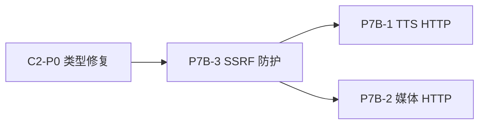

# Pre-Phase 9 延迟项清理 — Window C/D Bootstrap 上下文

> 创建时间：2026-02-15
> 前置：Window A ✅、Window B ✅
> **Window C ✅、Window D ✅** — 全部完成 (2026-02-15)

---

## 新窗口启动模板

在新窗口中粘贴以下内容即可恢复全部上下文：

```
@/refactor 执行 Pre-Phase 9 延迟项 Window C + Window D。

请先读取以下文件获取上下文：
1. docs/renwu/pre-phase9-bootstrap.md（本文件）
2. docs/renwu/deferred-items.md — 搜索 C2-P0、P7B-1、P7B-2、P7B-3
3. docs/gouji/agents.md — Agent 引擎架构
4. docs/gouji/autoreply.md — 自动回复引擎架构（含 ModelFallbackExecutor）

Window C 任务：
- C2-P0: MessagingToolSentTargets 类型不一致修复
- P7B-3: SSRF 防护集成

Window D 任务：
- P7B-1: TTS Provider HTTP 调用
- P7B-2: 媒体理解 Provider HTTP 调用
```

---

## Window C: 类型修复 + 安全 ✅ 已完成

### C2-P0: ~~MessagingToolSentTargets 类型不一致~~ ✅ 已修复

**问题**：Go 端 `EmbeddedPiRunResult.MessagingToolSentTexts` 是 `[]string`（仅文本），TS 端是结构化 `MessagingToolSend[]`。

**TS 类型定义**（`src/agents/pi-embedded-messaging.ts` L3-8）：

```typescript
type MessagingToolSend = {
  tool: string;
  provider: string;
  accountId?: string;
  to?: string;
};
```

**影响范围**：

- `matchesMessagingToolDeliveryTarget()`（`src/cron/isolated-agent/run.ts` L72）— 投递重复检测
- `pi-embedded-subscribe.ts` L69-198 — 收集 + 上限管理
- `reply-payloads.ts` L89 — 回复载荷构建
- `followup-runner.ts` L255 — 结果传播
- `agent-runner.ts` L417 — Agent 运行结果

**Go 需修改文件**：

| 文件 | 变更 |
|------|------|
| `runner/types.go` L63 | `MessagingToolSentTexts []string` → `MessagingToolSentTargets []MessagingToolSend` |
| `runner/types.go` | 新增 `MessagingToolSend` struct |
| `runner/run_attempt.go` L87 | 同步更新 `AttemptResult.MessagingSentTexts` |
| `autoreply/reply/model_fallback_executor.go` | 更新 `convertEmbeddedResult` 中的字段映射 |
| `autoreply/reply/agent_runner_payloads.go` | 更新 payload 构建逻辑 |

**验证**：`go build ./internal/agents/runner/... ./internal/autoreply/...` + `go test -race`

---

### ~~P7B-3: SSRF 防护集成~~ ✅ 已完成

**问题**：远程媒体下载缺少 SSRF 防护，`http.Get()` 直接请求外部 URL。

**Go 中的 TODO 位置**：

- `internal/media/fetch.go` L117 — `// TODO: 集成 SSRF 防护 (infra/net/ssrf)`
- `internal/media/input_files.go` L151 — `// TODO: 集成 SSRF 防护`

**TS 参考实现**（`src/infra/net/ssrf.ts` + `fetch-guard.ts`）：

- `SsrFPolicy` 类型 — 策略配置（允许/阻止规则）
- `SsrFBlockedError` — 阻止错误
- `fetchWithSsrFGuard()` — 带防护的 fetch（DNS pinning + 私有 IP 检测）
- `createPinnedLookup()` — DNS 固定查询（防止 DNS rebinding）
- `resolvePinnedHostname()` — 主机名解析 + 私有 IP 阻止

**Go 端无现有 SSRF 模块**。需新建：

| 文件 | 内容 |
|------|------|
| `internal/security/ssrf.go` **[NEW]** | `IsPrivateIP()` + `SafeFetch()` + `SsrfPolicy` |
| `internal/security/ssrf_test.go` **[NEW]** | 私有 IP 检测 + DNS rebinding 防护测试 |
| `internal/media/fetch.go` | 替换 `http.Get()` 为 `security.SafeFetch()` |
| `internal/media/input_files.go` | 同上 |

**关键逻辑**：

1. 解析 URL → 提取主机名
2. DNS 解析 → 检查解析后 IP 是否为私有/内网地址
3. 阻止 `10.x`, `172.16-31.x`, `192.168.x`, `127.x`, `::1`, `fd00::/8` 等
4. 阻止 `metadata.google.internal` 等云元数据端点
5. DNS pinning（可选，防 DNS rebinding）

---

## Window D: HTTP Provider 实现 ✅ 已完成

### ~~P7B-1: TTS Provider HTTP 调用~~ ✅ 已完成

**Go 骨架位置**：`internal/tts/synthesize.go`

**3 个 Provider 的 HTTP TODO**：

| Provider | API | HTTP 方法 | 端点 |
|----------|-----|-----------|------|
| OpenAI | Audio Speech | POST | `https://api.openai.com/v1/audio/speech` |
| ElevenLabs | Text-to-Speech | POST | `https://api.elevenlabs.io/v1/text-to-speech/{voiceId}` |
| Edge TTS | WebSocket 或 CLI | WebSocket | `wss://speech.platform.bing.com/...` |

**每个 Provider 需实现**：

1. 构建 HTTP 请求（headers: `Authorization: Bearer $KEY`, `Content-Type: application/json`）
2. 序列化请求体（model, input/text, voice, 格式参数）
3. 发送请求 + 读取响应体（audio bytes）
4. 错误处理（401/429/500 → 有意义的错误消息）
5. 返回 `[]byte`（音频数据）+ content-type

**TS 参考**：`src/tts/tts.ts`（具体 HTTP 调用实现）

**依赖**：

- API Key 解析：`agents/models/providers.go` → `ResolveEnvApiKeyWithFallback()`
- SSRF 防护：建议 P7B-3 先完成，Provider 调用公开 API 可先用标准 `http.Client`

---

### ~~P7B-2: 媒体理解 Provider HTTP 调用~~ ✅ 已完成

**Go 骨架位置**：`internal/media/understanding/provider_*.go`（7 个文件）

| 文件 | Provider | API |
|------|----------|-----|
| `provider_openai.go` | OpenAI Whisper | `POST /v1/audio/transcriptions`（multipart/form-data） |
| `provider_openai.go` | GPT-4V | `POST /v1/chat/completions`（image_url） |
| `provider_google.go` | Gemini | `POST /v1beta/models/{model}:generateContent` |
| `provider_anthropic.go` | Claude | `POST /v1/messages`（base64 image） |
| `provider_deepgram.go` | Deepgram Nova-2 | `POST /v1/listen`（raw audio） |
| `provider_groq.go` | Groq Whisper | `POST /openai/v1/audio/transcriptions` |
| `provider_minimax.go` | MiniMax | `POST /v1/text/chatcompletion_v2` |

**每个 Provider 需实现**：

1. 构建认证头（Bearer/x-api-key）
2. 构建请求体（JSON 或 multipart/form-data）
3. 发送 HTTP 请求
4. 解析响应 JSON → 提取转录文本 / 图像描述
5. 错误处理 + 重试

**TS 参考**：`src/media/understanding/` 目录

**依赖**：

- API Key 解析：同 P7B-1
- 媒体文件读取：`internal/media/` 已实现

---

## 执行顺序建议



1. **C2-P0**（类型修复）— 先做，影响范围明确，无外部依赖
2. **P7B-3**（SSRF 防护）— 其次，为 D 提供安全基础
3. **P7B-1 / P7B-2**（HTTP Provider）— 可并行，依赖 SSRF（P7B-3）

---

## 工作流提醒

- 遵循 `/refactor` 六步法，每个 item 独立执行 Step 1-6
- 每完成一项：更新 `deferred-items.md` 标记 ✅ + 更新 `refactor-plan-full.md` Pre-Phase 9 表格
- 架构文档：C2-P0 更新 `docs/gouji/agents.md`，P7B-3 更新 `docs/gouji/security.md`，P7B-1/2 更新 `docs/gouji/tts.md` + `docs/gouji/media.md`
- 编译验证：`cd backend && go build ./... && go vet ./... && go test -race ./internal/...`
