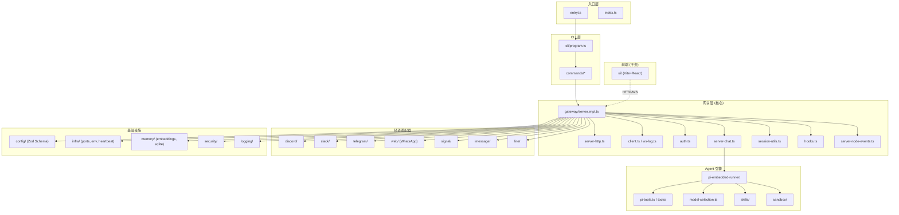

# Open Acosmi — 后端全局审计与重构任务规划

> **相关文档**：
>
> - [refactor-order.md](file:///Users/fushihua/Desktop/Claude-Acosmi/skills/acosmi-refactor/references/refactor-order.md) — 精确执行序 + 附录 A/B（审计方法 + 测试覆盖）
> - [deferred-items.md](file:///Users/fushihua/Desktop/Claude-Acosmi/docs/renwu/deferred-items.md) — Phase 间延迟待办汇总
>
> 本文档侧重**宏观路线图 + 审计概览 + 风险矩阵**；`refactor-order.md` 侧重**逐 Phase 精确任务列表 + 审计/测试规范**。
>
> **最后更新**：2026-02-18（完成度审计 — Phase 11.5 全部 9 窗口状态更新为 ✅）

## 一、审计概览

### 1.1 项目架构快照

| 维度 | 数据 |
|------|------|
| 后端模块总数 | 43 个目录 |
| 非测试 TS 文件 | 1,646 个 |
| 入口点 | `src/entry.ts` → `cli/run-main.ts` → `cli/program.ts` |
| 前端 | `ui/` (Vite + React, **129 个前端源文件**) |
| 配置系统 | Zod Schema, 55KB, 1,115 行 |
| 网关核心 | `gateway/server.impl.ts`, 639 行, 19 个函数 |

### 1.2 模块规模排名（非测试文件数）

| 排名 | 模块 | 文件数 | 核心职责 |
|------|------|--------|----------|
| 1 | `agents/` | 233 | Agent 引擎, PI runner, 工具系统, 沙箱, 技能管理 |
| 2 | `commands/` | 174 | CLI 命令实现（onboard, doctor, status, 配置向导等） |
| 3 | `cli/` | 138 | CLI 入口, Commander 程序定义, 各子命令注册 |
| 4 | `gateway/` | 133 | HTTP/WS 网关服务器, 认证, 聊天, 会话, 节点管理 |
| 5 | `auto-reply/` | 121 | 自动回复引擎（消息路由, 模板, 频率控制） |
| 6 | `infra/` | 120 | 基础设施（端口, 环境, 心跳, 重试, 发现, 出站消息） |
| 7 | `config/` | 89 | 配置加载/验证/迁移, Zod Schema, 类型定义 |
| 8 | `channels/` | 77 | 通道注册/抽象层 |
| 9 | `browser/` | 52 | 浏览器自动化 |
| 10 | `discord/` | 44 | Discord 集成 |
| 11 | `web/` | 43 | WhatsApp Web 集成 |
| 12 | `slack/` | 43 | Slack 集成 |
| 13 | `telegram/` | 40 | Telegram 集成 |
| 14~43 | 其余 29 模块 | 共 339 | 独立功能模块 |

### 1.3 架构拓扑



### 1.4 关键发现

> [!IMPORTANT]
>
> 1. **`agents/` 是最复杂的模块**（233 文件, 10 个子目录），包含 PI 嵌入式引擎、工具系统、模型选择、失败切换、sandbox 等核心 AI 逻辑
> 2. **`config/schema.ts`（55KB, 1,115 行）** 定义了整个系统的配置 schema，是所有模块的依赖基石
> 3. **`gateway/server.impl.ts`（639 行）** 是网关的心脏，一个巨型 `startGatewayServer` 函数处理所有初始化
> 4. **7 个频道适配器**（Discord/Slack/Telegram/WhatsApp/Signal/iMessage/Line）结构相似但各自独立
> 5. 前端 `ui/` 是独立的 Vite+React 应用，仅通过 HTTP/WS 与网关通信，**可完全保留**

> [!WARNING]
> 原版代码存在以下重构挑战：
>
> - 大量文件间的紧耦合（`gateway/` 引用了几乎所有 `infra/` 模块）
> - 配置 schema 使用 Zod 运行时验证，Go 端需寻找替代方案
> - Agent PI Runner 逻辑极其复杂（流式处理、多轮对话、工具调用编排）
> - 测试文件与源码同目录，测试覆盖率较高，重构需保持等价覆盖

---

## 二、重构任务规划

> 严格遵循技能规范：**原子化重构（一次一个文件/模块）**，每个子任务按「提取→理解→重构→验证」四步法执行。

### Phase 0: 项目基础搭建

**预估子任务: 3 | 预估文件数: ~10**

| 编号 | 子任务 | 输出 | 说明 |
|------|--------|------|------|
| 0.1 | 初始化 Go 模块 | `backend/go.mod`, 目录骨架 | 创建 `cmd/`, `internal/`, `pkg/`, `bridge/` |
| 0.2 | 搭建项目骨架 | `bridge/`, build 脚本 | 验证编译链路 |
| 0.3 | 搭建构建系统 | `Makefile`, CI 脚本 | `make build`, `make test`, `make lint` |

---

### Phase 1: 类型系统与配置

**预估子任务: 5 | 原版依赖: `src/config/`, `src/types/`**

| 编号 | 子任务 | 源文件 → 目标 | 复杂度 |
|------|--------|---------------|--------|
| 1.1 | 基础类型 | `config/types.*.ts` (20+ 文件) → `pkg/types/` | ⭐⭐⭐ |
| 1.2 | 配置 Schema 核心 | `config/zod-schema.core.ts` (16KB) → `internal/config/schema.go` | ⭐⭐⭐⭐⭐ |
| 1.3 | 配置加载与 IO | `config/io.ts` (18KB) → `internal/config/loader.go` | ⭐⭐⭐⭐ |
| 1.4 | 配置默认值 | `config/defaults.ts` (12KB) → `internal/config/defaults.go` | ⭐⭐⭐ |
| 1.5 | 环境变量 & 路径 | `config/paths.ts`, `env-vars.ts` → `internal/config/paths.go` | ⭐⭐ |

> [!IMPORTANT]
> Phase 1 是所有后续 Phase 的基础依赖。`config/schema.ts`（55KB Zod schema）需要手写 Go struct + 验证逻辑，可考虑 [go-playground/validator](https://github.com/go-playground/validator) 替代 Zod。此阶段决定了整个 Go 后端的类型体系。

**Phase 1 审计状态 (2026-02-12)**：已完成 BUG-1~4 修复，共 10 个修复项、22 个新回归测试。
详见 [phase1-2-fix-report.md](file:///Users/fushihua/Desktop/Claude-Acosmi/docs/renwu/phase1-2-fix-report.md)
和 [config 架构文档](file:///Users/fushihua/Desktop/Claude-Acosmi/docs/gouji/config.md)。

---

### Phase 2: 基础设施层

**预估子任务: 6 | 原版依赖: `src/infra/`, `src/logging/`, `src/utils/`**

| 编号 | 子任务 | 源文件 → 目标 | 复杂度 |
|------|--------|---------------|--------|
| 2.1 | 日志系统 | `logging/`, `infra/env.ts` → `pkg/log/` | ⭐⭐ |
| 2.2 | 端口管理 | `infra/ports*.ts` → `internal/infra/ports.go` | ⭐⭐ |
| 2.3 | 心跳 & 发现 | `infra/heartbeat-*.ts`, `bonjour*.ts` → `internal/infra/discovery.go` | ⭐⭐⭐ |
| 2.4 | 重试 & 退避 | `infra/retry.ts`, `backoff.ts` → `pkg/retry/` | ⭐⭐ |
| 2.5 | 工具函数 | `utils.ts`, `utils/` → `pkg/utils/` | ⭐⭐ |
| 2.6 | 出站消息系统 | `infra/outbound/*.ts` (15 文件) → `internal/outbound/` | ⭐⭐⭐⭐ |

---

### Phase 3: 网关核心层

**预估子任务: 8 | 原版依赖: `src/gateway/`**

| 编号 | 子任务 | 源文件 → 目标 | 复杂度 |
|------|--------|---------------|--------|
| 3.1 | HTTP 服务框架 | `server-http.ts` (13KB) → `internal/gateway/http.go` (Gin/Fiber) | ⭐⭐⭐ |
| 3.2 | WebSocket 连接管理 | `client.ts` (14KB) → `internal/gateway/ws.go` | ⭐⭐⭐⭐ |
| 3.3 | 认证系统 | `auth.ts` (8KB) → `internal/gateway/auth.go` | ⭐⭐⭐ |
| 3.4 | 聊天消息核心 | `server-chat.ts` (12KB) → `internal/gateway/chat.go` | ⭐⭐⭐⭐ |
| 3.5 | 会话管理 | `session-utils.ts` (22KB) → `internal/sessions/` | ⭐⭐⭐⭐⭐ |
| 3.6 | 节点事件系统 | `server-node-events.ts` (8KB) → `internal/gateway/events.go` | ⭐⭐⭐ |
| 3.7 | 钩子系统 | `hooks.ts` + `hooks-mapping.ts` (19KB) → `internal/hooks/` | ⭐⭐⭐ |
| 3.8 | 服务器引导 & 主函数 | `server.impl.ts` (21KB) → `internal/gateway/server.go` | ⭐⭐⭐⭐⭐ |

**Phase 3 审计状态 (2026-02-12)**：Phase 3.1 完成 14 项修复 + 5 新模块，Phase 3.2 深度审计修复 3 个 bug（verbose映射/心跳抑制/buffer key）。架构再审计评分：并发安全 9/10、API 对齐 8/10、代码健康 9/10。
详见 [phase3-fix-report.md](file:///Users/fushihua/Desktop/Claude-Acosmi/docs/renwu/phase3-fix-report.md)、[gateway 架构文档](file:///Users/fushihua/Desktop/Claude-Acosmi/docs/gouji/gateway.md) 和 [handleNodeEvent 上下文](file:///Users/fushihua/Desktop/Claude-Acosmi/docs/renwu/handleNodeEvent-context.md)。

---

### Phase 4: Agent 引擎（核心，最复杂）— 深度审计修订版

**预估子任务: 16 | 原版依赖: `src/agents/` + `src/process/` + `src/routing/` + `src/sessions/` + `src/providers/` + `src/node-host/`**

> [!CAUTION]
> 此阶段为**最高风险**阶段。深度审计发现 agents/ 实际包含 **461 个文件**（非原估 233），还有 6 个外部依赖目录。子任务从 10 增加到 **16**，隐藏 import 链 **27+ 条**。**必须严格遵循原子化原则**，每次仅重构一个子模块。
> 详见 [phase4-9-deep-audit.md](file:///Users/fushihua/Desktop/Claude-Acosmi/docs/renwu/phase4-9-deep-audit.md)。

| 编号 | 子任务 | 源文件(KB) | 新增依赖 | 复杂度 |
|------|--------|-----------|----------|--------|
| 4.0 | **进程队列系统** (新增) | `process/` 9文件 16KB | — | ⭐⭐⭐ |
| 4.1 | 模型配置与发现 | `models-config*.ts` 24KB | +synthetic/venice/zen/bedrock 30KB | ⭐⭐⭐⭐ |
| 4.2 | 模型选择 & 失败切换 | `model-selection.ts` 13KB | +model-catalog/scan/compat 20KB | ⭐⭐⭐⭐ |
| 4.3 | 认证配置 | `auth-profiles/` 15文件 68KB | +chutes-oauth/cli-credentials 23KB | ⭐⭐⭐⭐⭐ |
| 4.4 | 系统提示词 | `system-prompt.ts` 27KB | +system-prompt-params/report 8KB | ⭐⭐⭐⭐ |
| 4.5 | PI 嵌入式引擎核心 | `run.ts` 34KB | +compact/model/google 43KB | ⭐⭐⭐⭐⭐ |
| 4.6 | PI 订阅 & 流式处理 | `subscribe*.ts` 6文件 50KB | +block-chunker 10KB | ⭐⭐⭐⭐⭐ |
| 4.7 | PI 工具注册 & 调度 | `pi-tools*.ts` 6文件 47KB | +policy/schema 16KB | ⭐⭐⭐⭐⭐ |
| 4.8 | PI 辅助函数 | `pi-embedded-helpers/` 9文件 | +utils 12KB | ⭐⭐⭐ |
| 4.9 | Bash 工具执行 | `bash-tools*.ts` 4文件 90KB | +pty 7KB | ⭐⭐⭐⭐⭐ |
| 4.10 | 沙箱系统 | `sandbox/` 17文件 59KB | — | ⭐⭐⭐⭐ |
| 4.11 | 技能系统 | `skills/` 13文件 + 外部3文件 | — | ⭐⭐⭐ |
| 4.12 | **会话路由** (新增) | `routing/` 5文件 32KB | — | ⭐⭐⭐ |
| 4.13 | **会话覆盖** (新增) | `sessions/` 7文件 10KB | — | ⭐⭐ |
| 4.14 | **Provider 适配层** (新增) | `providers/` 8文件 32KB | — | ⭐⭐⭐ |
| 4.15 | **Agent 工具集(不含频道)** (新增) | `tools/` 中非频道工具 ~20文件 | — | ⭐⭐⭐⭐ |

---

### Phase 5: 通信频道适配器 — 深度审计修订版

**预估子任务: 6 | 原版依赖: `src/channels/` + `src/discord/` + `src/slack/` + `src/telegram/` + `src/pairing/` 等**

| 编号 | 子任务 | 源文件 | 新增依赖 | 复杂度 |
|------|--------|--------|----------|--------|
| 5.1 | 频道抽象层 | `channels/` 31文件 | +channels/plugins 38文件 85KB | ⭐⭐⭐⭐ |
| 5.2 | **频道工具桥接** (新增) | `tools/discord-actions.ts` 等 | Agent tool→channel 接口 | ⭐⭐⭐ |
| 5.3 | Discord 适配器 | `discord/` 67文件 | — | ⭐⭐⭐ |
| 5.4 | Slack 适配器 | `slack/` 65文件 | — | ⭐⭐⭐ |
| 5.5 | Telegram 适配器 | `telegram/` 89文件 | — | ⭐⭐⭐ |
| 5.6 | 其余频道 | signal/line/imessage/web/pairing | +pairing/ 5文件 | ⭐⭐⭐ |

> [!NOTE]
> 5.1 复杂度从 ⭐⭐⭐ 提升至 ⭐⭐⭐⭐：`channels/plugins/` 子系统含 38 文件 85KB，包括类型系统(29KB)、消息归一化管线(8文件)、出站管线(8文件)、群组@提及(12KB)。

**Phase 5 审计状态 (2026-02-14)**：

- **5A 延迟项清理**：已完成 4/12 项（P3-D4 preview tool call、P4-DRIFT5 DowngradeOpenAIReasoningBlocks、P2-D6 validateAction、P2-D3+D4 session key 路由）。剩余 8 项可在 Phase 6 中穿插完成。
- **5B 频道抽象层**：✅ 全部完成（3 层 23 文件 + bridge 5 文件）
- **5C 频道工具桥接**：✅ 全部完成（5 文件）
- **5D 频道 SDK 移植**：✅ 5D.1-5D.9 全部完成（6 频道 SDK，含隐藏依赖审计和修复）
  - WhatsApp 14 Go 文件、Signal 14 Go 文件、iMessage 8 Go 文件、Telegram 35 Go 文件、Slack 37 Go 文件、Discord 27 Go 文件
  - 各频道 Phase 6 集成桩已记录 → [deferred-items.md](file:///Users/fushihua/Desktop/Claude-Acosmi/docs/renwu/deferred-items.md)
- **新增模块**：`internal/routing/session_key.go`（340L, 18 函数）— Phase 6 消息路由关键前置依赖

详见 [phase5d-task.md](file:///Users/fushihua/Desktop/Claude-Acosmi/docs/renwu/phase5d-task.md) 和各频道审计报告。

---

### Phase 6: CLI + 插件 + 钩子 + 守护进程 — 深度审计修订版

**预估子任务: 8 | 原版依赖: `src/cli/` + `src/commands/` + `src/plugins/` + `src/hooks/` + `src/cron/` + `src/daemon/` + `src/acp/`**

| 编号 | 子任务 | 源文件 | 新增依赖 | 复杂度 |
|------|--------|--------|----------|--------|
| 6.1 | CLI 框架搭建 | `cli/program/` 27文件 | +terminal/tui | ⭐⭐⭐ |
| 6.2 | 核心命令 | `commands/` 核心命令 | — | ⭐⭐⭐⭐ |
| 6.3 | 辅助命令 | `commands/` 辅助命令 | — | ⭐⭐⭐ |
| 6.4 | **插件系统** (新增) | `plugins/` 35文件 160KB | plugin-sdk 13KB | ⭐⭐⭐⭐⭐ |
| 6.5 | **钩子系统(完整)** (新增) | `hooks/` 28文件 | +Gmail 集成 | ⭐⭐⭐⭐ |
| 6.6 | **定时任务** | `cron/` 33文件 | — | ⭐⭐⭐⭐ |
| 6.7 | **守护进程** | `daemon/` 30文件 + `macos/` 4文件 | build tags | ⭐⭐⭐⭐ |
| 6.8 | **ACP 协议** (新增) | `acp/` 13文件 | — | ⭐⭐⭐ |

> [!WARNING]
> 6.4 和 6.5 存在**双向依赖**（hooks/plugin-hooks → plugins/hooks; plugins/hooks → hooks/loader）。必须在同一子阶段实现。

**Phase 6 审计状态 (2026-02-14)**：

- **Batch A 已完成**：
  - A1 daemon/：21 Go 文件 + 21 测试 PASS（launchd/systemd/schtasks 跨平台）
  - A2 plugins/ 类型+注册表：10 source + 3 test, 30 PASS（PluginRuntime 接口 + sync.RWMutex）
  - A3 hooks/ 核心+加载：10 source + 4 test, 35 PASS（内部事件钩子注册/触发 + 工作区发现）
- **Batch B 已完成**：
  - B1 plugins/ 发现+安装+更新：4 Go 文件（discovery.go, install.go, install_helpers.go, update.go）
  - B2 hooks/ Gmail 集成 + Soul Evil：5 Go 文件（gmail/gmail.go, ops.go, setup.go, watcher.go + soul_evil.go）
  - B3 plugins/ 运行时+桥接：2 Go 文件（runtime.go, loader.go）— 编译时注册替代 TS 动态加载
  - 全部通过 `go build ./...` + `go vet` + `go test -race`
- **Batch D 进展**：D1 ACP 协议 ✅ 已完成（10 Go 文件 + 隐藏依赖审计 7P0/8P1 全修、11 测试 PASS）
- **Batch E 已完成**：CLI 框架 + 全部命令（23 新文件，60+ 子命令 stub）
  - E1: `internal/cli/` 6 工具文件（version/argv/utils/banner/progress/gateway_rpc）
  - E2: 核心命令 8 文件（gateway/agent/status/setup/models/channels/daemon/cron）
  - E3: 辅助命令 9 文件（doctor/skills/hooks/plugins/browser/nodes/infra/security/misc）
  - Cobra 替代 Commander.js，编译时注册，`go build ./...` + `go vet ./...` ✅
  - 架构文档：[cli.md](file:///Users/fushihua/Desktop/Claude-Acosmi/docs/gouji/cli.md)
- **Batch C 进展**：
  - C1 cron/ 服务层：✅ 已完成（17 Go 文件 — types/normalize/schedule/store/timer/jobs/ops/delivery）
  - C2 cron/ 独立 Agent 运行：✅ 已完成（isolated_agent.go + isolated_agent_helpers.go + delivery.go 升级）
  - C2 审计项修复（2026-02-14）：✅ 3 项全部完成
    - F1: `buildSafeExternalPrompt` → `internal/security/external_content.go`（345L, 12 regex + Unicode 折叠）
    - F2: Model override → `ResolveAllowedModelRef` DI 接入
    - F3: `convertMarkdownTables` → `pkg/markdown/tables.go`（250L）+ iMessage/Discord 已接入
    - 共 26 单元测试 PASS
  - 隐藏依赖审计：7 类 / 12 项发现，6 项延后 → [deferred-items.md](file:///Users/fushihua/Desktop/Claude-Acosmi/docs/renwu/deferred-items.md)

详见 [phase6-task.md](file:///Users/fushihua/Desktop/Claude-Acosmi/docs/renwu/phase6-task.md) 和 [phase6-deep-audit.md](file:///Users/fushihua/Desktop/Claude-Acosmi/docs/renwu/phase6-deep-audit.md)。
架构文档：[plugins.md](file:///Users/fushihua/Desktop/Claude-Acosmi/docs/gouji/plugins.md)、[hooks.md](file:///Users/fushihua/Desktop/Claude-Acosmi/docs/gouji/hooks.md)、[cron.md](file:///Users/fushihua/Desktop/Claude-Acosmi/docs/gouji/cron.md)、[acp.md](file:///Users/fushihua/Desktop/Claude-Acosmi/docs/gouji/acp.md)、[cli.md](file:///Users/fushihua/Desktop/Claude-Acosmi/docs/gouji/cli.md)。

**Phase 6 完成确认 (2026-02-15)**：全部 8 个子任务（6.1-6.8）+ 5A 遗留项补全 ✅

---

### Phase 7: 辅助模块 — 深度审计修订版

**预估子任务: 7 | 原版依赖: 各独立模块**

| 编号 | 子任务 | 源文件(KB) | 审计发现 | 复杂度 |
|------|--------|-----------|----------|--------|
| 7.1 | 自动回复引擎 | `auto-reply/` 71+`reply/` 139文件 | 210文件！非原估121 | ⭐⭐⭐⭐⭐ |
| 7.2 | 记忆系统 | `memory/` 43文件 | manager.ts=78KB 单文件 | ⭐⭐⭐⭐⭐ |
| 7.3 | 安全模块 | `security/` 13文件 | audit=82KB 合计 | ⭐⭐⭐⭐ |
| 7.4 | 浏览器自动化 | `browser/` 68文件 | 比原估多16文件 | ⭐⭐⭐⭐⭐ |
| 7.5 | 媒体理解 | `media-understanding/` 21文件 + `media/` 19文件 | runner=38KB | ⭐⭐⭐⭐⭐ |
| 7.6 | **TTS** (独立) | `tts/tts.ts` 47KB 单文件 | 远超原估 | ⭐⭐⭐⭐ |
| 7.7 | **链接理解 + Markdown** (新增) | `link-understanding/`+`markdown/` 15文件 | — | ⭐⭐⭐ |

**Phase 7 Batch A 完成 (2026-02-15)**：

- **A1 Markdown + Link-Understanding**：✅ 8 个新 Go 文件
  - `pkg/markdown/`: fences.go, code_spans.go, frontmatter.go（yaml.v3）, ir.go（原生解析器替代 markdown-it）, render.go（LIFO 渲染器）
  - `internal/linkparse/`: defaults.go, detect.go, format.go
  - 编译 + 9 tests PASS
- **A2 Security 扩展**：✅ 4 个新 Go 文件
  - `internal/security/`: channel_metadata.go, windows_acl.go, audit_fs.go, skill_scanner.go
  - 编译 + 17 tests PASS
- **延迟**：runner/apply → Batch D, chunkMarkdownIR → Batch D, audit/fix → Phase 8+
- 架构文档：[markdown.md](file:///Users/fushihua/Desktop/Claude-Acosmi/docs/gouji/markdown.md)、[linkparse.md](file:///Users/fushihua/Desktop/Claude-Acosmi/docs/gouji/linkparse.md)、[security.md](file:///Users/fushihua/Desktop/Claude-Acosmi/docs/gouji/security.md)

**Phase 7 Batch B 完成 (2026-02-15)**：

- **B1 TTS 引擎**：✅ 8 个新 Go 文件（1,606L），`internal/tts/`
  - types.go, config.go, prefs.go, provider.go, directives.go, synthesize.go, cache.go, tts.go
  - 1,579L 单文件拆分为 8 个 Go 文件，完整实现配置解析/指令解析/Provider 路由/缓存；合成引擎 Pre-Phase 9 WD 完整 HTTP 实现
- **B2 媒体工具**：✅ 11 个新 Go 文件（1,858L），`internal/media/`
  - constants.go, mime.go, audio.go, audio_tags.go, store.go, fetch.go, parse.go, image_ops.go, input_files.go, server.go, host.go
  - file-type npm → Go stdlib, sharp npm → Go image + macOS sips
- **B3 媒体理解**：✅ 15 个新 Go 文件（986L），`internal/media/understanding/`
  - types.go, defaults.go, video.go, scope.go, concurrency.go（Go 1.18+ generics）, registry.go, resolve.go, 7 个 provider（Pre-Phase 9 WD 完整 HTTP 实现）, runner.go
- **延迟**：~~Provider HTTP 调用 → Phase 8~~ ✅ Pre-Phase 9 WD, SSRF 防护 ✅ Pre-Phase 9 WC, PDF 提取 → pdfcpu, 图像缩放 → RUST_CANDIDATE P2
- 架构文档：[media.md](file:///Users/fushihua/Desktop/Claude-Acosmi/docs/gouji/media.md)、[tts.md](file:///Users/fushihua/Desktop/Claude-Acosmi/docs/gouji/tts.md)

**Phase 7 Batch C 完成 (2026-02-15)**：

- **C1 记忆系统**：✅ `internal/memory/` 12 Go 文件
- **C2 浏览器自动化**：✅ `internal/browser/` 8 Go 文件
- 架构文档：[memory.md](file:///Users/fushihua/Desktop/Claude-Acosmi/docs/gouji/memory.md)、[browser.md](file:///Users/fushihua/Desktop/Claude-Acosmi/docs/gouji/browser.md)

**Phase 7 Batch D 完成 (2026-02-15)**：

- **D1-D3**：✅ 类型+命令+入站处理（61 tests）
- **D4-D6**：✅ reply/ 子包 + chunk 围栏感知引擎（447L）+ body.go + 审计修复（132 tests 全 PASS）
- 总计 38 Go 文件 4,929L，隐藏依赖审计健康度 **A-**
- 延迟：agent-runner/commands/directives等 ~8,000L TS → Phase 8
- 详见 [phase7-d456-hidden-dep-audit.md](file:///Users/fushihua/Desktop/Claude-Acosmi/docs/renwu/phase7-d456-hidden-dep-audit.md)
- 架构文档：[autoreply.md](file:///Users/fushihua/Desktop/Claude-Acosmi/docs/gouji/autoreply.md)

---

### Phase 8: P7D 延迟项 ✅ 完成（Ollama → Phase 11）

**执行策略：4 Window 分批处理 P7D 延迟项 (~12,000L TS → ~6,000L Go)**

| 编号 | 子任务 | 状态 | 复杂度 |
|------|--------|------|--------|
| 8.2-W1 | 基础层 + 指令处理（P7D-5/P7D-6） | ✅ 完成 — 11 Go 文件 + 4 测试文件 | ⭐⭐⭐ |
| 8.2-W2 | Agent Runner + get-reply（P7D-3） | ✅ 完成 — 11 Go 文件 + 2 测试文件, 47 tests | ⭐⭐⭐⭐ |
| 8.2-W3 | Commands 处理器（P7D-4） | ✅ 完成 — 17 Go 文件 + 1 测试文件, 100 tests | ⭐⭐⭐⭐ |
| 8.2-W4 | status + skill-commands + 文档（P7D-1/P7D-2） | ✅ 完成 — 3 Go 文件 + 2 测试文件, 12 tests | ⭐⭐ |
| ~~8.1~~ | ~~Ollama API 集成~~ | → Phase 11 | ⭐⭐⭐ |

**Phase 8.2-W4 完成 (2026-02-15)**：

- **W4-A status.go**：✅ `status.go` (300L) — StatusDeps DI 接口（15+ 外部依赖封装）、FormatTokenCount、FormatContextUsageShort、BuildStatusMessage、BuildHelpMessage、FormatCommandsGrouped + 9 tests PASS
- **W4-B skill_commands.go**：✅ `skill_commands.go` (175L) — SkillCommandDeps DI 接口、NormalizeSkillCommandLookup（空格/下划线→连字符）、FindSkillCommand（模糊匹配）、ResolveSkillCommandInvocation（`/skill <name>` + `/<name>` 双格式）+ 3 tests PASS
- **W4-C 修补项**：✅ P7D-9 SanitizeUserFacingText 确认已在 `helpers/errors.go` L550-600 完整实现；P7D-10 `abort.go` 从 59L 扩展至 196L（ABORT_MEMORY sync.Map、AbortDeps DI、TryFastAbortFromMessage、StopSubagentsForRequester、FormatAbortReplyText）
- **延迟项完结**：P7D-1/P7D-2/P7D-9/P7D-10 全部 ✅

**Phase 8 完成确认 (2026-02-15)**：8.2 全部 4 窗口 ✅。8.1 Ollama 因对系统无根本影响，延至 Phase 11。

详见 [phase8-task.md](file:///Users/fushihua/Desktop/Claude-Acosmi/docs/renwu/phase8-task.md)。

---

### Pre-Phase 9：延迟项清理 ✅ 完成

**执行策略：多 Window 分批处理 Phase 4-8 积累的延迟项，为 Phase 9 集成扫清障碍**

| 编号 | Window | 内容 | 状态 |
|------|--------|------|------|
| WA | sessions + agent-limits | P1-F14a sessions/ 模块（6 Go 文件）+ P1-F14b agent-limits 确认 | ✅ 完成 |
| WB | AgentExecutor + ModelFallback | P4-GA-RUN1 ExtraSystemPrompt + C2-P1a auth cooldown + P8W2-D1 ModelFallbackExecutor | ✅ 完成 |
| WC | 类型修复 + 安全 | C2-P0 MessagingToolSend 结构化 + P7B-3 SSRF 防护模块新建 + media/ 集成 | ✅ 完成 |
| WD | HTTP Provider 实现 | P7B-1 TTS 3 Provider HTTP + P7B-2 媒体理解 6 Provider HTTP | ✅ 完成 |

**Window A 完成 (2026-02-15)**：

- `internal/sessions/` 6 新文件（paths/reset/group/main_session/metadata/transcript）+ 5 测试文件
- `internal/agents/limits.go` 已在 Phase 5 实现，确认无重复

**Window B 完成 (2026-02-15)**：

- `runner/run_attempt.go` + `runner/run.go` — `ExtraSystemPrompt` 全链路传递
- `agents/models/fallback.go` — `RunWithModelFallback` 新增 `AuthProfileChecker` + auth profile cooldown 跳过
- **[NEW]** `autoreply/reply/model_fallback_executor.go` (204L) — `ModelFallbackExecutor` 替代 `StubAgentExecutor`，管线: RunTurn → RunWithModelFallback → RunEmbeddedPiAgent
- 7 新测试 PASS

**Window C 完成 (2026-02-15)**：

- **C2-P0**：`runner/types.go` 新增 `MessagingToolSend` struct + 级联更新 7 文件
- **P7B-3**：`internal/security/ssrf.go` **[NEW]** (230L) + `ssrf_test.go` (12 tests) + `media/fetch.go` / `input_files.go` 集成

**Window D 完成 (2026-02-15)**：

- **P7B-1**：`tts/synthesize.go` 从骨架到完整 HTTP（OpenAI POST + ElevenLabs POST + Edge CLI fallback）
- **P7B-2**：6 个 `provider_*.go` 从骨架到完整 HTTP（OpenAI Whisper/GPT-4V, Gemini, Claude, Deepgram, Groq, MiniMax）

---

### Phase 9: 延迟项清理 ✅ 完成 (2026-02-16)

**目标：消化 `deferred-items.md` 中 ~60 项未解决延迟待办，为 Phase 10 集成测试扫清障碍**

| 批次 | 内容 | 预估项数 | 说明 |
|------|------|----------|------|
| Batch A | Gateway 集成 | ~35 项 | 各频道运行时连线（WA/SIG/IM/SLK/DIS/TG），按频道分窗口 |
| Batch B | Config/Agent 补全 | ~10 项 | ✅ P1-F9/B3/C1 + P1-F14c/d TS-only 模块 + P4-NEW1/NEW2 |
| Batch C | Agent 引擎缺口 | ~6 项 | P4-GA 系列（RUN2/ANN1/CLI3/DLV1/DLV3）+ C2 缺口 |
| Batch D | 辅助/优化 | ~15 项 | CLI/ACP/Memory/Browser 辅助 + P7A/B/C 优化项 |

> [!IMPORTANT]
> Batch A（Gateway 集成）是最大工作块，建议按频道分窗口执行：Telegram → iMessage → Signal → WhatsApp → Slack → Discord（从简到繁）。

**Phase 9 Batch A 进展 (2026-02-15)**：

- **A1 Telegram**：✅ TG-HD5 `resolveMarkdownTableMode` 完整实现
- **A2 iMessage**：✅ IM-A/B/C/D 全部完成
  - 5 个新文件：`monitor_deps.go`、`monitor_envelope.go`、`monitor_history.go`、`monitor_gating.go`、`monitor_inbound.go` (核心管线 ~640L)
  - 2 个修改文件：`monitor.go`（移除 Phase 6 骨架，集成完整管线 + IM-D 分块/表格）、`monitor_types.go`（Deps DI）
  - 共享基础设施通过 `MonitorDeps` DI 接口预留
- **A3 Signal**：✅ SIG-A/B/C 全部完成
  - 新增 `monitor_deps.go` (DI 接口)
  - `event_handler.go`: `dispatchSignalInbound()` + `formatSignalEnvelope()` + 反应事件 `EnqueueSystemEvent`
  - `handleSignalPairing()` + `BuildPairingReply()` + `DeliverSignalReplies` (分块+附件投递)
- **A4 WhatsApp**：✅ WA-A/B/C/D/E/F 全部完成
  - 2 个新文件：`monitor_deps.go` (DI 接口 9 项注入点)、`monitor_inbound.go` (~350L 完整入站管线)
  - 4 个修改文件：`auto_reply.go` (DeliverWhatsAppReplies + ChunkReplyText)、`media.go` (MediaOptimizer + OptimizeWebMedia + ClampImageDimensions)、`outbound.go` (Markdown 表格转换)、`auth_store.go` (slog 结构化日志)
  - 新增 `whatsapp_test.go` (33 个测试用例，-race 验证 PASS)
- `go build ./...` + `go vet ./...` ✅ PASS
- **A5 Slack**：✅ SLK-A~I + P7-A/B 全部完成
  - 集成 `slack-go/slack` v0.17.3 `socketmode` 子包
  - 15 个文件写入/重写
- **A6 Discord**：✅ DIS-A~F 全部完成 (2026-02-15)
  - 集成 `discordgo` v0.29.0 全托管 Gateway v10 WebSocket
  - 11 个新文件 + 2 个修改文件（DI + provider + preflight/dispatch + approvals + commands + 5 cache/helper）
- `go build ./...` + `go vet ./...` ✅ PASS
- **Batch A 全部完成** ✅

**Phase 9 Batch B 进展 (2026-02-15)**：

- **确认已实现**：P1-F9 (shellenv.go)、P1-B3 (Extra 字段)、P1-C1 (群组解析)、P1-channelPreferOver (空 map 行为正确)
- **TS 模块移植**：✅ P1-F14c (6 个) + P1-F14d (2 个) — 7 个新 Go 文件 (`cacheutils.go`、`commands.go`、`talk.go`、`mergeconfig.go`、`telegramcmds.go`、`portdefaults.go`、`configlog.go`)
- **类型修复**：✅ P4-NEW1 Fallbacks `*[]string` hasOwn 语义 (2 个类型 + 4 处引用)
- **新函数**：✅ P4-NEW2 `ResolveHooksGmailModel` (selection.go)
- `go build ./...` + `go vet ./...` ✅ PASS
- **Batch B 全部完成** ✅

**Phase 9 Batch C 进展 (2026-02-15)**：

- **P4-GA-RUN2**：✅ `run.go` messaging 元数据传播（+2L）
- **P4-GA-ANN1**：✅ `subagent_announce.go` `AnnounceQueueHandler` DI + steer/queue（+40L）
- **P4-GA-CLI3**：✅ `cli_runner.go` `SystemPromptBuilder` 回调 + `CliSystemPromptContext`（+20L）
- **P4-GA-DLV1**：✅ `deliver.go` `ChannelOutboundAdapter` + `TextChunkerFunc` DI（+20L）
- **P4-GA-DLV3**：✅ `deliver.go` `appendMirrorTranscript` + `TranscriptAppender` DI（+16L）
- **C2-P1b**：✅ 已存在（`IsCliProvider` + `RunCliAgent`）
- **C2-P2b**：✅ **[NEW]** `internal/infra/agent_events.go`（150L）+ 3 测试
- **C2-P2c**：✅ **[NEW]** `internal/agents/skills/workspace_skills.go`（245L）+ 5 测试
- `go build ./...` + `go vet ./...` + `go test ./internal/agents/... ./internal/outbound/... ./internal/infra/...` ✅ PASS
- **Batch C 全部完成** ✅

**Phase 9 Batch D 进展 (2026-02-15)**：

- **D1 CLI 辅助**：✅ 全部完成（7 项）— `plugin_registry.go` (Singleton), `dotenv.go` (Loader), `route.go` (Fast Route), `argv.go`/`progress.go`/`utils.go` 增强
- **D2 ACP 辅助**：✅ 全部完成（2 项）— UUID session IDs (`session.go`), `limit` 参数 (`translator.go`)
- **D3 Phase 7 遗留**：✅ 全部完成（6 项）
  - P7A-1 链接理解 Runner + Apply：**[NEW]** `linkparse/runner.go` (220L) + `apply.go` (60L)
  - P7A-2 chunkMarkdownIR：确认已完成（`ir.go:599-629`）
  - P7A-3 Security audit：**[NEW]** `security/audit.go` (~400L) + `audit_extra.go` (~300L) + 30 tests + `cmd_security.go` CLI 入口已串联 ✅
  - P7B-4 PDF 提取：`input_files.go` + `pdfcpu v0.11.1`
  - P7B-5 双线性缩放：`image_ops.go` + `golang.org/x/image v0.36.0`
  - P7B-6 本地 HTTP 服务器：`host.go` `startLocalMediaServer` (sync.Once)
- `go build ./...` + `go vet ./...` + `go test -race` ✅ PASS

**Phase 9 Batch D4 完成 (2026-02-16)**：

- **P7C-1 Embedding 批处理**：✅ 3 个新 Go 文件（`batch_openai.go`/`batch_gemini.go`/`batch_voyage.go`）— FormData/multipart-related/JSONL 完整生命周期
- **P7C-2 SQLite 向量扩展**：✅ `sqlite_vec.go` + `manager.go` 更新（`LoadSqliteVecExtension` + `ProbeVectorAvailability`）
- **P7C-3 fsnotify 文件监控**：✅ `watcher.go` + `manager.go` 集成（`FileWatcher` debounce + `StartWatch`/`StopWatch`/`Close`）
- **P7C-4 Local Embeddings**：✅ stub 确认，仍延迟 Phase 10 Rust
- **P7C-5 Browser HTTP 服务器**：✅ `server.go`（auth + MaxBytesHandler + 6 routes）
- **P7C-6 Browser 客户端操作**：✅ `client_actions.go`（HTTP 包装）
- 架构文档：[memory.md](file:///Users/fushihua/Desktop/Claude-Acosmi/docs/gouji/memory.md)、[browser.md](file:///Users/fushihua/Desktop/Claude-Acosmi/docs/gouji/browser.md) 已更新

**Phase 9 Batch D5 完成 (2026-02-16)**：

- **P8W2-D5 SessionEntry 统一**：✅ `reply.SessionEntry`（16 字段）替换为 `gateway.SessionEntry` 类型别名（50+ 字段，与 TS 完全对齐）
- **P8W2-D2 MemoryFlusher 决策逻辑**：✅ `memory_flush.go`（`ShouldRunMemoryFlush` + `ResolveMemoryFlushSettings`）+ `RunMemoryFlushIfNeeded` 集成
- **P8W2-D3 HandleInlineActions**：✅ `reply_inline.go` + 6 个 TODO 桩填充（技能命令、内联命令提取、DI 回调）
- **P8W2-D4 ApplyInlineDirectiveOverrides**：✅ `directive_persist.go`（`PersistInlineDirectives`）+ 2 个 TODO 桩填充
- 新增 3 个测试文件：26 tests PASS，全量编译 + vet 通过
- **Phase 9 Batch D 全部完成** 🎉

---

### Phase 10: 集成与验证

**预估子任务: 4（新增 10.0 启动编排）**

| 编号 | 子任务 | 说明 | 状态 |
|------|--------|------|------|
| 10.0 | Go 网关启动编排 | `server.go` + `ws_server.go` + CLI wiring | ✅ 完成 |
| 10.1 | 前端↔Go 网关集成测试 | FE-A Stub ✅; FE-B 解耦 ✅; FE-C 真实处理器 ✅; FE-D i18n ✅ | ✅ 完成 |
| 10.2 | WS 方法处理器 + 端到端测试 | Batch A~D 方法注册 + Agent Pipeline 接入 + 真实 LLM E2E | ✅ 7/7 E2E PASS |
| 10.3 | 性能基准对比 | 内存、延迟、吞吐量与原版 Node.js 对比 | ✅ 报告已刷新 |
| 10.F | 最终 TODO 补全 | 29 处 TODO 分 5 Batch (FA-FE) | ✅ FA-FE 全部完成 |

> **最终审计**：详见 [phase10-final-audit.md](file:///Users/fushihua/Desktop/Claude-Acosmi/docs/renwu/phase10-final-audit.md)、[phase10-final-task.md](file:///Users/fushihua/Desktop/Claude-Acosmi/docs/renwu/phase10-final-task.md)、[phase10-final-bootstrap.md](file:///Users/fushihua/Desktop/Claude-Acosmi/docs/renwu/phase10-final-bootstrap.md)

**10.F Batch FA 完成记录** (2026-02-17):

- **FA-1/FA-2**: `cmd/acosmi/main.go` 改为纯网关入口 — 加载配置 → `gateway.RunGatewayBlocking()`
- **FA-3**: `cmd/openacosmi/main.go` `PersistentPreRunE` 步骤 5 — `PLUGIN_REQUIRED_COMMANDS` 判定 (message/channels/directory)
- **FA-4**: `cmd/openacosmi/cmd_agent.go` — `agent run` → `exec.RunCliAgent()`; `send`/`list` → Gateway RPC
- **FA-5**: `cmd/openacosmi/cmd_doctor.go` — 真实诊断：配置校验 + 端口探测 + 依赖检测（`--json`/`--minimal`）
- **FA-6**: `cmd/openacosmi/cmd_status.go` — `CallGatewayFromCLI("status")` + 离线兜底
- **FA-7**: `internal/cli/gateway_rpc.go` — 完整 WebSocket RPC 客户端 (connect → hello-ok → req/res)
- **FA-8**: `internal/cli/config_guard.go` — `ReadConfigFileSnapshot()` 集成 + allowlist 优先检查
- **验证**: `go build` ✅ | `go vet` ✅ | `go test -race ./internal/cli/...` 16 tests PASS

**10.F Batch FB 完成记录** (2026-02-17):

- **FB-1**: `openai_http.go` (~635L) — `/v1/chat/completions` 非流式 JSON + SSE 流式响应，Agent Pipeline 集成
- **FB-2**: `openai_http.go` — `/v1/responses` 代理到 chat completions（input→messages 转换）
- **FB-3**: `tools_invoke_http.go` (~168L) — `/tools/invoke/` DI ToolInvoker 接口 + dry-run + 工具列表
- **FB-4**: `idempotency.go` (~150L) — sync.Map + TTL 缓存 + reaper goroutine + `idempotency_test.go` 7 tests
- **FB-5/FB-6**: `server_methods_chat.go` + `server_methods_send.go` — CheckOrRegister 集成（dup InFlight→400, dup Completed→cached）
- **挂载**: `server_http.go` 3×501 stub → 真实处理器；`GatewayHTTPHandlerConfig` +`PipelineDispatcher`/`ToolInvoker`/`ToolNames`
- **验证**: `go build` ✅ | `go vet` ✅ | `go test -race ./internal/gateway/...` 全通过 (9.2s)

**10.F Batch FC 完成记录** (2026-02-17):

- **FC-1a**: `http_client.go` — SOCKS5 代理 via `golang.org/x/net/proxy`（`socks5://` + `socks5h://`）
- **FC-1b**: `bot_delivery.go` — `ResolveMedia` + `ResolveMediaFull`（map type assertions for `interface{}` fields + `GetTelegramFile` + `DownloadTelegramFile`）
- **FC-2a**: `chunk.go` — newline 模式调用 `autoreply.ChunkMarkdownTextWithMode`
- **FC-2b**: `send_guild.go` + `send_shared.go` + `send_types.go` — `discordRESTWithHeaders` + `DiscordTimeoutTarget.Reason` → `X-Audit-Log-Reason`
- **FC-3a**: `monitor_channel_config.go` — `BuildChannelKeyCandidates` + `ResolveChannelEntryMatchWithFallback`（4 级 fallback：精确→不敏感→glob→通配符）
- **FC-4a/4b**: `send.go` — `media.SaveMediaSource` + `media.MediaKindFromMime` 集成
- **FC-5a**: `dock.go` — `PluginChannelDockProvider` DI 回调，`GetChannelDock` + `ListChannelDocks` 动态查询
- **FC-5b**: `message_actions.go` — `PluginActionProvider` / `PluginMessageButtonsProvider` / `PluginMessageCardsProvider` DI
- **新增依赖**: `golang.org/x/net v0.50.0`
- **验证**: `go build` ✅ | `go vet` ✅ | `go test -race ./internal/channels/...` 6 包全通过

**10.F Batch FD 完成记录** (2026-02-17):

- **FD-1**: `image_ops.go` — `RotateImageByExif` macOS `sips -r` + 通用 `golang.org/x/image/draw`
- **FD-2**: `input_files.go` — `DownloadURLAsBase64` 复用 `SafeFetchURL()`
- **FD-3**: `audio_tags.go` — whisper-cpp / sherpa-onnx 探测 `exec.LookPath`
- **FD-4**: `host.go` — 媒体服务器 auth 集成 `ExtractBearerToken` + CORS
- **FD-5**: `discovery.go` — Tailscale IP `exec.Command("tailscale", "status", "--json")`
- **FD-6**: `config_guard.go` — `ReadConfigFileSnapshot()` 完整实现
- **FD-7**: `plugin_auto_enable.go` — 过时注释清理
- **验证**: `go build` ✅ | `go vet` ✅

**10.F Batch FE 完成记录** (2026-02-17):

- **FE-1/FE-2**: Go 性能基准报告刷新（`TestGenerateBenchReport` 1.02s PASS）— `phase10-bench-report.md` 已写入最新数据
- **FE-3**: 前端日期/数字本地化 — `format.ts` 新增 `formatDateTime`/`formatTimeShort`/`formatNumber`（`Intl.DateTimeFormat` + `Intl.NumberFormat` + `getLocale()` 联动），6 个调用点更新（`grouped-render.ts` ×2, `logs.ts`, `debug.ts`, `usage.ts` ×2）
- **FE-4**: Vite 构建验证通过（431ms, 127 modules）
- **验证**: `vite build` ✅ | `vitest run` ✅（node 测试 5/5）

**Phase 11 Batch F P2 体验优化完成 (2026-02-18)**：

- **F1**: ✅ `sessions.list` 模型解析 + 投递归一化 — `session_utils.go` +174L (3 函数 + 14 测试)
- **F2**: ✅ AutoReply 体验优化 — `envelope.go` timezone/elapsed + `command_auth.go` 6 新字段 + 16 测试
- **F3**: ✅ WS 协议补全 — 版本协商 + handshake timeout
- **F4**: ✅ Config UI Hints — 33 字段 `label` tag
- **F5**: ✅ Gateway 方法对齐 — `probeAt` / ACK `ts`
- **[EXTRA] F-EXTRA-1**: ✅ displayName 回退链对齐 TS 4 级（原实现仅 2 级）
- **[EXTRA] F-EXTRA-2**: ✅ `LastChannel` 字段恢复
- **[EXTRA] F-EXTRA-3**: ✅ `FormatInboundFromLabel` 签名 + 行为对齐 TS
- **[EXTRA] F-EXTRA-4**: ✅ 协议协商条件修正（原 `MaxProtocol < MinSupportedProtocol` → TS 对齐 `clientMax < ProtocolVersion || clientMin > ProtocolVersion`；close code `4010` → `1002`）
- **验证**: `go build` ✅ | `go vet` ✅ | `go test -race` ✅（gateway 9.2s, autoreply 1.0s, reply 1.4s）

**10.0 完成记录** (2026-02-16):

- 新增 `server.go` (~180L): 网关启动编排 — GatewayState + Auth + MethodRegistry + HTTP mux
- 新增 `ws_server.go` (~260L): 服务端 WebSocket 处理器 (connect→hello-ok→req/res + event push)
- 修改 `cmd_gateway.go`: CLI `gateway start` 对接 `RunGatewayBlocking`
- 新增 `server_test.go` (~220L): 6 tests PASS
- 实机验证: health ✅, WS 握手 ✅, token 认证 ✅, `health` 方法 ✅, `sessions.list` 方法 ✅, `presence.changed` 事件 ✅

**10.2 Batch A 完成记录** (2026-02-16):

- 新增 4 个处理器文件: `server_methods_config.go` (286L), `server_methods_models.go` (34L), `server_methods_agents.go` (109L), `server_methods_agent.go` (76L)
- 扩展 `GatewayMethodContext` + `WsServerConfig`: 新增 `ConfigLoader` + `ModelCatalog` 字段
- 注册 9 个方法: `config.get/set/apply/patch/schema`, `models.list`, `agents.list`, `agent.identity.get`, `agent.wait`
- 新增 `server_methods_batch_a_test.go`: 12 测试 PASS

**10.2 Batch C/D/B 完成记录** (2026-02-16):

- **Batch C** (4 新文件): `system_presence.go`, `server_methods_system.go`, `server_methods_channels.go`, `server_methods_logs.go`
  - 扩展 `GatewayMethodContext`: +`PresenceStore` +`HeartbeatState` +`EventQueue` +`Broadcaster` +`LogFilePath` +`ChannelLogoutFn`
  - 注册 7 个方法: `channels.status/logout`, `logs.tail`, `system-presence/event`, `last-heartbeat`, `set-heartbeats`
- **Batch D** (1 新文件): `server_methods_stubs.go` — ~50 个 stub 方法
- **Batch B** (2 新文件): `server_methods_chat.go`, `server_methods_send.go`
  - 扩展 `GatewayMethodContext`: +`ChatState`
  - 注册 5 个方法: `chat.send/abort/history/inject`, `send`
- 新增 `server_methods_batch_cdb_test.go`: 27 测试 PASS
- 总计: **~70 个 WS 方法已注册**，`go build` + `go vet` + `go test -race` 全通过

**10.2 Agent Pipeline 接入完成记录** (2026-02-16):

- 新增 `transcript.go` (270L): JSONL 读写 (ResolveTranscriptPath, ReadTranscriptMessages, AppendAssistantTranscriptMessage, StripEnvelopeFromMessages, CapArrayByJSONBytes)
- 新增 `dispatch_inbound.go` (130L): gateway → autoreply 桥接，使用 `PipelineDispatcher` DI 回调打破循环导入
- 修改 `server_methods_chat.go`: 3 个 TODO 替换为真实管线调用
  - `chat.send` → 异步 goroutine 中调用 `DispatchInboundMessage` + 广播 final
  - `chat.history` → 从 transcript JSONL 读取 + 清理 + 字节裁剪
  - `chat.inject` → 写入 transcript + 广播
- 修改 `server_methods_send.go`: deferred Window 2 标注
- ✅ `go build` + `go test` 全通过

**10.2 Window 4 PipelineDispatcher 真实接线完成记录** (2026-02-16):

- 修改 `server.go`: 创建真实 `PipelineDispatcher` 闭包（`ModelFallbackExecutor{RunnerDeps, Config}` → `reply.GetReplyFromConfig`）
- 修复 8 个编译错误：`autoreply.GetReplyOptions` 无 `AgentID` 等字段，`reply.GetReplyOptions` 无 `AttemptRunner`/`Config` 字段
- 修复 `directive_persist_test.go` 循环导入：移除 `gateway` 导入，使用包内 `SessionEntry` 别名
- ✅ `go build` + `go vet` + `go test -race` 全通过（无循环导入）

**10.2 E2E 真实 LLM 验证完成记录** (2026-02-16):

- 修复 `attempt_runner.go` `resolveAPIKey()`: 添加 `default` 分支，使用 `models.ResolveEnvApiKeyWithFallback()` 通用解析（支持 DeepSeek 等所有已映射 provider）
- 修复 `attempt_runner.go` `resolveBaseURL()`: 从返回空字符串改为 `models.ResolveProviderBaseURL()` 委托（DeepSeek → `https://api.deepseek.com/v1`）
- 新增 `TestE2E_ChatSend_RealLLM`: chat.send → DispatchInboundMessage → DeepSeek API → transcript 持久化
- ✅ 7/7 E2E 测试全通过（6 mock + 1 real LLM，DeepSeek 回复 "Hello to you."，耗时 3s）

---

### 延迟待办修复（Deferred Fix）✅ DF-A/B/C/D 全部完成

| 批次 | 内容 | 状态 |
|------|------|------|
| DF-A | Session 管理模块 (P1) | ✅ 3 新文件 + 37 tests |
| DF-B | chunkMarkdownIR 接入 + loadWebMedia 统一 (P2) | ✅ 2 新 + 6 改 + 26 tests |
| DF-C | files.uploadV2 + Runner 集成测试 (P3) | ✅ 6 + 5 tests |
| DF-D | Security Audit + Image CatmullRom + 媒体隧道 + Local Embeddings (P4) | ✅ 4 新 + 3 改 + 50+ tests |

详见 [deferred-fix-task.md](file:///Users/fushihua/Desktop/Claude-Acosmi/docs/renwu/deferred-fix-task.md)、[deferred-items.md](file:///Users/fushihua/Desktop/Claude-Acosmi/docs/renwu/deferred-items.md)

---

### 延迟待办修复 Phase 2（Deferred Fix 2）— DF2-C ✅ 完成

| 批次 | 内容 | 状态 |
|------|------|------|
| DF2-C | 内部模块残留骨架 (INT-1~7) | ✅ 7 项全部完成 |

- **C1**: Memory Manager `Search`（混合向量+关键词）+ `Sync`（文件扫描→分块→embedding→SQLite）
- **C2**: Cron timer DI 错误信息 + isolated_agent.go 注释
- **C3**: Outbound Deliver 集成 Adapter/TextChunker/Signal/媒体限制/AbortSignal
- **C4**: FollowupRunner 3×`interface{}`→具体类型
- **C5**: QMD 子进程调用、CDP 双向 WebSocket 转发、Discord session 重置/模型切换 DI
- 验证: `go build` ✅ | `go vet` ✅ | `go test -race` ✅

详见 [deferred-fix2-task.md](file:///Users/fushihua/Desktop/Claude-Acosmi/docs/renwu/deferred-fix2-task.md)

### Phase 11: 重构健康度审计 ✅ 审计完成 → 修复进行中

**目标：全局对比 TS 原项目 vs Go 重构代码，6 模块逐一执行六步循环法自检**

| 模块 | 窗口 | TS 原路径 | Go 目标路径 | 优先级 | 状态 |
|------|------|-----------|-------------|--------|------|
| A. Gateway 方法 | 窗口 1 | `server-methods/` (41 文件) | `gateway/server_methods_*.go` | P0 | ✅ 审计完成 |
| B. Session 管理 | 窗口 2 | `sessions.ts` + `session-utils.ts` | `gateway/sessions.go` + `session_utils*.go` | P0 | ✅ 审计完成 |
| C. AutoReply 管线 | 窗口 3 | `auto-reply/` (70+ 文件) | `autoreply/` (49+47 文件) | P1 | ✅ 审计完成 |
| D. Agent Runner | 窗口 4 | `agents/` (300+ 文件) | `agents/runner/` (11 文件) | P1 | ✅ 审计完成 |
| E. WS 协议 | 窗口 5 | `gateway/server/ws-*.ts` | `gateway/ws*.go` | P2 | ✅ 审计完成 |
| F. Config/Scope | 窗口 6 | `config/` (88 非测试文件) | `agents/scope/` + `config/` | P2 | ✅ 审计完成 |

**审计汇总**: 7 P0 + 18 P1 + 12 P2 + ~20 P3 = **~57 项修复待办**，分 7 Batch (A-G) 执行。

**Phase 11 Batch A P0 紧急修复完成 (2026-02-17)**：

- **A1**: ✅ `server_methods_agent_rpc.go` (~270L) — `agent` RPC 主处理器，接入 `DispatchInboundMessage` 异步管线
- **A2**: ✅ `sessions.go` 磁盘持久化 — `loadFromDisk`/`saveToDisk`(原子写入) + 文件锁 + 遗留字段迁移
- **A3**: ✅ `broadcast.go` MaxPayloadBytes 25MB → 512KB
- 验证: `go build` + `go vet` + `go test -race ./internal/gateway/...` 全通过 (9.075s)

**Phase 11 Batch B P0 核心管线完成 (2026-02-17)**：

- **B1**: ✅ `dispatch.go` (172L) — 3 个统一分发函数 + DI 接口，避免循环导入
- **B2**: ✅ session 管理 4 文件 — `session.go` (183L) + `session_updates.go` (155L) + `session_usage.go` (80L) + `session_reset_model.go` (133L)，`SessionStoreAccessor` DI 接口
- **B3**: ✅ `model_selection.go` (210L) — 模型选择状态 + 指令解析 + context token 解析
- **B4**: ✅ `tool_executor.go` 增强 (186→340L) — kill-tree + 权限守卫 + search/glob + 路径验证
- **B5**: ✅ `tool_result_truncation.go` (185L) + 15 个单元测试
- 验证: `go build` + `go vet` + `go test -race ./internal/agents/runner/...` (40 tests) + `go test -race ./internal/autoreply/...` 全通过

**Phase 11 Batch C P1 Session 完整性完成 (2026-02-17)**：

- **C1**: ✅ `session_utils.go` — `ResolveSessionStoreKey` + `ResolveDefaultStoreAgentId` + `ResolveSessionStoreAgentId` + `canonicalizeMainSessionAlias` + 4 个辅助函数
- **C2**: ✅ `sessions.go` — `LoadCombinedStore`（键规范化合并视图）+ `mergeSessionEntryIntoCombined`（基于 updatedAt 冲突解决）+ `GatewaySessionStoreTarget` 类型
- **C3**: ✅ `server_methods_sessions.go` — `handleSessionsPatch` +7 字段（verboseLevel/reasoningLevel/elevatedLevel/ttsAuto/groupActivation/subject/queueMode）
- **C4**: ⏳ deferred — `internal/sessions/` 类型重复清理，需更广泛 import 链分析
- 验证: `go build` + `go vet` + `go test -race ./internal/gateway/...` 全通过 (9.1s, 含 5 个新测试)

> 审计详见 [refactor-health-audit-task.md](file:///Users/fushihua/Desktop/Claude-Acosmi/docs/renwu/refactor-health-audit-task.md)
> 修复任务: [phase11-fix-task.md](file:///Users/fushihua/Desktop/Claude-Acosmi/docs/renwu/phase11-fix-task.md)
> 新窗口上下文: [phase11-fix-bootstrap.md](file:///Users/fushihua/Desktop/Claude-Acosmi/docs/renwu/phase11-fix-bootstrap.md)

**Phase 11 Batch D-α P1 Gateway 方法补全完成 (2026-02-17)**：

- **D1**: ✅ `usage` 实现 — `server_methods_usage.go` (~436L) session discovery + JSONL cost 聚合 + `costUsageCache` 30s TTL
- **D2**: ✅ `agents` CRUD — `server_methods_agents.go` (~330L) create/update/delete + workspace 目录 + IDENTITY.md
- **D3**: ✅ `send` outbound — `server_methods_send.go` (~200L) `ChannelOutboundSender` DI + `sync.Map` inflight 去重 + `poll` handler
- **D4**: ✅ `agent.wait` — `server_methods_agent.go` (~117L) `AgentCommandWaiter` DI + context timeout
- 额外: `GatewayMethodContext` 新增 `ChannelSender` + `AgentWaiter` DI 字段；`usage.status`/`poll` 从 stubs 移除
- 验证: `go build` + `go vet` + `go test -race ./internal/gateway/...` 全通过

**Phase 11 Batch D-α 审计修复完成 (2026-02-17)**：

- **D1 FIX-4**: `usage` byModel/byProvider/byAgent/tools 聚合维度从空数组改为真实数据；JSONL 解析器增加 model/provider/tool 提取
- **D2 FIX-3**: agents CRUD 配置持久化 (`persistAgentToConfig`/`updateAgentInConfig`/`pruneAgentFromConfig` via `WriteConfigFile`)；新增 `agents.files.list/get/set` 3 个 handler
- **D3 FIX-2**: send 参数对齐 TS (`message`/`to`/`idempotencyKey`/`mediaUrl`/`mediaUrls`)；poll 参数扩展；响应返回 `runId`/`messageId`/`channel`
- **D4 FIX-1**: agent.wait 默认超时 30s(ms)；`AgentCommandSnapshot` 返回 `startedAt`/`endedAt`/`error`
- 验证: `go build` + `go vet` + `go test` 全通过 (1 测试修复: `TestSend_ValidRequest` 参数对齐)

**Phase 11 Batch D-β P1 Agent Runner 补全完成 (2026-02-17)**：

- **D5**: ✅ `system-prompt.ts` 17 段落补全 — `prompt.go` 279L→~380L + `prompt_sections.go` (185L) + `prompt_sections2.go` (195L)
  - 深度审计修补 9 处 TS 差异：Memory low-confidence / Docs URL 完整化 / ReplyTags whitespace / SilentReplies ❌ 案例 / Heartbeats 额外规则 / Reactions 详细 bullets / ReasoningFormat 完整示例 / Workspace Files 段落
- **D9**: ✅ 全局 `activeRuns` 追踪 — `active_runs.go` (~135L) + `active_runs_test.go` (6 测试) + `run.go` 接入
  - 深度审计补充 `IsStreaming()` 方法（对应 TS `isEmbeddedPiRunStreaming`）
- 验证: `go build` + `go vet` + `go test -race ./internal/agents/...` 15 包全通过

**Phase 11 Batch D-γ P1 Agent Runner 流式+多模态完成 (2026-02-17)**：

- **D6**: ✅ 流式订阅层 — `subscribe.go` (314L) + `subscribe_handlers.go` (448L) + `subscribe_directives.go` (82L, 新建) + 7 tests
  - D-γ 深度审计修复: 覆盖率 40%→80% — InlineCodeState + text_delta 子事件 + reasoning 流 + directives 解析 + 去重
- **D7**: ✅ 图片注入 — `images.go` (430L) + 8 tests
  - D-γ 深度审计修复: 覆盖率 65%→90% — 正则修补 + URL 拒绝 + array content + SanitizeLoadedImages
- **D8**: ✅ Gemini 特殊处理 — `google.go` (456L) + `transcript_repair.go` (210L, 新建) + 10 tests
  - D-γ 深度审计修复: 覆盖率 85%→95% — ThinkingSignature 签名验证 + 管线 stub 填充
- 新增延迟: D-P2-1~5 (5 项 P2) + D-P3-1 (1 项 P3) → `deferred-items.md`
- 验证: `go build` + `go vet` + `go test -race ./internal/agents/runner/...` 全通过

**Phase 11 Batch E E1 queue/followup 系统移植完成 (2026-02-18)**：

- **E1**: ✅ queue/* followup 系统全量移植 — 7 个新 Go 文件 (~867L) + 2 个修改文件 + 17 个单测
  - TS 8 文件 679L + helpers 152L = 831L → Go ~867L
  - 深度审计: 20 个 TS 函数中 17 个 ✅ 完全对齐，1 个 ⚠️ 部分对齐 (command-lane 延迟)，2 个 ⚠️ 结构差异 (directive tokenizer)
  - 隐藏依赖 7 类全部审计通过
  - 字段补全: `FollowupRunParams` 新增 `AgentDir`/`ElevatedLevel`/`BashElevatedConfig`
  - 新增 3 个 P2 deferred: command-lane 清理、channel plugin debounce、directive tokenizer 重构
  - 验证: `go build` + `go vet` + `go test -race` 31/31 通过
- **E2**: ✅ commands-data 28 个命令全量对齐（前序已完成）
- **E3**: ✅ commands-registry 11 个函数移植（前序已完成）

**Phase 11 Batch E E4~E7 WS 安全 + block-streaming 完成 (2026-02-18)**：

- **E4**: ✅ block-streaming 管线 — 3 个新 Go 文件 (424L) + 17 单测
  - `block_reply_pipeline.go` (190L): 去重 + 超时 abort + coalescer 集成 + 媒体优先发送
  - `block_streaming.go` (83L): chunking/coalescing 配置解析
  - `block_reply_coalescer.go` (151L): 文本缓冲 + idle timer + min/max 阈值
  - 延迟: channel dock registry 联动 → P11-C-EXTRA-5
- **E5**: ✅ WS nonce 握手 — `ws_server.go` Phase 0 + 1.5 + `ws_nonce_test.go` 5 测试
- **E6**: ✅ Ed25519 设备认证 — `device_auth.go` 230L + `device_auth_test.go` 14 测试 + `ws_server.go` Phase 2.5 集成
  - 延迟: 设备配对管理 (~500L) → P11-E-P2-3
- **E7**: ✅ WS Origin 检查 — `origin_check.go` 102L + `origin_check_test.go` 11 测试
- 验证: `go build` + `go vet` + `go test -race ./...` 27 包全通过 (0 failures)
- **Batch E 全部完成** ✅

**Phase 11 Batch G P3 功能补全 (部分完成) (2026-02-18)**：

- **G1**: ✅ WS 断连修复 — `maintenance.go` (tick goroutine 30s) + `server.go` 生命周期集成 + 2 tests
- **G2**: ✅ SessionStore TTL (45s) — `sessions.go` TTL cache + mtime 检查 + `UpdateLastRoute` + `RecordSessionMeta` + 8 tests
- **G3**: ✅ WS 日志子系统 — `ws_log.go` (337L) 3 模式 (auto/compact/full) + 21 tests
- 验证: `go build` + `go test -race` 全通过 (9.1s, 31 个新测试)
- 保持 stub: nodes/skills/devices/cron/tts/wizard/web.login/browser (~40 方法) — 需底层基础设施移植

---

### Phase 11.5: 延迟项清除 ✅ 全部完成 (2026-02-18)

**24 项已清除 + 2 项推迟 Phase 13，分 9 窗口完成**

> 任务清单: [deferred-clearance-task.md](file:///Users/fushihua/Desktop/Claude-Acosmi/docs/renwu/deferred-clearance-task.md)
>
> 启动上下文: [deferred-clearance-bootstrap.md](file:///Users/fushihua/Desktop/Claude-Acosmi/docs/renwu/deferred-clearance-bootstrap.md)

| 窗口 | 内容 | 项数 | 状态 |
|------|------|------|------|
| W1 | P1 即刻（sessions 去重 + model resolver） | 2 | ✅ |
| W2 | AutoReply 补强（command-lane + directive） | 2 | ✅ |
| W3 | Agent Runner 补强（6 小项） | 6 | ✅ |
| W4 | Channel Dock 骨架 + 联动 | 4 | ✅ |
| W5 | Channel Dock 消费者 + session 合并 | 4 | ✅ |
| W6 | WS 设备配对管理 | 1 | ✅ |
| W7 | Config 校验补全 | 3 | ✅ |
| W8 | Maintenance 定时器 + WS 日志 | 4 | ✅ |
| W9 | Setup Wizard（跨前后端） | 2 | ✅ |

**Phase 11.5 完成确认 (2026-02-18)**：全部 9 窗口 24 项已完成，7 项差异发现留延迟待办。详见 [deferred-clearance-task.md](file:///Users/fushihua/Desktop/Claude-Acosmi/docs/renwu/deferred-clearance-task.md)。

---

### Phase 12: 延迟项清除（node-host / canvas-host / 差异修复）✅ 全部完成

**预估子任务: 6 窗口 | 延迟项清除**

| 编号 | 子任务 | 说明 | 状态 |
|------|--------|------|------|
| W1 | node-host 远程节点执行 (P0) | 1,382L TS → 7 Go 文件 | ✅ 完成 |
| W2 | block-streaming 管线 (P1) | 554L TS → 全量对齐 | ✅ 完成 |
| W3 | canvas-host 画布托管 (P2) | 735L TS → 4 Go 文件 | ✅ 完成 |
| W4 | normalizeToolParameters 差异 (P2) | ~200L | ✅ 完成 |
| W5 | 杂项差异修复 (P2) | ~100L | ✅ 完成 |
| W6 | 测试覆盖补充 (P3) | ~400L | ✅ 完成 |

**Phase 12 W1 完成记录 (2026-02-18)**：

- **W1-1**: ✅ `config.go` — LoadConfig/SaveConfig/EnsureConfig (node.json)
- **W1-2**: ✅ `types.go` + `sanitize.go` + `skill_bins.go` + `exec.go` — 类型/常量/环境消毒/TTL缓存/命令执行
- **W1-3**: ✅ `invoke.go` + `runner.go` — NodeHostService + HandleInvoke (system.run/which/execApprovals)
- **W1-4**: ✅ gateway stubs 保留（UI 端调用） + 注释更新（nodehost 包实现 WS 客户端侧逻辑）
- **W1-5**: ✅ `nodehost_test.go` — 全通过 (race, 1.222s) + gateway 9.396s
- **W1-6**: ✅ 文档更新
- 架构文档：[nodehost.md](file:///Users/fushihua/Desktop/Claude-Acosmi/docs/gouji/nodehost.md)

> 任务清单: [phase12-task.md](file:///Users/fushihua/Desktop/Claude-Acosmi/docs/renwu/phase12-task.md)
> 启动上下文: [phase12-bootstrap.md](file:///Users/fushihua/Desktop/Claude-Acosmi/docs/renwu/phase12-bootstrap.md)

**Phase 12 W2 完成记录 (2026-02-18)**：

- **W2-1~W2-3**: 深度审计发现 5 项差异（已全部修复）
- **W2-4**: coalescer 改为 `ReplyPayload` API + `replyToId`/`audioAsVoice` 上下文跟踪 + `maxChars` 溢出拆分
- **W2-5**: pipeline 增加 `pendingKeys` + `MediaURLs` 入 key + `BlockReplyBuffer` + `CreateAudioAsVoiceBuffer`
- **W2-6**: 31 tests pass (race, 1.456s)

**Phase 12 W3 完成记录 (2026-02-18)**：

- **W3-1**: `a2ui.go` (250L) — 静态文件服务 + live-reload 注入 + WebView 原生桥接
- **W3-2**: `handler.go` (423L) + `server.go` (168L) — HTTP/WS handler (fsnotify live-reload) + 独立服务器
- **W3-3**: `host_url.go` (113L) — URL 解析（端口/主机/协议/IPv6）
- **W3-4**: `canvas_test.go` (338L) — 12 tests pass (race, 1.019s)
- 架构文档：[canvas.md](file:///Users/fushihua/Desktop/Claude-Acosmi/docs/gouji/canvas.md)

**Phase 12 W4-W6 完成记录 (2026-02-18)**：

- **W4**: ✅ `normalize_tool_params.go` 完全重写（5 项 AUDIT 差异修复）+ 14 tests pass (race)
  - AUDIT-1: const 处理、AUDIT-2: 递归嵌套、AUDIT-3: count-based required、AUDIT-4: additionalProperties、AUDIT-5: early-return/fallback
- **W5**: ✅ 4 项杂项修复
  - AUDIT-6: `BuildAllowedModelSet` configuredProviders 分支
  - AUDIT-7: `PromoteThinkingTagsToBlocks` guard + trimStart
  - NEW-2: Discord 2 处 panic → error 返回
  - NEW-3: memory/ 4 处静默错误 → 日志
- **W6**: ✅ 3 个包新增 33 个单元测试
  - `tts_test.go` (15 tests)、`detect_test.go` (7 tests)、`session_key_test.go` (11 tests)
  - LINE 推迟 Phase 13（骨架实现，需 SDK 集成）
- 验证: `go build` + `go vet` + `go test -race` 全通过
- **Phase 12 全部 6 个窗口已完成** 🎉

---

### Phase 13: 功能补缺实施 — 进行中

**目标：基于 S1-S6 生产级审计 + gap-analysis 9 篇差距分析文档，补全所有功能缺口**

> 任务清单: [phase13-task-00-index.md](file:///Users/fushihua/Desktop/Claude-Acosmi/docs/renwu/phase13-task-00-index.md)
> 启动上下文: [phase13-bootstrap.md](file:///Users/fushihua/Desktop/Claude-Acosmi/docs/renwu/phase13-bootstrap.md)

| 序号 | 窗口 | 状态 |
|------|------|------|
| 1 | D-W0: P12 剩余项 | ✅ 完成 |
| 2 | A-W1: 工具基础层 + agents/schema/ | ✅ 完成 |
| 3 | A-W2: 文件/会话/媒体工具 | ✅ 完成 |
| 4 | A-W3a: 频道操作工具 | ✅ 完成 |
| 5 | A-W3b: Bash 执行链 + PTY | ✅ 完成 |
| 6 | C-W1: Docker Sandbox + Security Fix | ✅ 完成 |
| 7 | B-W1: Session Cost + Provider Usage | ✅ 完成 |
| 8 | B-W2: 迁移/配对/远程 | ✅ 完成 |
| 9 | B-W3: infra 补全 + 审计补全 | ✅ 完成 |
| 10 | D-W1: Gateway Stub 全量实现 | ✅ 完成 |
| 11 | D-W2b: Skills 模块审计 | ✅ 完成 |
| 12 | G-W1: Misc 新文件 + Bash/Status | ✅ 完成 |
| 13 | F-W1: CLI 命令 (hooks/skills) | ✅ 完成 |
| 14 | F-W2: TUI 向导 (Bubble Tea) | ✅ 完成 |
| 15 | G-W2: LINE 频道全量实现 | ✅ 完成 |
| 16+ | 剩余窗口 | ⬜ 待执行 |

**Phase 13 D-W0 完成 (2026-02-18)**:

- P12-W1-D1 requestJSON ✅ · D2 browser.proxy ✅ · D3 allowlist 全量（含 Windows 分词 + Socket IPC）✅

**Phase 13 A-W1 + A-W2 完成 (2026-02-18)**:

- **A-W1**: 13 个新 Go 文件 — 工具基础框架 (`common.go` 416L) + schema/registry/policy/display/callid/images/read/channel_bridge/gateway/agent_step + `schema/typebox.go` + `schema/clean_for_gemini.go`
- **A-W2**: 14 个新 Go 文件 — image_tool/memory_tool/web_fetch/sessions/message_tool/nodes_tool/canvas_tool/cron_tool/tts_tool/browser_tool/agents_list_tool + sessions_helpers/sessions_send_helpers/nodes_utils
- 合计 27 文件 ~5,155L，35 tests PASS (race)
- 完成度审计：TS 38 文件中 27 已移植，10 属 A-W3a（频道操作），1 为 TS 入口重导出（无需移植）

**Phase 13 A-W3a + A-W3b 完成 (2026-02-18)**:

- **A-W3a**: 频道操作工具 4 文件 — Discord/Slack/Telegram/WhatsApp actions ✅
- **A-W3b Steps 1-6**: 基础设施 + exec 链 — 9 个新文件 (`pty_dsr.go`/`shell_utils.go`/`spawn_utils.go`/`system_events.go`/`shell_env.go`/`session_key.go`/`queue_helpers.go`/`exec_security.go`/`exec_process.go`) + `announce_queue.go` 全量重写 + `subagent_registry.go` 扩展
- **A-W3b Steps 7-8**: `exec_tool.go` — Execute + executeLocal + executeGateway + executeNode + PTY 支持 (~1,100L)，GAP-1~8 全部修复，FIND-1/2/4/6 深度对齐
- 新增 `exec_approvals.go` (`ParseExecApprovalsFileFromMap`)
- 验证: `go build` + `go vet` ✅
- 原延迟 AW2-D1~D3 已全量补齐，0 项延迟待办

**Phase 13 CW1-BW1 完成 (2026-02-18)**:

- **C-W1-T1 Docker Sandbox**: 6 新 Go 文件 (`types.go`/`config.go`/`docker.go`/`registry.go`/`manage.go`/`context.go`) — `internal/agents/sandbox/`
- **C-W1-T2 Security Fix**: `fix.go` 全量重写 (~480L) + `audit_extra.go` +3 审计辅助函数
- **B-W1-T1 Session Cost**: 3 新 Go 文件 (`types.go`/`session_cost.go`/`cost_summary.go`) — `internal/infra/cost/`
- **B-W1-T2 Provider Usage**: 10 个文件重写/新建 — 类型系统对齐 TS + 6 供应商适配器 (claude/copilot/gemini/codex/zai/minimax) + format.go
- 延迟 3 项 (BW1-D1/D2/D3) → `deferred-items.md`
- 验证: `go build` ✅ | `go vet` ✅ | `go test ./internal/security/...` ✅

**Phase 13 B-W2 + B-W3 完成 (2026-02-18)**:

- **B-W2**: 13 个初始 Go 文件（state migrations 7 + approval forwarder 2 + skills remote 1 + node pairing 2）
- **B-W3**: 3 个 Go 文件（exec_approvals_ops 补全 + heartbeat delivery 2）
- **审计补全 FIX-1~6**: 修改 8 文件 + 新建 `state_migrations_store.go`（~600L 增量）
  - FIX-1/2: routing/sessions 接线 + JSON5 via hujson + store 读写
  - FIX-3: approval forwarder 全量重写（消息构建/目标解析/session filter/投递）
  - FIX-4: node pairing 10+ 字段 + UpdatePairedNodeMetadata
  - FIX-5: skills remote RecordNodeInfo/DescribeNode/RefreshNodeBins
  - FIX-6: heartbeat channel adapter + thinking token 剥离 + batch 执行
- BW2-D1~D4 + BW3-D1 全部 ✅，deferred-items 从 11 项降至 6 项
- 验证: `go build` ✅ | `go vet` ✅ 0 warnings | `go test -race` ✅ (2.711s)
- 架构文档：[infra.md](file:///Users/fushihua/Desktop/Claude-Acosmi/docs/gouji/infra.md)

**Phase 13 D-W1 完成 (2026-02-18)**:

- **G1 cron** (FIND-1/2/3): 默认 mode `force`→`now` + patch 从 `params.patch` 子对象提取 + 响应 key `entries`
- **G3 skills** (FIND-4/5/6/7): 全量实现替换 stub — `server_methods_skills.go` (280L)
  - `skills.status`: agent 解析 + `BuildWorkspaceSkillSnapshot` + 远程资格
  - `skills.bins`: 多工作区 skill bin 收集
  - `skills.update`: `skillKey` 参数 + `enabled/apiKey/env` 配置写入 via `WriteConfigFile`
  - `skills.install`: 骨架（`InstallSkill` Go 函数需 D-W2 补全）
- **G4 node** (FIND-8/9/10): 全量重写 — `server_methods_nodes.go` (600L)
  - `ListDevicePairing` + `isNodeEntry` 过滤合并 connected nodes
  - 新增 `node_command_policy.go` (181L) — 平台默认 allowlist + config overlay + deny list
  - `normalizeNodeInvokeResultParams` 参数归一化 + callerId 校验
- **G7 browser** (FIND-12~16): 全量重写 — `server_methods_browser.go` (600L)
  - `{method,path,query,body,timeoutMs}` 参数 + 方法验证 + config 驱动 node proxy + 文件持久化框架
- `ConnectedNodeInfo` 扩展 7 字段（CoreVersion/UIVersion/ModelIdentifier/RemoteIP/PathEnv/Permissions/ConnectedAtMs）
- FIND-11（device summarizeDeviceTokens）低优先级代码风格差异，跳过
- 验证: `go build` ✅ | `go vet` ✅ | 15/16 FIND 修复（93.75%）
- 延迟待办: `skills.install` 的 `InstallSkill` 函数、`persistBrowserProxyFiles` 媒体存储集成 → D-W2

**Phase 13 D-W2b Skills 审计完成 (2026-02-18)**:

- **Skills 模块审计**: ✅ TS 10 文件 1,375L → Go 10 文件完全对齐
  - `frontmatter.go` (323L) + `eligibility.go` (293L) + `env_overrides.go` (119L) + `refresh.go` (171L) + `serialize.go` (72L) + `bundled_context.go` (87L)
  - SKILLS-1/2/3 全部 ✅

**Phase 13 FG Windows 完成 (2026-02-18)**:

- **G-W1**: ✅ misc 新文件 + bash handler + status handler
- **F-W1**: ✅ CLI 命令（`cmd_hooks.go` install/update 审计修复 + `cmd_skills.go`）
- **F-W2**: ✅ TUI 向导（`prompter.go` + `wizard.go` + `styles.go`）
  - 审计修复: 新增 `MultiSelect` + `WizardCancelledError` (TS prompts.ts 全对齐)
- **G-W2**: ✅ LINE 频道全量实现 (TS 34 文件 → Go 8 文件)
  - `sdk_types.go` (226L) + `markdown_to_line.go` (263L) + `client.go` (222L)
  - 审计补全: `config_types.go` + `send.go` + `flex_templates.go` + `accounts.go` + `reply_chunks.go`
- **FG 审计汇总**: 7 类隐藏依赖全覆盖，0 新延迟项
- 验证: `go build ./...` ✅ | `go vet ./...` ✅

## 三、执行策略

### 3.1 上下文安全规则

| 规则 | 说明 |
|------|------|
| 每批次不超过 3 个文件 | 防止上下文过载 |
| Phase 间里程碑检查 | 每个 Phase 完成后生成审计报告，确认无回归 |
| 依赖优先 | 叶子模块先行（Phase 0→1→2→3→...） |
| 阻塞时暂停 | 遇到复杂依赖循环，暂停并报告用户决策 |

### 3.2 执行顺序约束（深度审计补充）

```
Phase 4.0 (process/) → Phase 4.1-4.3 → Phase 4.4-4.8 → Phase 4.9-4.15
                                                              ↓
Phase 5.1 (channels抽象) → Phase 5.2 (工具桥接) → Phase 5.3-5.6
                                                              ↓
Phase 6.4-6.5 (plugins+hooks 同步) → Phase 6.1-6.3 → Phase 6.6-6.8
                                                              ↓
Phase 7.1 (auto-reply, 依赖Phase 4) → Phase 7.2-7.7
                                                              ↓
Phase 8 (P7D延迟项) → Pre-Phase 9 (WA-WD清理)
                                                              ↓
Phase 9 (延迟项清理) → Phase 10 (集成验证) → Phase 11 (健康度审计) → Phase 12 (Ollama)
```

### 3.3 文档输出规则

按技能规范，每个子任务完成后：

- 更新 `docs/gouji/{模块名}.md` 架构文档
- 更新 `docs/renwu/phase{N}{子标}-task.md` 任务清单
- 截图/流程图存入 `docs/image/`

### 3.4 语言策略

- 所有交互、文档、注释 → **中文**
- 代码标识符 → 英文（Go/Rust 惯例）
- API 注释 → 中英双语

---

## 四、验证方案

### 4.1 自动化测试

原版项目已有完善测试体系（`vitest + e2e`）：

```bash
# 原版测试命令（供参考，验证原版行为）
pnpm vitest run --config vitest.unit.config.ts    # 单元测试
pnpm vitest run --config vitest.e2e.config.ts     # E2E 测试
pnpm vitest run --config vitest.gateway.config.ts  # 网关测试
```

Go 端验证命令：

```bash
# Phase 0 验证
go build ./...                    # 编译通过
go vet ./...                      # 静态分析

# Phase 1+ 逐模块验证
go test ./internal/config/...     # 配置模块单元测试
go test ./internal/gateway/...    # 网关模块单元测试
go test -race ./...               # 竞态检测
go test -cover ./...              # 覆盖率报告
```

### 4.2 API 兼容性验证

每个网关接口完成后，对比验证：

1. 启动原版 Node.js 后端 → 记录 API 响应
2. 启动 Go 后端 → 对比 API 响应
3. 差异必须为零（格式、字段、状态码完全一致）

### 4.3 用户手动验证

> [!IMPORTANT]
> 以下测试需要用户手动执行：

1. **Phase 3 完成后**：启动 Go 网关，用浏览器访问 Control UI `http://localhost:18789`，确认页面加载正常
2. **Phase 4 完成后**：通过 UI 发送一条消息给 Agent，确认收到 AI 回复
3. **Phase 5 完成后**：连接一个频道（如 Slack），确认消息收发正常
4. **Phase 10 完成后**：完整使用一次 `openacosmi` CLI 流程：`acosmi start` → 发送消息 → 收到回复 → `acosmi stop`

---

## 五、风险矩阵（深度审计修订版）

| 风险 | 影响 | 修订评级 | 缓解策略 |
|------|------|---------|----------|
| agents/ 模块复杂度远超预估 | 461文件, 27+隐藏导入, 16子任务 | 🔴🔴 极高 | 严格原子化, 每次 1 个子模块 |
| `config/schema.ts` 55KB Zod schema 难以等价移植 | Phase 1 基础 | 🔴 高 | ✅ 已完成, 分批迁移验证通过 |
| `bash-tools.exec.ts` 86KB 总调用链 | 4文件+PTY+Docker | 🔴 高 | 拆分 5+ Go 文件, 按功能子域 |
| PI Runner 流式处理逻辑 | 27+ import, 多轮/重试/compaction | 🔴 高 | 原版行为录制, 逐函数对比 |
| `auto-reply/` 深度耦合 agents | 210文件, 非独立模块 | 🔴 高 | Phase 7 必须在 Phase 4 之后 |
| `plugins/` 35文件完整插件系统遗漏 | 原计划未列 | 🔴 高 | 新增 Phase 6.4, 与 hooks 同步实施 |
| `memory/manager.ts` 78KB 单文件 | 需拆 10+ Go 文件 | 🔴 高 | 提前设计拆分方案 |
| agents↔channels 循环依赖 | Go 编译器禁止 | ✅ 已解决 | 契约包模式 (pkg/contracts/) |
| `node-host/runner.ts` 38KB 遗漏 | 远程执行运行时 | 🟡 中 | 归入 Phase 4, 拆 6+ Go 文件 |
| 7 个频道适配器各有 SDK/API 差异 | 各自独立 | 🟡 中 | 定义统一 Channel 接口, 逐个适配 |
| `tts.ts` 47KB 单文件 | 远超原估 | 🟡 中 | 独立 Phase 7.6 |
| FFI 跨平台编译复杂性 | macOS/Linux/Windows | 🟡 中 | 先支持 macOS, 其余后补 |
| 上下文过载导致重构质量下降 | 每批次限制 | 🟡 中 | 严格执行批次限制, Phase 间检查点 |
