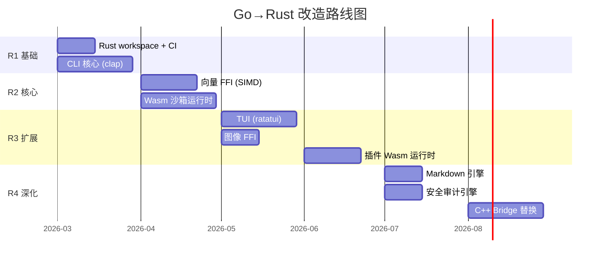
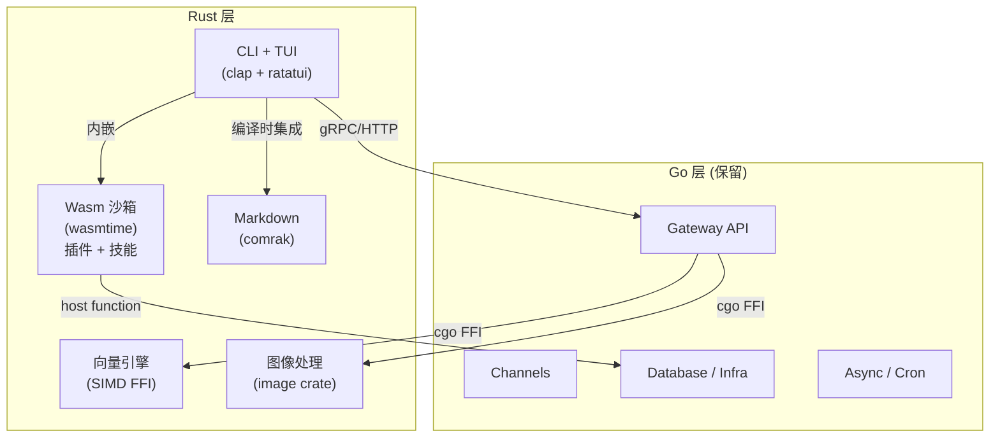

# OpenAcosmi/Acosmi Rust 改造规划（Go→Rust）

> [!NOTE]
> 基线：项目已完成 TS→Go 迁移，所有模块均以 Go 为基准。本规划仅涉及 Go→Rust 的改造。

## 审计方法论

1. 扫描 Go backend 全部 26 个 internal 模块 + 8 个 pkg 包
2. 搜集项目已有 **17 处 `RUST_CANDIDATE`** 标记（P1/P2/P3）
3. 联网验证：Rust CLI(clap/ratatui) ✅、Wasm 沙箱(wasmtime) ✅、FFI(cgo) ✅、安全库(ring/rustls) ✅
4. 用户确认：**异步/并发保留 Go**（goroutine），**沙箱/计算密集→Rust**

## 决策矩阵

| 评估维度 | 留 Go | 迁 Rust | 说明 |
|---------|------|--------|------|
| 异步并发 I/O | ✅ | ❌ | goroutine 已是最优解 |
| CPU 密集计算 | ❌ | ✅ | 无 GC 停顿，SIMD 加速 |
| 内存安全沙箱 | ❌ | ✅ | Wasm 隔离 + 所有权模型 |
| 单二进制 CLI | 可选 | ✅ | 启动更快、无 GC、体积更小 |
| HTTP API / Gateway | ✅ | ❌ | Go net/http 生态成熟 |
| 数据库交互 | ✅ | ❌ | Go SQL 生态完善 |

---

## Tier 1 — 高优先级（ROI 最高）

### 1.1 终端 CLI + TUI ⭐⭐⭐

**Go 现状**: `backend/internal/cli/` (12 文件)，`backend/internal/tui/` (6 文件)，`backend/cmd/openacosmi/` (入口)

**迁移理由**:

- Go CLI 启动约 ~100ms（含 GC 初始化），Rust 可达 <10ms
- `clap` 替代 Go CLI 路由，`ratatui` 替代 Go TUI 层
- 单二进制无运行时依赖，跨平台 `cargo build --target`
- 行业标杆：Claude Code、Warp Terminal、ripgrep 均 Rust CLI

**技术栈**: `clap` + `ratatui` + `crossterm` + `tokio`（SSE 流）

**Go 文件→Rust 映射**:

| Go 文件 | Rust 模块 |
|---------|----------|
| `cli/argv.go` | `clap` derive 宏 |
| `cli/banner.go` | `cli::banner` |
| `cli/route.go` | `clap` 子命令路由 |
| `cli/progress.go` | `indicatif` |
| `tui/*.go` | `ratatui` widgets |

---

### 1.2 Wasm 沙箱执行引擎（插件 + 技能）⭐⭐⭐

**Go 现状**: 沙箱依赖 Docker 容器隔离

**迁移理由**:

- Wasmtime 冷启动 <5ms vs Docker ~2s
- 内存隔离 + WASI 能力模型，比容器更轻量安全
- 插件和技能可编译为 `.wasm`，在沙箱中安全执行
- Shopify、Cloudflare Workers 生产验证

**技术栈**: `wasmtime` + `wasi-common` + `cap-std`

**Go 文件→Rust 映射**:

| Go 模块 | Rust 改造 |
|---------|----------|
| `plugins/runtime.go` (2.8KB) | Wasm host 运行时 |
| `plugins/schema.go` (3.8KB) | Rust JSON Schema 验证 |
| `plugins/loader.go` (9KB) | Wasm module loader |
| `agents/skills/plugin_skills.go` | Wasm guest SDK |
| `agents/skills/workspace_skills.go` | Wasm guest SDK |
| `security/skill_scanner.go` (9KB) | Rust 安全扫描 |

---

### 1.3 向量计算引擎（Embedding 热路径）⭐⭐⭐

**已标记**: `RUST_CANDIDATE: P1`

**Go 现状**: 纯 Go 实现余弦相似度 + 文本分块哈希

**迁移理由**:

- `CosineSimilarity` 在搜索内循环中被调用（`internal.go:330`）
- 全量重建时 `chunkAndHash` 是热路径（`internal.go:218`）
- Rust SIMD (`std::arch`) 可加速 4-8x
- Qdrant（Rust 向量数据库）验证了可行性

**技术栈**: Rust FFI (`#[no_mangle] extern "C"`) → Go `cgo` 调用

**Go 文件→Rust FFI 映射**:

| Go 热路径 | Rust FFI 函数 |
|----------|-------------|
| `memory/internal.go` chunkAndHash | `acosmi_chunk_and_hash()` |
| `memory/internal.go` 搜索循环 | `acosmi_cosine_similarity_batch()` |
| 项目已有 FFI 规范 | [coding-standards.md](file:///Users/fushihua/Desktop/Claude-Acosmi/skills/acosmi-refactor/references/coding-standards.md) |

---

## Tier 2 — 中优先级

### 2.1 图像处理管线 ⭐⭐

**已标记**: `RUST_CANDIDATE: P2`

- [image_ops.go](file:///Users/fushihua/Desktop/Claude-Acosmi/backend/internal/media/image_ops.go) (524L) — EXIF/JPEG/PNG/HEIC 处理
- Rust `image` crate + SIMD，批量提速 3-5x
- FFI 暴露给 Go，无需整体重写 media 模块

### 2.2 安全审计引擎 ⭐⭐

- [audit.go](file:///Users/fushihua/Desktop/Claude-Acosmi/backend/internal/security/audit.go) (598L) — 完整安全审计
- [ssrf.go](file:///Users/fushihua/Desktop/Claude-Acosmi/backend/internal/security/ssrf.go) (8KB) — SSRF 防护
- Rust 类型安全 + `ring`/`rustls` 增强密码学安全

### 2.3 Markdown 解析引擎 ⭐⭐

- [ir.go](file:///Users/fushihua/Desktop/Claude-Acosmi/backend/pkg/markdown/ir.go) (16KB) — IR 解析器
- Rust `comrak` / `pulldown-cmark` 生产验证
- CLI + API 共用同一引擎

---

## Tier 3 — 远期可选

| Go 模块 | Rust 改造 | 理由 |
|---------|----------|------|
| `embeddings_local.go` (P3) | GGUF 直接加载 | 替代 llama.cpp 子进程 |
| `linkparse/` (6 文件) | URL 安全解析 | 体量小 |
| `bridge/` + `cpp/` | C++→Rust | inference/vision 逐步替换 |

---

## 明确保留 Go 的模块

> [!IMPORTANT]
> 以下模块 **不迁移**，Go 已是最优选择：

- **Gateway / HTTP API** (`internal/gateway/`) — Go net/http + goroutine
- **Channel 集成** (`internal/channels/`) — I/O 密集，Go 更优
- **异步任务** (`internal/cron/`, `internal/daemon/`) — goroutine + context
- **Session / 数据库** (`internal/sessions/`, `internal/infra/`) — Go SQL
- **Hooks / Routing** (`internal/hooks/`, `internal/routing/`) — 业务逻辑

---

## 实施路线图

## 架构总览

## 验证计划

- CLI 启动：`hyperfine` Rust vs Go CLI
- 向量搜索：`criterion` bench Rust SIMD vs Go
- 图像缩放：吞吐量 ops/sec 对比
- Wasm 沙箱：冷启动延迟 vs Docker
- FFI 安全：`cargo miri` 内存检测 + `valgrind`
- 跨平台：Linux/macOS/Windows 编译验证
