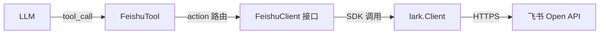

# 飞书 SDK 智能体工具集成跟踪计划

> 日期: 2026-02-23 | 状态: 规划中（待开工）
> SDK: `github.com/larksuite/oapi-sdk-go/v3 v3.5.3`（已安装）

## 目标

让 OpenAcosmi 智能体能通过**工具调用**操作飞书全能力：多维表格、文档、日历、审批、消息、云空间。

## 架构设计

### 关键设计

- **`FeishuClient` 接口**：抽象层，方便测试 mock
- **`lark.Client`**：运行时注入，来自频道配置的 App ID / Secret
- **Token 管理**：SDK 内置 `tenant_access_token` 自动刷新（2h 有效期）
- **权限隔离**：每个 action 需声明所需 scope，UI 提示用户去飞书后台开权限

---

## 阶段计划

### Phase 1: 基础框架 + 多维表格（MVP）

| 任务 | 文件 | 说明 |
|---|---|---|
| `[ ]` 定义 `FeishuClient` 接口 | `tools/feishu_client.go` | 抽象层 |
| `[ ]` 实现 `larkFeishuClient` | `tools/feishu_client_lark.go` | 包装 SDK |
| `[ ]` 创建 `CreateFeishuTool()` | `tools/feishu_tool.go` | 工具定义 + Execute |
| `[ ]` 注册到 ToolRegistry | `tools/registry.go` | `EnableFeishu` 开关 |
| `[ ]` Gateway 启动注入 | `gateway/boot.go` | 读取飞书配置创建 client |

**多维表格 Actions（Phase 1 重点）：**

| Action | SDK 方法 | 权限 Scope | QPS |
|---|---|---|---|
| `bitable_list_records` | `bitable.v1.AppTableRecord.List` | `bitable:app:readonly` | 100/s |
| `bitable_get_record` | `bitable.v1.AppTableRecord.Get` | `bitable:app:readonly` | 100/s |
| `bitable_create_record` | `bitable.v1.AppTableRecord.Create` | `bitable:app` | 50/s |
| `bitable_update_record` | `bitable.v1.AppTableRecord.Update` | `bitable:app` | 50/s |
| `bitable_delete_record` | `bitable.v1.AppTableRecord.Delete` | `bitable:app` | 50/s |
| `bitable_list_tables` | `bitable.v1.AppTable.List` | `bitable:app:readonly` | 20/s |
| `bitable_create_table` | `bitable.v1.AppTable.Create` | `bitable:app` | 10/s |
| `bitable_list_fields` | `bitable.v1.AppTableField.List` | `bitable:app:readonly` | 20/s |

---

### Phase 2: 文档 + 云空间

| Action | SDK 方法 | 权限 Scope | QPS |
|---|---|---|---|
| `doc_create` | `docx.v1.Document.Create` | `docs:doc` | 5/s |
| `doc_get_content` | `docx.v1.DocumentBlock.List` | `docs:doc:readonly` | 5/s |
| `drive_upload_file` | `drive.v1.File.UploadAll` | `drive:file` | 5/s |
| `drive_list_files` | `drive.v1.File.List` | `drive:file:readonly` | 5/s |
| `drive_download` | `drive.v1.File.Download` | `drive:file:readonly` | 5/s |

---

### Phase 3: 日历 + 审批

| Action | SDK 方法 | 权限 Scope | QPS |
|---|---|---|---|
| `calendar_create_event` | `calendar.v4.CalendarEvent.Create` | `calendar:calendar` | 100/min |
| `calendar_list_events` | `calendar.v4.CalendarEvent.List` | `calendar:calendar:readonly` | 100/min |
| `calendar_free_busy` | `calendar.v4.Freebusy.List` | `calendar:calendar:readonly` | 100/min |
| `approval_create` | `approval.v4.Instance.Create` | `approval:approval` | 50/s |
| `approval_get` | `approval.v4.Instance.Get` | `approval:approval:readonly` | 50/s |
| `approval_list` | `approval.v4.Instance.List` | `approval:approval:readonly` | 50/s |

---

### Phase 4: 消息增强（IM 已有基础）

| Action | SDK 方法 | 权限 Scope | QPS |
|---|---|---|---|
| `im_send_card` | `im.v1.Message.Create` | `im:message:send_as_bot` | 5/s per bot |
| `im_list_groups` | `im.v1.Chat.List` | `im:chat:readonly` | 50/s |
| `im_create_group` | `im.v1.Chat.Create` | `im:chat` | 50/s |

---

## 前置条件

| 条件 | 状态 | 说明 |
|---|---|---|
| `oapi-sdk-go/v3` 已安装 | ✅ | v3.5.3 |
| 飞书应用已创建（App ID + Secret） | ⚠️ 用户负责 | 需在飞书开放平台创建自建应用 |
| 权限审批 | ⚠️ 用户负责 | 每个 scope 需管理员审批 |
| 工具注册体系已就绪 | ✅ | `ToolRegistry` 模式成熟 |
| 飞书频道配置已实现 | ✅ | `channels.save` RPC 已完成 |

## 注意事项

> [!WARNING]
> 飞书基础免费版 API 调用上限 **10,000 次/月**。建议商业使用升级至企业版。

> [!IMPORTANT]
> 多维表格**单数据表不支持并发写入**，需加互斥锁或串行队列。

> [!NOTE]
> SDK 内置 `tenant_access_token` 自动管理（2h 有效期），无需手动刷新。

## 参考文档

- [飞书 Go SDK 指南](https://open.feishu.cn/document/uAjLw4CM/ukTMukTMukTM/server-side-sdk/golang-sdk-guide/preparations)
- [多维表格 API](https://open.feishu.cn/document/server-docs/docs/bitable-v1/bitable-overview)
- [文档 API](https://open.feishu.cn/document/server-docs/docs/docs/docx-v1/document/create)
- [日历 API](https://open.feishu.cn/document/server-docs/calendar-v4/calendar/introduction)
- [审批 API](https://open.feishu.cn/document/server-docs/approval-v4/approval/overview)
- [API 频率限制](https://open.feishu.cn/document/server-docs/getting-started/server-api-rate-limit)
