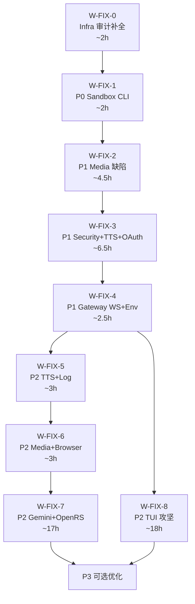

# 全局审计后修复优先级计划

> 基于 35+ 模块审计报告 + `deferred-items.md` 综合分析
> 制定日期：2026-02-21 | 修订：2026-02-22（基于 [深度对比分析](./post-audit-deep-comparison.md)）

## 统计汇总

| 优先级 | 新发现项 | deferred 遗留项 | 合计 |
|--------|----------|----------------|------|
| 🔴 P0 | 1 | 0 | **1** |
| 🟡 P1 | 3 | 2 | **5** |
| 🟢 P2 | 5 | 5 | **10** |
| ⚪ P3 | ≥10 | ≥15 | **25+** |

---

## 第〇层：审计补全（前置，1 窗口）

### ~~窗口 W-FIX-0：Infra 隐藏依赖审计补全~~ ✅ 已完成（2026-02-22）

| ID | 来源 | 描述 | 结果 |
|----|------|------|------|
| INFRA-AUDIT | `global-audit-infra.md` | 隐藏依赖审计 7 类全部完成 + 差异清单（P0=0, P1=0, P2=3已跟踪, P3=25+） | 评级 A |

---

## 第一层：P0 紧急修复（1 项，1 窗口）

### ~~窗口 W-FIX-1：Commands 沙盒命令群补全~~ ✅ 已完成（2026-02-22）

| ID | 来源 | 描述 | 结果 |
|----|------|------|------|
| CMD-1 | `global-audit-commands.md` | Go 端缺少 `sandbox list/recreate/explain` 沙箱状态查看与管理子命令 | ✅ 新建 `cmd_sandbox.go`（560L）+ `BrowserContainerInfo` 类型 + `ListSandboxBrowserContainers` 函数 |

**目标文件**：新建 `backend/cmd/openacosmi/cmd_sandbox.go`，修改 `manage.go`、`types.go`、`main.go`，清理 `cmd_misc.go` 旧 stub
**验证**：`go build ./...` ✅ + `go vet ./...` ✅ + `go test -race ./internal/agents/sandbox/...` ✅（44 tests）

---

## 第二层：P1 高优先修复（5 项，2-3 窗口）

### ~~窗口 W-FIX-2：Media 核心缺陷修复~~ ✅ 已完成（2026-02-22）

| ID | 来源 | 描述 | 结果 |
|----|------|------|------|
| MEDIA-2 | `global-audit-media.md` | `parse.go` 缺少 Markdown Fenced Code 边界检测，会误捕获代码块中的 `MEDIA:` token | ✅ 引入 `markdown.ParseFenceSpans` + `isInsideFence` + `lineOffset` 追踪，12 个新增测试 PASS |
| MEDIA-1 | `global-audit-media.md` | `input_files.go` PDF 页面渲染转图片完全缺失（仅提取文本） | ✅ 新增 `PDFLimits` + 三级渲染策略（pdftocairo / qlmanage / pdfcpu ExtractImagesRaw）+ 文本优先图片 fallback |

**目标文件**：修改 `backend/internal/media/parse.go`、`input_files.go`，新建 `parse_test.go`
**验证**：`go build ./...` ✅ + `go vet ./...` ✅ + `go test -race ./internal/media/...` ✅（14 tests）

### 窗口 W-FIX-3：Security JSONC + TTS 摘要 ✅ (2026-02-22)

| ID | 来源 | 描述 | 预估 |
|----|------|------|------|
| W1-SEC1 | `deferred-items.md` | `audit_extra.go`/`fix.go` 无法解析含注释的 JSONC 配置，导致安全审计完全失效 | ~1.5h |
| W1-TTS1 | `deferred-items.md` | 长文本 TTS 缺少 LLM 智能摘要，直接硬截断 | ~2h |
| CMD-2 | `global-audit-commands.md` | OAuth CLI Web Flow 缺失（Chutes 等第三方验证） | ~3h |

**W1-SEC1 修复** ✅：新建 `security/jsonc.go` 使用 `hujson.Standardize`；5 处 `json.Unmarshal` → `ParseJSONC()`
**W1-TTS1 修复** ✅：新建 `tts/summarize.go` 函数注入模式（`SummarizerFunc`）；`maybeSummarizeText` 三路 fallback
**CMD-2 修复** ✅：新建 `cmd/openacosmi/setup_oauth_web.go`（PKCE + 本地 HTTP 回调）；替换 `applyOAuthPlaceholder`
**验证**：`go build ./...` ✅ + `go vet ./...` ✅ + security tests ✅ (7 JSONC) + tts tests ✅ (10 summarize)
**复核审计**：✅ 通过 (14/14, 0 虚标)

### 窗口 W-FIX-4：Gateway WS + 环境变量对齐

| ID | 来源 | 描述 | 预估 |
|----|------|------|------|
| GW-3 | `global-audit-gateway.md` | WebSocket Close Codes（如 `1008 pairing required`）Go 端可能不完全一致。**需先验证真实差异再定级** | ~1.5h |
| CMD-5 | `global-audit-commands.md` | `OPENACOSMI_STATE_DIR` 多级推断路径在 Go 端需验证对齐 | ~1h |

**验证**：编写 WS Close Code 单元测试 + `dotenv.go` 路径解析测试

---

## 第三层：P2 体验提升（10 项，4-5 窗口）

### 窗口 W-FIX-5：TTS + Log 功能补全

| ID | 来源 | 描述 | 预估 |
|----|------|------|------|
| TTS-1 | `global-audit-tts.md` | `synthesize.go` 硬编码 OpenAI 端点，不支持 `OPENAI_TTS_BASE_URL` 自定义端点（LocalAI/Kokoro） | ~1h |
| LOG-1 | `global-audit-log.md` | `cmd_logs.go --follow` 仅本地文件轮询，无法远程追踪 Gateway 日志 | ~2h |

> ~~TTS-2~~ 已合并至 W-FIX-3 的 W1-TTS1（同一问题，不再重复）

**TTS-1 修复**：从环境变量/配置读取 base URL，替换硬编码
**LOG-1 修复**：`--follow` 模式检测 Gateway URL 存在时走 RPC Polling

### 窗口 W-FIX-6：Media + Browser 补全

| ID | 来源 | 描述 | 预估 |
|----|------|------|------|
| MEDIA-3 | `global-audit-media.md` | `store.go` 下载不支持自定义 Headers（鉴权资源拉取失败） | ~1h |
| BRW-2 | `global-audit-browser.md` | `pw-ai` 视觉/AI DOM 推理在 Go 中缺失，需确认移交点 | ~2h |

**MEDIA-3 修复**：`http.Get` 改为 `http.NewRequest` + headers map 透传
**BRW-2 修复**：确认 AI 视觉分析是否由引擎其他模块承接，若否则创建 stub

### 窗口 W-FIX-7：Gemini 流式 + OpenResponses（PHASE5-1 + PHASE5-2）

| ID | 来源 | 描述 | 预估 |
|----|------|------|------|
| W2-D2 / PHASE5-1 | `deferred-items.md` | Gemini SSE 分块解析器缺失，长连接流式可能丢 token | ~5h |
| PHASE5-2 | `deferred-items.md` | `/v1/responses` API 仅简单代理，缺少完整实现 | ~12h |

> [!IMPORTANT]
> PHASE5-2 工作量大（~12h），建议拆分为 2 个子窗口。前置依赖 PHASE5-1。

### 窗口 W-FIX-8：TUI 核心攻坚（TUI-1 + TUI-2）

| ID | 来源 | 描述 | 预估 |
|----|------|------|------|
| TUI-1 | `deferred-items.md` L340 | TUI 聊天全流程近半组件 Partial/Missing | ~16h |
| TUI-2 | `deferred-items.md` L348 | `resolveExplicitGatewayAuth` 粘合代码未就绪 | ~2h |

> [!WARNING]
> TUI-1 是最大单体任务（~16h），需 3-4 个独立窗口集中攻坚。建议作为独立 Sprint 处理。
> **注**：此处 TUI-1/TUI-2 来自 `deferred-items.md`，与 `global-audit-tui.md` 差异清单中同名 ID 含义不同（后者为 P3 架构差异，无需修复）。

### 其他 P2 零散项（可穿插处理）

| ID | 来源 | 描述 | 预估 |
|----|------|------|------|
| MEM-2 | `global-audit-memory.md` | node-llama 替换为 Ollama API（已完成，确认接口层面） | ~0.5h |
| PLG-1 | `global-audit-plugins.md` | Hook 生命周期 Go 端去中心化，确认等效触发 | ~1h |
| PLG-2 | `global-audit-plugins.md` | 原生 C++ ABI 加载在 Go 无法执行，确认 WASM/RPC 替代 | ~1h |
| GW-1 | `global-audit-gateway.md` | Control UI 静态面板 Go 端未挂载 | ~2h |
| HEALTH-D4 | `deferred-items.md` | 图片工具缩放/转换 TODO(phase13) 未实现 | ~2h |

---

## 第四层：P3 长期优化（25+ 项，按需安排）

### 可选窗口 W-OPT-A：Infra 长尾补全（PHASE5-4）

| 描述 | 预估 |
|------|------|
| 剩余 50+ infra 文件逐步移植（`ssh-config.ts`, `update-check.ts` 等） | ~18h / 3-4 窗口 |
| OTA 升级机制（`update-runner.ts` 等）移植 | ~8h |

### 可选窗口 W-OPT-B：网络与发现（PHASE5-3）

| 描述 | 预估 |
|------|------|
| TailScale CLI 集成 + Bonjour mDNS 注册（`grandcat/zeroconf`） | ~8.5h / 1-2 窗口 |

### 可选窗口 W-OPT-C：Playwright AI 浏览自动化（PHASE5-5）

| 描述 | 预估 |
|------|------|
| 引入 `playwright-go` 实现 40+ 操作及 AI 引导浏览循环 | ~16h / 3 窗口 |

### 其他 P3 零散项（不阻塞核心功能）

- CMD-3：交互式 auth 引导增强
- CMD-6：`dashboard.ts`/`message.ts` CLI 端点缺失（深度对比新增）
- CRON-BUG：`NormalizeCronPayload` 的 `ToLower` 导致 `systemEvent` 无法匹配常量（深度对比新增，~0.5h）
- W5-D1：Windows 进程检测升级（`OpenProcess` API）
- W6-D1：TUI 主题色彩微调
- HIDDEN-4：`go-readability`/`iso-639-1` 枚举等 npm 黑盒替代
- HIDDEN-8：macOS clipboard/Homebrew 路径/WSL 检测
- 各模块 P3/P4 架构差异（均已评定为无需修复）

---

## 推荐执行顺序

## 窗口上下文限制预算

| 窗口 | 任务数 | 预估总工时 | 复杂度 | 建议 |
|------|--------|-----------|--------|------|
| W-FIX-1 | 1 | ~2h | 低 | 可与 W-FIX-4 合并 |
| W-FIX-2 | 2 | ~4.5h | 中 | 独立窗口 |
| W-FIX-3 | 3 | ~6.5h | 高 | 独立窗口，OAuth 最复杂 |
| W-FIX-4 | 2 | ~2.5h | 低 | 可与 W-FIX-1 合并 |
| W-FIX-5 | 2-3 | ~3h | 中 | 独立窗口 |
| W-FIX-6 | 2 | ~3h | 中 | 独立窗口 |
| W-FIX-7 | 2 | ~17h | 极高 | 拆 2-3 子窗口 |
| W-FIX-8 | 2 | ~18h | 极高 | 拆 3-4 子窗口 |

> [!NOTE]
> W-FIX-1 和 W-FIX-4 可合并为一个窗口（~4.5h），降低窗口切换开销。
> W-FIX-7（Gemini+OpenRS）和 W-FIX-8（TUI）为两条可并行的长线任务。

## 审计评级总览

| 评级 | 模块 |
|------|------|
| **S** (完美) | autoreply, cli, config |
| **S** (完美) | media（P1 全部修复，2026-02-22 W-FIX-2）|
| **A** (优秀) | agents, channels, gateway, browser, memory, plugins, web, tui, security, hooks, cron, daemon, media-understanding, markdown, nodehost, acp, outbound, sessions, session, tts, log, wizard, canvas, routing, process, providers, plugin-sdk, macos, linkparse, types, contracts, retry, i18n, ollama |
| **A** (优秀) | commands（W-FIX-1 沙箱 CLI 已补完，2026-02-22）|
| **A** (优秀) | infra（隐藏依赖审计 + 差异清单已补完，2026-02-22 W-FIX-0）|
