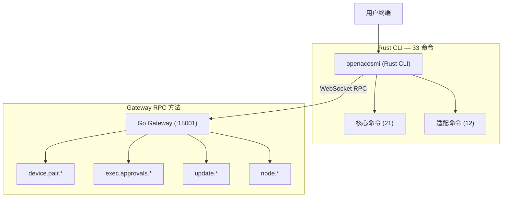
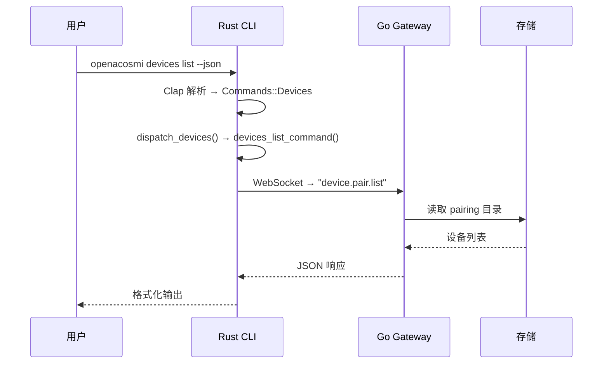

# OpenAcosmi CLI 指令集架构 — 新架构全景

> 最后更新: 2026-03-01

---

## 1. 架构总览

OpenAcosmi CLI 采用 **Rust CLI + Go Gateway** 双架构模式：

| 层 | 语言 | 定位 | 入口 |
|----|------|------|------|
| **CLI 命令层** | Rust | 全部 33 个子命令 | `cli-rust/crates/oa-cli/` |
| **Gateway 服务层** | Go | 网关服务 + 频道 + Agent | `backend/cmd/acosmi/` |
| **Go CLI (弃用)** | Go | 遗留入口，引导迁移 | `backend/cmd/openacosmi/` |



---

## 2. 完整命令清单

### 2.1 核心命令（21 个，原有实现）

| 命令 | Crate | 实现状态 | 通信方式 |
|------|-------|---------|---------|
| `health` | oa-cmd-health | ✅ 完整 | Gateway RPC |
| `status` | oa-cmd-status | ✅ 完整 | Gateway RPC + 本地 |
| `sessions` | oa-cmd-sessions | ✅ 完整 | 本地文件 |
| `channels *` | oa-cmd-channels | ✅ 完整 | Gateway RPC |
| `models *` | oa-cmd-models | ✅ 完整 | Gateway RPC |
| `agents *` | oa-cmd-agents | ✅ 完整 | Gateway RPC |
| `sandbox *` | oa-cmd-sandbox | ✅ 完整 | Gateway RPC |
| `auth` | oa-cmd-auth | ✅ 完整 | 交互式向导 |
| `configure` | oa-cmd-configure | ✅ 完整 | 交互式向导 |
| `onboard` | oa-cmd-onboard | ✅ 完整 | 交互式向导 |
| `doctor` | oa-cmd-doctor | ✅ 完整 | 20 个检查模块 |
| `agent` | oa-cmd-agent | ✅ 完整 | Gateway RPC |
| `cron` | oa-cmd-cron | ✅ 完整 | Gateway RPC |
| `daemon` | oa-cmd-daemon | ✅ 完整 | launchd/systemd |
| `memory` | oa-cmd-memory | ✅ 完整 | Gateway RPC |
| `message` | (内置) | ✅ | Gateway RPC |
| `dashboard` | (内置) | ✅ | 浏览器打开 |
| `docs` | (内置) | ✅ | 文档搜索 |
| `reset` | (内置) | ✅ | 状态重置 |
| `setup` | (内置) | ✅ | 工作区初始化 |
| `completion` | oa-cli | ✅ 完整 | Clap 内置 |

### 2.2 批次 3 适配命令（12 个，新增）

| 命令 | Crate | 实现状态 | 通信方式 | Gateway RPC |
|------|-------|---------|---------|-------------|
| `devices *` | oa-cmd-devices | ✅ **真实** | Gateway RPC | `device.pair.list/approve/reject`, `device.token.rotate/revoke` |
| `approvals *` | oa-cmd-approvals | ✅ **真实** | Gateway RPC | `exec.approvals.get/set` |
| `update *` | oa-cmd-update | ✅ **真实** | Gateway RPC | `update.check`, `update.run` |
| `pairing *` | oa-cmd-pairing | ✅ **真实** | Gateway RPC | `node.pair.list/approve` |
| `node *` | oa-cmd-node | ✅ **真实** | Gateway RPC | `node.list` |
| `system *` | oa-cmd-system | ✅ **本地** | 本地文件 | TCP 探测 + 心跳文件 |
| `dns *` | oa-cmd-dns | ✅ **本地** | tokio DNS | DNS 解析 + LAN IP |
| `config *` | oa-cmd-config | ✅ **完整** | 本地文件 | TOML get/set/unset |
| `acp *` | oa-cmd-acp | ⏳ Stub | — | 需 ACP 协议 |
| `tui` | oa-cmd-tui | ⏳ Stub | — | 需 ratatui |
| `voicecall *` | oa-cmd-voicecall | ⏳ Stub | — | 需语音插件 |
| `webhooks *` | oa-cmd-webhooks | ⏳ Stub | — | 需 API 扩展 |
| `directory *` | oa-cmd-directory | ⏳ Stub | — | 需 channel API |

---

## 3. Rust Crate 全量清单

### 37 个 crate, 分 6 层

```
┌───────────────────────────────────────────────────────────┐
│  Binary 层: oa-cli (main.rs + commands.rs)                │
├───────────────────────────────────────────────────────────┤
│  Command 层 (25 crates): oa-cmd-*                         │
│  ┌─ 核心 ──────────────────────────────────────────────┐  │
│  │ health │ status │ sessions │ channels │ models      │  │
│  │ agents │ sandbox │ auth │ configure │ onboard       │  │
│  │ doctor │ agent │ cron │ daemon │ memory             │  │
│  │ supporting (message/dashboard/docs/reset/setup)     │  │
│  └─────────────────────────────────────────────────────┘  │
│  ┌─ 批次3 适配 (12 新 crate) ─────────────────────────┐  │
│  │ devices │ approvals │ update │ pairing │ node       │  │
│  │ system │ dns │ config │ acp │ tui │ voicecall       │  │
│  │ webhooks │ directory                                │  │
│  └─────────────────────────────────────────────────────┘  │
├───────────────────────────────────────────────────────────┤
│  Shared 层: oa-cli-shared                                 │
├───────────────────────────────────────────────────────────┤
│  Service 层:                                              │
│  oa-gateway-rpc │ oa-agents │ oa-channels │ oa-daemon     │
├───────────────────────────────────────────────────────────┤
│  Infrastructure 层:                                       │
│  oa-config │ oa-infra │ oa-routing                        │
├───────────────────────────────────────────────────────────┤
│  Leaf 层: oa-types │ oa-runtime │ oa-terminal             │
└───────────────────────────────────────────────────────────┘
```

---

## 4. Gateway RPC 方法映射

Rust CLI 通过 `call_gateway()` 调用 Go Gateway 的 WebSocket RPC：

| RPC 方法 | 对应 CLI 命令 | Go 处理器 |
|----------|-------------|-----------|
| `device.pair.list` | `devices list` | `server_methods_devices.go` |
| `device.pair.approve` | `devices approve` | 同上 |
| `device.pair.reject` | `devices reject` | 同上 |
| `device.token.rotate` | `devices rotate` | 同上 |
| `device.token.revoke` | `devices revoke` | 同上 |
| `exec.approvals.get` | `approvals get` | `server_methods_exec_approvals.go` |
| `exec.approvals.set` | `approvals set` | 同上 |
| `update.check` | `update status` | `server_methods_update.go` |
| `update.run` | `update run` | 同上 |
| `node.pair.list` | `pairing list` | `server_methods_nodes.go` |
| `node.pair.approve` | `pairing approve` | 同上 |
| `node.list` | `node status` | 同上 |
| `channels.status` | `channels status` | `server_methods_channels.go` |
| `channels.logout` | `channels logout` | 同上 |

---

## 5. Go Gateway CLI 命令

Go CLI (`backend/cmd/openacosmi/`) 已弃用，但保留 stub 供兼容：

| 文件 | 包含命令 | 数量 |
|------|---------|------|
| `cmd_misc.go` | health, sessions, message, configure, acp, system, directory, completion, dashboard, reset, **approvals, config, devices, node, tui, voicecall** | 18 |
| `cmd_infra.go` | pairing, dns, webhooks, presence, ports | 5 |
| `cmd_security.go` | update | 1 |
| 其他 `cmd_*.go` | gateway, agent, sandbox, status, setup, models, channels, daemon, cron, doctor, skills, hooks, plugins, browser, nodes | 15 |

---

## 6. 数据流架构



---

## 7. 构建与验证

```sh
# Rust CLI 编译
cd cli-rust && cargo build --release -p oa-cli

# Go Gateway 编译
cd backend && go build ./cmd/openacosmi/...

# 全量检查
cd cli-rust && cargo check --workspace  # 零警告
cd cli-rust && cargo test --workspace   # 测试

# 手动测试 (需 Gateway 运行)
./target/release/openacosmi devices list --json
./target/release/openacosmi update status
./target/release/openacosmi system presence
./target/release/openacosmi dns setup
```

---

## 8. 度量

| 指标 | 值 |
|------|----|
| Rust CLI crate 总数 | 37 |
| Rust 命令 crate | 25 (oa-cmd-*) |
| 总 CLI 子命令数 | 33 |
| 真实 RPC 接入命令 | 8 (devices, approvals, update, pairing, node, system, dns, config) |
| Stub 命令 | 5 (acp, tui, voicecall, webhooks, directory) |
| Go Gateway RPC 方法（已对接） | 12 |
| Release 二进制大小 | ~4.3 MB (stripped) |
| 编译时间 (release) | ~37s |
