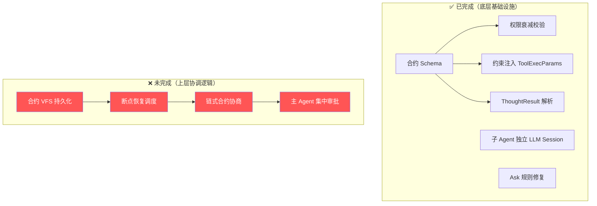

# 主智能体 ↔ Coder 子代理 交互架构审计报告

> **审计日期**: 2026-03-01
> **审计模式**: 只读代码审计
> **审计范围**: 主智能体安排编程任务时与子代理 coder 的交互工作流、通信协议、协调机制、对话能力

---

## 一、核心发现

> **主智能体与 Coder 之间不具备真正的"对话"能力**。它们之间的交互是**单轮委托-返回**模式：主 Agent 通过工具调用发起任务 → Coder 独立执行 → 返回结构化结果。**无多轮对话、无中间沟通、无协商机制**。
>
> 这与设计文档 `design-delegation-contract-system-2026-02-27.md` 的愿景存在显著差距。

---

## 二、交互工作流全景

```mermaid
sequenceDiagram
    participant User as 用户
    participant Main as 主智能体
    participant Gateway as Gateway Server
    participant Coder as Coder 子代理
    participant Confirm as 确认管理器

    User->>Main: 用户请求（含编程任务）
    Main->>Main: 决策是否需要委托 Coder

    rect rgb(40, 44, 52)
    Note over Main,Coder: 委托阶段
    Main->>Main: 1. 调用 spawn_coder_agent 工具
    Main->>Main: 2. 构建 DelegationContract
    Main->>Main: 3. ValidateMonotonicDecay（权限校验）
    Main->>Main: 4. BuildCoderSubagentSystemPrompt
    Main->>Gateway: 5. SpawnSubagent 回调
    Gateway->>Coder: 6. RunEmbeddedPiAgent（独立 LLM Session）
    end

    rect rgb(30, 60, 40)
    Note over Coder,Confirm: 执行阶段（Coder 独立运行）
    Coder->>Coder: 读取文件、编写代码、执行命令
    Coder-->>Confirm: 高危操作（edit/write/bash）触发确认
    Confirm-->>User: WebSocket 推送确认请求
    User-->>Confirm: allow / deny
    Confirm-->>Coder: 返回决策
    Coder->>Coder: 继续执行或中止
    end

    rect rgb(50, 30, 50)
    Note over Coder,Main: 结果返回阶段
    Coder->>Gateway: 输出 ThoughtResult JSON（最终消息）
    Gateway->>Main: 解析并格式化为可读文本
    Main->>User: 汇报结果
    end
```



---

## 三、关键组件分析

### 3.1 委托合约系统（DelegationContract）

| 文件 | 职责 |
|------|------|
| `runner/delegation_contract.go` | 合约定义、验证、权限衰减校验 |
| `runner/spawn_coder_agent.go` | 工具定义 + 合约创建 + 启动子 session |

**合约包含**：

- `task_brief` — 任务描述（≤500字符）
- `scope` — 允许路径 + 权限（read/write/execute）
- `constraints` — 约束集（no_network, no_spawn, sandbox_required, max_bash_calls, allowed_commands）
- `timeout_ms` — 超时限制

**权限单调衰减**（`ValidateMonotonicDecay`）：子 Agent 的权限集必须 ⊆ 父 Agent。违反时拒绝创建合约。

### 3.2 子代理生命周期

在 `gateway/server.go` L1214-1333 中注入的 `SpawnSubagent` 回调：

1. 生成临时 session ID/Key（`spawn-coder-{contractID[:8]}`）
2. 热加载 open-coder 独立配置（provider / model / apiKey）
3. 调用 `RunEmbeddedPiAgent` 启动子 LLM session
4. 子 Agent 使用 `PromptMode: "minimal"` 跳过无关系统提示段
5. **同步等待**执行完成（受 `timeout_ms` 限制）
6. 提取最终回复，解析 `ThoughtResult` JSON

### 3.3 通信协议（单向、结构化）

**主 Agent → Coder**（下行）：

- 通过 `BuildCoderSubagentSystemPrompt` 在系统提示词中注入任务、合约、行为准则
- **一次性传递**，之后无法追加指令或修改任务

**Coder → 主 Agent**（上行）：

- Coder 的最终消息必须是 `ThoughtResult` JSON
- 通过 `ParseThoughtResult` 解析，`formatSpawnResult` 格式化为主 Agent 可读文本
- 包含：`status`、`result`、`artifacts`（files_modified/created）、`reasoning_summary`、`scope_violations`、`resume_hint`

### 3.4 确认流（CoderConfirmationManager）

在 `runner/coder_confirmation.go` 中实现。

当 Coder 执行高风险操作时：

1. 广播 `coder.confirm.requested` 到前端 WebSocket
2. 推送到飞书等远程渠道（通过 `remoteNotify` 回调）
3. **阻塞等待**用户决策或超时（默认 5 分钟）
4. 前端通过 `coder.confirm.resolve` RPC 回调 allow/deny

> ⚠️ 确认流是 **用户 ↔ Coder** 直接交互，**不经过主 Agent**。主 Agent 无法干预或感知单个确认操作。

### 3.5 结果通告（SubagentAnnounce）

`runner/subagent_announce.go` 用于异步子 Agent 完成后通知主 Agent。但当前 `spawn_coder_agent` 使用的是**同步等待**模式（回调内 `RunEmbeddedPiAgent` 会阻塞直到完成），结果直接作为工具调用返回值传回主 Agent。

---

## 四、协调模式总结

| 维度 | 当前状态 |
|------|----------|
| **通信方式** | 单轮委托-返回（工具调用 → ThoughtResult） |
| **对话能力** | ❌ 无。不支持多轮对话、追问、协商 |
| **中间沟通** | ❌ 无。Coder 执行期间无法与主 Agent 通信 |
| **任务修改** | ❌ 无。任务一旦下发，无法变更 |
| **结果传递** | 结构化 JSON（ThoughtResult），一次性返回 |
| **用户确认** | ✅ 有。对 edit/write/bash 操作可触发用户审批 |
| **断点恢复** | ⚠️ 设计中。字段存在但恢复逻辑未实现 |
| **执行模式** | 同步阻塞（SpawnSubagent 回调内等待完成） |
| **权限控制** | ✅ 完善。单调衰减、Scope 路径约束、命令白名单 |

---

## 五、设计方案 vs 实际实现差距分析

### 原始设计愿景

> "每个智能体都有思想，它们是可以进行沟通，但所有执行需要主智能体根据系统规则下达，子智能体从来没有执行权，只有干活的权利。"
>
> — 摘自 `design-delegation-contract-system-2026-02-27.md` §1

### 差距对照表

| 设计要求 | 设计方案 | 当前实现 | 差距等级 |
|---------|---------|---------|---------|
| **Agent 间可以沟通** | 异步协商：子 Agent 返回 `needs_auth` → 主 Agent 评估 → 新合约恢复 | ❌ 单轮委托-返回，无恢复逻辑 | 🔴 严重 |
| **所有审批在主系统** | 主 Agent 评估 `auth_request` → 决策批准/拒绝 → 链式合约 | ❌ 确认流绕过主 Agent，用户直接与 Coder 交互 | 🔴 严重 |
| **断点恢复** | `parent_contract` + `resume_hint` → 新合约带上下文 | ⚠️ 字段存在，但恢复调度逻辑未实现 | 🟡 部分 |
| **合约持久化到 VFS** | `_system/contracts/{active,suspended,completed,failed}/` | ❌ 完全未实现，合约仅在内存中存在于单次调用 | 🔴 严重 |
| **权限单调衰减** | `parent.Capabilities ⊇ child.Capabilities` | ✅ `ValidateMonotonicDecay` 已实现 | 🟢 完成 |
| **子 Agent 有"思想"** | 子 Agent 使用 LLM 推理 + ThoughtResult 结构化返回 | ✅ `RunEmbeddedPiAgent` + `ThoughtResult` 已实现 | 🟢 完成 |
| **合约约束注入** | `ApplyConstraints` → ToolExecParams 权限守卫 | ✅ read_only/no_exec/sandbox/command 白名单已实现 | 🟢 完成 |
| **Ask 规则真正暂停** | `CoderConfirmationManager` 阻塞等待 | ✅ Pre-work 已修复 | 🟢 完成 |

---

### 差距 1：无"沟通"能力（最关键）

**设计方案**的异步沟通流程：

```
子 Agent → ThoughtResult {status: "needs_auth", auth_request: {...}, resume_hint: "..."}
   ↓
主 Agent LLM 收到 → 评估 risk_level → 决策批准/拒绝
   ↓ 批准
新合约 {parent_contract: "原合约ID", scope: 扩展后scope, task_brief: "原任务 + 断点说明"}
   ↓
子 Agent 从断点恢复执行
```

**实际实现**：

- `spawn_coder_agent` 是**同步阻塞**的工具调用
- Coder 运行结束后，ThoughtResult 直接作为工具结果返回给主 Agent 的 LLM
- 但主 Agent **从未被教导如何处理** `needs_auth` 状态
- 没有任何代码实现"根据 `auth_request` 创建新合约 → 用 `parent_contract` 引用 → 重新 spawn" 的流程
- 结果：`needs_auth` → 主 Agent 大概率只是把文本告诉用户，而不是重新委托

### 差距 2：审批绕过主 Agent

**设计方案**：所有执行需要主智能体根据系统规则下达

**实际实现**（`coder_confirmation.go`）：

```
Coder 调用 edit/write/bash
   ↓
CoderConfirmationManager 直接广播到 WebSocket 前端
   ↓
用户直接 allow/deny
   ↓
Coder 继续执行
```

主 Agent **完全不知道**这个确认发生了。设计意图是：

```
Coder 需要权限 → 上报主 Agent → 主 Agent 综合判断 → 向用户请求授权 → 下达到子 Agent
```

### 差距 3：合约不持久化

**设计方案**详细规划了 VFS 目录：

```
_system/contracts/
    active/     → 运行中
    suspended/  → 等待授权
    completed/  → 已完成
    failed/     → 失败审计
```

**实际实现**：合约只是 `executeSpawnCoderAgent` 函数内的局部变量，用完即丢。无法：

- 审计历史合约
- 跨 session 恢复
- 在 `suspended` 状态等待主 Agent 决策

### 差距 4：断点恢复未实现

设计文档 §4.5 有详细的断点恢复示例：

```
第一次委托 contract_id: "aaa-111"
   → 子 Agent 返回 needs_auth + resume_hint
   → 写入 suspended/aaa-111_result.json
   → 主 Agent 评估 → 批准

第二次委托 contract_id: "bbb-222", parent_contract: "aaa-111"
   → scope 扩展 + 断点信息拼入 task_brief
   → 子 Agent 从断点继续
```

代码中 `parent_contract` 字段和 `resume_hint` 字段都存在，但：

- 无代码实现合约链的创建逻辑
- 无代码从 `suspended/` 目录读取并恢复
- 主 Agent 系统提示词中无引导其处理 `needs_auth` 的指令

---

## 六、已完成的设计项

| 设计项 | 实现文件 | 状态 |
|-------|---------|------|
| DelegationContract Schema | `runner/delegation_contract.go` | ✅ 完整 |
| ThoughtResult 解析 | `runner/delegation_contract.go:200-218` | ✅ 完整 |
| 权限单调衰减 | `runner/delegation_contract.go:462-499` | ✅ 完整 |
| 约束注入 ToolExecParams | `runner/delegation_contract.go:278-370` | ✅ 完整 |
| spawn_coder_agent 工具 | `runner/spawn_coder_agent.go` | ✅ 完整 |
| Coder 专用 System Prompt | `runner/announce_helpers.go:204-325` | ✅ 完整 |
| SpawnSubagent 回调接线 | `gateway/server.go:1214-1333` | ✅ 完整 |
| no_network 隔离 | delegation_contract.go + Docker --network=none | ✅ 完整 |
| Ask 规则阻塞修复 | tool_executor.go + CoderConfirmationManager | ✅ 完整 |

---

## 七、审计结论



**用一句话概括**：
> 设计的是"主 Agent 指挥、子 Agent 汇报、循环协商"的指挥体系，实现的是"主 Agent 扔一次任务、子 Agent 干完交差"的外包模式。

---

## 八、涉及文件清单

| 文件路径 | 行数 | 核心职责 |
|---------|------|---------|
| `backend/internal/agents/runner/spawn_coder_agent.go` | 244 | spawn_coder_agent 工具定义 + 合约创建 + 启动子 session |
| `backend/internal/agents/runner/delegation_contract.go` | 515 | 合约 Schema + ThoughtResult + 权限衰减 + 约束注入 |
| `backend/internal/agents/runner/coder_confirmation.go` | 245 | 用户确认流管理（edit/write/bash 审批） |
| `backend/internal/agents/runner/subagent_announce.go` | 349 | 子 Agent 结果通告流程 |
| `backend/internal/agents/runner/announce_helpers.go` | 326 | 统计格式化 + 系统提示词构建 |
| `backend/internal/agents/runner/types.go` | 217 | 类型定义（SubagentRunOutcome, RunEmbeddedPiAgentParams 等） |
| `backend/internal/gateway/server.go` L1214-1333 | — | SpawnSubagent 回调注入（RunEmbeddedPiAgent 接线） |
| `backend/internal/gateway/server_methods_subagent.go` | 174 | subagent.list / subagent.ctl RPC |
| `backend/internal/agents/bash/subagent_registry.go` | 468 | 子代理运行记录注册表（生命周期管理） |
| `backend/internal/agents/tools/agent_step.go` | 85 | Agent 步骤执行 + 历史回复读取 |
| `backend/internal/autoreply/reply/agent_runner.go` | 163 | 主 Agent 回复入口管线 |
| `backend/internal/autoreply/reply/agent_runner_execution.go` | 97 | Agent 执行器 DI 接口 |
| `docs/claude/tracking/design-delegation-contract-system-2026-02-27.md` | 719 | 委托合约系统完整设计文档 |
| `docs/claude/goujia/arch-agent-execution-v3.md` | 101 | 五维联动安全执行框架设计 |
